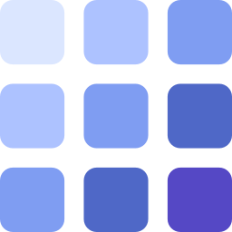
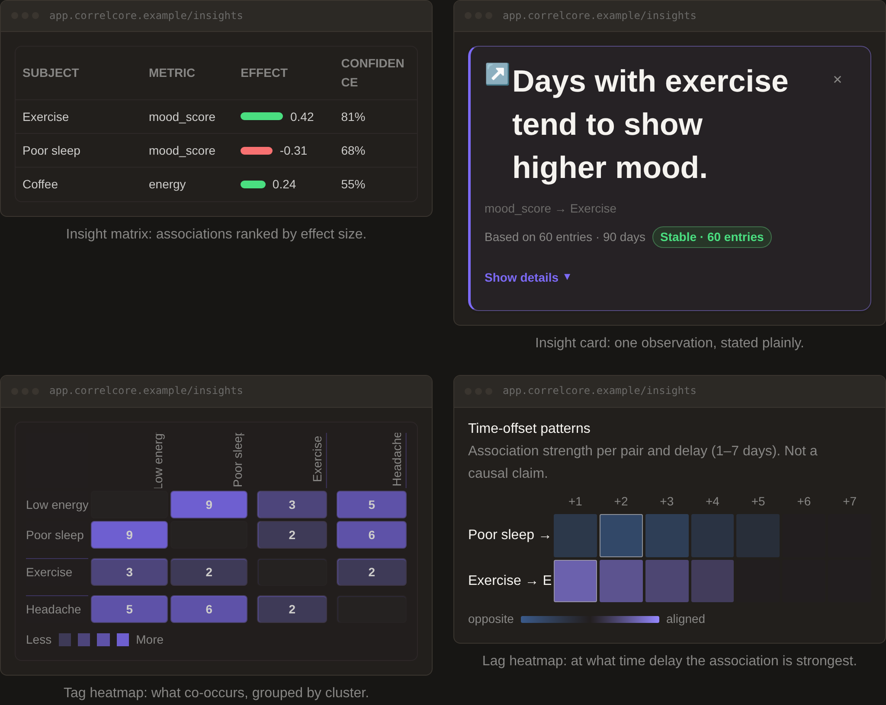
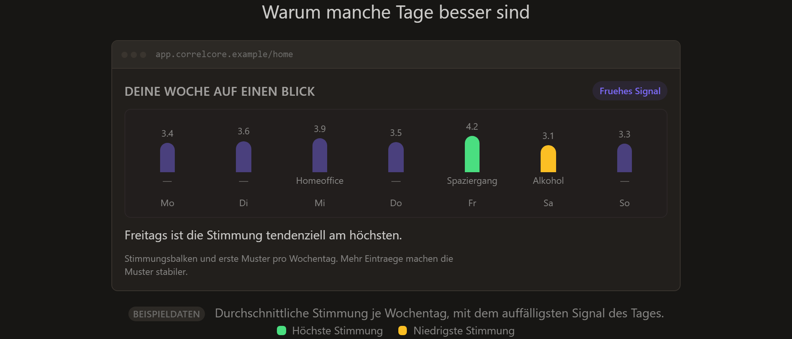

<p align="center">
  
</p>

<h1 align="center">CorrelCore</h1>

<p align="center">
  <strong>Privacy-first correlation analysis for your wellbeing</strong><br />
  Understand why some days are good and others aren't — from a 60-second daily check-in. Self-hosted, offline-capable.
</p>

<p align="center">
  <a href="LICENSE"></a>
  <a href="https://sturmi77.github.io/correlcore/"></a>
  <a href="https://github.com/Sturmi77/correlcore/releases"></a>
  <a href="#tech-stack"></a>
</p>

<p align="center">
  <a href="https://sturmi77.github.io/correlcore/"><strong>Documentation</strong></a> ·
  <a href="#quickstart-self-host"><strong>Quickstart</strong></a> ·
  <a href="#deployment-options"><strong>Deployment</strong></a> ·
  <a href="#roadmap"><strong>Roadmap</strong></a> ·
  <a href="CHANGELOG.md"><strong>Changelog</strong></a> ·
  <a href="CONTRIBUTING.md"><strong>Contributing</strong></a>
</p>

---

> [!IMPORTANT]
> **CorrelCore is not a medical device.** All correlations are for personal reflection only and do not replace medical or therapeutic advice. The project is under active development on the self-host `v1.x` line — see [`SECURITY.md`](SECURITY.md) and [`CHANGELOG.md`](CHANGELOG.md).

## What is CorrelCore?

People sense that sleep, exercise, remote-work days, or social contacts influence their wellbeing — but rarely know **which** factors actually matter, **how strongly**, and with what **time delay**. Existing apps are either too simple (just mood emojis), too cloud-dependent (a privacy problem for health data), or too complex (built for quantified-self enthusiasts).

CorrelCore fills the gap: log ~60 seconds a day, and it surfaces the associations that explain your good and bad days — on infrastructure you own.

<p align="center">
  
</p>
<p align="center"><sub>Insights the app produces — associations ranked by strength, co-occurrence, and the time delay at which each is strongest.</sub></p>

## Features

- **Correlations, not raw data** — statistical analysis explains why days were good or bad, ranked by effect size and confidence.
- **Time-lag insights** — see _with what delay_ a factor (e.g. poor sleep) tends to move mood or energy.
- **Privacy-first & self-hosted** — your health data stays on your instance; no third-party telemetry. Notes and custom symptoms are encrypted at rest.
- **Offline-capable** — installable PWA with offline shell caching and feature-flagged local-first sync.
- **60 seconds a day** — mood, energy, stress, tags and symptoms in one quick check-in.
- **No gamification, ever** — you collect data points, not streaks; the app never optimizes for how often you open it.
- **Your data is yours** — export your entries any time; AGPL-licensed, auditable source.

<p align="center">
  
</p>
<p align="center"><sub>“Why some days are better” — a weekday overview with each day’s standout signal.</sub></p>

## Deployment options

CorrelCore is one codebase that runs in two modes — the **same web bundle**, distinguished at runtime by the backend (`GET /api/v1/instance`), so there is no separate build.

| Mode              | What it is                                                                                | Who runs it | Status                                                                                                           |
| ----------------- | ----------------------------------------------------------------------------------------- | ----------- | ---------------------------------------------------------------------------------------------------------------- |
| **Self-hosted**   | You run the full stack (Docker) on your own server; your data never leaves your instance. | You         | **Available now** — [Quickstart](#quickstart-self-host) · [`docs/selfhost/INSTALL.md`](docs/selfhost/INSTALL.md) |
| **Hosted (SaaS)** | Managed instance at `correlcore.com` — sign up, no ops.                                   | Us          | **Live (beta)** — public cutover done; general-availability closeout in progress                                 |

Two backend env vars control the mode; defaults give a working self-host with open registration:

| Env variable           | Default    | Effect                                                                                                                                          |
| ---------------------- | ---------- | ----------------------------------------------------------------------------------------------------------------------------------------------- |
| `DEPLOYMENT_MODE`      | `selfhost` | `selfhost` \| `hosted` — badge wording and default landing CTA framing.                                                                         |
| `REGISTRATION_ENABLED` | `true`     | `true` opens self-registration (landing shows **Create account**); `false` closes it (server-enforced) and the landing points to **Self-host**. |

**Log in** is always available and logged-in users never see the marketing landing. Full behavior table and per-role walkthrough: [`docs/selfhost/INSTANCE_MODE.md`](docs/selfhost/INSTANCE_MODE.md).

## Quickstart (self-host)

Full install guide (Traefik, DNS, backup, homelab variant): [`docs/selfhost/INSTALL.md`](docs/selfhost/INSTALL.md).

**Prerequisites:** Docker ≥ 24 + Compose v2, and a domain with DNS pointing at your server (public VPS path).

```bash
git clone https://github.com/Sturmi77/correlcore.git
cd correlcore/infra/docker
cp .env.example .env
# Edit .env: DOMAIN, LETSENCRYPT_EMAIL, SECRET_KEY, ENCRYPTION_KEY, passwords — see INSTALL.md
# Pin IMAGE_TAG=v1.4.0 (or the latest v1.x) for published GHCR images
# Set acme.email in infra/docker/traefik/traefik.yml to match LETSENCRYPT_EMAIL
docker compose up -d
```

After startup, CorrelCore is available at `https://your-domain.tld`.

- Homelab / Tailnet without public DNS → [`infra/dockhand/README.md`](infra/dockhand/README.md)
- Compose stack matrix & profiles → [`docs/selfhost/COMPOSE_STACKS.md`](docs/selfhost/COMPOSE_STACKS.md)
- Android sideload (optional, pre-Play) → [`docs/selfhost/ANDROID_SIDELOAD.md`](docs/selfhost/ANDROID_SIDELOAD.md)

## Roadmap

- [x] **M8** — Sleep & Health Connect: manual sleep fields, wearable import, and sleep↔mood insights **shipped**; on-device visual/HC QA still pending.
- [x] **M10.2** — Hosted launch (`correlcore.com`): public cutover **live** (topology H; register/verify E2E green); launch closeout ([#621](https://github.com/Sturmi77/correlcore/issues/621)) remaining.
- [ ] **M11** — Android Play Store (Capacitor): shell, signed sideload, widget and FCM **complete**; Play Console / ops remaining ([#429](https://github.com/Sturmi77/correlcore/issues/429)).
- [ ] **M12** — Managed SaaS hardening (general availability on top of the M10.2 cutover).
- [ ] **M13** — Photo & media: MinIO gallery; EXIF-strip foundation shipped.

Full roadmap lives in [`docs/DESIGN_DOCUMENT.md`](docs/DESIGN_DOCUMENT.md); shipped milestones are archived in [`docs/releases/COMPLETED_MILESTONES.md`](docs/releases/COMPLETED_MILESTONES.md).

## Tech stack

**FastAPI (Python 3.12)** · **SvelteKit** · **PostgreSQL 16 + pgvector** · **Redis 7** · **Traefik** · Docker-native, offline-first.

<details>
<summary>Full stack &amp; rationale</summary>

<br />

| Layer             | Technology                                                                  | Rationale                                                               |
| ----------------- | --------------------------------------------------------------------------- | ----------------------------------------------------------------------- |
| **Backend API**   | FastAPI (Python 3.12)                                                       | Async, OpenAPI-native, fast iteration                                   |
| **Web Frontend**  | SvelteKit + Skeleton UI                                                     | Performance, small bundle                                               |
| **Mobile**        | Responsive web + PWA; Capacitor Android (sideload via Releases; Play = M11) | Maximum code sharing ([ADR-0002](docs/adr/0002-capacitor-statt-twa.md)) |
| **Charts**        | Custom SVG components                                                       | No external framework, token-compliant                                  |
| **Database**      | PostgreSQL 16 + pgvector                                                    | Row-level security, vectors for insights                                |
| **Cache / Queue** | Redis 7                                                                     | Sessions, rate limiting, sync queue                                     |
| **Analytics**     | pandas + scikit-learn                                                       | Lasso, lag, symptom analytics; correlation engine                       |
| **Migrations**    | Alembic                                                                     | Schema versioning                                                       |
| **Auth**          | Native JWT (Authentik planned)                                              | Self-hostable ([ADR-0004](docs/adr/0004-auth-strategie.md))             |
| **Offline Sync**  | Dexie.js (IndexedDB), feature-flagged                                       | Push/pull LWW merge, local-first entry path                             |
| **Monitoring**    | GlitchTip + Uptime Kuma                                                     | Self-hosted error tracking                                              |

</details>

<details>
<summary>Monorepo structure</summary>

<br />

```
correlcore/
├── apps/
│   ├── web/          # SvelteKit web app + PWA
│   └── android/      # Capacitor Android app (sideload; Play = M11)
├── backend/          # FastAPI app, Alembic migrations, analytics worker
├── infra/            # docker-compose, Traefik, .env.example
├── docs/             # design doc, ADRs, self-host guides, release archive
└── docs-site/        # MkDocs Material → GitHub Pages
```

</details>

## Documentation

The full docs live on the public site — [**sturmi77.github.io/correlcore**](https://sturmi77.github.io/correlcore/) (install guide, user guide, API overview, privacy).

Key references in-repo: [DESIGN_DOCUMENT.md](docs/DESIGN_DOCUMENT.md) (single source of truth) · [ARCHITECTURE.md](docs/ARCHITECTURE.md) · [Self-host install](docs/selfhost/INSTALL.md) · [Instance mode](docs/selfhost/INSTANCE_MODE.md) · [ADR index](docs/adr/).

## Contributing

CorrelCore is currently a solo project. See [`CONTRIBUTING.md`](CONTRIBUTING.md) for the language policy, PR rules, and Definition of Done — issues and discussions are welcome. Interested in beta / sideload testing? Open a [beta-tester issue](https://github.com/Sturmi77/correlcore/issues/new?template=beta_tester.md).

## License

Released under the [GNU Affero General Public License v3.0](LICENSE). For commercial self-host licenses without AGPL copyleft, reach out via an issue.
