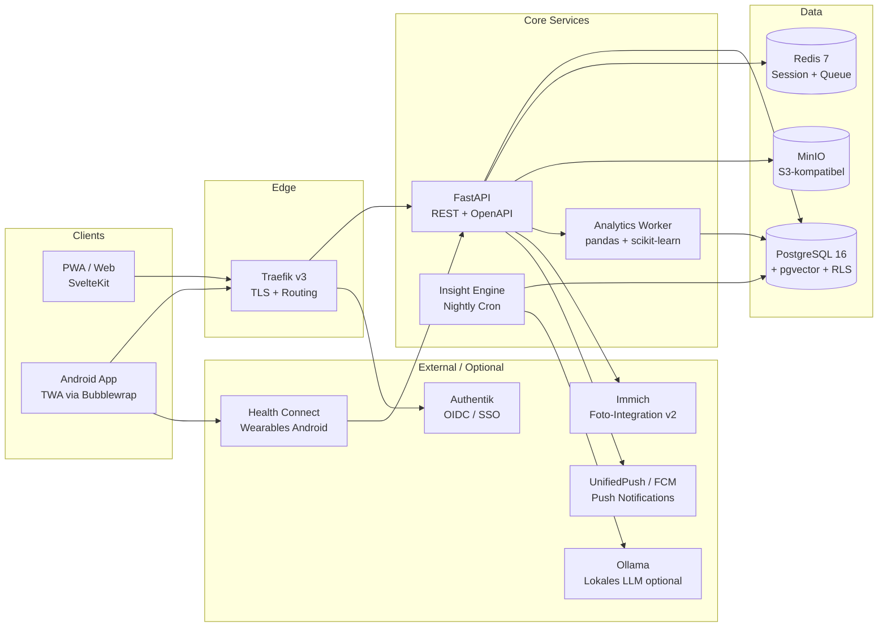

# MoodSync — Architektur

Dieses Dokument leitet sich aus [`DESIGN_DOCUMENT.md`](DESIGN_DOCUMENT.md) ab und vertieft die technische Architektur.

---

## 1. Leitprinzipien

| Prinzip | Bedeutung |
|---|---|
| **API-First** | Backend ist vollständig über REST/OpenAPI konsumierbar; kein Coupling zwischen Frontend und DB |
| **Offline-First** | Clients sind vollwertig offline bedienbar; Server ist autoritativ bei Merge |
| **Selfhosted-First, Cloud-Ready** | `docker compose up` → lauffähig. Kein Code-Rewrite für SaaS-Phase |
| **Privacy by Design** | Datenminimierung, Feld-Verschlüsselung für Sensibles, keine Third-Party-Analytics |
| **Stateless Backend** | Keine Server-Side-Session; State in PostgreSQL + Redis; horizontal skalierbar |
| **12-Factor App** | Config über Env-Variablen, Logs auf stdout, Prozesse stateless |

---

## 2. Komponentendiagramm



---

## 3. Deployment-Topologien

### Topologie A — Single Node (Selfhost, empfohlen bis 500 User)

```
[Internet] → [Traefik] → [FastAPI] → [PostgreSQL]
                                   → [Redis]
                                   → [MinIO]
             [Authentik] (separat oder integriert)
```

Alles auf einer Hetzner CX23 (2 vCPU, 4 GB RAM) via `docker-compose.yml`. Kosten: ~4–8 €/Monat.

### Topologie B — HA / SaaS (ab 5.000 User)

```
[Cloudflare] → [Traefik (2×)] → [FastAPI (3×)]
                                → [PostgreSQL (Primary + Replica)]
                                → [Redis Sentinel]
                                → [MinIO (Distributed)]
```

Hetzner CCX23 × 2 + Managed Postgres + Managed Object Storage. ~150–250 €/Monat.

---

## 4. Sync-Protokoll (Offline-First Detail)

```
Client                          Server
  |                               |
  |─── POST /sync/push ──────────>|  {changes: [{id, table, data, updated_at}]}
  |                               |  Merge: Last-Write-Wins per Feld
  |<── 200 {conflicts, cursor} ───|
  |                               |
  |─── GET /sync/pull?since=X ──>|
  |<── 200 {changes: [...]} ──────|
  |                               |
```

**Konfliktauflösung:**
- Granularität: pro Feld, nicht pro Dokument
- Entscheid: `updated_at` entscheidet (Server-Version gewinnt bei gleichem Timestamp)
- Client erhält Merge-Report bei Konflikt
- Kein CRDT nötig (pro Tag typischerweise nur ein Device)

---

## 5. Auth-Flow (OIDC via Authentik)

```
1. User öffnet App → redirect zu Authentik /authorize
2. Authentik: Login (Password / MFA / SSO)
3. Authentik → App: Authorization Code
4. App → FastAPI: POST /auth/callback mit Code
5. FastAPI → Authentik: Token Exchange → Access Token + Refresh Token
6. FastAPI setzt HttpOnly-Cookie (Session)
7. Refresh Token Rotation: neues Token bei jeder Nutzung
```

---

## 6. Analytics Worker & Insight Engine

```
Nightly Cron (02:00 UTC)
  └── Für jeden aktiven User (≥ 30 Einträge):
        ├── Lade Entry-History aus PostgreSQL
        ├── Berechne Punkt-Biseriale Korrelationen (Tags ↔ Mood)
        ├── Berechne Lag-Analyse (Tag t-1, t-2 ↔ Mood t)
        ├── Lasso-Regression (multiple Variablen, Regularisierung)
        ├── Filtere: effect_size > 0.15, confidence > 0.7, sample_n ≥ 10
        ├── Generiere Statement via Template
        │     └── Optional: Ollama (lokales LLM) für natürlichere Sprache
        └── Speichere Insight in PostgreSQL
```

**Insight-Objekt:**
```json
{
  "metric": "tag:sport",
  "effect_size": 0.73,
  "confidence": 0.85,
  "sample_n": 34,
  "statement": "An Tagen mit Sport ist dein Mood-Score Ø +0.7 höher (basierend auf 34 Tagen).",
  "generated_at": "2026-04-20T02:15:00Z"
}
```

---

## 7. Datensicherheit

| Layer | Maßnahme |
|---|---|
| Transport | TLS 1.3 + HSTS + CSP strict (via Traefik) |
| Authentifizierung | OIDC via Authentik, HttpOnly-Cookie, Refresh-Token-Rotation |
| Daten at-rest (DB) | `note_enc`, `symptoms.details` AES-256 verschlüsselt |
| Daten at-rest (MinIO) | SSE (Server-Side Encryption) für Fotos |
| Multi-Tenancy | PostgreSQL Row-Level-Security (`user_id`-basiert) |
| App-Lock (Mobile) | PIN / Biometrie (Web Crypto API) |
| Export/Löschung | Vollständiger JSON+ZIP-Export, Self-Service Account-Löschung |
| Backups | Verschlüsselt via restic auf externen Storage |
| Audit-Log | Alle Admin-Aktionen geloggt |
