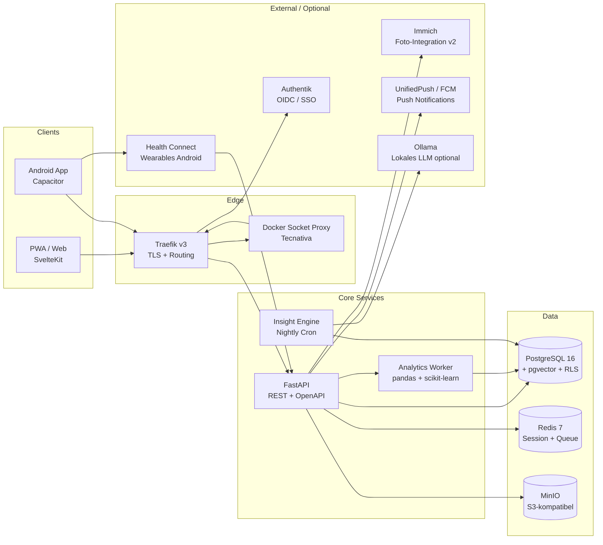

# MoodSync — Architektur

Dieses Dokument leitet sich aus [`DESIGN_DOCUMENT.md`](DESIGN_DOCUMENT.md) ab und vertieft die technische Architektur.

---

## 1. Leitprinzipien

| Prinzip                           | Bedeutung                                                                                      |
| --------------------------------- | ---------------------------------------------------------------------------------------------- |
| **API-First**                     | Backend ist vollständig über REST/OpenAPI konsumierbar; kein Coupling zwischen Frontend und DB |
| **Offline-First**                 | Clients sind vollwertig offline bedienbar; Server ist autoritativ bei Merge                    |
| **Selfhosted-First, Cloud-Ready** | `docker compose up` → lauffähig. Kein Code-Rewrite für SaaS-Phase                              |
| **Privacy by Design**             | Datenminimierung, Feld-Verschlüsselung für Sensibles, keine Third-Party-Analytics              |
| **Stateless Backend**             | Keine Server-Side-Session; State in PostgreSQL + Redis; horizontal skalierbar                  |
| **12-Factor App**                 | Config über Env-Variablen, Logs auf stdout, Prozesse stateless                                 |

---

## 2. Komponentendiagramm



> **Docker Socket Proxy (Tecnativa):** Traefik erhält keinen direkten Zugriff auf `/var/run/docker.sock`. Stattdessen sitzt ein schreibgeschützter Socket-Proxy (Tecnativa-Image) dazwischen, der nur die benötigten API-Endpunkte (`containers`, `networks`, `services`) exponiert. Dies verhindert, dass ein kompromittierter Traefik-Container vollständige Docker-Kontrolle erhält.

---

## 3. Deployment-Topologien

### Topologie A — Single Node (Selfhost, empfohlen bis 500 User)

```
[Internet] → [Traefik] → [FastAPI] → [PostgreSQL]
                                   → [Redis]
                                   → [MinIO]
             [Authentik] (separat oder integriert)
```

Alles auf einer Hetzner CX23 (2 vCPU, 4 GB RAM) via `docker-compose.yml`. Kosten: ~4–8 €/Monat.

### Topologie B — HA / SaaS (ab 5.000 User)

```
[Cloudflare] → [Traefik (2×)] → [FastAPI (3×)]
                                → [PostgreSQL (Primary + Replica)]
                                → [Redis Sentinel]
                                → [MinIO (Distributed)]
```

Hetzner CCX23 × 2 + Managed Postgres + Managed Object Storage. ~150–250 €/Monat.

---

## 4. Sync-Protokoll (Offline-First Detail)

```
Client                          Server
  |                               |
  |─── POST /sync/push ──────────>|  {changes: [{id, table, data, updated_at}]}
  |                               |  Merge: Last-Write-Wins per Feld
  |<── 200 {conflicts, cursor} ───|
  |                               |
  |─── GET /sync/pull?since=X ──>|
  |<── 200 {changes: [...]} ──────|
  |                               |
```

**Konfliktauflösung:**

- Granularität: pro Feld, nicht pro Dokument
- Entscheid: `updated_at` entscheidet (Server-Version gewinnt bei gleichem Timestamp)
- Client erhält Merge-Report bei Konflikt
- Konflikte werden in `sync_conflicts` geloggt (siehe Sektion 9)
- Kein CRDT nötig (pro Tag typischerweise nur ein Device)

---

## 5. Auth-Flow (OIDC via Authentik)

```
1. User öffnet App → redirect zu Authentik /authorize
2. Authentik: Login (Password / MFA / SSO)
3. Authentik → App: Authorization Code
4. App → FastAPI: POST /auth/callback mit Code
5. FastAPI → Authentik: Token Exchange → Access Token + Refresh Token
6. FastAPI setzt HttpOnly-Cookie (Session)
7. Refresh Token Rotation: neues Token bei jeder Nutzung
```

---

## 6. Analytics Worker & Insight Engine

```
Nightly Cron (02:00 UTC)
  └── Für jeden aktiven User (≥ 30 Einträge):
        ├── Lade Entry-History aus PostgreSQL
        ├── Berechne Punkt-Biseriale Korrelationen (Tags ↔ Mood)
        ├── Berechne Lag-Analyse (Tag t-1, t-2 ↔ Mood t)
        ├── Lasso-Regression (multiple Variablen, Regularisierung)
        ├── Filtere: effect_size > 0.15, confidence > 0.7, sample_n ≥ 10
        ├── Generiere Statement via Template
        │     └── Optional: Ollama (lokales LLM) für natürlichere Sprache
        └── Speichere Insight in PostgreSQL
```

**Insight-Objekt:**

```json
{
  "metric": "tag:sport",
  "effect_size": 0.73,
  "confidence": 0.85,
  "sample_n": 34,
  "statement": "An Tagen mit Sport ist dein Mood-Score Ø +0.7 höher (basierend auf 34 Tagen).",
  "generated_at": "2026-04-20T02:15:00Z"
}
```

---

## 7. Datensicherheit

| Layer                 | Maßnahme                                                                                       | Status    |
| --------------------- | ---------------------------------------------------------------------------------------------- | --------- |
| Transport             | TLS 1.3 + HSTS + CSP strict via Traefik                                                        | ✅        |
| Auth                  | Native JWT + Refresh-Rotation (Phase 1, M1 ✅) / OIDC via Authentik (Phase 2, M12+)            | ✅        |
| Docker Security       | Traefik nutzt Docker Socket Proxy (Tecnativa) statt direktem Socket-Mount                      | ✅        |
| Daten at-rest (DB)    | App-Level Fernet pro User-DEK für `entries.note_enc` und Custom-`symptoms.name_enc` (ADR-0005) | ✅        |
| Daten at-rest (MinIO) | SSE-S3 für alle Buckets aktiviert                                                              | ✅        |
| MinIO Isolation       | MinIO-Console NICHT über öffentliches Traefik-Routing erreichbar                               | ✅        |
| Multi-Tenancy         | PostgreSQL Row-Level-Security (`user_id`-basiert)                                              | ✅        |
| Sync-Konflikte        | Conflict-Log-Tabelle für alle LWW-Konflikte                                                    | ✅        |
| App-Lock              | PIN / Biometrie (Web Crypto API)                                                               | Phase 1.1 |
| Export/Löschung       | JSON+ZIP-Export (Art. 20 DSGVO), Self-Service Account-Löschung                                 | ✅        |
| Backups               | Verschlüsselt via restic auf externen Storage                                                  | ✅        |
| Audit-Log             | Alle Admin-Aktionen geloggt                                                                    | ✅        |
| EXIF-Strip            | Serverseitiger EXIF-Strip via Pillow (GPS + biometrische Metadaten)                            | ✅        |
| Logs                  | Keine Klartextloggung von Mood-/Symptom-Werten                                                 | ✅        |
| Rate-Limiting         | Login-Endpunkte max. 5/min (SlowAPI)                                                           | ✅        |
| Push Payload          | Notification-Payload enthält keine Gesundheitsdaten                                            | ✅        |

---

## 8. Mobile-Strategie: Capacitor statt TWA

> Rationale vollständig dokumentiert in [ADR-0002](../decisions/ADR-0002.md).

### Ausgangslage: Warum nicht TWA?

Trusted Web Activities (TWA / Bubblewrap) wurden als initialer Ansatz evaluiert, aber aus mehreren Gründen verworfen:

| Problem                                 | Erläuterung                                                                                                                                                                                                                                            |
| --------------------------------------- | ------------------------------------------------------------------------------------------------------------------------------------------------------------------------------------------------------------------------------------------------------ |
| **Kein Health Connect Zugriff**         | TWA ist eine Chrome-Rendering-Schicht und bietet keine Möglichkeit, native Android-APIs wie Health Connect direkt anzubinden. Eine Brücke wäre nur über einen separaten nativen Companion-Layer möglich — faktisch ein zweites Projekt.                |
| **Google Play Policy-Risiko**           | Google hat TWA-Apps, die primär eine Website wrappen ohne substanziellen nativen Mehrwert, wiederholt aus dem Play Store entfernt oder abgelehnt. Für eine App mit Gesundheitsdaten (erweitertes Policy-Screening) ist dieses Risiko nicht akzeptabel. |
| **Eingeschränkte Offline-Capabilities** | TWA-Cache-Verhalten ist an den Chrome-Browser gebunden; kein zuverlässiges Workbox-controlled ServiceWorker-Lifecycle außerhalb des Browser-Contexts.                                                                                                  |

### Capacitor als Lösung

[Capacitor](https://capacitorjs.com/) (Ionic) ist ein nativer Runtime-Wrapper, der bestehende Web-Apps in vollwertige native Apps verwandelt:

- **SvelteKit-Codebase bleibt erhalten:** Kein Framework-Wechsel, keine doppelte Codebasis. Der gesamte bestehende SvelteKit-Code läuft im Capacitor WebView.
- **Native Bridge:** Capacitor exponiert native Android-APIs über ein typisiertes Plugin-System. Health Connect wird über `@capacitor-community/health-connect` (oder ein projektspezifisches Plugin) angebunden.
- **Volle Play-Store-Konformität:** Capacitor-Apps gelten als native Apps, da sie echte APKs mit nativem Code erzeugen.
- **Einheitlicher Build-Prozess:** Kein separates Android-Projekt zu pflegen; das Capacitor-Projekt wird aus dem SvelteKit-Build generiert.

### Build-Prozess

```
SvelteKit (src/)
    │
    ▼ npm run build
Static Build Output (build/)
    │
    ▼ npx cap sync android
Capacitor Android-Projekt (android/)
    │
    ▼ ./gradlew assembleRelease
Android APK / AAB (für Play Store)
```

**CI/CD:** GitHub Actions baut APK bei jedem Tag-Push auf `main`. Signing via GitHub Secrets (Keystore).

---

## 9. Sync-Protokoll: Conflict-Log

Ergänzend zu der in Sektion 4 beschriebenen LWW-Strategie (Last-Write-Wins) werden alle Konflikte persistent geloggt — sie werden nicht still überschrieben.

### Motivation

Bei LWW gehen im Konfliktfall Daten des „unterlegenen" Clients verloren. Um Transparenz und Nachvollziehbarkeit zu gewährleisten (insbesondere bei Gesundheitsdaten), schreibt der Server bei jedem Merge-Konflikt einen Eintrag in `sync_conflicts`. Nutzer können diese unter **Einstellungen → Datenverlauf** einsehen und ggf. manuell die bevorzugte Version übernehmen.

### Schema

```sql
CREATE TABLE sync_conflicts (
  id           UUID PRIMARY KEY DEFAULT gen_random_uuid(),
  user_id      UUID NOT NULL REFERENCES users(id),
  entity_id    UUID NOT NULL,
  entity_type  TEXT NOT NULL, -- 'entry', 'tag', 'habit'
  field_name   TEXT NOT NULL,
  client_value JSONB,
  server_value JSONB,
  client_ts    TIMESTAMPTZ NOT NULL,
  server_ts    TIMESTAMPTZ NOT NULL,
  resolved_at  TIMESTAMPTZ,
  created_at   TIMESTAMPTZ DEFAULT NOW()
);
```

### Verhalten

| Aspekt          | Beschreibung                                                                                                                    |
| --------------- | ------------------------------------------------------------------------------------------------------------------------------- |
| **Auslöser**    | Jedes Feld, bei dem `client_ts` und `server_ts` divergieren und beide Werte sich unterscheiden                                  |
| **Gewinner**    | Server-Version (`server_value`) gewinnt und wird in der Haupttabelle gespeichert                                                |
| **Verlierer**   | Client-Version (`client_value`) wird in `sync_conflicts` archiviert                                                             |
| **Einsehbar**   | Settings → Datenverlauf → Sync-Konflikte (gefiltert nach Zeitraum und Entity-Type)                                              |
| **Auflösung**   | User kann `resolved_at` setzen (= manuell als erledigt markiert); zukünftig: manuelle Wert-Übernahme                            |
| **Bereinigung** | Automatisches Löschen nach **90 Tagen** via PostgreSQL-Job / pg_cron (`DELETE … WHERE created_at < NOW() - INTERVAL '90 days'`) |

### Sequenzdiagramm (Konfliktfall)

```
Client                          Server
  |                               |
  |─── POST /sync/push ──────────>|  field: mood_score
  |    {client_ts: T2, val: 7}    |  DB hat: {server_ts: T2, val: 8}
  |                               |  → Konflikt erkannt (gleicher Timestamp, andere Werte)
  |                               |  → INSERT INTO sync_conflicts (...)
  |                               |  → Server-Wert bleibt in entries
  |<── 200 {conflicts: [{...}]} ──|
  |    User wird informiert        |
```

---

## 10. DSGVO-Compliance-Architektur

Alle personenbezogenen Daten, insbesondere Gesundheitsdaten (Art. 9 DSGVO), werden nach
Privacy-by-Design-Prinzipien verarbeitet. Details: [docs/DSGVO.md](DSGVO.md)

### Datenfluss-Übersicht

- Alle Nutzdaten bleiben auf der selbst betriebenen Instanz
- Kein Third-Party-Tracking, kein Analytics-Dienst, keine CDN-Ressourcen
- Health Connect Daten fließen nur App → lokale Instanz (kein Cloud-Hop)
- Logs enthalten keine Gesundheitsdaten im Klartext

### Technische Umsetzung der Datenschutzrechte

| Recht                          | Umsetzung                                                                       |
| ------------------------------ | ------------------------------------------------------------------------------- |
| Auskunft (Art. 15)             | API: `GET /user/data-export` (JSON-Dump)                                        |
| Berichtigung (Art. 16)         | Standard-Edit-Endpunkte                                                         |
| Löschung (Art. 17)             | `DELETE /api/v1/user/me` → Cascade auf alle Daten + Cryptographic Erasure (DEK) |
| Datenübertragbarkeit (Art. 20) | `GET /user/export` → ZIP mit JSON + Fotos                                       |
| Widerspruch (Art. 21)          | Analytics-Opt-Out: `POST /user/settings {analytics_enabled: false}`             |
