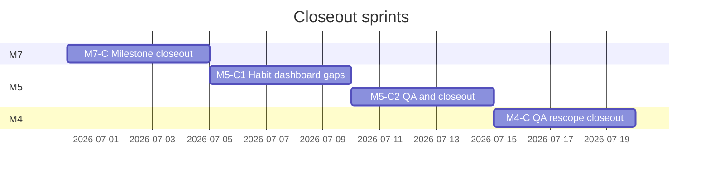

# Closeout Sprint Plan — M4, M5, M7

Last updated: 2026-06-30

Companion to per-milestone sprint plans. This document records **audit findings** (2026-06-30),
the **closeout sprint sequence**, and a **deferred-work index** mapping every out-of-scope item
to a future roadmap milestone.

**Repository:** [Sturmi77/correlcore](https://github.com/Sturmi77/correlcore)  
**Audit method:** `gh` CLI (authenticated), sprint status docs on `main`, open-issue scan.

---

## 1. Audit findings (2026-06-30)

### 1.1 Milestone code vs. formal closeout

| Milestone | Code on `main`             | Formal closeout | Status (2026-06-30) |
| --------- | -------------------------- | --------------- | ------------------- |
| **M7**    | Spec complete (PR #238)    | Sprint **M7-C** | **Complete** ✓      |
| **M5**    | Habits Core (PR #212)      | **M5-C1/C2**    | **Complete** ✓      |
| **M4**    | Quick wins + PWA (PR #211) | Sprint **M4-C** | **Complete** ✓      |

### 1.2 GitHub milestone tracker (post-hygiene)

GitHub milestones (numeric IDs) do **not** match roadmap IDs (M0–M13). After closeout hygiene:

| GitHub milestone # | GitHub title              | Roadmap ID | Status                                                          |
| ------------------ | ------------------------- | ---------- | --------------------------------------------------------------- |
| 1–4                | M0–M3                     | M0–M3      | **Closed** (shipped)                                            |
| 5–6                | M4, M5                    | M4, M5     | **Closed** (closeout done)                                      |
| 8                  | M4.1 — Offline-First Sync | M4.1       | **Complete** (2026-06-30) — #10, #24 closed                     |
| 7                  | M10 — Public Selfhost     | M10        | **Ready to close** — Sprint 6 complete; tag `v1.0.0` post-merge |

Roadmap status in `README.md` and `docs/M*_SPRINT_STATUS.md` is authoritative.

### 1.3 Issue tracker hygiene (completed 2026-06-30)

| Action                       | Issues        |
| ---------------------------- | ------------- |
| Closed (shipped M3)          | #15, #16, #17 |
| Rescoped → M4.1              | #10, #24      |
| Rescoped → M11               | #27           |
| Relabeled M7 → M8            | #31           |
| Relabeled → M7-S8 (optional) | #147, #148    |
| Relabeled → post-M7          | #149          |
| Closed (M5 closeout)         | #157, #159    |
| Closed (M7 closeout)         | #146, #150    |

### 1.4 Open issues by closeout relevance (historical)

**M4 blockers for closeout (rescope, not implement):**

| Issue                                                   | Title                | Action       |
| ------------------------------------------------------- | -------------------- | ------------ |
| [#10](https://github.com/Sturmi77/correlcore/issues/10) | Offline-Sync (Dexie) | → **M4.1** ✓ |
| [#24](https://github.com/Sturmi77/correlcore/issues/24) | Sync Conflict-Log    | → **M4.1** ✓ |
| [#27](https://github.com/Sturmi77/correlcore/issues/27) | Capacitor-Strategie  | → **M11** ✓  |

**M5 blockers for closeout (implement):**

| Issue                                                     | Title                            | Action   |
| --------------------------------------------------------- | -------------------------------- | -------- |
| [#157](https://github.com/Sturmi77/correlcore/issues/157) | Adherence Rate + no-gamification | Closed ✓ |
| [#159](https://github.com/Sturmi77/correlcore/issues/159) | Habit Dashboard UI               | Closed ✓ |

**M7 hygiene (shipped — close or relabel):**

| Issue                                                     | Title                   | Shipped in | Closeout action |
| --------------------------------------------------------- | ----------------------- | ---------- | --------------- |
| [#144](https://github.com/Sturmi77/correlcore/issues/144) | Lasso + TimeSeriesSplit | Sprint 1   | Closed ✓        |
| [#145](https://github.com/Sturmi77/correlcore/issues/145) | Lag 1–7d                | Sprint 1   | Closed ✓        |
| [#146](https://github.com/Sturmi77/correlcore/issues/146) | Weekday OLS confounder  | Sprint 7   | Closed ✓        |
| [#150](https://github.com/Sturmi77/correlcore/issues/150) | Combined clusters API   | Sprint 9   | Closed ✓        |
| [#149](https://github.com/Sturmi77/correlcore/issues/149) | Changepoint (ruptures)  | —          | **post-M7** ✓   |
| [#147](https://github.com/Sturmi77/correlcore/issues/147) | Weekly digest           | —          | **M7-S8** ✓     |
| [#148](https://github.com/Sturmi77/correlcore/issues/148) | Ollama LLM              | —          | **M7-S8** ✓     |

**Mislabeled issues (resolved):**

| Issue                                                          | Was                    | Now             |
| -------------------------------------------------------------- | ---------------------- | --------------- |
| [#31](https://github.com/Sturmi77/correlcore/issues/31)        | `milestone:M7`         | **M8** ✓        |
| [#147–#149](https://github.com/Sturmi77/correlcore/issues/147) | `milestone:M8` (wrong) | M7-S8/post-M7 ✓ |

### 1.5 Scope decision (binding for closeout)

- **M4 closes without Dexie offline sync.** Quick wins + PWA shell only. Offline-first is **M4.1**.
- **M5 closes without tag co-occurrence heatmap** (already shipped as M5.1 quick win).
- **M7 closes without Sprint 8** (Ollama, digest), changepoint, sleep, or cycle analytics.

---

## 2. Deferred-work index (future milestones)

Every item explicitly excluded from M4/M5/M7 closeout maps here.

| Roadmap ID  | Title                        | Scope summary                                                                                       | GitHub issues / refs                                                                                      |
| ----------- | ---------------------------- | --------------------------------------------------------------------------------------------------- | --------------------------------------------------------------------------------------------------------- |
| **M4.1**    | Offline-First Sync           | Dexie.js, delta sync, conflict log, retry queue                                                     | #10, #24; [M4.1_SPRINT_PLAN.md](M4.1_SPRINT_PLAN.md) · [ADR-0009](adr/0009-offline-sync-nach-m4.md)       |
| **M4.2**    | Push & App Lock              | UnifiedPush / FCM, app lock, install polish                                                         | Original M4 scope; blocked by M4.1 for offline push UX                                                    |
| **M5.1**    | Tag co-occurrence (shipped)  | Patterns heatmap on `/insights`                                                                     | Closeout done 2026-05-29 — [`quality/M5_1_VISUAL_QA.md`](quality/M5_1_VISUAL_QA.md)                       |
| **M7-S8**   | Insights optional LLM/Digest | Ollama statements + weekly digest **foundation landed** (#147/#148); push delivery still needs M4.2 | See CHANGELOG Unreleased; Worker `app.workers.digest`                                                     |
| **post-M7** | Changepoint analytics        | `ruptures` mood breaks — **foundation landed** (#149)                                               | Insight engine + migration 026                                                                            |
| **M7.1**    | Cycle × lifestyle insights   | Cycle phase bands, lifestyle correlation                                                            | [`features/cycle-tracking.md`](features/cycle-tracking.md)                                                |
| **M8**      | Sleep & Health Connect       | Sleep fields + HC import remaining; **consent + notes signals foundations landed** (#31, #201–#202) | [`M8_NOTES.md`](M8_NOTES.md)                                                                              |
| **M9**      | Beta hardening               | **Complete** (2026-07-11)                                                                           | #29 closed; [`M9_SPRINT_STATUS.md`](M9_SPRINT_STATUS.md)                                                  |
| **M9+**     | Security hardening           | Slug HMAC for custom symptoms — **landed** (#62, ADR-0039, migration 027)                           | Ops: set `SLUG_HMAC_KEY` before upgrade                                                                   |
| **M10**     | Public selfhost v1.0         | **Complete** (2026-07-11)                                                                           | Tag `v1.0.0`                                                                                              |
| **M11**     | Android Play Store           | **Sprints 1–5 complete** (shell, sideload, Bearer, Glance widget, FCM registration); Play Console / Firebase / ops remaining | [`M11_SPRINT_PLAN.md`](M11_SPRINT_PLAN.md), ops [#429](https://github.com/Sturmi77/correlcore/issues/429) |
| **M12**     | SaaS mode                    | Managed hosting, Authentik OIDC                                                                     | [ADR-0004](adr/0004-auth-strategie.md)                                                                    |
| **M13**     | Photo & media                | **EXIF strip foundation landed** (#28); MinIO persist + gallery remaining                           | `POST /media/photos`, [`M13_NOTES.md`](M13_NOTES.md)                                                      |

**Notes epic (#194–#202):** Foundation (markers, visibility, signals, ADRs N-01–03) shipped with PR #393;
remaining polish/export depth tracked under notes feature spec — not M7 closeout blockers.

---

## 3. Sprint sequence (4 weeks)



| Sprint    | Duration | Type           | Exit criterion                          |
| --------- | -------- | -------------- | --------------------------------------- |
| **M7-C**  | 1 week   | Docs + hygiene | M7 Complete in README; #146/#150 closed |
| **M5-C1** | 1 week   | Feature        | #157/#159 acceptance criteria met       |
| **M5-C2** | 1 week   | QA + docs      | `M5_VISUAL_QA.md`; milestone #6 closed  |
| **M4-C**  | 1 week   | QA + rescope   | `M4_VISUAL_QA.md` pass; #10/#24 → M4.1  |

---

## 4. Sprint M7-C — Milestone closeout

**Goal:** Formal M7 completion. No new feature code.

### Day 1–2 — Verification

```powershell
.\scripts\local-quality.ps1
cd backend
uv run --python 3.12 python scripts/seed_m7_qa.py --reset
uv run --python 3.12 python scripts/verify_m7_qa_api.py
pnpm --filter @correlcore/web test:e2e:smoke
```

Rendered QA matrix: [`quality/M7_SPRINT9_VISUAL_QA.md`](quality/M7_SPRINT9_VISUAL_QA.md).

### Day 3 — GitHub hygiene

```powershell
gh issue close 146 --comment "Shipped: weekday OLS confounder (M7 Sprint 7, PR #223)."
gh issue close 150 --comment "Shipped: combined tag+symptom clusters API (M7 Sprint 9, PR #238)."
gh issue comment 149 --body "Deferred to post-M7 per M7_SPRINT9_PLAN. Not a closeout blocker."
gh issue comment 147 --body "Deferred to M7-S8 (optional). Depends on M4.2 push infrastructure."
gh issue comment 148 --body "Deferred to M7-S8 (optional). Local Ollama only; no cloud LLM."
```

Relabel #31 from `milestone:M7` → M8 when M8 sprint opens.

### Day 4 — Documentation

| File                              | Update                                      |
| --------------------------------- | ------------------------------------------- |
| `docs/M7_SPRINT_STATUS.md`        | M7-C section; remove stale remaining items  |
| `docs/quality/M7_QUALITY_GATE.md` | Sprints 6–9 passed; verdict **M7 Complete** |
| `README.md`                       | M7 → Complete                               |
| `CHANGELOG.md`                    | M7-C closeout entry                         |
| `docs/DESIGN_DOCUMENT.md`         | M7 acceptance criteria `[x]` where shipped  |

### Day 5 — Sign-off

- [ ] CI green on closeout PR
- [ ] No open must-have M7 issues except #149 (deferred)

---

## 5. Sprint M5-C1 — Habit dashboard gaps

**Goal:** Close #157 and #159.

### Backend

- `GET /api/v1/habits/{tag_id}/stats?window={7|14|28|90}`
- Response: `adherence_rate`, `days_tracked`, `days_total`, `correlation_score` (nullable)

### Frontend

- Habit list: adherence badge + window selector
- Habit detail: adherence bar, M2 heatmap, correlation contribution (hidden when null)
- Bottom-sheet detail on mobile; neutral empty states

### Tests

- Backend pytest for all windows and null correlation
- `noGamificationCopy.test.ts` regression

---

## 6. Sprint M5-C2 — M5 QA + closeout

- `.\scripts\local-quality.ps1`
- New: `docs/quality/M5_VISUAL_QA.md` (375 / 768 / 1280, light + dark)
- Update `M5_SPRINT_STATUS.md`, `FRONTEND.md`, `README.md`, `CHANGELOG.md`
- Close #157, #159; close GitHub milestone #6

---

## 7. Sprint M4-C — M4 QA + rescope

### Rendered QA

Complete `docs/quality/M4_VISUAL_QA.md` for all M4 surfaces (slots, onboarding, PWA, smoothing).

### Issue rescope

Create GitHub milestone **M4.1 — Offline-First Sync** and move #10, #24.

```powershell
gh api repos/Sturmi77/correlcore/milestones -f title="M4.1 — Offline-First Sync" `
  -f description="Dexie.js, delta sync, conflict log, retry queue. See ADR-0009."
```

- #27 → comment + relabel M11 (Capacitor — ADR-0002)
- Close GitHub milestone #5 (M4 — Mobile Polish)

---

## 8. Post-closeout checklist

| Document                       | M7-C     | M5-C      | M4-C                    |
| ------------------------------ | -------- | --------- | ----------------------- |
| `README.md` milestone table    | Complete | Complete  | Complete                |
| `CHANGELOG.md`                 | Entry    | Entry     | Entry                   |
| `docs/M*_SPRINT_STATUS.md`     | All Done | All Done  | All Done                |
| `docs/quality/M*_VISUAL_QA.md` | Sprint 9 | New (M5)  | Pass matrix             |
| GitHub milestone               | Hygiene  | #6 closed | #5 closed; M4.1 created |

---

## 9. References

- [`M4_SPRINT_PLAN.md`](M4_SPRINT_PLAN.md) · [`M4_SPRINT_STATUS.md`](M4_SPRINT_STATUS.md)
- [`M5_SPRINT_PLAN.md`](M5_SPRINT_PLAN.md) · [`M5_SPRINT_STATUS.md`](M5_SPRINT_STATUS.md)
- [`M7_SPRINT_PLAN.md`](M7_SPRINT_PLAN.md) · [`M7_SPRINT_STATUS.md`](M7_SPRINT_STATUS.md)
- [`M7_SPRINT9_PLAN.md`](M7_SPRINT9_PLAN.md)
- [`M7_M8_MILESTONE_SWAP.md`](M7_M8_MILESTONE_SWAP.md)
