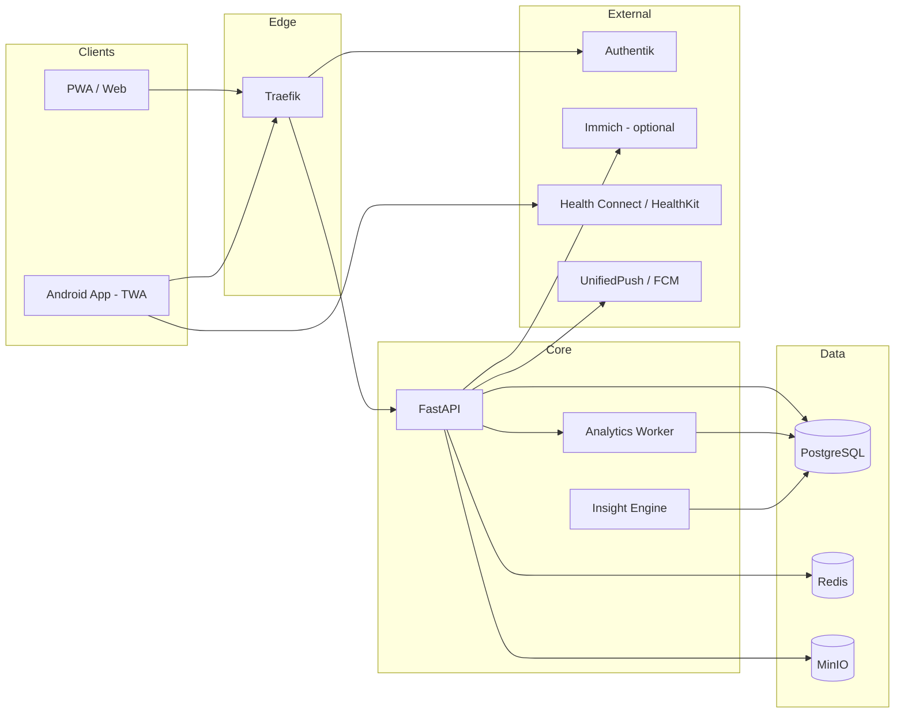
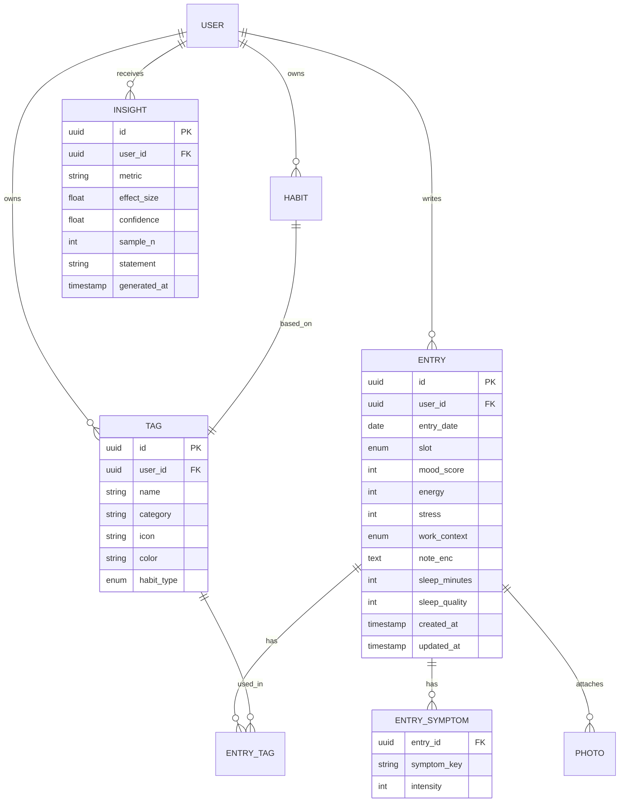

# Design-Dokument: MoodSync — Mood & Habit Tracker mit Korrelationsanalyse

**Version:** 0.2 (Produkt-Konkretisierung)
**Datum:** 2026-04-20
**Autor:** Solo-Entwickler / Einmann-Unternehmen
**Arbeitstitel:** MoodSync
**Zweck:** Single Source of Truth für Projekt, Architektur, Frontend-Prinzipien und Roadmap. Dient gleichzeitig als Kontext-Datei für KI-Assistenten (Claude, Perplexity, Cursor, Copilot).

---

## 0. Wie dieses Dokument zu nutzen ist (Meta)

`DESIGN_DOCUMENT.md` ist die kanonische Quelle. Alle weiteren Dokumente (`ARCHITECTURE.md`, `API.md`, `FRONTEND.md`, `ROADMAP.md`) leiten sich daraus ab.

Bei Sessions mit KI-Modellen: **Diese Datei IMMER zuerst in den Kontext laden.**

Änderungen werden via Git versioniert; jede signifikante Entscheidung als ADR unter `/docs/adr/NNNN-titel.md`.

### KI-Prompt-Template

```
Kontext: Lies zuerst DESIGN_DOCUMENT.md vollständig. Halte dich strikt an die dort
definierte Architektur, Tech-Stack und Frontend-Prinzipien. Wenn du davon abweichen
willst, begründe es und schlage einen ADR-Eintrag vor.
Aufgabe: <hier konkrete Aufgabe>
```

---

## 1. Vision & Produkt

### 1.1 Problem

Menschen spüren, dass Schlaf, Sport, Homeoffice-Tage, Sozialkontakte oder bestimmte Aktivitäten ihr Wohlbefinden beeinflussen — aber niemand weiß welche wirklich, wie stark und mit welcher Verzögerung. Bestehende Apps (Daylio, Bearable, Exist.io) sind entweder zu simpel (nur Mood-Emoji), zu Cloud-abhängig (Privacy-Bedenken bei Gesundheitsdaten) oder zu komplex (Quantified-Self-Nerd-Zielgruppe).

### 1.2 Vision

MoodSync ist ein privacy-first Mood- und Habit-Tracker, der Korrelationen zwischen Aktivitäten, Gesundheit und Wohlbefinden sichtbar macht und in alltagstauglichen Handlungsempfehlungen verdichtet.

### 1.3 Zielgruppe

**Primary Persona „Reflektive Self-Optimizer" (30–50 J.):** Berufstätig, teils Homeoffice, sport- oder gesundheitsbewusst, Garmin/Apple-Watch-User, tech-affin, Privacy-sensitiv, will keine weitere Cloud-Gesundheits-App.

**Secondary Persona „Health-Aware Recoverer":** Migräne-/Verdauungs-/Burnout-Historie; nutzt App als Ergänzung zu Arzt/Therapie.

### 1.4 Value Proposition

- **Zusammenhänge statt Rohdaten** — die App erklärt, warum Tage gut/schlecht waren
- **Selfhosted & Offline-First** — deine Gesundheitsdaten verlassen dein Zuhause nicht
- **60 Sekunden pro Tag** — nicht mehr, sonst wird es nicht gemacht

### 1.5 Nicht-Ziele (wichtig!)

- Kein medizinisches Diagnose-Tool (Disclaimer nötig)
- Kein Social Network, keine öffentlichen Feeds
- Kein Chat-Bot/Therapeut-Ersatz
- Keine Ads, kein Daten-Verkauf — Monetarisierung ausschließlich via Selfhost-Lizenz oder SaaS-Abo

### 1.6 Erfolgsmetriken

| Metrik | Ziel |
|---|---|
| Day-7 Retention | ≥ 40 % |
| Day-30 Retention | ≥ 20 % |
| Ø Tägliche Eintrags-Completion | ≥ 70 % aktiver User |
| Time-to-First-Insight | < 14 Tage |
| Crash-Free-Rate | > 99,5 % |

---

## 2. Feature-Katalog (detailliert & kritisch bewertet)

Jedes Feature: Beschreibung → Kritische Fragen → Entscheidung/Umsetzung → Priorität (MoSCoW).

### 2.1 Täglicher Eintrag (Mood-Entry)

**Beschreibung:** Ein Eintrag pro Tag mit Mood-Score (1–5 oder −2..+2 Slider), Energielevel, Stresslevel, optionaler Text-Notiz.

**Kritisch:**
- „Ein Datensatz pro Tag" ist einfach, verliert aber Intra-Day-Dynamik (morgens top, abends mies).
- Empfehlung: 1 Hauptdatensatz pro Tag + optionale Mehrfacheinträge (Morning/Noon/Evening) als „Detail-Checkins". Standard-UX bleibt „1/Tag", Power-User können mehr erfassen.
- Nachträgliches Erfassen für bis zu 7 Tage erlauben, danach read-only (sonst Bias durch Rückblick).

**Entscheidung:** Datenmodell speichert `entries` mit optionalem `slot` (`day|morning|noon|evening`). UI zeigt Default „Tagesrückblick".

**Priorität:** MUST

---

### 2.2 Aktivitäten / Tags

**Beschreibung:** Multi-Select von Tags (Sport, Musik, Lesen, Familie, Alkohol, Meditation, …). User-definierbar, gruppierbar (Kategorien: Sport, Sozial, Arbeit, Freizeit, Konsum).

**Kritisch:**
- Vordefinierte Tags vs. freie Tags: beides. Start mit kuratiertem Set (~30 Tags), freies Hinzufügen möglich, Merge-UI gegen Tag-Wildwuchs.
- Dauer/Intensität erfassen? Fürs MVP nein (Friction zu hoch); später optional Duration-Slider pro Tag.

**Entscheidung:** Tags mit Kategorie, Icon, Farbe; Tag-Verwendung boolean pro Entry; V2: `tag_usage(entry_id, tag_id, duration_min, intensity)`.

**Priorität:** MUST

---

### 2.3 Good / Bad Habits

**Beschreibung:** Explizit als „gut" oder „schlecht" markierte Tags mit Streak-Tracking (z. B. „7 Tage ohne Alkohol", „12 Tage Meditation").

**Kritisch:**
- Habit ≠ Tag: Habits brauchen Ziele („5×/Woche Sport") und Streaks, Tags nur Ja/Nein.
- Psychologisch heikel: „Bad Habit"-Framing kann schaden. Neutrale Sprache anbieten („Habits I'm building" / „Habits I'm reducing").

**Entscheidung:** Tag kann Flag `habit_type: none|build|reduce` + `target_frequency` haben. Streak-Logik separat.

**Priorität:** SHOULD (v1.1)

---

### 2.4 Gesundheits-Symptome

**Beschreibung:** Checkliste für Symptome (Kopfschmerzen, Verdauung, Rückenschmerzen, Schlafqualität subjektiv, Erkältung) + Intensitätsskala 0–3.

**Kritisch:**
- Klar von Mood trennen — Symptome sind objektivere Marker und wichtig für Korrelationen.
- Menstruationszyklus explizit berücksichtigen? Ja, optional (hoher Korrelationswert, Gender-Inclusion).
- Medizinischer Disclaimer Pflicht.

**Entscheidung:** Eigene `symptoms`-Entität, parallel zu Tags. Zyklus-Tracking als optionales Modul.

**Priorität:** MUST (Kern-USP der Korrelationsanalyse)

---

### 2.5 Notizen

**Beschreibung:** Freitextfeld pro Eintrag, Markdown-Support.

**Kritisch:**
- Volltextsuche nötig? Ja, über Postgres FTS oder Meilisearch.
- E2E-Verschlüsselung sinnvoll — siehe Security.

**Entscheidung:** `entries.note` TEXT, verschlüsselt-at-rest; Suche serverseitig (nur möglich wenn Entschlüsselung am Server; bei E2E: clientseitige Suche über lokalen Index).

**Priorität:** MUST

---

### 2.6 Fotos / Immich-Integration

**Beschreibung:** Fotos des Tages anhängen bzw. aus Immich (selfhosted Foto-Stack) referenzieren.

**Kritisch:**
- Fotos selbst hosten verdoppelt Storage-Bedarf. Immich-Referenz ist eleganter: `asset_id` + Thumbnail-Proxy.
- Immich hat eine OAuth-fähige API (REST) → realistisch integrierbar, aber Breaking Changes möglich.
- Datenschutz: Foto-Metadaten (EXIF, GPS) vorher strippen.

**Entscheidung:**
- v1: lokaler Upload nach MinIO, EXIF-Strip Pflicht.
- v2: optionale Immich-Integration via API-Key, „Foto des Tages" per Search-API (by date).

**Priorität:** COULD (Immich), SHOULD (lokaler Upload)

---

### 2.7 Office/Homeoffice-Tag

**Beschreibung:** Kategorischer Tages-Kontext (Büro, Homeoffice, Urlaub, Krank, Wochenende, Dienstreise).

**Kritisch:**
- Nicht als Tag, sondern als dedicated Field — hoher Korrelationswert, strukturiertes Reporting.
- Auto-Detection via Kalender (ICS-Import) oder Geofence später möglich.

**Entscheidung:** `entries.work_context` Enum. Auto-Fill via Wochentag-Default-Regeln.

**Priorität:** MUST

---

### 2.8 Schlafdaten aus Garmin / Wearables

**Beschreibung:** Schlafdauer, -qualität, HRV, Ruhepuls automatisch importieren.

**Kritisch:**
- Garmin hat **keine** offizielle Consumer-API ohne Approval-Prozess (Health-API nur B2B). Workarounds:
  - `python-garminconnect` — fragil, TOS-Grauzone
  - Garmin → Health Connect (Android 14+) — offizieller Weg
  - Manueller CSV-Import als Fallback

**Entscheidung:**
- v1: Manuelle Eingabe Schlafdauer + -qualität
- v2 (Android-App): Health Connect Integration
- v3: Direkte `python-garminconnect` für Power-User mit Warnhinweis

**Priorität:** SHOULD (Health Connect ab v1.1), COULD (direkte Garmin-Sync)

---

### 2.9 Trend- & Mustererkennung, Handlungsempfehlungen

**Beschreibung:** App erkennt Korrelationen und formuliert kurze Statements.

**Kritisch:**
- Korrelation ≠ Kausalität. Disclaimer + Confidence-Level nötig.
- Minimum Datenmenge: seriöse Aussagen erst ab ~30 Einträgen.
- Statistische Methoden: Punkt-Biseriale Korrelation, Lag-Analyse, Lasso-Regression.
- LLM nur als Formulierungs-Schicht über statistisch verifizierten Findings. Lokales LLM (Ollama) für Privacy.

**Entscheidung:** Analyse-Worker berechnet nightly Insights. Insight-Objekt: `{metric, effect_size, confidence, sample_n, statement_template}`. Statement-Rendering template-basiert, LLM optional.

**Priorität:** MUST (Kern-USP), iterativ ausbaubar

---

### 2.10 Auswertungen / Visualisierungen

**Beschreibung:** Mood-Verlauf (Tag/Woche/Monat/Jahr), Tag-Frequenz-Heatmap, Korrelations-Matrix, Streak-Visualisierung.

**Kritisch:**
- Charts mobile-freundlich! Keine riesigen Dashboards.
- Export als PNG/CSV/PDF für Arzt-Gespräche.

**Entscheidung:** Chart-Lib: ECharts oder LayerChart (Svelte). CSV/JSON-Export per Default, PDF ab v1.1.

**Priorität:** MUST

---

### 2.11 Mobile First & Offline-Verfügbarkeit

**Beschreibung:** Schneller Eintrag auch ohne Netz, Sync wenn verfügbar.

**Kritisch:**
- PWA mit IndexedDB reicht für Text/Tags; Fotos-Upload muss Queue-basiert sein.
- Konfliktauflösung: Last-Write-Wins mit `updated_at` reicht, kein CRDT nötig.

**Entscheidung:** Lokale SQLite/IndexedDB (Dexie.js), Sync-Queue mit Retry, Delta-Sync per `updated_at`.

**Priorität:** MUST

---

### 2.12 Mehrere User / Multi-User

**Beschreibung:** Familie/WG nutzt selbe Instanz mit getrennten Daten.

**Kritisch:**
- Von Tag 1 einbauen — nachträglich Multi-Tenancy einziehen ist schmerzhaft.
- Kein Cross-User-Zugriff, kein Sharing in v1.

**Entscheidung:** Ab v1 mit `user_id` auf allen Entitäten + Row-Level-Security in Postgres.

**Priorität:** MUST (Architektur), SHOULD (Admin-UI für User-Management)

---

### 2.13 Dark/Light Theme

**Beschreibung:** System-Preference + manueller Override.

**Entscheidung:** CSS-Variablen + `prefers-color-scheme`, `data-theme`-Attribut, persistiert in LocalStorage.

**Priorität:** MUST

---

### 2.14 Security & Privacy

**Beschreibung:** Gesundheitsdaten = besonders schützenswert (DSGVO Art. 9).

**Entscheidungen:**
- Auth: OIDC via Authentik, Sessions als HttpOnly-Cookie (Web), Refresh-Token-Rotation
- Verschlüsselung at-rest: `notes`, `symptoms.details`, Fotos in MinIO mit SSE
- E2E-Option (v2): Client-seitig verschlüsselte Notizen — als Opt-in
- Transport: TLS 1.3, HSTS, CSP strikt
- App-Lock: PIN / Biometrie auf Mobile
- Export/Delete: vollständiger Datenexport (JSON+Fotos-ZIP) und „Account löschen" Self-Service
- Audit-Log aller Admin-Aktionen
- Backup: verschlüsselt via restic auf externen Storage

**Priorität:** MUST (Basics), SHOULD (E2E opt-in v2)

---

### 2.15 Erinnerungen / Notifications

**Beschreibung:** Tägliche Erinnerung „Wie war dein Tag?" + adaptive Zeiten.

**Kritisch:**
- Max. 1/Tag, konfigurierbare Zeit, Snooze.
- Selfhost: NTFY / Gotify; Play-Store-App: FCM oder UnifiedPush.

**Entscheidung:** UnifiedPush als Primary (selfhostbar), FCM-Fallback.

**Priorität:** SHOULD

---

## 3. Architektur

### 3.1 Leitprinzipien

1. **API-First & Offline-First** — Clients sind vollwertig offline bedienbar, Server ist autoritativ bei Merge
2. **Selfhosted-First, Cloud-Ready** — `docker compose up` → lauffähig. Kein Code-Rewrite für SaaS
3. **Privacy by Design** — Datenminimierung, Feld-Verschlüsselung für Sensibles, keine Third-Party-Analytics
4. **Stateless Backend, 12-Factor**

### 3.2 Komponenten



### 3.3 Tech-Stack (fixiert)

| Schicht | Technologie | Alternative erwogen |
|---|---|---|
| Backend API | FastAPI 0.111 + Python 3.12 | Django REST (zu schwerfällig) |
| Web Frontend | SvelteKit 2 + Skeleton UI | Next.js (React, größeres Bundle) |
| Mobile | PWA → TWA via Bubblewrap | React Native (zu viel Overhead für Solo-Dev) |
| Datenbank | PostgreSQL 16 + pgvector | SQLite (kein RLS für Multi-User) |
| Cache/Queue | Redis 7 | Valkey (Drop-in, evaluieren) |
| Object Storage | MinIO | S3 (nur SaaS-Phase) |
| Reverse Proxy | Traefik v3 | Nginx Proxy Manager |
| Auth | Authentik | Keycloak (zu ressourcenintensiv) |
| Offline-Sync | Dexie.js (IndexedDB) | PouchDB |
| Analytics Worker | pandas + scikit-learn | R (kein Python-Ökosystem) |
| Error Tracking | GlitchTip | Sentry Cloud (Privacy) |
| Push | UnifiedPush / FCM | NTFY direkt |
| Build | pnpm + Vite | npm (langsamer) |
| Python Deps | uv | pip/poetry |
| Migrations | Alembic | — |

### 3.4 Datenmodell (Kern)



### 3.5 Sync-Protokoll (Offline-First)

1. Client hält lokale `change_log` mit monotoner Sequenz + `client_id`
2. `POST /sync/push` sendet Batch, Server merged (Last-Write-Wins pro Feld, `updated_at` entscheidet)
3. `GET /sync/pull?since=<cursor>` liefert Delta
4. Bei Konflikt pro Tag: Server-Version gewinnt, Client bekommt Merge-Report

---

## 4. Frontend-Prinzipien

- **60-Sekunden-Regel:** Default-Eintrag in ≤ 60 Sek. (Mood-Slider, 3 Top-Tags, Symptome optional, Notiz optional)
- **Bottom-Sheet-Entry** statt Full-Page-Form auf Mobile
- **Home-Screen** = Heute + Streak + letzter Insight. Keine Dashboard-Überladung
- **Dark-Mode First**, Light-Variante paritätisch
- **a11y WCAG 2.2 AA** — Slider zusätzlich mit Buttons, Farben nie einzige Information
- **Performance-Budget:** JS < 150 KB gz, LCP < 2 s
- **i18n DE/EN** ab Tag 1, keine Hardcodes
- **Komponenten:** Atomic Design + Storybook
- **Motion:** subtil, 150–250 ms; Reduced-Motion respektieren

---

## 5. Abhängigkeiten

**Laufzeit:** PostgreSQL, Redis, MinIO, Traefik, Authentik, optional Ollama, optional Immich, SMTP-Relay

**Build:** Node LTS, pnpm, Python 3.12 + uv, Android Studio + Bubblewrap

**Extern (SaaS-Phase):** Google Play Console (25 USD), FCM, Resend/Postmark, Stripe

---

## 6. Feature-Roadmap

Entwicklung in Vertical Slices — jedes Release ist end-to-end nutzbar.

### M0 — Fundament (Woche 1–2)
- Monorepo-Setup, CI/CD, Docker Compose-Stack
- Postgres-Schema v1, Alembic
- Authentik-Anbindung, User-Login
- Leeres App-Shell (PWA) mit Theme-Toggle
- **Exit:** Login funktioniert, leere Startseite erreichbar

### M1 — Core Entry (Woche 3–5) → „Ich tracke meinen ersten Tag"
- Tägliches Eintrags-Formular: Mood, Energy, Stress, Work-Context
- Tag-System (vordefinierte Tags + Custom-Tags)
- Symptom-Checkliste
- Notiz-Feld (Markdown)
- Offline-Fähigkeit via IndexedDB + Sync-Endpoint
- **Exit:** Produktive Nutzung durch Entwickler selbst möglich

### M2 — Visualisierung (Woche 6–7) → „Ich sehe meinen Verlauf"
- Mood-Zeitreihe (Woche/Monat/Jahr)
- Tag-Frequenz-Heatmap
- Streak-Widgets
- CSV/JSON-Export
- **Exit:** Nutzer versteht Trends visuell

### M3 — Insights v1 (Woche 8–10) → „Die App erklärt mir was"
- Nightly Analytics-Worker
- Punkt-Biseriale Korrelation Tags↔Mood
- Template-basierte Statements
- Home-Screen-Insight-Karte
- Confidence-Level + medizinischer Disclaimer
- **Exit:** Mindestens 3 sinnvolle Insights bei 30 Einträgen

### M4 — Mobile Polish & PWA-Hardening (Woche 11–12)
- Installierbare PWA, Service-Worker, App-Icon, Splash
- Bottom-Sheet-UX, Gestensteuerung
- Daily Reminder (Web-Push / UnifiedPush)
- App-Lock (PIN) auf Mobile
- **Exit:** App fühlt sich auf Handy nativ an

### M5 — Habits & Ziele (Woche 13–14)
- Habit-Flag auf Tags (build / reduce) + Zielfrequenzen
- Streak-Logik, Erfolgs-Badges
- Habit-Dashboard
- **Exit:** Gewohnheits-Tracking produktiv nutzbar

### M6 — Fotos & Medien (Woche 15–16)
- Lokaler Foto-Upload → MinIO, EXIF-Strip
- Thumbnail-Galerie pro Tag
- **Exit:** Fotos als zusätzlicher Gedächtnisanker

### M7 — Schlaf & Health Connect (Woche 17–18)
- Manuelle Schlafdaten erweiterte Felder (Einschlafzeit, Tiefschlaf)
- Android-seitig: Health Connect Import (Schlaf, HR, Schritte)
- Korrelation Schlaf↔Mood in Insights
- **Exit:** Wearable-Daten fließen automatisch

### M8 — Insights v2 (Woche 19–21)
- Multiple Regression (Lasso) über alle Variablen
- Lag-Analyse (Sport gestern → Mood heute)
- Optional: Lokales LLM (Ollama) formuliert Statements natürlicher
- Wöchentlicher „Insight Digest"
- **Exit:** Qualitativ deutlich bessere Handlungsempfehlungen

### M9 — Beta-Härtung (Woche 22–24)
- Monitoring, GlitchTip-Error-Tracking
- Backup/Restore-Dokumentation
- 5–10 externe Beta-Tester, Feedback einarbeiten
- Dokumentation (Install-Guide, User-Manual)
- **Exit:** Stabil genug für Public-Selfhost-Release

### M10 — Public Selfhost Release v1.0 (Woche 25)
- GitHub-Release, Docker Hub Image
- Landing-Page + Docs-Site
- Lizenzmodell finalisieren (AGPL)
- **Exit:** v1.0 öffentlich nutzbar

### M11 — Android-App für Play Store (Woche 26–28)
- PWA → TWA via Bubblewrap
- Play Console Setup, Internal Testing Track
- FCM für Non-Selfhost-User
- Store-Assets (Screenshots, Beschreibung, Datenschutzerklärung)
- **Exit:** Closed Testing im Play Store

### M12 — SaaS-Modus (Monat 7+)
- Multi-Tenancy via Postgres RLS (Architektur bereits vorhanden)
- Billing (Stripe), Onboarding, Support-Ticket-System
- Managed-Hosting (Hetzner + k3s)
- **Exit:** Erster zahlender Kunde

### Backlog / Später
- Immich-Integration (Foto-Referenzen statt Upload)
- iOS-App (HealthKit)
- Direkte Garmin-Connect-Sync (TOS-Risiko evaluieren)
- E2E-Verschlüsselung opt-in
- Kalender-Integration (ICS für Work-Context-Auto-Fill)
- Zyklus-Tracking-Modul
- Sharing-Features (Arzt-Report als PDF)
- Apple Watch / Wear OS Complication

---

## 7. Offene Entscheidungen (Decision-Log)

| ID | Frage | Status | ADR |
|---|---|---|---|
| D-001 | SvelteKit oder Next.js als Web-Framework? | ✅ Entschieden: SvelteKit | [ADR-0001](adr/0001-sveltekit-vs-nextjs.md) |
| D-002 | Primäre Chart-Bibliothek: ECharts oder LayerChart? | 🔄 Offen | — |
| D-003 | E2E-Verschlüsselung in v1 oder v2? | ✅ Entschieden: v2 opt-in | — |
| D-004 | Lizenzmodell: AGPL oder Source-Available? | 🔄 Offen | — |
| D-005 | Monetarisierung: Hybrid (Selfhost Free + Cloud Abo + Lifetime)? | 🔄 Offen | — |
| D-006 | Push: UnifiedPush-first oder FCM-first? | ✅ Entschieden: UnifiedPush primary | — |
| D-007 | LLM für Insights: Ollama local oder API? | 🔄 Offen | — |

---

## 8. Risiken

| Risiko | Wahrscheinlichkeit | Impact | Maßnahme |
|---|---|---|---|
| Scheinkorrelationen führen User zu falschen Schlüssen | Mittel | Hoch | Confidence-Level, Disclaimer, Mindest-n=30 |
| Play-Store-Rejection wegen Health-Claims | Niedrig | Hoch | Legal Review vor Submission, keine diagnostischen Aussagen |
| Garmin-API ändert sich / TOS-Verstoß | Hoch | Mittel | Health Connect als primärer Weg, Garmin als opt-in mit Warnung |
| Solo-Dev-Burnout | Mittel | Kritisch | Vertical Slices, klare Exit-Kriterien pro Milestone, Timeboxing |
| Immich Breaking Changes in API | Mittel | Niedrig | Immich erst v2, abstrakte Integration via Adapter |
| DSGVO-Verstoß bei Health-Daten | Niedrig | Kritisch | Privacy-by-Design, AV-Verträge, kein Third-Party-Analytics |

---

## 9. Definition of Done

- [ ] Code reviewed (Self-Review-Checkliste)
- [ ] Tests grün (Unit + Integration)
- [ ] OpenAPI-Spec aktualisiert
- [ ] Dokumentation angepasst
- [ ] Migration getestet (forward + rollback)
- [ ] Manuell auf Staging verifiziert
- [ ] Changelog-Eintrag
- [ ] Privacy-Impact geprüft (bei Gesundheitsdaten-relevanten Changes)
