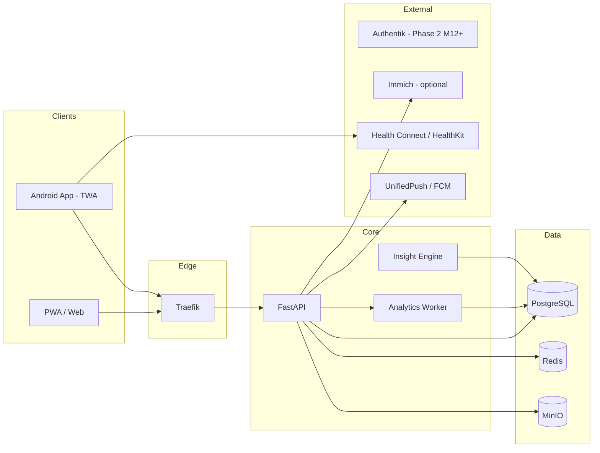
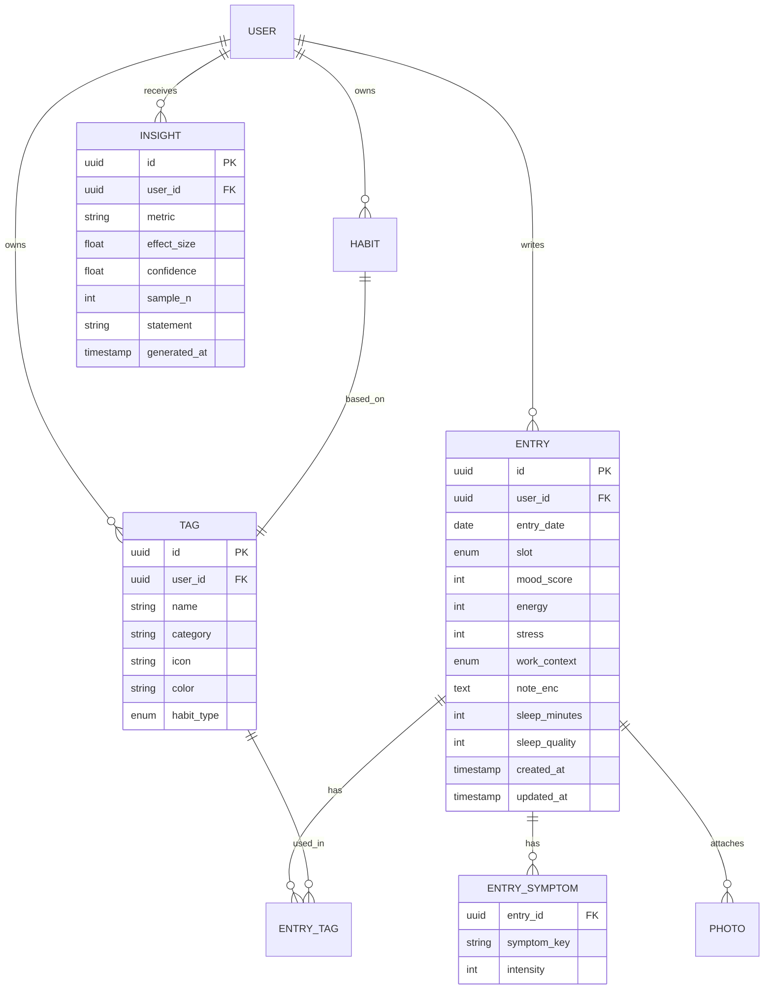

# Design-Dokument: MoodSync — Mood & Habit Tracker mit Korrelationsanalyse

**Version:** 0.7 (M1 in Arbeit: #41 + #39 + #40 gemergt, ADR-0005 nachgeschärft — D-011 Verschlüsselungsstrategie re-evaluiert und bestätigt: App-Level Fernet pro-User)
**Datum:** 2026-05-04
**Autor:** Solo-Entwickler / Einmann-Unternehmen
**Arbeitstitel:** MoodSync
**Zweck:** Single Source of Truth für Projekt, Architektur, Frontend-Prinzipien und Roadmap. Dient gleichzeitig als Kontext-Datei für KI-Assistenten (Claude, Perplexity, Cursor, Copilot).

---

## 0. Wie dieses Dokument zu nutzen ist (Meta)

`DESIGN_DOCUMENT.md` ist die kanonische Quelle. Alle weiteren Dokumente (`ARCHITECTURE.md`, `API.md`, `FRONTEND.md`, `ROADMAP.md`) leiten sich daraus ab.

Bei Sessions mit KI-Modellen: **Diese Datei IMMER zuerst in den Kontext laden.**

Änderungen werden via Git versioniert; jede signifikante Entscheidung als ADR unter `/docs/adr/NNNN-titel.md`.

### KI-Prompt-Template

```
Kontext: Lies zuerst DESIGN_DOCUMENT.md vollständig. Halte dich strikt an die dort
definierte Architektur, Tech-Stack und Frontend-Prinzipien. Wenn du davon abweichen
willst, begründe es und schlage einen ADR-Eintrag vor.
Aufgabe: <hier konkrete Aufgabe>
```

---

## 1. Vision & Produkt

### 1.1 Problem

Menschen spüren, dass Schlaf, Sport, Homeoffice-Tage, Sozialkontakte oder bestimmte Aktivitäten ihr Wohlbefinden beeinflussen — aber niemand weiß welche wirklich, wie stark und mit welcher Verzögerung. Bestehende Apps (Daylio, Bearable, Exist.io) sind entweder zu simpel (nur Mood-Emoji), zu Cloud-abhängig (Privacy-Bedenken bei Gesundheitsdaten) oder zu komplex (Quantified-Self-Nerd-Zielgruppe).

### 1.2 Vision

MoodSync ist ein privacy-first Mood- und Habit-Tracker, der Korrelationen zwischen Aktivitäten, Gesundheit und Wohlbefinden sichtbar macht und in alltagstauglichen Handlungsempfehlungen verdichtet.

### 1.3 Zielgruppe

**Primary Persona „Reflektive Self-Optimizer" (30–50 J.):** Berufstätig, teils Homeoffice, sport- oder gesundheitsbewusst, Garmin/Apple-Watch-User, tech-affin, Privacy-sensitiv, will keine weitere Cloud-Gesundheits-App.

**Secondary Persona „Health-Aware Recoverer":** Migräne-/Verdauungs-/Burnout-Historie; nutzt App als Ergänzung zu Arzt/Therapie.

### 1.4 Value Proposition

- **Zusammenhänge statt Rohdaten** — die App erklärt, warum Tage gut/schlecht waren
- **Selfhosted & Offline-First** — deine Gesundheitsdaten verlassen dein Zuhause nicht
- **60 Sekunden pro Tag** — nicht mehr, sonst wird es nicht gemacht

### 1.5 Nicht-Ziele (wichtig!)

- Kein medizinisches Diagnose-Tool (Disclaimer nötig)
- Kein Social Network, keine öffentlichen Feeds
- Kein Chat-Bot/Therapeut-Ersatz
- Keine Ads, kein Daten-Verkauf — Monetarisierung ausschließlich via Selfhost-Lizenz oder SaaS-Abo

### 1.6 Erfolgsmetriken

| Metrik                         | Ziel                |
| ------------------------------ | ------------------- |
| Day-7 Retention                | ≥ 40 %              |
| Day-30 Retention               | ≥ 20 %              |
| Ø Tägliche Eintrags-Completion | ≥ 70 % aktiver User |
| Time-to-First-Insight          | < 14 Tage           |
| Crash-Free-Rate                | > 99,5 %            |

---

## 2. Feature-Katalog (detailliert & kritisch bewertet)

Jedes Feature: Beschreibung → Kritische Fragen → Entscheidung/Umsetzung → Priorität (MoSCoW).

### 2.1 Täglicher Eintrag (Mood-Entry)

**Beschreibung:** Ein Eintrag pro Tag mit Mood-Score (1–5 oder −2..+2 Slider), Energielevel, Stresslevel, optionaler Text-Notiz.

**Kritisch:**

- „Ein Datensatz pro Tag" ist einfach, verliert aber Intra-Day-Dynamik (morgens top, abends mies).
- Empfehlung: 1 Hauptdatensatz pro Tag + optionale Mehrfacheinträge (Morning/Noon/Evening) als „Detail-Checkins". Standard-UX bleibt „1/Tag", Power-User können mehr erfassen.
- Nachträgliches Erfassen für bis zu 7 Tage erlauben, danach read-only (sonst Bias durch Rückblick).

**Entscheidung:** Datenmodell speichert `entries` mit optionalem `slot` (`day|morning|noon|evening`). UI zeigt Default „Tagesrückblick".

**Priorität:** MUST

---

### 2.2 Aktivitäten / Tags

**Beschreibung:** Multi-Select von Tags (Sport, Musik, Lesen, Familie, Alkohol, Meditation, …). User-definierbar, gruppierbar (Kategorien: Sport, Sozial, Arbeit, Freizeit, Konsum).

**Kritisch:**

- Vordefinierte Tags vs. freie Tags: beides. Start mit kuratiertem Set (~30 Tags), freies Hinzufügen möglich, Merge-UI gegen Tag-Wildwuchs.
- Dauer/Intensität erfassen? Fürs MVP nein (Friction zu hoch); später optional Duration-Slider pro Tag.

**Entscheidung:** Tags mit Kategorie, Icon, Farbe; Tag-Verwendung boolean pro Entry; V2: `tag_usage(entry_id, tag_id, duration_min, intensity)`.

**Priorität:** MUST

---

### 2.3 Good / Bad Habits

**Beschreibung:** Explizit als „gut" oder „schlecht" markierte Tags mit Streak-Tracking (z. B. „7 Tage ohne Alkohol", „12 Tage Meditation").

**Kritisch:**

- Habit ≠ Tag: Habits brauchen Ziele („5×/Woche Sport") und Streaks, Tags nur Ja/Nein.
- Psychologisch heikel: „Bad Habit"-Framing kann schaden. Neutrale Sprache anbieten („Habits I'm building" / „Habits I'm reducing").

**Entscheidung:** Tag kann Flag `habit_type: none|build|reduce` + `target_frequency` haben. Streak-Logik separat.

**Priorität:** SHOULD (v1.1)

---

### 2.4 Gesundheits-Symptome

**Beschreibung:** Checkliste für Symptome (Kopfschmerzen, Verdauung, Rückenschmerzen, Schlafqualität subjektiv, Erkältung) + Intensitätsskala 0–3.

**Kritisch:**

- Klar von Mood trennen — Symptome sind objektivere Marker und wichtig für Korrelationen.
- Menstruationszyklus explizit berücksichtigen? Ja, optional (hoher Korrelationswert, Gender-Inclusion).
- Medizinischer Disclaimer Pflicht.

**Entscheidung:** Eigene `symptoms`-Entität, parallel zu Tags. Zyklus-Tracking als optionales Modul.

**Priorität:** MUST (Kern-USP der Korrelationsanalyse)

---

### 2.5 Notizen

**Beschreibung:** Freitextfeld pro Eintrag, Markdown-Support.

**Kritisch:**

- Volltextsuche nötig? Ja, über Postgres FTS oder Meilisearch.
- E2E-Verschlüsselung sinnvoll — siehe Security.

**Entscheidung:** `entries.note` TEXT, verschlüsselt-at-rest; Suche serverseitig (nur möglich wenn Entschlüsselung am Server; bei E2E: clientseitige Suche über lokalen Index).

**Priorität:** MUST

---

### 2.6 Fotos / Immich-Integration

**Beschreibung:** Fotos des Tages anhängen bzw. aus Immich (selfhosted Foto-Stack) referenzieren.

**Kritisch:**

- Fotos selbst hosten verdoppelt Storage-Bedarf. Immich-Referenz ist eleganter: `asset_id` + Thumbnail-Proxy.
- Immich hat eine OAuth-fähige API (REST) → realistisch integrierbar, aber Breaking Changes möglich.
- Datenschutz: Foto-Metadaten (EXIF, GPS) vorher strippen.

**Entscheidung:**

- v1: lokaler Upload nach MinIO, EXIF-Strip Pflicht.
- v2: optionale Immich-Integration via API-Key, „Foto des Tages" per Search-API (by date).

**Priorität:** COULD (Immich), SHOULD (lokaler Upload)

---

### 2.7 Office/Homeoffice-Tag

**Beschreibung:** Kategorischer Tages-Kontext (Büro, Homeoffice, Urlaub, Krank, Wochenende, Dienstreise).

**Kritisch:**

- Nicht als Tag, sondern als dedicated Field — hoher Korrelationswert, strukturiertes Reporting.
- Auto-Detection via Kalender (ICS-Import) oder Geofence später möglich.

**Entscheidung:** `entries.work_context` Enum. Auto-Fill via Wochentag-Default-Regeln.

**Priorität:** MUST

---

### 2.8 Schlafdaten aus Garmin / Wearables

**Beschreibung:** Schlafdauer, -qualität, HRV, Ruhepuls automatisch importieren.

**Kritisch:**

- Garmin hat **keine** offizielle Consumer-API ohne Approval-Prozess (Health-API nur B2B). Workarounds:
  - `python-garminconnect` — fragil, TOS-Grauzone
  - Garmin → Health Connect (Android 14+) — offizieller Weg
  - Manueller CSV-Import als Fallback

**Entscheidung:**

- v1: Manuelle Eingabe Schlafdauer + -qualität
- v2 (Android-App): Health Connect Integration
- v3: Direkte `python-garminconnect` für Power-User mit Warnhinweis

**Priorität:** SHOULD (Health Connect ab v1.1), COULD (direkte Garmin-Sync)

---

### 2.9 Trend- & Mustererkennung, Handlungsempfehlungen

**Beschreibung:** App erkennt Korrelationen und formuliert kurze Statements.

**Kritisch:**

- Korrelation ≠ Kausalität. Disclaimer + Confidence-Level nötig.
- Minimum Datenmenge: seriöse Aussagen erst ab ~30 Einträgen.
- Statistische Methoden: Punkt-Biseriale Korrelation, Lag-Analyse, Lasso-Regression.
- LLM nur als Formulierungs-Schicht über statistisch verifizierten Findings. Lokales LLM (Ollama) für Privacy.

**Entscheidung:** Analyse-Worker berechnet nightly Insights. Insight-Objekt: `{metric, effect_size, confidence, sample_n, statement_template}`. Statement-Rendering template-basiert, LLM optional.

**Priorität:** MUST (Kern-USP), iterativ ausbaubar

---

### 2.10 Auswertungen / Visualisierungen

**Beschreibung:** Mood-Verlauf (Tag/Woche/Monat/Jahr), Tag-Frequenz-Heatmap, Korrelations-Matrix, Streak-Visualisierung.

**Kritisch:**

- Charts mobile-freundlich! Keine riesigen Dashboards.
- Export als PNG/CSV/PDF für Arzt-Gespräche.

**Entscheidung:** Chart-Lib: ECharts oder LayerChart (Svelte). CSV/JSON-Export per Default, PDF ab v1.1.

**Priorität:** MUST

---

### 2.11 Mobile First & Offline-Verfügbarkeit

**Beschreibung:** Schneller Eintrag auch ohne Netz, Sync wenn verfügbar.

**Kritisch:**

- PWA mit IndexedDB reicht für Text/Tags; Fotos-Upload muss Queue-basiert sein.
- Konfliktauflösung: Last-Write-Wins mit `updated_at` reicht, kein CRDT nötig.

**Entscheidung:** Lokale SQLite/IndexedDB (Dexie.js), Sync-Queue mit Retry, Delta-Sync per `updated_at`.

**Priorität:** MUST

---

### 2.12 Mehrere User / Multi-User

**Beschreibung:** Familie/WG nutzt selbe Instanz mit getrennten Daten.

**Kritisch:**

- Von Tag 1 einbauen — nachträglich Multi-Tenancy einziehen ist schmerzhaft.
- Kein Cross-User-Zugriff, kein Sharing in v1.

**Entscheidung:** Ab v1 mit `user_id` auf allen Entitäten + Row-Level-Security in Postgres.

**Priorität:** MUST (Architektur), SHOULD (Admin-UI für User-Management)

---

### 2.13 Dark/Light Theme

**Beschreibung:** System-Preference + manueller Override.

**Entscheidung:** CSS-Variablen + `prefers-color-scheme`, `data-theme`-Attribut, persistiert in LocalStorage.

**Priorität:** MUST

---

### 2.14 Security & Privacy

**Beschreibung:** Gesundheitsdaten = besonders schützenswert (DSGVO Art. 9).

**Entscheidungen:**

- Auth: Native JWT Phase 1 (ADR-0004), Authentik ab Phase 2 (M12+, SaaS)
- Verschlüsselung at-rest: `notes`, `symptoms.details`, Fotos in MinIO mit SSE
- E2E-Option (v2): Client-seitig verschlüsselte Notizen — als Opt-in
- Transport: TLS 1.3, HSTS, CSP strikt
- App-Lock: PIN / Biometrie auf Mobile
- Export/Delete: vollständiger Datenexport (JSON+Fotos-ZIP) und „Account löschen" Self-Service
- Audit-Log aller Admin-Aktionen
- Backup: verschlüsselt via restic auf externen Storage

**Priorität:** MUST (Basics), SHOULD (E2E opt-in v2)

---

### 2.15 Erinnerungen / Notifications

**Beschreibung:** Tägliche Erinnerung „Wie war dein Tag?" + adaptive Zeiten.

**Kritisch:**

- Max. 1/Tag, konfigurierbare Zeit, Snooze.
- Selfhost: NTFY / Gotify; Play-Store-App: FCM oder UnifiedPush.

**Entscheidung:** UnifiedPush als Primary (selfhostbar), FCM-Fallback.

**Priorität:** SHOULD

---

## 3. Architektur

### 3.1 Leitprinzipien

1. **API-First & Offline-First** — Clients sind vollwertig offline bedienbar, Server ist autoritativ bei Merge
2. **Selfhosted-First, Cloud-Ready** — `docker compose up` → lauffähig. Kein Code-Rewrite für SaaS
3. **Privacy by Design** — Datenminimierung, Feld-Verschlüsselung für Sensibles, keine Third-Party-Analytics
4. **Stateless Backend, 12-Factor**

### 3.2 Komponenten



### 3.3 Tech-Stack (fixiert)

| Schicht          | Technologie                 | Alternative erwogen                          |
| ---------------- | --------------------------- | -------------------------------------------- |
| Backend API      | FastAPI 0.111 + Python 3.12 | Django REST (zu schwerfällig)                |
| Web Frontend     | SvelteKit 2 + Skeleton UI   | Next.js (React, größeres Bundle)             |
| Mobile           | PWA → TWA via Bubblewrap    | React Native (zu viel Overhead für Solo-Dev) |
| Datenbank        | PostgreSQL 16 + pgvector    | SQLite (kein RLS für Multi-User)             |
| Cache/Queue      | Redis 7                     | Valkey (Drop-in, evaluieren)                 |
| Object Storage   | MinIO                       | S3 (nur SaaS-Phase)                          |
| Reverse Proxy    | Traefik v3                  | Nginx Proxy Manager                          |
| Auth Phase 1     | Native JWT (FastAPI)        | Authentik (M12+, SaaS)                       |
| Offline-Sync     | Dexie.js (IndexedDB)        | PouchDB                                      |
| Analytics Worker | pandas + scikit-learn       | R (kein Python-Ökosystem)                    |
| Error Tracking   | GlitchTip                   | Sentry Cloud (Privacy)                       |
| Push             | UnifiedPush / FCM           | NTFY direkt                                  |
| Build            | pnpm + Vite                 | npm (langsamer)                              |
| Python Deps      | uv                          | pip/poetry                                   |
| Migrations       | Alembic                     | —                                            |

### 3.4 Datenmodell (Kern)



### 3.5 Sync-Protokoll (Offline-First)

1. Client hält lokale `change_log` mit monotoner Sequenz + `client_id`
2. `POST /sync/push` sendet Batch, Server merged (Last-Write-Wins pro Feld, `updated_at` entscheidet)
3. `GET /sync/pull?since=<cursor>` liefert Delta
4. Bei Konflikt pro Tag: Server-Version gewinnt, Client bekommt Merge-Report

---

### 3.6 Observability-Strategie

Für M0 wird bewusst ein schlanker Observability-Ansatz gewählt: Der Kernstack soll bereits diagnosefähig sein, ohne dass der Projektstart von zusätzlichen Betriebsdiensten abhängig wird.

**Architekturentscheidung:** Healthchecks und strukturiertes Logging sind im Anwendungscode verpflichtend. Uptime Kuma, GlitchTip und Loki werden als optionale Compose-Profile oder separate Ops-Datei vorbereitet und erst nachgelagert (M9) aktiviert.

#### Health-Endpunkte (verpflichtend ab M0)

Die API stellt drei Health-Endpunkte bereit:

| Endpunkt            | Zweck                                        | Fehlt bei                         |
| ------------------- | -------------------------------------------- | --------------------------------- |
| `GET /health/live`  | Prozess lebt — keine externen Deps prüfen    | API-Prozess selbst defekt         |
| `GET /health/ready` | Betriebsbereit — DB, Redis, MinIO erreichbar | Abhängige Komponenten nicht ready |
| `GET /health`       | Kompakte menschenlesbare Aggregation         | —                                 |

`/health/live` darf bei kurzzeitigen PostgreSQL- oder Redis-Problemen **nicht** rot werden, um unnötige Restart-Schleifen zu vermeiden. `/health/ready` wird von Reverse Proxy, Uptime-Checks und späteren Monitoring-Systemen ausgewertet.

#### Strukturiertes JSON-Logging (verpflichtend ab M0)

Jeder Log-Eintrag enthält mindestens:

```json
{
  "timestamp": "...",
  "level": "INFO",
  "service": "moodsync-api",
  "environment": "production",
  "request_id": "...",
  "method": "GET",
  "path": "/health/ready",
  "status_code": 200,
  "duration_ms": 12
}
```

Fehlerlogs dürfen Stacktraces enthalten, aber **keine sensiblen Nutzdaten** (Mood-Werte, Symptome, Notizen). Unstrukturierte `print()`-Ausgaben gelten nicht als Standard für produktionsnahen Betrieb.

#### Request-ID / Correlation-ID (verpflichtend ab M0)

Jede eingehende HTTP-Anfrage erhält eine `request_id` via Middleware. Sie wird in Logs mitgeführt und als Response-Header `X-Request-ID` zurückgegeben. Dadurch ist die Korrelation einzelner Requests über API, Traefik und spätere Zusatzdienste möglich.

#### Docker-Healthchecks im Core-Stack (verpflichtend ab M0)

| Dienst          | Check-Methode                             |
| --------------- | ----------------------------------------- |
| API             | HTTP `GET /health/live`                   |
| Web (SvelteKit) | HTTP-Check auf App-Shell oder Statusseite |
| PostgreSQL      | Native Readiness-Prüfung (`pg_isready`)   |
| Redis           | `PING`                                    |
| MinIO           | HTTP- oder CLI-Check                      |

#### Compose-Strategie: Core vs. Ops

`docker-compose.yml` enthält ausschließlich den Core-Stack (Traefik, Web, API, PostgreSQL, Redis, MinIO, Bucket-Init). Zusätzliche Betriebsdienste (Uptime Kuma, GlitchTip, Loki, Tracing) werden in `docker-compose.ops.yml` oder über Compose-Profile geführt — damit bleibt der Basisstart schlank. Diese Trennung ist besonders sinnvoll für Selfhosting- und Synology-Szenarien.

#### Empfohlene Repo- und Dateistruktur für M0

```text
moodsync/
├── apps/
│   └── web/
│       ├── src/routes/+page.svelte
│       ├── src/routes/status/+page.svelte
│       ├── src/lib/api/health.ts
│       └── Dockerfile
├── backend/
│   └── app/
│       ├── main.py
│       ├── api/v1/health.py
│       ├── core/config.py
│       ├── core/logging.py
│       ├── core/request_id.py
│       ├── services/health_service.py
│       └── tests/test_health.py
├── infra/
│   └── docker/
│       ├── docker-compose.yml
│       ├── docker-compose.ops.yml
│       ├── .env.example
│       ├── traefik/
│       │   └── dynamic/middlewares.yml
│       └── postgres/init/001-create-extensions.sql
├── .github/
│   └── workflows/
│       ├── ci-api.yml
│       └── ci-web.yml
├── scripts/
│   ├── dev-up.sh
│   └── migrate.sh
└── docs/
    └── adr/
        ├── 0001-sveltekit-vs-nextjs.md
        ├── 0002-capacitor-statt-twa.md
        ├── 0003-sync-conflict-log.md
        ├── 0004-auth-strategie.md
        ├── 0005-verschluesselung-at-rest.md
        ├── 0006-cookie-auth-mit-capacitor-migration.md
        └── 0007-healthchecks-and-logging.md
```

---

## 4. Frontend-Prinzipien

- **60-Sekunden-Regel:** Default-Eintrag in ≤ 60 Sek. (Mood-Slider, 3 Top-Tags, Symptome optional, Notiz optional)
- **Bottom-Sheet-Entry** statt Full-Page-Form auf Mobile
- **Home-Screen** = Heute + Streak + letzter Insight. Keine Dashboard-Überladung
- **Dark-Mode First**, Light-Variante paritätisch
- **a11y WCAG 2.2 AA** — Slider zusätzlich mit Buttons, Farben nie einzige Information
- **Performance-Budget:** JS < 150 KB gz, LCP < 2 s
- **i18n DE/EN** ab Tag 1, keine Hardcodes
- **Komponenten:** Atomic Design + Storybook
- **Motion:** subtil, 150–250 ms; Reduced-Motion respektieren

---

## 5. Abhängigkeiten

**Laufzeit:** PostgreSQL, Redis, MinIO, Traefik, optional Authentik (Phase 2), optional Ollama, optional Immich, SMTP-Relay

**Build:** Node LTS, pnpm, Python 3.12 + uv, Android Studio + Bubblewrap

**Extern (SaaS-Phase):** Google Play Console (25 USD), FCM, Resend/Postmark, Stripe

---

## 6. Feature-Roadmap

Entwicklung in Vertical Slices — jedes Release ist end-to-end nutzbar.

### M0 — Fundament ✅ ABGESCHLOSSEN (PRs #32, #33, #35, #36, #37, #38)

- Monorepo-Grundstruktur für Web, API, Infra, Dokumentation und CI
- Core-Compose-Stack: Traefik, Web, API, PostgreSQL, Redis, MinIO + Bucket-Init
- FastAPI-Minimalservice mit versionierter API-Struktur und Health-Endpunkten
- SvelteKit-App-Shell als leere, startbare PWA-Basis
- CI/CD-Grundsetup für Linting, Typechecks, Tests und Builds (`ci-api.yml`, `ci-web.yml`)
- **Strukturiertes JSON-Logging im Backend** als Standard (kein `print()`)
- **Docker- und Applikations-Healthchecks** als verpflichtender Teil des Core-Stacks
- **Postgres-Schema v1** mit `users`-Tabelle + Alembic-Migrationen (`000_initial`, `001_create_users`)
- **JWT-Auth:** `/register`, `/login`, `/refresh`, `/logout`, `/me` + Redis TokenStore + SlowAPI Rate-Limit
- **Exit:** JWT-Auth funktioniert (API-Ebene), leere Startseite erreichbar, Health-Endpunkte antworten, CI grün, User-Tabelle migriert

#### Akzeptanzkriterien M0

- [x] Docker Socket via Tecnativa-Proxy abgesichert (kein direkter Socket-Mount in Traefik-Container) _(PR #32)_
- [x] MinIO Console NICHT öffentlich über Traefik erreichbar (kein Router auf Port 9001) _(PR #32)_
- [x] Security Headers (HSTS, CSP, X-Frame-Options) in Traefik konfiguriert und per Test verifiziert _(PR #32)_
- [x] Redis mit Passwort und `--appendonly yes` konfiguriert _(PR #32)_
- [x] CI/CD-Pipeline grün (Lint, Tests, Build) _(PR #37)_
- [x] API liefert funktionierende `GET /health/live`, `GET /health/ready` und `GET /health` Endpunkte _(PR #35)_
- [x] Strukturierte JSON-Logs für Startup, Requests und Fehler werden geschrieben _(PR #35)_
- [x] Jede Anfrage erhält eine `request_id` (Middleware gesetzt, in Logs mitgeführt, als `X-Request-ID`-Header zurückgegeben) _(PR #35)_
- [x] Docker-Healthchecks für API, Web, PostgreSQL, Redis und MinIO im Core-Stack konfiguriert _(PR #35)_
- [x] Postgres-Schema v1 migriert: `users`-Tabelle mit UUID-PK, email, hashed*password, is_active, is_verified, created_at, updated_at *(PR #36)\_
- [x] Alembic-Migrationen `000_initial` und `001_create_users` laufen fehlerfrei (forward + rollback) _(PR #36)_
- [x] `updated_at`-Trigger in Postgres aktiv _(PR #36)_
- [x] GitHub Actions `ci-api.yml` grün (ruff, mypy, pytest mit Coverage ≥ 70 %) _(PR #37)_
- [x] GitHub Actions `ci-web.yml` grün (ESLint, Prettier, svelte-check, vite build) _(PR #37)_
- [x] JWT-Auth: `/register`, `/login`, `/refresh`, `/logout`, `/me` implementiert und getestet _(PR #38)_
- [x] Redis Single-Use Token Rotation für Refresh-Tokens _(PR #38)_
- [x] Rate-Limiting auf `/auth/login` (SlowAPI) _(PR #38)_
- [ ] Branch Protection auf `main`: PR + grüne CI als Pflicht vor Merge _(blockiert: GitHub Free Plan; nachholen wenn Repo public wird — M10)_
- [x] `.env.example` / `SECRET_KEY`-Mismatch behoben _(Issue #41, PR #43)_
- [x] Login-Flow end-to-end implementiert (JWT → FastAPI → SvelteKit Login-UI) _(Issue #40, PR #45, M1)_
- [x] E-Mail-Verifikation (`POST /auth/verify-email`, SMTP) _(Issue #39, PR #44, M1)_
- [x] **Quality-Gate**: Code-Quality-Review + Security-Audit gemäß §9 durchgeführt und bestanden _(M0 retroaktiv abgedeckt durch ADR-0007 + PR #51, PR #52)_

#### DSGVO-Checkpoint M0

- [x] 🔒 DSGVO: Datenschutzkonzept-Dokument (`docs/DSGVO.md`) vorhanden und versioniert
- [ ] 🔒 DSGVO: Kein Third-Party Analytics oder Tracking-Code im Frontend (CSP prüfen) _(noch nicht verifiziert — M1-Aufgabe)_
- [ ] 🔒 DSGVO: Keine externen Fonts oder CDN-Ressourcen ohne Datenschutz-Prüfung _(noch nicht verifiziert — M1-Aufgabe)_

---

### M1 — Core Entry (Woche 3–5) → „Ich tracke meinen ersten Tag"

- Tägliches Eintrags-Formular: Mood, Energy, Stress, Work-Context
- Tag-System (vordefinierte Tags + Custom-Tags)
- Symptom-Checkliste
- Notiz-Feld (Markdown)
- Offline-Fähigkeit via IndexedDB + Sync-Endpoint
- **Login-UI:** SvelteKit Login/Register-Seiten _(aus M0 verschoben, Issue #40)_
- **E-Mail-Verifikation:** `POST /auth/verify-email`, SMTP-Versand _(aus M0 verschoben, Issue #39)_
- **`.env.example`-Fix + Vollständigkeit:** SECRET*KEY-Mismatch beheben, alle Config-Variablen dokumentieren *(aus M0 verschoben, Issue #41)\_
- **Exit:** Produktive Nutzung durch Entwickler selbst möglich (inkl. Login im Browser)

#### Akzeptanzkriterien M1

- [x] Alle API-Endpunkte hinter Auth-Middleware (kein unauthenticated Zugriff auf Nutzdaten) _(Entry-Endpoints via `get_current_verified_user`, Issue #7)_
- [~] `user_id` auf allen Entitäten vorhanden, Row-Level-Security in Postgres aktiv und per Test verifiziert _(RLS-Policies für `entries` in Migration `003_create_entries.py` enthalten; vollständige Enforcement via `SET LOCAL app.current_user_id`-Middleware folgt als M1-Followup)_
- [ ] Offline-Sync mit Conflict-Log-Tabelle implementiert (Konflikte werden aufgezeichnet)
- [x] Rate-Limiting auf Login-Endpunkten (max. 5 Versuche/Minute) _(bereits implementiert in PR #38; Entry-Endpoints zusätzlich rate-limitiert: 60/min POST/PATCH, 120/min GET — Issue #7)_
- [x] Nachträgliches Erfassen bis 7 Tage möglich, ältere Einträge read-only _(Issue #7: `BACKDATE_DAYS_LIMIT=7` im Service, UI-Datepicker auf 7-Tage-Fenster begrenzt)_
- [ ] Sync-Endpunkt (`/sync/push` + `/sync/pull`) funktioniert mit Offline-Queue
- [x] Login/Register im Browser funktioniert End-to-End (SvelteKit → JWT → FastAPI) _(Issue #40, PR #45)_
- [x] E-Mail-Verifikation: `/register` sendet Mail über MailPit/SMTP, `POST /auth/verify-email` setzt `is_verified=True`; Single-Use-Token in `email_verification_tokens` (24h TTL); `POST /auth/resend-verification` rate-limitiert _(Issue #39, PR #44)_
- [x] `SECRET_KEY` in `config.py` und `.env.example` konsistent _(Issue #41, PR #43)_
- [x] `.env.example` vollständig: alle Config-Variablen mit Kommentaren und Generierungsbefehlen _(Issue #41, PR #43)_
- [ ] **Quality-Gate**: Code-Quality-Review + Security-Audit gemäß §9 durchgeführt und bestanden

#### DSGVO-Checkpoint M1

- [ ] 🔒 DSGVO: `note_enc`-Feld verschlüsselt at-rest (pgcrypto oder App-Level-Encryption)
- [ ] 🔒 DSGVO: Symptom-Daten (`symptoms`-Tabelle) ebenfalls verschlüsselt at-rest
- [x] 🔒 DSGVO: Keine Klartextloggung von Mood-/Symptom-Werten in App-Logs (Log-Scrubbing geprüft) — Fehlerlogs dürfen Stacktraces, aber keine Tagebucheinträge, Symptome oder Gesundheitsdaten enthalten (siehe Abschnitt 3.6 und [ADR-0007](adr/0007-healthchecks-and-logging.md)); abgesichert durch automatischen Test `backend/tests/test_log_scrubbing.py`
- [x] 🔒 DSGVO: Auth-Strategie für Phase 1 dokumentiert und in [ADR-0004](adr/0004-auth-strategie.md) festgehalten

---

### M2 — Visualisierung (Woche 6–7) → „Ich sehe meinen Verlauf"

- Mood-Zeitreihe (Woche/Monat/Jahr)
- Tag-Frequenz-Heatmap
- Streak-Widgets
- CSV/JSON-Export
- **Exit:** Nutzer versteht Trends visuell

#### Akzeptanzkriterien M2

- [ ] CSV/JSON-Export vollständig (alle Felder, alle Einträge des Users)
- [ ] Export enthält keine system-internen IDs, die Rückschlüsse auf andere User erlauben
- [ ] Charts auf Mobilgerät (375 px Breite) korrekt gerendert und bedienbar
- [ ] Zeitreihe korrekt für Wochen-/Monats-/Jahresansicht
- [ ] Streak-Berechnung korrekt bei fehlenden Tagen
- [ ] **Quality-Gate**: Code-Quality-Review + Security-Audit gemäß §9 durchgeführt und bestanden

#### DSGVO-Checkpoint M2

- [ ] 🔒 DSGVO: Export-Funktion entspricht Right-to-Data-Portability (Art. 20 DSGVO) — maschinenlesbares Format
- [ ] 🔒 DSGVO: Export enthält keine Daten anderer User (RLS-Test mit zwei Test-Accounts)

---

### M3 — Insights v1 (Woche 8–10) → „Die App erklärt mir was"

- Nightly Analytics-Worker
- Punkt-Biseriale Korrelation Tags↔Mood
- Template-basierte Statements
- Home-Screen-Insight-Karte
- Confidence-Level + medizinischer Disclaimer
- **Exit:** Mindestens 3 sinnvolle Insights bei 30 Einträgen

#### Akzeptanzkriterien M3

- [ ] Insights werden erst ab n≥30 Einträgen aktiviert (unter diesem Schwellwert keine Anzeige)
- [ ] Jeder Insight hat sichtbaren Confidence-Level und Disclaimer
- [ ] Kein Insight formuliert diagnostische Aussagen (Review-Checkliste liegt vor und ist abgezeichnet)
- [ ] Analytics-Worker läuft als geplanter Job (Cron/Celery) und nicht inline in der API
- [ ] Fehler im Analytics-Worker crashen nicht die API
- [ ] **Quality-Gate**: Code-Quality-Review + Security-Audit gemäß §9 durchgeführt und bestanden

#### DSGVO-Checkpoint M3

- [ ] 🔒 DSGVO: Analytics-Worker greift nur auf eigene User-Daten zu (RLS geprüft, Query-Audit)
- [ ] 🔒 DSGVO: Ollama (falls genutzt) verarbeitet keine Daten außerhalb der eigenen Instanz (kein Cloud-Fallback)
- [ ] 🔒 DSGVO: Kein Profiling-Output wird an Dritte übermittelt

---

### M4 — Mobile Polish & PWA-Hardening (Woche 11–12)

- Installierbare PWA, Service-Worker, App-Icon, Splash
- Bottom-Sheet-UX, Gestensteuerung
- Daily Reminder (Web-Push / UnifiedPush)
- App-Lock (PIN) auf Mobile
- **Exit:** App fühlt sich auf Handy nativ an

#### Akzeptanzkriterien M4

- [ ] PWA App-Lock (PIN) implementiert und aktivierbar
- [ ] Service Worker cached keine sensitiven API-Responses (`Cache-Control: no-store` für `/api/*`)
- [ ] Web Push Notifications enthalten keine Gesundheitsdaten im Payload
- [ ] PWA installierbar auf Android Chrome und iOS Safari
- [ ] Offline-Modus: Eintrag erstellen ohne Netzverbindung, Sync beim nächsten Online-Start
- [ ] **Quality-Gate**: Code-Quality-Review + Security-Audit gemäß §9 durchgeführt und bestanden

#### DSGVO-Checkpoint M4

- [ ] 🔒 DSGVO: Push-Notification-Payload enthält nur anonyme Reminder-Texte, keine Inhaltsdaten oder Mood-Werte
- [ ] 🔒 DSGVO: Service-Worker-Cache-Strategie dokumentiert (welche Ressourcen werden gecacht)

---

### M5 — Habits & Ziele (Woche 13–14)

- Habit-Flag auf Tags (build / reduce) + Zielfrequenzen
- Streak-Logik, Erfolgs-Badges
- Habit-Dashboard
- **Exit:** Gewohnheits-Tracking produktiv nutzbar

#### Akzeptanzkriterien M5

- [ ] Habit-Sprache neutral (build/reduce, nicht good/bad) — UI-Text-Review abgeschlossen
- [ ] Keine Wertung oder Scoring von Habits, die psychologisch schaden könnte (kein „Versagt"-Framing)
- [ ] Zielfrequenz konfigurierbar (täglich / x-mal pro Woche)
- [ ] Streak-Reset-Logik korrekt bei fehlendem Tag vs. bewusstem Aussetzen
- [ ] **Quality-Gate**: Code-Quality-Review + Security-Audit gemäß §9 durchgeführt und bestanden

#### DSGVO-Checkpoint M5

- [ ] 🔒 DSGVO: Habit-Daten unterliegen derselben Verschlüsselung und RLS wie Entry-Daten

---

### M6 — Fotos & Medien (Woche 15–16)

- Lokaler Foto-Upload → MinIO, EXIF-Strip
- Thumbnail-Galerie pro Tag
- **Exit:** Fotos als zusätzlicher Gedächtnisanker

#### Akzeptanzkriterien M6

- [ ] EXIF-Strip serverseitig via Pillow implementiert (nicht nur clientseitig — clientseitiger Strip gilt nicht als ausreichend)
- [ ] GPS-Koordinaten aus EXIF nachweislich entfernt (automatischer Test mit Foto mit bekannten GPS-Daten)
- [ ] MinIO SSE-S3 für Photo-Bucket aktiviert
- [ ] Foto-Upload nur für authentifizierte User, kein direkter MinIO-Zugriff ohne Pre-Signed URL
- [ ] Maximale Dateigröße und erlaubte MIME-Types serverseitig validiert
- [ ] **Quality-Gate**: Code-Quality-Review + Security-Audit gemäß §9 durchgeführt und bestanden

#### DSGVO-Checkpoint M6

- [ ] 🔒 DSGVO: Fotos zählen als besondere Datenkategorie — Löschung bei Account-Delete verifiziert (inkl. MinIO-Bucket-Bereinigung)
- [ ] 🔒 DSGVO: Foto-EXIF kann biometrische Merkmale enthalten → EXIF-Strip ist Pflicht und durch automatisierten Test abgedeckt
- [ ] 🔒 DSGVO: Foto-Zugriff ist user-isoliert (kein Cross-User-Zugriff auf Pre-Signed URLs möglich)

---

### M7 — Schlaf & Health Connect (Woche 17–18)

- Manuelle Schlafdaten erweiterte Felder (Einschlafzeit, Tiefschlaf)
- Android-seitig: Health Connect Import (Schlaf, HR, Schritte)
- Korrelation Schlaf↔Mood in Insights
- **Exit:** Wearable-Daten fließen automatisch

#### Akzeptanzkriterien M7

- [ ] Health Connect Permission-Request erklärt klar welche Daten gelesen werden (In-App-Erklärungsscreen)
- [ ] Keine Weitergabe von Health-Connect-Daten an Third-Party-Services
- [ ] Import importiert nur Schlaf + HR (keine Bewegungsprofile, keine Standortdaten)
- [ ] Health Connect API Declaration korrekt in `AndroidManifest.xml` eingetragen
- [ ] **Quality-Gate**: Code-Quality-Review + Security-Audit gemäß §9 durchgeführt und bestanden

#### DSGVO-Checkpoint M7

- [ ] 🔒 DSGVO: Health Connect Daten = Art. 9 DSGVO → explizite Einwilligung via Onboarding-Screen vor erstem Import
- [ ] 🔒 DSGVO: Daten-Minimierung: nur Schlaf + HR importiert, keine Bewegungsprofile (technisch durchgesetzt, nicht nur dokumentiert)
- [ ] 🔒 DSGVO: Löschung von importierten Health-Connect-Daten bei Account-Delete vollständig implementiert und getestet

---

### M8 — Insights v2 (Woche 19–21)

- Multiple Regression (Lasso) über alle Variablen
- Lag-Analyse (Sport gestern → Mood heute)
- Optional: Lokales LLM (Ollama) formuliert Statements natürlicher
- Wöchentlicher „Insight Digest"
- **Exit:** Qualitativ deutlich bessere Handlungsempfehlungen

#### Akzeptanzkriterien M8

- [ ] Lasso-Regression produziert reproduzierbare Ergebnisse bei gleichen Eingabedaten
- [ ] Lag-Analyse konfigurierbar (1–7 Tage Verzögerung)
- [ ] Insight Digest als optionale wöchentliche Push-Notification
- [ ] LLM-Integration (Ollama) optional und deaktivierbar ohne Funktionsverlust
- [ ] **Quality-Gate**: Code-Quality-Review + Security-Audit gemäß §9 durchgeführt und bestanden

#### DSGVO-Checkpoint M8

- [ ] 🔒 DSGVO: LLM verarbeitet keine Daten außerhalb der lokalen Instanz (kein Cloud-LLM ohne explizite User-Zustimmung)

---

### M9 — Beta-Härtung (Woche 22–24)

- Monitoring, GlitchTip-Error-Tracking
- Backup/Restore-Dokumentation
- 5–10 externe Beta-Tester, Feedback einarbeiten
- Dokumentation (Install-Guide, User-Manual)
- **Exit:** Stabil genug für Public-Selfhost-Release

#### Akzeptanzkriterien M9

- [ ] Vollständige Datenschutzerklärung vorhanden (`docs/PRIVACY.md` + in-app verlinkbar)
- [ ] Account-Löschung (Right to Erasure, Art. 17 DSGVO) als Self-Service implementiert
- [ ] Backup-Prozess dokumentiert und Restore-Test erfolgreich durchgeführt
- [ ] GlitchTip Error-Tracking aktiv, kein PII in Error-Reports
- [ ] Install-Guide für Selfhost vollständig (Docker Compose, Traefik, DNS)
- [ ] **Quality-Gate**: Code-Quality-Review + Security-Audit gemäß §9 durchgeführt und bestanden

#### DSGVO-Checkpoint M9

- [ ] 🔒 DSGVO: Datenschutz-Folgeabschätzung (DSFA) für Cloud-Deployment dokumentiert (falls SaaS geplant)
- [ ] 🔒 DSGVO: AV-Vertrag-Template für Cloud-Hoster (Hetzner) vorhanden
- [ ] 🔒 DSGVO: Vollständiger JSON+ZIP-Datenexport (Art. 20 DSGVO) als Self-Service implementiert und getestet
- [ ] 🔒 DSGVO: GlitchTip-Instanz selfhosted oder DSGVO-konformer Anbieter

---

### M10 — Public Selfhost Release v1.0 (Woche 25)

- GitHub-Release, Docker Hub Image
- Landing-Page + Docs-Site
- Lizenzmodell finalisieren (AGPL)
- **Exit:** v1.0 öffentlich nutzbar

#### Akzeptanzkriterien M10

- [ ] Docker Hub Image für amd64 + arm64 publiziert
- [ ] `docker compose up` mit `.env.example` startet vollständigen Stack ohne weitere Konfiguration
- [ ] Security-Disclosure-Policy vorhanden (`SECURITY.md` im Repository)
- [ ] CHANGELOG.md gepflegt und vollständig für v1.0
- [ ] Docs-Site (Docusaurus oder MkDocs) mit Install- und User-Guide live
- [ ] **Quality-Gate**: Code-Quality-Review + Security-Audit gemäß §9 durchgeführt und bestanden

#### DSGVO-Checkpoint M10

- [ ] 🔒 DSGVO: Datenschutzerklärung auf Landing-Page verlinkt
- [ ] 🔒 DSGVO: Impressum (AT-Recht / DE-Recht) vorhanden und erreichbar

---

### M11 — Android-App für Play Store (Woche 26–28)

- PWA → TWA via Bubblewrap
- Play Console Setup, Internal Testing Track
- FCM für Non-Selfhost-User
- Store-Assets (Screenshots, Beschreibung, Datenschutzerklärung)
- **Exit:** Closed Testing im Play Store

#### Akzeptanzkriterien M11

- [ ] Capacitor-Build (statt TWA, falls D-008 so entschieden — Verweis auf ADR-0002) produktionsreif
- [ ] Health Connect API Declaration im Play Store korrekt ausgefüllt (`health_permissions` deklariert)
- [ ] App besteht Google Play Pre-Launch-Report ohne kritische Fehler
- [ ] FCM-Integration getestet (Push-Notification kommt an)
- [ ] Store-Assets vollständig (Screenshots alle Formfaktoren, Feature-Graphic, kurze/lange Beschreibung)
- [ ] **Quality-Gate**: Code-Quality-Review + Security-Audit gemäß §9 durchgeführt und bestanden

#### DSGVO-Checkpoint M11

- [ ] 🔒 DSGVO: Google Play Data Safety Section vollständig und wahrheitsgemäß ausgefüllt
- [ ] 🔒 DSGVO: Datenschutzerklärung als App-Store-Link hinterlegt (Play Store verlangt öffentliche URL)
- [ ] 🔒 DSGVO: Health Connect Nutzung in Data Safety Section korrekt deklariert

---

### M12 — SaaS-Modus (Monat 7+)

- Multi-Tenancy via Postgres RLS (Architektur bereits vorhanden)
- Billing (Stripe), Onboarding, Support-Ticket-System
- Managed-Hosting (Hetzner + k3s)
- Authentik OIDC-Integration (ADR-0004 Phase 2)
- **Exit:** Erster zahlender Kunde

#### Akzeptanzkriterien M12

- [ ] Stripe Webhook mit Signatur-Verifikation implementiert (kein unauthenticated Webhook-Zugriff)
- [ ] Tenant-Isolation via RLS für alle neuen Tabellen geprüft und durch Cross-Tenant-Test verifiziert
- [ ] Onboarding-Flow für neue SaaS-User vollständig (Registrierung → Billing → erste Nutzung)
- [ ] Support-Ticket-System oder Kontaktkanal vorhanden
- [ ] **Quality-Gate**: Code-Quality-Review + Security-Audit gemäß §9 durchgeführt und bestanden

#### DSGVO-Checkpoint M12

- [ ] 🔒 DSGVO: Data Processing Agreement (DPA) mit Cloud-Hoster abgeschlossen
- [ ] 🔒 DSGVO: Auftragsverarbeitungsverzeichnis (Art. 30 DSGVO) gepflegt
- [ ] 🔒 DSGVO: Datenlöschung bei Kündigung innerhalb 30 Tage implementiert und dokumentiert
- [ ] 🔒 DSGVO: Datenschutzerklärung für SaaS-Betrieb aktualisiert (andere Rechtsgrundlage als Selfhost)

---

### Backlog / Später

- Immich-Integration (Foto-Referenzen statt Upload)
- iOS-App (HealthKit)
- Direkte Garmin-Connect-Sync (TOS-Risiko evaluieren)
- E2E-Verschlüsselung opt-in
- Kalender-Integration (ICS für Work-Context-Auto-Fill)
- Zyklus-Tracking-Modul
- Sharing-Features (Arzt-Report als PDF)
- Apple Watch / Wear OS Complication

---

## 7. Offene Entscheidungen (Decision-Log)

| ID    | Frage                                                                                                                                                                                   | Status                                                                                                                                                         | ADR                                              |
| ----- | --------------------------------------------------------------------------------------------------------------------------------------------------------------------------------------- | -------------------------------------------------------------------------------------------------------------------------------------------------------------- | ------------------------------------------------ |
| D-001 | SvelteKit oder Next.js als Web-Framework?                                                                                                                                               | ✅ Entschieden: SvelteKit                                                                                                                                      | [ADR-0001](adr/0001-sveltekit-vs-nextjs.md)      |
| D-002 | Primäre Chart-Bibliothek: ECharts oder LayerChart?                                                                                                                                      | 🔄 Offen                                                                                                                                                       | —                                                |
| D-003 | E2E-Verschlüsselung in v1 oder v2?                                                                                                                                                      | ✅ Entschieden: v2 opt-in                                                                                                                                      | —                                                |
| D-004 | Lizenzmodell: AGPL oder Source-Available?                                                                                                                                               | 🔄 Offen                                                                                                                                                       | —                                                |
| D-005 | Monetarisierung: Hybrid (Selfhost Free + Cloud Abo + Lifetime)?                                                                                                                         | 🔄 Offen                                                                                                                                                       | —                                                |
| D-006 | Push: UnifiedPush-first oder FCM-first?                                                                                                                                                 | ✅ Entschieden: UnifiedPush primary                                                                                                                            | —                                                |
| D-007 | LLM für Insights: Ollama local oder API?                                                                                                                                                | 🔄 Offen                                                                                                                                                       | —                                                |
| D-008 | Mobile-Strategie: Capacitor vs. TWA (Bubblewrap)? TWA hat Google-Policy-Risiko (Health Connect Bridge, Policy-Änderungen); Capacitor bietet mehr nativen Zugriff, höherer Buildaufwand. | ✅ Entschieden: Capacitor                                                                                                                                      | [ADR-0002](adr/0002-capacitor-statt-twa.md)      |
| D-009 | Sync-Protokoll Conflict-Handling: Aktuelles LWW-Modell (`updated_at`) birgt Datenverlust bei Multi-Device. Alternativen: CRDT, serverseitige Merge-Strategien, Conflict-Inbox für User. | ✅ Entschieden: LWW + Conflict-Log-Tabelle                                                                                                                     | [ADR-0003](adr/0003-sync-conflict-log.md)        |
| D-010 | Auth Phase 1: Native JWT (FastAPI-intern) — implementiert. Authentik ab Phase 2 (M12+).                                                                                                 | ✅ Entschieden: Native JWT Phase 1, Authentik M12+                                                                                                             | [ADR-0004](adr/0004-auth-strategie.md)           |
| D-011 | Verschlüsselung at-rest Strategie: pgcrypto (DB-Level), App-Level-Encryption (Python), oder Kombination? Auswirkungen auf Suche, Performance und Schlüsselverwaltung.                   | ✅ Entschieden: Zweistufig — LUKS+SSE (Stufe 1) + App-Level Fernet pro-User (Stufe 2); pgcrypto verworfen wegen Connection-Pool-Risiko und teurer Key-Rotation | [ADR-0005](adr/0005-verschluesselung-at-rest.md) |
| D-012 | Observability-Tiefe in M0: Schlanker Ansatz (Healthchecks + Logging im Code, Ops-Tools optional) vs. vollständiger Stack von Beginn an.                                                 | ✅ Entschieden: Schlanker Ansatz, Ops-Tools als `docker-compose.ops.yml`                                                                                       | [ADR-0007](adr/0007-healthchecks-and-logging.md) |

---

## 8. Risiken

| Risiko                                                   | ID     | Wahrscheinlichkeit | Impact   | Maßnahme                                                                                                                                                                                                                      |
| -------------------------------------------------------- | ------ | ------------------ | -------- | ----------------------------------------------------------------------------------------------------------------------------------------------------------------------------------------------------------------------------- |
| Scheinkorrelationen führen User zu falschen Schlüssen    | —      | Mittel             | Hoch     | Confidence-Level, Disclaimer, Mindest-n=30                                                                                                                                                                                    |
| Play-Store-Rejection wegen Health-Claims                 | —      | Niedrig            | Hoch     | Legal Review vor Submission, keine diagnostischen Aussagen                                                                                                                                                                    |
| Garmin-API ändert sich / TOS-Verstoß                     | —      | Hoch               | Mittel   | Health Connect als primärer Weg, Garmin als opt-in mit Warnung                                                                                                                                                                |
| Solo-Dev-Burnout                                         | ZS-05  | Mittel             | Kritisch | Vertical Slices mit klaren Exit-Kriterien; Timebox pro Milestone fixiert; wöchentliches 1h-Review ob Scope noch realistisch; konsequentes Backlog-Kürzen bei Verzögerung; keine Feature-Creep-Toleranz in laufendem Milestone |
| Immich Breaking Changes in API                           | —      | Mittel             | Niedrig  | Immich erst v2, abstrakte Integration via Adapter                                                                                                                                                                             |
| DSGVO-Verstoß bei Health-Daten                           | —      | Niedrig            | Kritisch | Privacy-by-Design, AV-Verträge, kein Third-Party-Analytics                                                                                                                                                                    |
| LWW Sync Datenverlust bei Multi-Device                   | SW-01  | Mittel             | Mittel   | Conflict-Log-Tabelle persistiert alle Konflikte; User-sichtbarer Conflict-Inbox geplant (D-009 / ADR-0003); CRDT als langfristige Option evaluieren                                                                           |
| Auth-Modell undefiniert in Phase 1                       | SEC-01 | ✅ behoben         | —        | Native JWT implementiert (PR #38); Authentik auf M12 verschoben (ADR-0004)                                                                                                                                                    |
| Docker Socket Exposure (Traefik)                         | SEC-03 | Mittel             | Kritisch | Docker Socket ausschließlich via Tecnativa Socket-Proxy mounten — implementiert (PR #32)                                                                                                                                      |
| MinIO Console öffentlich erreichbar                      | SEC-04 | ✅ behoben         | —        | MinIO Console (Port 9001) nicht via Traefik exponiert (PR #32)                                                                                                                                                                |
| TWA Google-Policy-Risiko / Health Connect Bridge-Problem | ZS-01  | Mittel             | Hoch     | Capacitor als Alternative evaluieren (D-008 / ADR-0002); Entscheidung spätestens M7                                                                                                                                           |

---

## 9. Definition of Done

Die folgenden Punkte gelten für **jeden** Pull-Request, unabhängig vom Milestone. Zusätzlich definiert jeder Milestone ein **Quality-Gate** (Code-Quality-Review + Security-Audit), das vor dem Milestone-Exit bestanden sein muss.

### Pro Pull-Request

- [ ] Code reviewed (Self-Review-Checkliste)
- [ ] Tests grün (Unit + Integration)
- [ ] OpenAPI-Spec aktualisiert
- [ ] Dokumentation angepasst
- [ ] Migration getestet (forward + rollback)
- [ ] Manuell auf Staging verifiziert
- [ ] Changelog-Eintrag
- [ ] Privacy-Impact geprüft (bei Gesundheitsdaten-relevanten Changes)
- [ ] 🔒 DSGVO: Art.-9-Impact-Check durchgeführt bei allen health-daten-relevanten Changes
- [ ] 🔒 DSGVO: EXIF-Strip verifiziert bei Foto-relevanten Changes (automatisierter Test mit GPS-EXIF-Testbild)
- [ ] 🔒 DSGVO: Löschkonzept geprüft bei neuen Datenfeldern (werden Felder bei Account-Delete vollständig entfernt?)

### Pro Milestone (Quality-Gate)

Jeder Milestone darf erst auf `done` gesetzt werden, wenn beide Audits durchgeführt **und** bestanden wurden. Findings müssen entweder im selben Milestone gefixt oder als getracktes Issue mit Risiko-Akzeptanz dokumentiert werden.

#### Code-Quality-Review (CQR)

- [ ] **Reuse / DRY**: Doppelter Code identifiziert und in Helper / Service / Util konsolidiert
- [ ] **Test-Factories**: Neue Modelle haben Fixtures in `backend/tests/conftest.py` (Backend) bzw. Test-Helpern (Frontend)
- [ ] **Library-Hygiene**: Neue Dependencies dokumentiert; ungenutzte Dependencies in optional-Group oder entfernt
- [ ] **Konsistenz**: Naming, Modulstruktur, Schema-Pattern folgen den im Milestone bisher etablierten Mustern
- [ ] **Coverage**: Backend `pytest --cov` ≥ 70 % gehalten; kritische Pfade (Auth, Sync, Krypto) zusätzlich ≥ 85 %
- [ ] **Statische Analyse grün**: `ruff check`, `ruff format --check`, `mypy --strict` (Backend); `eslint`, `prettier --check`, `svelte-check` (Frontend)
- [ ] **CHANGELOG-Eintrag** im `Changed`-Block mit konkreten Refactorings (kein generisches "Code-Cleanup")

#### Security-Audit (SA)

- [ ] **Auth-Coverage**: Alle neuen Endpoints hinter `get_current_user` / `get_current_verified_user` (außer explizit öffentlich); RLS-Pfad geprüft
- [ ] **Input-Validation**: Pydantic-Schemas mit `Field`-Constraints (min/max-Length, Bereiche, Regex) für alle User-Inputs
- [ ] **Rate-Limiting**: Neue öffentliche Endpoints mit `@limiter.limit(...)` versehen, wo sinnvoll (Auth, E-Mail, Resend, Costly-Reads)
- [ ] **Healthchecks**: Neue Services / DB-Tabellen / externe Dependencies in `/health/ready` integriert; Liveness vs. Readiness sauber getrennt (siehe [ADR-0007](adr/0007-healthchecks-and-logging.md))
- [ ] **Logging-Hygiene**: Keine Klartext-Mood-/Symptom-/Notiz-/Token-Werte in Logs; `test_log_scrubbing.py` erweitert um neue sensitive Felder; nur `request_id` + `user_id` als Korrelation
- [ ] **DSGVO-Pfad**: Neue Felder im Erasure-Pfad (`DELETE /user/me`); persönliche Daten entweder verschlüsselt at-rest oder als nicht-personenbeziehbar dokumentiert
- [ ] **Anti-Enumeration**: Neue öffentliche Endpoints (Lookup, Resend, Reset) liefern generische Antworten; keine Timing-Side-Channels
- [ ] **Headers / Cookies**: Bei neuen Cookies HttpOnly + Secure + `SameSite=strict`; Pfad möglichst eng gescopet (siehe `auth.py`)
- [ ] **Dependency-Scan**: `pip-audit` (Backend) und `pnpm audit --prod` (Frontend) ohne `high`/`critical`-Findings; Ausnahmen mit Begründung in CHANGELOG
- [ ] **Secrets-Scan**: Repo gegen `.env`-Leaks geprüft (kein Secret in Git-History); neue Env-Vars in `.env.example` mit Generierungsbefehl

---

## 10. Architektur-Entscheidungen & bekannte Schwachstellen

Referenztabelle aller in der Architektur-Analyse identifizierten Schwachstellen mit aktuellem Status und Verweis auf ADR oder Meilenstein.

| ID       | Beschreibung                                                                                                                                | Kategorie     | Status         | Verweis                                                                                                                       |
| -------- | ------------------------------------------------------------------------------------------------------------------------------------------- | ------------- | -------------- | ----------------------------------------------------------------------------------------------------------------------------- |
| SEC-01   | Auth-Modell undefiniert in Phase 1 — kein klares JWT vs. Authentik-Commitment                                                               | Sicherheit    | ✅ behoben     | Native JWT implementiert (PR #38), Authentik → M12; [ADR-0004](adr/0004-auth-strategie.md)                                    |
| SEC-02   | `SECRET_KEY` in config.py vs. `JWT_SECRET` in .env.example — Env-Var-Mismatch, JWT-Secret wird nicht gelesen                                | Sicherheit    | ✅ behoben     | [Issue #41](https://github.com/Sturmi77/moodsync/issues/41), PR #43                                                           |
| SEC-03   | Docker Socket direkter Mount in Traefik ermöglicht Container-Escape                                                                         | Sicherheit    | ✅ behoben     | PR #32, Tecnativa-Proxy                                                                                                       |
| SEC-04   | MinIO Console (Port 9001) öffentlich über Traefik erreichbar                                                                                | Sicherheit    | ✅ behoben     | PR #32                                                                                                                        |
| SW-01    | LWW Sync-Strategie verursacht stillen Datenverlust bei gleichzeitigen Multi-Device-Edits                                                    | Software      | ✅ behoben     | D-009, [ADR-0003](adr/0003-sync-conflict-log.md), Issue #24                                                                   |
| ZS-01    | TWA-Strategie gefährdet durch Google-Policy-Änderungen und Health Connect Bridge-Instabilität                                               | Zielstrategie | ✅ behoben     | D-008, [ADR-0002](adr/0002-capacitor-statt-twa.md), M11                                                                       |
| ZS-05    | Solo-Dev-Burnout-Risiko durch Scope-Creep und fehlende Timeboxing-Disziplin                                                                 | Zielstrategie | 🔄 in Arbeit   | Maßnahme in Risikotabelle (Sek. 8), Milestone-Exit-Kriterien                                                                  |
| DSGVO-01 | Verschlüsselung at-rest Strategie nicht festgelegt (pgcrypto vs. App-Level)                                                                 | DSGVO         | ✅ entschieden | D-011, [ADR-0005](adr/0005-verschluesselung-at-rest.md) (re-evaluiert 2026-05-04: App-Level Fernet pro-User), Umsetzung in M1 |
| DSGVO-02 | Health Connect Daten (Art. 9 DSGVO) ohne explizite Einwilligungsarchitektur                                                                 | DSGVO         | ❌ offen       | M7-DSGVO                                                                                                                      |
| DSGVO-03 | Kein DSFA-Dokument für Cloud/SaaS-Deployment vorhanden                                                                                      | DSGVO         | ❌ offen       | M9-DSGVO                                                                                                                      |
| DSGVO-04 | EXIF-Strip nur als Designentscheidung dokumentiert, kein automatisierter Test                                                               | DSGVO         | ❌ offen       | M6-AC, DoD                                                                                                                    |
| ARCH-01  | Mermaid-Diagramm zeigt TWA als Android-Client — inkonsistent mit offener D-008-Entscheidung                                                 | Architektur   | 🔄 in Arbeit   | D-008, ADR-0002                                                                                                               |
| ARCH-02  | Keine ADRs für D-002 bis D-007 angelegt (Entscheidungen undokumentiert)                                                                     | Architektur   | ❌ offen       | Backlog: ADR-Erstellung pro offener Entscheidung                                                                              |
| OBS-01   | Observability-Anforderungen für M0 nicht explizit definiert (fehlende Health-Endpunkte, kein strukturiertes Logging, keine Correlation-IDs) | Architektur   | ✅ behoben     | D-012, [ADR-0007](adr/0007-healthchecks-and-logging.md), Abschnitt 3.6                                                        |
| ARCH-03  | Kein Postgres-Schema v1 und keine Alembic-Basismigrationen vorhanden                                                                        | Architektur   | ✅ behoben     | Issue #5, PR feat/m0-postgres-schema                                                                                          |
| ARCH-04  | Kein CI/CD-Setup — keine automatisierten Lint/Test/Build-Checks bei PRs                                                                     | Architektur   | ✅ behoben     | Issue #6, PR feat/m0-ci                                                                                                       |
