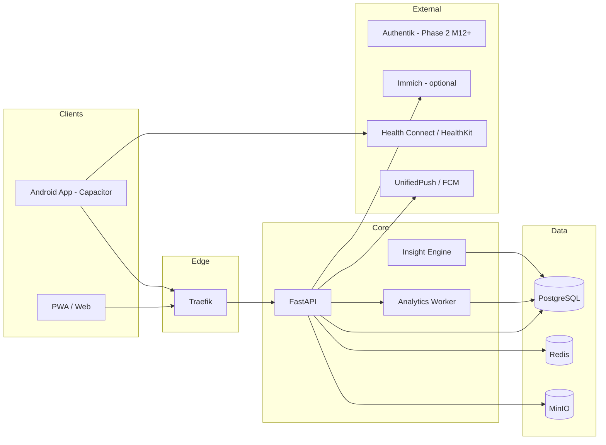
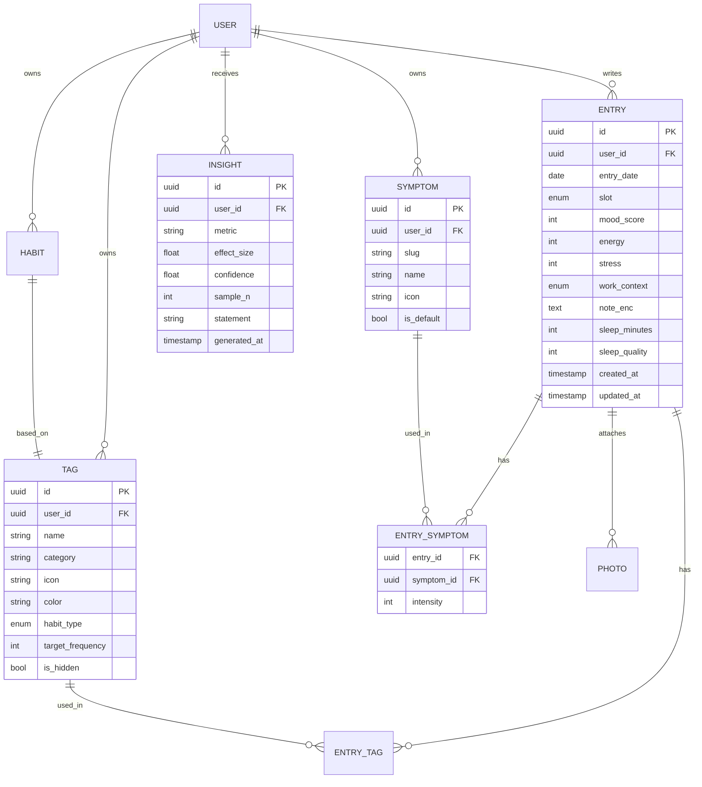

# Design-Dokument: CorrelCore — Mood & Habit Tracker mit Korrelationsanalyse

**Version:** 0.15 (M10 public selfhost v1.0 Complete; patch line v1.0.1–v1.0.8 Android sideload; M10.1 shipped; M11 engineering sprints 1–5 shipped — shell, signed sideload, Bearer auth, Glance widget, FCM registration code; Play Console / Firebase ops exit still open #429; next exit M11 Play Closed Testing)
**Datum:** 2026-07-19

> **Vorherige Version:** 0.14 (2026-07-10) — M9 Beta + M10 public selfhost v1.0 Complete; M10.1 insight triggers/tag maturity shipped; post-M10 foundations through Capacitor scaffold.
> **Vorherige Version:** 0.12 (2026-05-11) — No-gamification promise added; M5 habits
> redesigned: streak logic replaced by Adherence Rate + Calendar Heatmap +
> Correlation Contribution; M2 entry-streak relabeled to Tracking Consistency —
> Issues #157, #158, #159.
> **Autor:** Solo-Entwickler / Einmann-Unternehmen
> **Arbeitstitel:** CorrelCore
> **Zweck:** Single Source of Truth für Projekt, Architektur, Frontend-Prinzipien und Roadmap. Dient gleichzeitig als Kontext-Datei für KI-Assistenten (Claude, Perplexity, Cursor, Copilot).

---

## 0. Wie dieses Dokument zu nutzen ist (Meta)

`DESIGN_DOCUMENT.md` ist die kanonische Quelle. Alle weiteren Dokumente (`ARCHITECTURE.md`, `API.md`, `FRONTEND.md`, `ROADMAP.md`) leiten sich daraus ab.

Bei Sessions mit KI-Modellen: **Diese Datei IMMER zuerst in den Kontext laden.**

Änderungen werden via Git versioniert; jede signifikante Entscheidung als ADR unter `/docs/adr/NNNN-titel.md`.

### KI-Prompt-Template

```
Kontext: Lies zuerst DESIGN_DOCUMENT.md vollständig. Halte dich strikt an die dort
definierte Architektur, Tech-Stack und Frontend-Prinzipien. Wenn du davon abweichen
willst, begründe es und schlage einen ADR-Eintrag vor.
Aufgabe: <hier konkrete Aufgabe>
```

---

## 1. Vision & Produkt

### 1.1 Problem

Menschen spüren, dass Schlaf, Sport, Homeoffice-Tage, Sozialkontakte oder bestimmte Aktivitäten ihr Wohlbefinden beeinflussen — aber niemand weiß welche wirklich, wie stark und mit welcher Verzögerung. Bestehende Apps (Daylio, Bearable, Exist.io) sind entweder zu simpel (nur Mood-Emoji), zu Cloud-abhängig (Privacy-Bedenken bei Gesundheitsdaten) oder zu komplex (Quantified-Self-Nerd-Zielgruppe).

### 1.2 Vision

CorrelCore ist ein privacy-first Mood- und Habit-Tracker, der Korrelationen zwischen Aktivitäten, Gesundheit und Wohlbefinden sichtbar macht und in alltagstauglichen Handlungsempfehlungen verdichtet.

### 1.3 Zielgruppe

**Primary Persona „Reflektive Self-Optimizer" (30–50 J.):** Berufstätig, teils Homeoffice, sport- oder gesundheitsbewusst, Garmin/Apple-Watch-User, tech-affin, Privacy-sensitiv, will keine weitere Cloud-Gesundheits-App.

**Secondary Persona „Health-Aware Recoverer":** Migräne-/Verdauungs-/Burnout-Historie; nutzt App als Ergänzung zu Arzt/Therapie.

### 1.4 Value Proposition

- **Zusammenhänge statt Rohdaten** — die App erklärt, warum Tage gut/schlecht waren
- **Selfhosted + PWA-Shell + feature-flagged Dexie Offline-Sync (M4.1)** — deine Gesundheitsdaten bleiben auf deiner Instanz; Offline-Sync ist geliefert (feature-flagged)
- **60 Sekunden pro Tag** — nicht mehr, sonst wird es nicht gemacht
- **No gamification, ever** — du trackst deine Gewohnheiten, nicht wie oft du die App öffnest. Kein Streak-Druck, keine Badges, keine Belohnungsschleifen.

**Visualisierungs-Konsequenz (Theme-agnostische Fassung, präzisiert durch [ADR-0035](adr/0035-temporal-correspondence-pattern.md)):**

Eine divergente Skala (für signierte Größen wie Z-Score-Abweichung von der persönlichen Baseline oder positive/negative Korrelation) muss strukturell eine der folgenden Formen haben:

- **(a)** Eine Hue-Familie mit zwei Wahrnehmungsextremen (hell↔dunkel oder gesättigt↔entsättigt), **oder**
- **(b)** Zwei Hues aus dem aktiven Theme-Accent-System, die **nicht** als Ampel (rot↔grün) lesbar sind. Konkret untersagt: das Paar (rot ≈ H 0°/360°, grün ≈ H 120°) sowie jedes Paar innerhalb von 20° um diese Hues.

Die beiden Endpunkte einer divergenten Skala kommen aus den Theme-Tokens `--color-divergent-neg` und `--color-divergent-pos`. Theme-Autoren können beliebige konforme Paare wählen — die Regel ist hue-agnostisch und überlebt jedes spätere GUI-Re-Skinning, solange die strukturelle Vorgabe eingehalten wird.

### 1.5 Nicht-Ziele (wichtig!)

- Kein medizinisches Diagnose-Tool (Disclaimer nötig)
- Kein Social Network, keine öffentlichen Feeds
- Kein Chat-Bot/Therapeut-Ersatz
- Keine Ads, kein Daten-Verkauf — Monetarisierung ausschließlich via Selfhost-Lizenz oder SaaS-Abo
- **Keine Gamification** — keine Streaks, Punkte, Badges oder Engagement-Loops (s. §1.4)

### 1.6 Erfolgsmetriken

| Metrik                         | Ziel                |
| ------------------------------ | ------------------- |
| Day-7 Retention                | ≥ 40 %              |
| Day-30 Retention               | ≥ 20 %              |
| Ø Tägliche Eintrags-Completion | ≥ 70 % aktiver User |
| Time-to-First-Insight          | < 14 Tage           |
| Crash-Free-Rate                | > 99,5 %            |

---

## 2. Feature-Katalog (detailliert & kritisch bewertet)

Jedes Feature: Beschreibung → Kritische Fragen → Entscheidung/Umsetzung → Priorität (MoSCoW).

### 2.1 Täglicher Eintrag (Mood-Entry)

**Beschreibung:** Ein Eintrag pro Tag mit Mood-Score (1–5 Slider), Energielevel, Stresslevel, optionaler Text-Notiz.

**Kritisch:**

- „Ein Datensatz pro Tag" ist einfach, verliert aber Intra-Day-Dynamik (morgens top, abends mies).
- Empfehlung: 1 Hauptdatensatz pro Tag + optionale Mehrfacheinträge (Morning/Noon/Evening) als „Detail-Checkins". Standard-UX bleibt „1/Tag", Power-User können mehr erfassen.
- Nachträgliches Erfassen für bis zu 7 Tage erlauben, danach read-only (sonst Bias durch Rückblick).

**Entscheidung:** Datenmodell speichert `entries` mit optionalem `slot` (`day|morning|noon|evening`). UI zeigt Default „Tagesrückblick".

**Priorität:** MUST

---

### 2.2 Aktivitäten / Tags

**Beschreibung:** Multi-Select von Tags (Sport, Musik, Lesen, Familie, Alkohol, Meditation, …). User-definierbar, gruppierbar (Kategorien: Sport, Sozial, Arbeit, Freizeit, Konsum).

**Kritisch:**

- Vordefinierte Tags vs. freie Tags: beides. Start mit kuratiertem Set (~30 Tags), freies Hinzufügen möglich, Merge-UI gegen Tag-Wildwuchs.
- Dauer/Intensität erfassen? Fürs MVP nein (Friction zu hoch); später optional Duration-Slider pro Tag.

**Entscheidung:** Tags mit Kategorie, Icon, Farbe; Tag-Verwendung boolean pro Entry; V2: `tag_usage(entry_id, tag_id, duration_min, intensity)`.

**UI-Stand 2026-05-30:** Neue Custom-Tags können direkt im Entry-/Bearbeitungsflow
über den `TagPicker` angelegt werden (Name, Kategorie, eindeutiger Slug, optional
Icon/Farbe). Der neue Tag wird sofort in die Auswahl übernommen, solange das
Entry-Tag-Limit nicht erreicht ist.

**Priorität:** MUST

---

### 2.3 Good / Bad Habits

**Beschreibung:** Als „build" oder „reduce" markierte Tags mit Zielfrequenz-Tracking.

**Kritisch:**

- Habit ≠ Tag: Habits brauchen Ziele („5×/Woche Sport") und Frequenz-Tracking, Tags nur Ja/Nein.
- Psychologisch heikel: „Bad Habit"-Framing kann schaden. Neutrale Sprache: „Habits I'm building" / „Habits I'm reducing".
- **Keine Streaks** — Streak-Logik widerspricht dem No-Gamification-Promise (§1.4). Ersatz durch drei nicht-gamifizierende Metriken (s. M5 und Issue #157):
  1. **Adherence Rate**: `count(days_with_tag) / total_days_in_window` — ehrlich, bricht nicht bei einer Unterbrechung
  2. **Calendar Heatmap**: visuelle Frequenzdarstellung (M2-Komponente wiederverwendet), kein Streak-Zähler
  3. **Correlation Contribution Score**: wie stark ein Habit die Insight-Qualität beeinflusst (aus M3/M7 Insight Engine)

**Entscheidung:** Tag kann Flag `habit_type: none|build|reduce` + `target_frequency` haben. Adherence Rate als primäre KPI. Keine Streak-Logik. Die genaue Abgrenzung zwischen **Eintrags-Tracking-Consistency** (M2, aktivitätsbasiert) und **Habit-Adherence-Rate** (M5, zielbezogen) sowie der Schema-Vorgriff für `tags.habit_type` / `tags.target_frequency` in M2 ist in [ADR-0012](adr/0012-m2-m5-streak-semantik.md) festgelegt (Update zu ADR-0012 erforderlich).

**Priorität:** SHOULD (v1.1)

---

### 2.4 Gesundheits-Symptome

**Beschreibung:** Checkliste für Symptome (Kopfschmerzen, Verdauung, Rückenschmerzen, Schlafqualität subjektiv, Erkältung) + Intensitätsskala 0–3.

**Kritisch:**

- Klar von Mood trennen — Symptome sind objektivere Marker und wichtig für Korrelationen.
- Menstruationszyklus explizit berücksichtigen? Ja, optional (hoher Korrelationswert, Gender-Inclusion).
- Medizinischer Disclaimer Pflicht.

**Entscheidung:** Eigene `symptoms`-Entität, parallel zu Tags. Zyklus-Tracking als optionales Modul.

**M1 Custom-Symptome (Issue #57, [ADR-0008](adr/0008-symptom-master-tabelle.md)):** Seit Issue #57 spiegelt das Symptom-System das Tag-Modell vollständig: kuratierte Defaults (5 Einträge mit deterministischer `uuid5`) + User-eigene Custom-Symptome mit CRUD analog zu Tags. `entry_symptoms` referenziert `symptoms.id` per FK statt vormals `symptom_key:String`. Cap: 50 Custom-Symptome pro User; max. 32 zugewiesene Symptome pro Entry.

**Analytische Behandlung ([ADR-0025](adr/0025-symptom-analytics.md)):** Symptome werden in drei Ebenen analysiert (vollständige Spezifikation: [`features/symptom-analytics.md`](features/symptom-analytics.md)):

- **Univariat:** Zusammenhang zwischen einzelnen Symptomen und Mood/Energy/Stress (Pointbiserial, Mann-Whitney-U, Cliff's Delta)
- **Ko-Okkurrenz:** Assoziationen zwischen Symptomen und Tags (Phi, Jaccard, Lift/PMI, Fisher Exact)
- **Multivariat:** Symptome als Features in Lasso- und Lag-Analysen sowie hierarchischem Clustering (M7)

Phase-Gating, Schwellen und FDR-Korrektur folgen [ADR-0021](adr/0021-insight-maturity-phases.md). Symptom-Intensität (0–3) bleibt zunächst außerhalb des Scopes (Future Work, dokumentiert in der Feature-Spec).

**UI-Stand 2026-05-30:** Symptome sind in `/trends` als eigener Kontext-Layer
unter der Mood/Energy/Stress-Zeitreihe einblendbar; Trendlinie und Heatmap teilen
sich eine tägliche Achse, damit identische Tage exakt übereinander liegen. In
`/insights` kann ein deskriptiver Symptomverlauf eingeblendet werden. Diese
Views zeigen Häufigkeit/Intensität, aber keine medizinische Interpretation und
keine inferenziellen Korrelationen.

**Priorität:** MUST (Kern-USP der Korrelationsanalyse)

---

### 2.5 Notizen

**Beschreibung:** Freitextfeld pro Eintrag, Markdown-Support.

**Kritisch:**

- Volltextsuche nötig? Ja, über Postgres FTS oder Meilisearch.
- E2E-Verschlüsselung sinnvoll — siehe Security.

**Entscheidung:** `entries.note` TEXT, verschlüsselt-at-rest; Suche serverseitig (nur möglich wenn Entschlüsselung am Server; bei E2E: clientseitige Suche über lokalen Index).

**Priorität:** MUST

---

### 2.6 Fotos / Immich-Integration

**Beschreibung:** Fotos des Tages anhängen bzw. aus Immich (selfhosted Foto-Stack) referenzieren.

**Kritisch:**

- Fotos selbst hosten verdoppelt Storage-Bedarf. Immich-Referenz ist eleganter: `asset_id` + Thumbnail-Proxy.
- Immich hat eine OAuth-fähige API (REST) → realistisch integrierbar, aber Breaking Changes möglich.
- Datenschutz: Foto-Metadaten (EXIF, GPS) vorher strippen.

**Entscheidung:**

- M13: lokaler Upload nach MinIO, EXIF-Strip Pflicht.
- Optional (M13+ / Backlog): Immich-Integration via API-Key, „Foto des Tages" per Search-API (by date).

**Priorität:** COULD (Immich), SHOULD (lokaler Upload)

---

### 2.7 Office/Homeoffice-Tag

**Beschreibung:** Kategorischer Tages-Kontext (Büro, Homeoffice, Urlaub, Krank, Wochenende, Dienstreise).

**Kritisch:**

- Nicht als Tag, sondern als dedicated Field — hoher Korrelationswert, strukturiertes Reporting.
- Auto-Detection via Kalender (ICS-Import) oder Geofence später möglich.

**Entscheidung:** `entries.work_context` Enum. Auto-Fill via Wochentag-Default-Regeln.

**Priorität:** MUST

---

### 2.8 Schlafdaten aus Garmin / Wearables

**Beschreibung:** Schlafdauer, -qualität, HRV, Ruhepuls automatisch importieren.

**Kritisch:**

- Garmin hat **keine** offizielle Consumer-API ohne Approval-Prozess (Health-API nur B2B). Workarounds:
  - `python-garminconnect` — fragil, TOS-Grauzone
  - Garmin → Health Connect (Android 14+) — offizieller Weg
  - Manueller CSV-Import als Fallback

**Entscheidung:**

- v1: Manuelle Eingabe Schlafdauer + -qualität
- v2 (Android-App): Health Connect Integration
- v3: Direkte `python-garminconnect` für Power-User mit Warnhinweis

**Priorität:** SHOULD (Health Connect ab v1.1), COULD (direkte Garmin-Sync)

---

### 2.9 Trend- & Mustererkennung, Handlungsempfehlungen

**Beschreibung:** App erkennt Korrelationen und formuliert kurze Statements.

**Kritisch:**

- Korrelation ≠ Kausalität. Disclaimer + Confidence-Level nötig.
- Minimum Datenmenge: seriöse Aussagen erst ab ~30 Einträgen.
- Statistische Methoden: Punkt-Biseriale Korrelation, Mann-Whitney-U, Lag-Analyse, Lasso-Regression. Für Symptom×Tag-Assoziationen zusätzlich Ko-Okkurrenz-Maße (Phi, Jaccard, Lift, Fisher Exact) — Details in [ADR-0025](adr/0025-symptom-analytics.md).
- LLM nur als Formulierungs-Schicht über statistisch verifizierten Findings. Lokales LLM (Ollama) für Privacy.

**Entscheidung:** Analyse-Worker berechnet nightly Insights. Insight-Objekt: `{metric, effect_size, confidence, sample_n, statement_template}`. Statement-Rendering template-basiert, LLM optional.

**Insight-Typen (Auswahl):** `tag_mood_correlation`, `metric_mood_correlation` (Energy/Stress), `weekday_pattern`, `symptom_mood_association`, `symptom_tag_cooccurrence`, `symptom_cluster` (M7). Vollständiges Schema in [`features/symptom-analytics.md`](features/symptom-analytics.md) und [API.md](API.md).

**Priorität:** MUST (Kern-USP), iterativ ausbaubar

---

### 2.10 Auswertungen / Visualisierungen

**Beschreibung:** Mood-Verlauf (Tag/Woche/Monat/Jahr), Tag-Frequenz-Heatmap, Korrelations-Matrix, Tracking-Consistency-Visualisierung, Symptom-Tag-Ko-Okkurrenz-Heatmap (M7), Symptom-Kalender-Heatmap (M7), Symptom-Trend mit Mood-Overlay (M7). Symptom-Visualisierungen sind in den bestehenden `/insights`-Feed integriert — keine separate Route. Details in [`frontend/SYMPTOM_VISUALIZATION.md`](frontend/SYMPTOM_VISUALIZATION.md).

**Kritisch:**

- Charts mobile-freundlich! Keine riesigen Dashboards.
- Export als PNG/CSV/PDF für Arzt-Gespräche.

**Entscheidung:** Chart-Implementierung via **Custom-SVG-Komponenten** in SvelteKit (D-002 entschieden — siehe §7). CSV/JSON-Export implementiert. PDF ab v1.1. PNG-Export im Backlog.

**Priorität:** MUST

---

### 2.11 Mobile First & Offline-Verfügbarkeit

**Beschreibung:** Schneller Eintrag auch ohne Netz, Sync wenn verfügbar.

**Kritisch:**

- PWA mit IndexedDB reicht für Text/Tags; Fotos-Upload muss Queue-basiert sein.
- Konfliktauflösung: Last-Write-Wins mit `updated_at` reicht, kein CRDT nötig.

**Entscheidung:** M4 liefert lokale IndexedDB (Dexie.js), Sync-Queue mit Retry und Delta-Sync per `updated_at`. Der aktuelle Web-Client ist online-first und bereitet nur UI-Zustände für Offline-Fälle vor.

**Priorität:** MUST

---

### 2.12 Mehrere User / Multi-User

**Beschreibung:** Familie/WG nutzt selbe Instanz mit getrennten Daten.

**Kritisch:**

- Von Tag 1 einbauen — nachträglich Multi-Tenancy einziehen ist schmerzhaft.
- Kein Cross-User-Zugriff, kein Sharing in v1.

**Entscheidung:** Ab v1 mit `user_id` auf allen Entitäten + Row-Level-Security in Postgres.

**Priorität:** MUST (Architektur), SHOULD (Admin-UI für User-Management)

---

### 2.13 Dark/Light Theme

**Beschreibung:** System-Preference + manueller Override.

**Entscheidung:** CSS-Variablen + `prefers-color-scheme`, `data-theme`-Attribut, persistiert in LocalStorage.

**Priorität:** MUST

---

### 2.14 Security & Privacy

**Beschreibung:** Gesundheitsdaten = besonders schützenswert (DSGVO Art. 9).

**Entscheidungen:**

- Auth: Native JWT Phase 1 (ADR-0004), Authentik ab Phase 2 (M12+, SaaS)
- Verschlüsselung at-rest: `notes` und Custom-`symptoms.name` per App-Level-Fernet; Fotos in MinIO mit SSE folgen in M13
- E2E-Option (v2): Client-seitig verschlüsselte Notizen — als Opt-in
- Transport: TLS 1.3, HSTS, CSP strikt
- App-Lock: PIN / Biometrie auf Mobile (M4)
- Export/Delete: vollständiger Datenexport für aktuelle M1-M3-Daten und „Account löschen" Self-Service; Foto-Sektion bleibt bis M13 leer
- Audit-Log aller Admin-Aktionen (geplant, noch nicht implementiert)
- Backup: verschlüsselt via restic auf externen Storage

**Priorität:** MUST (Basics), SHOULD (E2E opt-in v2)

---

### 2.15 Erinnerungen / Notifications

**Beschreibung:** Tägliche Erinnerung „Wie war dein Tag?" + adaptive Zeiten.

**Kritisch:**

- Max. 1/Tag, konfigurierbare Zeit, Snooze.
- Selfhost: NTFY / Gotify; Play-Store-App: FCM oder UnifiedPush.
- **Keine Streak-Reminder** („don't break your streak") — widerspricht No-Gamification-Promise.

**Entscheidung:** UnifiedPush als Primary (selfhostbar), FCM-Fallback. Notification-Copy ist neutral: „Time for your daily check-in." — kein Streak-Druck.

**Priorität:** SHOULD

---

## 3. Architektur

### 3.1 Leitprinzipien

1. **API-First & offline-ready** — Backend ist REST/OpenAPI-first; M4.1 Dexie-Sync geliefert (feature-flagged)
2. **Selfhosted-First, Cloud-Ready** — `docker compose up` → lauffähig. Kein Code-Rewrite für SaaS
3. **Privacy by Design** — Datenminimierung, Feld-Verschlüsselung für Sensibles, keine Third-Party-Analytics
4. **Stateless Backend, 12-Factor**
5. **No Gamification** — keine Streak-Logik, Punkte, Badges oder Engagement-Loops im gesamten System

### 3.2 Komponenten



### 3.3 Tech-Stack (fixiert)

| Schicht          | Technologie                                                                                       | Alternative erwogen                                                                                                                                                                         |
| ---------------- | ------------------------------------------------------------------------------------------------- | ------------------------------------------------------------------------------------------------------------------------------------------------------------------------------------------- |
| Backend API      | FastAPI 0.111 + Python 3.12                                                                       | Django REST (zu schwerfällig)                                                                                                                                                               |
| Web Frontend     | SvelteKit 2 + Skeleton UI                                                                         | Next.js (React, größeres Bundle)                                                                                                                                                            |
| Mobile           | Responsive Web → PWA-Hardening M4 → Capacitor (Android)                                           | TWA/Bubblewrap (Google-Policy-Risiko, Health Connect — ADR-0002)                                                                                                                            |
| Datenbank        | PostgreSQL 16 + pgvector                                                                          | SQLite (kein RLS für Multi-User)                                                                                                                                                            |
| Cache/Queue      | Redis 7                                                                                           | Valkey (Drop-in, evaluieren)                                                                                                                                                                |
| Object Storage   | MinIO                                                                                             | S3 (nur SaaS-Phase); Foto-Upload/EXIF-Strip folgen später                                                                                                                                   |
| Reverse Proxy    | Traefik v3                                                                                        | Nginx Proxy Manager                                                                                                                                                                         |
| Auth Phase 1     | Native JWT (FastAPI)                                                                              | Authentik (M12+, SaaS)                                                                                                                                                                      |
| Offline-Sync     | Dexie.js (IndexedDB), geplant M4                                                                  | PouchDB                                                                                                                                                                                     |
| Analytics Worker | pandas + scikit-learn                                                                             | R (kein Python-Ökosystem)                                                                                                                                                                   |
| **Chart-Lib**    | **Custom SVG-Komponenten (Default) + LayerChart in `/trends` & `/insights` Deep-Views (ab M3.8)** | ECharts, Plotly, Vega-Lite (Budget-Verletzung); reines Custom-SVG für analytische Tief-Views (Wartungskostenrisiko) — siehe D-002 + [ADR-0035](adr/0035-temporal-correspondence-pattern.md) |
| Error Tracking   | GlitchTip                                                                                         | Sentry Cloud (Privacy)                                                                                                                                                                      |
| Push             | UnifiedPush / FCM                                                                                 | NTFY direkt                                                                                                                                                                                 |
| Build            | pnpm + Vite                                                                                       | npm (langsamer)                                                                                                                                                                             |
| Python Deps      | uv                                                                                                | pip/poetry                                                                                                                                                                                  |
| Migrations       | Alembic                                                                                           | —                                                                                                                                                                                           |

### 3.4 Datenmodell (Kern)



### 3.5 Sync-Protokoll (M4-Ziel)

Noch nicht implementiert. Der aktuelle Client ist online-first; M4 liefert die lokale Dexie-Queue, Sync-Endpunkte und Konflikttransparenz.

1. Client hält lokale `change_log` mit monotoner Sequenz + `client_id`
2. `POST /sync/push` sendet Batch, Server merged (Last-Write-Wins pro Feld, `updated_at` entscheidet)
3. `GET /sync/pull?since=<cursor>` liefert Delta
4. Bei Konflikt pro Tag: Server-Version gewinnt, Client bekommt Merge-Report

---

### 3.6 Observability-Strategie

Für M0 wird bewusst ein schlanker Observability-Ansatz gewählt: Der Kernstack soll bereits diagnosefähig sein, ohne dass der Projektstart von zusätzlichen Betriebsdiensten abhängig wird.

**Architekturentscheidung:** Healthchecks und strukturiertes Logging sind im Anwendungscode verpflichtend. Uptime Kuma, GlitchTip und Loki werden als optionale Compose-Profile oder separate Ops-Datei vorbereitet und erst nachgelagert (M9) aktiviert.

#### Health-Endpunkte (verpflichtend ab M0)

Die API stellt drei Health-Endpunkte bereit:

| Endpunkt            | Zweck                                        | Fehlt bei                         |
| ------------------- | -------------------------------------------- | --------------------------------- |
| `GET /health/live`  | Prozess lebt — keine externen Deps prüfen    | API-Prozess selbst defekt         |
| `GET /health/ready` | Betriebsbereit — DB, Redis, MinIO erreichbar | Abhängige Komponenten nicht ready |
| `GET /health`       | Kompakte menschenlesbare Aggregation         | —                                 |

`/health/live` darf bei kurzzeitigen PostgreSQL- oder Redis-Problemen **nicht** rot werden, um unnötige Restart-Schleifen zu vermeiden. `/health/ready` wird von Reverse Proxy, Uptime-Checks und späteren Monitoring-Systemen ausgewertet.

#### Strukturiertes JSON-Logging (verpflichtend ab M0)

Jeder Log-Eintrag enthält mindestens:

```json
{
  "timestamp": "...",
  "level": "INFO",
  "service": "correlcore-api",
  "environment": "production",
  "request_id": "...",
  "method": "GET",
  "path": "/health/ready",
  "status_code": 200,
  "duration_ms": 12
}
```

Fehlerlogs dürfen Stacktraces enthalten, aber **keine sensiblen Nutzdaten** (Mood-Werte, Symptome, Notizen). Unstrukturierte `print()`-Ausgaben gelten nicht als Standard für produktionsnahen Betrieb.

#### Request-ID / Correlation-ID (verpflichtend ab M0)

Jede eingehende HTTP-Anfrage erhält eine `request_id` via Middleware. Sie wird in Logs mitgeführt und als Response-Header `X-Request-ID` zurückgegeben. Dadurch ist die Korrelation einzelner Requests über API, Traefik und spätere Zusatzdienste möglich.

#### Docker-Healthchecks im Core-Stack (verpflichtend ab M0)

| Dienst          | Check-Methode                             |
| --------------- | ----------------------------------------- |
| API             | HTTP `GET /health/live`                   |
| Web (SvelteKit) | HTTP-Check auf App-Shell oder Statusseite |
| PostgreSQL      | Native Readiness-Prüfung (`pg_isready`)   |
| Redis           | `PING`                                    |
| MinIO           | HTTP- oder CLI-Check                      |

#### Compose-Strategie: Core vs. Ops

`docker-compose.yml` enthält ausschließlich den Core-Stack (Traefik, Web, API, PostgreSQL, Redis, MinIO, Bucket-Init). Zusätzliche Betriebsdienste (Uptime Kuma, GlitchTip, Loki, Tracing) werden in `docker-compose.ops.yml` oder über Compose-Profile geführt — damit bleibt der Basisstart schlank. Diese Trennung ist besonders sinnvoll für Selfhosting- und Synology-Szenarien.

#### Empfohlene Repo- und Dateistruktur für M0

```text
correlcore/
├── apps/
│   └── web/
│       ├── src/routes/+page.svelte
│       ├── src/routes/status/+page.svelte
│       ├── src/lib/api/health.ts
│       └── Dockerfile
├── backend/
│   └── app/
│       ├── main.py
│       ├── api/v1/health.py
│       ├── core/config.py
│       ├── core/logging.py
│       ├── core/request_id.py
│       ├── services/health_service.py
│       └── tests/test_health.py
├── infra/
│   └── docker/
│       ├── docker-compose.yml
│       ├── docker-compose.ops.yml
│       ├── .env.example
│       ├── traefik/
│       │   └── dynamic/middlewares.yml
│       └── postgres/init/001-create-extensions.sql
├── .github/
│   └── workflows/
│       ├── ci-api.yml
│       └── ci-web.yml
├── scripts/
│   ├── dev-up.sh
│   └── migrate.sh
└── docs/
    └── adr/
        ├── 0001-sveltekit-vs-nextjs.md
        ├── 0002-capacitor-statt-twa.md
        ├── 0003-sync-conflict-log.md
        ├── 0004-auth-strategie.md
        ├── 0005-verschluesselung-at-rest.md
        ├── 0006-cookie-auth-mit-capacitor-migration.md
        └── 0007-healthchecks-and-logging.md
```

---

## 4. Frontend-Prinzipien

- **60-Sekunden-Regel:** Default-Eintrag in ≤ 60 Sek. (Mood-Slider, 3 Top-Tags, Symptome optional, Notiz optional)
- **Bottom-Sheet-Entry** statt Full-Page-Form auf Mobile
- **Home-Screen** = Heute + Tracking-Consistency + letzter Insight. Keine Dashboard-Überladung
- **Dark-Mode First**, Light-Variante paritätisch
- **a11y WCAG 2.2 AA** — Slider zusätzlich mit Buttons, Farben nie einzige Information
- **Performance-Budget:** JS < 150 KB gz, LCP < 2 s
- **i18n DE/EN** ab Tag 1, keine Hardcodes
- **Komponenten:** Atomic Design + Storybook
- **Motion:** subtil, 150–250 ms; Reduced-Motion respektieren
- **Chart-Implementierung:** Custom-SVG-Komponenten in SvelteKit (kein externes Chart-Framework); Token-konform für Dark-Mode; Metrik-Linien mit unterschiedlichen Dash-Patterns + Point-Shapes (Color-Blind-Safe)
- **No Gamification in UI:** Keine Streak-Zähler, Badges, Punkte, Fortschrittsbalken die Engagement messen. Einzige Ausnahme: Tracking-Consistency-Widget (neutral formuliert, Datensatz-Qualität kommunizierend, kein Druck-Framing)

### Mobile/Web Operating Model (2026-06-22)

- **Mobile ist der Alltagsmodus:** tägliche Eingabe, Check-in, schnelle Rückmeldung und kompakte Review.
- **Web ist der Analysemodus:** Vergleich, Verwaltung, tiefere Auswertung und datenreiche Visualisierung.
- **Eine SvelteKit-Codebasis:** Routen, API-Verträge, Stores, Validierung und Domain-Logik bleiben geteilt. Unterschiede liegen in Shell, Komposition und Informationsdichte.
- **Keine komprimierten Desktop-Dashboards auf Mobile:** Trends und Insights nutzen Zusammenfassungen und fokussierte Drill-downs.
- **Keine künstliche Mobile-Verarmung auf Web:** Desktop darf Split Views, Side Panels, Sticky Controls und breite Chart-Flächen verwenden.

Die abgeleitete Frontend-Spezifikation ist [`FRONTEND.md`](FRONTEND.md). Audit und Lieferplan:
[`frontend/MOBILE_WEB_AUDIT.md`](frontend/MOBILE_WEB_AUDIT.md) und
[`frontend/MOBILE_WEB_IMPLEMENTATION_PLAN.md`](frontend/MOBILE_WEB_IMPLEMENTATION_PLAN.md).

## Insight Maturity as Core Product Philosophy

CorrelCore does not treat insights as binary output that suddenly appears after a fixed amount of data.  
Instead, the product communicates an explicit journey from raw input to increasingly trustworthy findings.

This philosophy is fundamental to the product experience:

- Users should always understand what stage of the insight journey they are currently in.
- The frontend must actively communicate what is already possible, what is still missing, and why.
- Early signals may be shown before robust correlations are available, but they must be clearly labeled as low-confidence or provisional.
- Robust insight statements require sufficient longitudinal data and statistical safeguards.
- The system must never imply causality where only correlation or weak pattern evidence exists.

### Insight Journey Phases

The product should model insight maturity in explicit phases:

1. **Baseline Collection (Day 1-6)**  
   The system primarily gathers enough entries to establish personal baselines and data completeness.

2. **Early Patterns (Day 7-13)**  
   The system may show first descriptive patterns such as recurring moods, repeated activities, simple frequency trends, and basic comparisons.

3. **Provisional Relationships (Day 14-29)**  
   The system may surface weak or emerging relationships between behaviors, contexts, and wellbeing signals, always marked as provisional.

4. **Robust Insights (Day 30+)**  
   The system may generate stronger insight statements when sample size, consistency, and confidence thresholds are met.

### Frontend Responsibilities

Insight maturity must be a first-class frontend concept, not just backend logic.

The UI should therefore include:

- a visible phase indicator,
- a short explanation of the current maturity level,
- a clear description of what users can already learn now,
- a transparent explanation of why stronger insights need more data,
- confidence badges and disclaimers attached to every generated insight.

### UX Principle

CorrelCore should reduce uncertainty by making progress visible.  
Users should never feel that the app is “not doing anything yet”.  
Instead, they should feel guided through a comprehensible journey from data collection to trustworthy personal insight.

### Language Principle

All insight copy must use careful, non-medical, non-causal wording.

Preferred wording:

- “first indications”
- “emerging pattern”
- “possible relationship”
- “more data needed for stronger confidence”

Avoid wording such as:

- “this causes”
- “this proves”
- “this is certain”
- “medical conclusion”

### Architectural Consequence

This philosophy requires a shared maturity model across product layers:

- backend: insight maturity evaluation and confidence scoring,
- API: explicit `insight_maturity` field,
- frontend: journey visualization and contextual explanations,
- content system: phase-specific copy and disclaimers.

Suggested states:

- `collecting`
- `early_patterns`
- `provisional`
- `robust`

Implementation milestone: **M3.6 — Insight Maturity Phases**. M3.6 is the dedicated vertical slice for ADR-0021 and owns the backend API contract, frontend journey UI, phase-aware empty states, and milestone notification card before M4 starts.

---

## 5. Abhängigkeiten

**Laufzeit:** PostgreSQL, Redis, MinIO, Traefik, optional Authentik (Phase 2), optional Ollama, optional Immich, SMTP-Relay

**Build:** Node LTS, pnpm, Python 3.12 + uv, Android Studio + Capacitor

**Extern (SaaS-Phase):** Google Play Console (25 USD), FCM, Resend/Postmark, Stripe

---

## 6. Feature-Roadmap

Entwicklung in Vertical Slices — jedes Release ist end-to-end nutzbar.

### M0 — Fundament ✅ ABGESCHLOSSEN (PRs #32, #33, #35, #36, #37, #38)

- Monorepo-Grundstruktur für Web, API, Infra, Dokumentation und CI
- Core-Compose-Stack: Traefik, Web, API, PostgreSQL, Redis, MinIO + Bucket-Init
- FastAPI-Minimalservice mit versionierter API-Struktur und Health-Endpunkten
- SvelteKit-App-Shell als leere, startbare PWA-Basis
- CI/CD-Grundsetup für Linting, Typechecks, Tests und Builds (`ci-api.yml`, `ci-web.yml`)
- **Strukturiertes JSON-Logging im Backend** als Standard (kein `print()`)
- **Docker- und Applikations-Healthchecks** als verpflichtender Teil des Core-Stacks
- **Postgres-Schema v1** mit `users`-Tabelle + Alembic-Migrationen (`000_initial`, `001_create_users`)
- **JWT-Auth:** `/register`, `/login`, `/refresh`, `/logout`, `/me` + Redis TokenStore + SlowAPI Rate-Limit
- **Exit:** JWT-Auth funktioniert (API-Ebene), leere Startseite erreichbar, Health-Endpunkte antworten, CI grün, User-Tabelle migriert

#### Akzeptanzkriterien M0

- [x] Docker Socket via Tecnativa-Proxy abgesichert (kein direkter Socket-Mount in Traefik-Container) _(PR #32)_
- [x] MinIO Console NICHT öffentlich über Traefik erreichbar (kein Router auf Port 9001) _(PR #32)_
- [x] Security Headers (HSTS, CSP, X-Frame-Options) in Traefik konfiguriert und per Test verifiziert _(PR #32)_
- [x] Redis mit Passwort und `--appendonly yes` konfiguriert _(PR #32)_
- [x] CI/CD-Pipeline grün (Lint, Tests, Build) _(PR #37)_
- [x] API liefert funktionierende `GET /health/live`, `GET /health/ready` und `GET /health` Endpunkte _(PR #35)_
- [x] Strukturierte JSON-Logs für Startup, Requests und Fehler werden geschrieben _(PR #35)_
- [x] Jede Anfrage erhält eine `request_id` (Middleware gesetzt, in Logs mitgeführt, als `X-Request-ID`-Header zurückgegeben) _(PR #35)_
- [x] Docker-Healthchecks für API, Web, PostgreSQL, Redis und MinIO im Core-Stack konfiguriert _(PR #35)_
- [x] Postgres-Schema v1 migriert: `users`-Tabelle mit UUID-PK, email, hashed*password, is_active, is_verified, created_at, updated_at *(PR #36)\_
- [x] Alembic-Migrationen `000_initial` und `001_create_users` laufen fehlerfrei (forward + rollback) _(PR #36)_
- [x] `updated_at`-Trigger in Postgres aktiv _(PR #36)_
- [x] GitHub Actions `ci-api.yml` grün (ruff, mypy, pytest mit Coverage ≥ 70 %) _(PR #37)_
- [x] GitHub Actions `ci-web.yml` grün (ESLint, Prettier, svelte-check, vite build) _(PR #37)_
- [x] JWT-Auth: `/register`, `/login`, `/refresh`, `/logout`, `/me` implementiert und getestet _(PR #38)_
- [x] Redis Single-Use Token Rotation für Refresh-Tokens _(PR #38)_
- [x] Rate-Limiting auf `/auth/login` (SlowAPI) _(PR #38)_
- [ ] Branch Protection auf `main`: PR + grüne CI als Pflicht vor Merge _(blockiert: GitHub Free Plan; nachholen wenn Repo public wird — M10)_
- [x] `.env.example` / `SECRET_KEY`-Mismatch behoben _(Issue #41, PR #43)_
- [x] Login-Flow end-to-end implementiert (JWT → FastAPI → SvelteKit Login-UI) _(Issue #40, PR #45, M1)_
- [x] E-Mail-Verifikation (`POST /auth/verify-email`, SMTP) _(Issue #39, PR #44, M1)_
- [x] **Quality-Gate**: Code-Quality-Review + Security-Audit gemäß §9 durchgeführt und bestanden _(M0 retroaktiv abgedeckt durch ADR-0007 + PR #51, PR #52)_

#### DSGVO-Checkpoint M0

- [x] 🔒 DSGVO: Datenschutzkonzept-Dokument (`docs/DSGVO.md`) vorhanden und versioniert
- [ ] 🔒 DSGVO: Kein Third-Party Analytics oder Tracking-Code im Frontend (CSP prüfen) _(noch nicht verifiziert — M1-Aufgabe)_
- [ ] 🔒 DSGVO: Keine externen Fonts oder CDN-Ressourcen ohne Datenschutz-Prüfung _(noch nicht verifiziert — M1-Aufgabe)_

---

### M1 — Core Entry (Woche 3–5) → „Ich tracke meinen ersten Tag"

- Tägliches Eintrags-Formular: Mood, Energy, Stress, Work-Context
- Tag-System (vordefinierte Tags + Custom-Tags)
- Symptom-Checkliste + Custom-Symptome
- Notiz-Feld (Markdown)
- App-Level-Verschlüsselung at-rest für `entries.note` und `symptoms.name` (Custom) gemäß ADR-0005
- **Login-UI:** SvelteKit Login/Register-Seiten _(aus M0 verschoben, Issue #40)_
- **E-Mail-Verifikation:** `POST /auth/verify-email`, SMTP-Versand _(aus M0 verschoben, Issue #39)_
- **`.env.example`-Fix + Vollständigkeit:** SECRET*KEY-Mismatch beheben, alle Config-Variablen dokumentieren *(aus M0 verschoben, Issue #41)\_
- **Nicht in M1-Scope:** Offline-Sync und Sync-Conflict-Log — verschoben nach M4 gemäß [ADR-0009](adr/0009-offline-sync-nach-m4.md)
- **Exit:** Produktive Online-Nutzung durch Entwickler selbst möglich (inkl. Login im Browser)

#### Akzeptanzkriterien M1

- [x] Alle API-Endpunkte hinter Auth-Middleware (kein unauthenticated Zugriff auf Nutzdaten) _(Entry-Endpoints via `get_current_verified_user`, Issue #7)_
- [x] `user_id` auf allen Entitäten vorhanden, Row-Level-Security in Postgres aktiv und per Test verifiziert _(RLS-Policies für User-Daten vorhanden; Enforcement via transaktionslokalem `app.current_user_id`-Binding in Auth-Dependency und Analytics-Worker; Migration `012_enforce_rls_and_app_role_grants.py` erzwingt RLS auch für die eingeschränkte App-Rolle)_
- [x] Rate-Limiting auf Login-Endpunkten (max. 5 Versuche/Minute) _(bereits implementiert in PR #38; Entry-Endpoints zusätzlich rate-limitiert: 60/min POST/PATCH, 120/min GET — Issue #7)_
- [x] Nachträgliches Erfassen bis 7 Tage möglich, ältere Einträge read-only _(Issue #7: `BACKDATE_DAYS_LIMIT=7` im Service, UI-Datepicker auf 7-Tage-Fenster begrenzt)_
- [x] Tag-System (vordefinierte Tags + Custom-Tags) verfügbar: `/tags`-CRUD + `PUT /entries/{id}/tags` (replace-set), 30 kuratierte Defaults im Migration-Seed, RLS für Custom-Tags _(Issue #8)_
- [x] Symptom-Checkliste verfügbar: `/symptoms`-Endpunkte, visuelle Intensitäts-Skala 0–3, medizinischer Disclaimer in der UI _(Issue #9)_
- [x] Custom-Symptome verfügbar: User-eigene Symptome über CRUD-Endpoints analog Tags _(Issue #57, [ADR-0008](adr/0008-symptom-master-tabelle.md))_
- [x] Login/Register im Browser funktioniert End-to-End (SvelteKit → JWT → FastAPI) _(Issue #40, PR #45)_
- [x] E-Mail-Verifikation: `/register` sendet Mail über MailPit/SMTP, `POST /auth/verify-email` setzt `is_verified=True` _(Issue #39, PR #44)_
- [x] `SECRET_KEY` in `config.py` und `.env.example` konsistent _(Issue #41, PR #43)_
- [x] `.env.example` vollständig: alle Config-Variablen mit Kommentaren und Generierungsbefehlen _(Issue #41, PR #43)_
- [x] Auth-Endpoints in `docs/API.md` vereinheitlicht dokumentiert _(Issue #50)_
- [x] **Quality-Gate**: Code-Quality-Review + Security-Audit gemäß §9 durchgeführt und bestanden — Verdikt **vollständig bestanden** (Stand 2026-05-07, [`docs/quality/M1_QUALITY_GATE.md`](quality/M1_QUALITY_GATE.md)). 288 Tests grün, projektweite Coverage 96.11 %.

#### DSGVO-Checkpoint M1

- [x] 🔒 DSGVO: `note_enc`-Feld verschlüsselt at-rest via App-Level Fernet pro User (Issue #26, ADR-0005)
- [x] 🔒 DSGVO: Custom-`symptoms.name` ebenfalls verschlüsselt at-rest _(Issue #26, ADR-0005, ADR-0008)_
- [x] 🔒 DSGVO: Keine Klartextloggung von Mood-/Symptom-Werten in App-Logs (Log-Scrubbing geprüft)
- [x] 🔒 DSGVO: Auth-Strategie für Phase 1 dokumentiert und in [ADR-0004](adr/0004-auth-strategie.md) festgehalten
- [x] 🔒 DSGVO: Right-to-Erasure-API (`DELETE /api/v1/user/me`) implementiert _(Issue #66, ADR-0005)_

---

### M1.5 — UX-Pflege Tagesansicht & Home-Dashboard (Zwischen-Iteration aus M1-Eigentest)

Nicht-blockierende UX-Verbesserungen aus dem Eigen-User-Test nach M1-Abschluss. Schema- und API-seitig keine Änderung; reine Frontend-Lieferung.

- **Auto-Save für Day-Entries** ([ADR-0013](adr/0013-autosave-day-entries.md)): Submit-Button entfällt, Hybrid-Auto-Save mit Status-Maschine (`idle | dirty | saving | saved | error`), 800 ms-Debounce.
- **Home-Dashboard** ([ADR-0014](adr/0014-home-dashboard-recent-entries-sparkline.md)): Recent-Entries-Liste (7 Tage), 7-Tage-Summary, 14-Tage-Mood-Sparkline (eigenes SVG).
- **`/entries/new?date=YYYY-MM-DD`-Routing**: Bestehender Loader respektiert Query-Param.
- **Exit:** Tagesansicht ohne Speichern-Button bedienbar; Startseite zeigt Trend.

#### Akzeptanzkriterien M1.5

- [ ] Auto-Save speichert Slider-/Tag-/Symptom-/Notes-Änderungen ohne Button-Klick; Status-Badge sichtbar in allen fünf Zuständen
- [ ] Erster Save eines Tages bleibt POST, Folge-Saves PATCH (kein 409 mehr beim zweiten Submit)
- [ ] Datumswechsel löst **kein** Auto-Save aus (nur Hydration)
- [ ] `beforeunload`-Listener warnt bei Tab-Close während `dirty` oder `saving`
- [ ] Recent-Entries-Liste zeigt 7 Tage; leerer Tag als gestrichelte Card
- [ ] 7-Tage-Summary korrekt bei lückenhaften Tagen; Tracking-Consistency bricht erst am Folgetag eines fehlenden Eintrags
- [ ] Sparkline rendert mit fehlenden Datenpunkten (Dashed-Line); Tooltip pro Punkt; theme-aware
- [ ] **Quality-Gate:** Lint 0/0, Typecheck 0/0, Vitest 100% pre-existing + neue Tests grün

---

### M2 — Visualisierung (Woche 6–7) ✅ ABGESCHLOSSEN → „Ich sehe meinen Verlauf"

- Mood-Zeitreihe (Woche/Monat/Jahr) — erweitert auf Multi-Metric (Energy, Stress)
- Tag-Frequenz-Heatmap mit Drilldown auf Tageseinträge (gemäß [ADR-0012](adr/0012-m2-m5-streak-semantik.md))
- **Tracking-Consistency-Widget** (ehemals Streak-Widget — Issue #158): zeigt „X of last Y days" statt Streak-Zähler; neutral formuliert, kommuniziert Datensatz-Qualität für Insight Engine
- CSV/JSON-Export (DSGVO Art. 20, `format_version 1.1`, kein `user_id` im Export)
- Schema-Vorgriff Habits gemäß [ADR-0012](adr/0012-m2-m5-streak-semantik.md): `tags.habit_type` + `tags.target_frequency` + `tags.is_hidden` Spalten (Migration 007+008), ohne API/UI
- Tag-Kategorien bearbeitbar: Copy-on-Write für Default-Tags, `is_hidden`-Flag _(Issue #124)_
- Developer-View gemäß [ADR-0015](adr/0015-developer-view-version-identifikation.md): `/dev` zeigt GitHub-Commit, Image-Tag und Infra-Status; default-off via `DEV_VIEW_ENABLED` _(Issue #125)_
- Auto-Cleanup für unverified Accounts via Worker-Job (`UNVERIFIED_CLEANUP_DAYS=7`) _(Issue #101)_
- **Chart-Implementierung:** Custom-SVG-Komponenten (D-002 entschieden) — kein externes Chart-Framework, JS-Budget < 150 KB gz eingehalten
- **Quality-Gate:** Alle 14 GUI-Findings aus Issue #133/#135 geschlossen, CI grün ([`docs/quality/M2_ISSUE_133_CLOSURE.md`](quality/M2_ISSUE_133_CLOSURE.md))
- **M2 Followup (Issue #158):** Entry-Streak-Widget auf „Tracking consistency: X of last Y days" relabeln — kein Streak-Framing, kein Druck, Bezug zu Insight-Qualität
- **Exit:** Nutzer versteht Trends visuell ✅

#### Akzeptanzkriterien M2

- [x] CSV/JSON-Export vollständig (alle Felder, alle Einträge des Users) _(Issue #14, Issue #30; `format_version 1.1`, `score_legend` enthalten)_
- [x] Export enthält keine system-internen IDs, die Rückschlüsse auf andere User erlauben _(kein `user_id` im Export-Payload — verifiziert in Closure-PR)_
- [x] Charts auf Mobilgerät (375 px Breite) korrekt gerendert und bedienbar _(QA-Checkliste in [`docs/quality/M2_ISSUE_133_CLOSURE.md`](quality/M2_ISSUE_133_CLOSURE.md) bestanden; alle Touch-Targets ≥ 44 px)_
- [x] Zeitreihe korrekt für Wochen-/Monats-/Jahresansicht _(Issue #11; Score-Achse 1–5, X-Axis-Labels, Gridlines implementiert)_
- [x] **Tracking-Consistency**-Berechnung korrekt bei fehlenden Tagen (gemäß [ADR-0012](adr/0012-m2-m5-streak-semantik.md)) _(Issue #13)_
- [ ] **M2 Followup:** Widget-Label auf „Tracking consistency: X of last Y days" aktualisiert _(Issue #158)_
- [x] **Quality-Gate**: Code-Quality-Review + Security-Audit gemäß §9 durchgeführt und bestanden _(Issues #133, #135, #142 geschlossen; [`docs/quality/M2_ISSUE_133_CLOSURE.md`](quality/M2_ISSUE_133_CLOSURE.md))_

#### DSGVO-Checkpoint M2

- [x] 🔒 DSGVO: Export-Funktion entspricht Right-to-Data-Portability (Art. 20 DSGVO) — maschinenlesbares Format _(Issue #30; JSON + CSV, `README.txt` im Export, `docs/DATA_EXPORT_FORMAT.md`)_
- [x] 🔒 DSGVO: Export enthält keine Daten anderer User (RLS-Test mit zwei Test-Accounts) _(verifiziert in Closure-PR; kein `user_id` im Export-Payload)_

---

### M3 — Insights v1 (Woche 8–10) → „Die App erklärt mir was"

- Nightly Analytics-Worker
- Punkt-Biseriale Korrelation Tags↔Mood
- Template-basierte Statements
- Home-Screen-Insight-Karte
- Confidence-Level + medizinischer Disclaimer
- **Tiered Confidence System** (Cold-Start UX):
  - 3–7 Einträge: einfachste Trends, Label „Early signal — still little data"
  - 8–14 Einträge: Single-variable streaks, Label „Preliminary — pattern emerging"
  - 15–29 Einträge: Bivariate correlation, Label „Data-based — more entries sharpen the picture"
  - 30+ Einträge: Volle Korrelationsanalyse, Label „Statistically robust"
- **Cold-Start UX-Features:**
  - Retrospective onboarding (bis 7 Tage rückwirkend erfassen)
  - Insight-Reifegrad-Fortschrittsbalken (ehrlich, kein Streak-Druck)
  - Day-over-day delta ab 2 Einträgen
  - Weekday pattern insight ab 7 Einträgen
  - Onboarding profile questionnaire (Schlafzeit, Arbeitssituation, Sport-Frequenz)
- **Exit:** Mindestens 3 sinnvolle Insights bei 30 Einträgen

#### Akzeptanzkriterien M3

- [ ] Insights werden tiered angezeigt (3/8/15/30 Einträge — s. Tiered Confidence System)
- [ ] Jeder Insight hat sichtbaren Confidence-Level und Disclaimer
- [ ] Kein Insight formuliert diagnostische Aussagen (Review-Checkliste liegt vor und ist abgezeichnet)
- [ ] Analytics-Worker läuft als geplanter Job (Cron/Celery) und nicht inline in der API
- [ ] Fehler im Analytics-Worker crashen nicht die API
- [ ] Retrospective onboarding: bis 7 Tage rückwirkend erfassbar im Onboarding-Flow
- [ ] Day-over-day delta ab 2 Einträgen sichtbar
- [ ] Weekday pattern insight ab 7 Einträgen sichtbar (labeled „early pattern — unconfirmed")
- [ ] Insight-Reifegrad-Fortschrittsbalken zeigt X/30 Datenpunkte (neutral, kein Druck-Framing)
- [ ] **Quality-Gate**: Code-Quality-Review + Security-Audit gemäß §9 durchgeführt und bestanden

#### DSGVO-Checkpoint M3

- [x] 🔒 DSGVO: Analytics-Worker greift nur auf eigene User-Daten zu (RLS-Binding pro User-Job, Query-Audit, Regressionstest)
- [ ] 🔒 DSGVO: Ollama (falls genutzt) verarbeitet keine Daten außerhalb der eigenen Instanz (kein Cloud-Fallback)
- [ ] 🔒 DSGVO: Kein Profiling-Output wird an Dritte übermittelt

---

### M3.6 — Insight Maturity Phases (Zwischen-Iteration vor M4)

ADR-0021 macht Insight-Reifephasen zu einem First-Class-Konzept in Backend, API und Frontend. M3.6 setzt diese Phasenlogik als eigene vertikale Iteration um, damit M4 nicht auf einer widersprüchlichen "30 Einträge oder nichts"-UX aufbaut.

- **API-Vertrag:** Alle `/api/v1/insights/*`-Antworten enthalten ein `insight_maturity`-Objekt mit Phase, Entry-Count, nächstem Schwellenwert und i18n-Key.
- **Frontend Journey:** `InsightJourneyBanner` zeigt auf Insights und Home die aktuelle Phase, Fortschritt innerhalb der Phase und den nächsten sinnvollen Schritt.
- **Insight Cards:** `InsightMaturityBadge` ersetzt die rohe Confidence-/Prozent-Logik in Standardkarten durch phase-aware Labels.
- **Empty/Locked States:** Insights- und Dashboard-Leerzustände erklären die aktuelle Phase statt generische Lock-/No-Data-Texte zu zeigen.
- **Milestone Card:** Phasenübergänge erscheinen als dedizierte, einmalige Karte; kein Toast, kein Druck-Framing.
- **Exit:** Nutzer versteht in jeder Phase, was CorrelCore bereits zeigen kann und warum stärkere Insights mehr Daten brauchen.

#### Akzeptanzkriterien M3.6

- [x] `insight_maturity` ist in allen Insight-Endpoint-Responses vorhanden und dokumentiert.
- [x] Frontend berechnet Phasen nicht eigenständig, sondern liest sie aus der API.
- [x] `InsightJourneyBanner` rendert alle vier Phasen (`collecting`, `early_patterns`, `provisional`, `robust`).
- [x] `InsightMaturityBadge` ist auf allen geeigneten Insight Cards sichtbar.
- [x] Empty/Locked States sind phase-aware und verwenden `maturity.*` i18n-Keys.
- [x] Phase Milestone Card erscheint einmal pro Übergang und persistiert Dismiss-State.
- [x] Copy bleibt nicht-medizinisch, nicht-kausal und nicht-gamifiziert.
- [x] Issues #188-#192 sind dem GitHub-Meilenstein **M3.6 — Insight Maturity Phases** zugeordnet und geschlossen oder bewusst rescope't.

#### DSGVO-Checkpoint M3.6

- [x] 🔒 DSGVO: `insight_maturity` enthält nur aggregierte Entry-Counts und keine sensiblen Freitext-/Gesundheitsdaten.
- [x] 🔒 DSGVO: Milestone-Dismiss-State wird als Preference gespeichert und ist im Export/Erasure-Pfad berücksichtigt.
- [x] 🔒 DSGVO: Keine Phase-Milestone-Notification enthält Gesundheitsdaten im Push-/Notification-Payload.

---

### M4 — Quick Wins + Mobile/PWA-Hardening (Woche 11–12) ✅ CORE GELIEFERT

> **Statusupdate (2026-07-10):** M4 wird als **„core delivered, UX-polish pending"**
> geführt. Mobile Closeout Phasen 0–4 sind laut
> [`MOBILE_CLOSEOUT_SPRINT_PLAN.md`](MOBILE_CLOSEOUT_SPRINT_PLAN.md) und
> [`frontend/MOBILE_WEB_IMPLEMENTATION_PLAN.md`](frontend/MOBILE_WEB_IMPLEMENTATION_PLAN.md)
> abgeschlossen (Entry, Trends, Insights-Hierarchie, Supporting Flows, PWA-Lifecycle,
> Offline-Recovery, mobile Touch-UX). `entries.slot`-bezogene UI-Fixes (Autosave,
> Slot-Races, Draft-Loss), Guided Onboarding, Home-Bridges, mobile Insights und
> Heatmap-Drilldown sind in Code vorhanden. Verbleibende UX-Feinheiten hängen an
> offenen `ux(O-xx)`-Issues und werden nicht als eigener Feature-Meilenstein
> weitergeführt, sondern im neuen Zwischenschritt **M5.1** konsolidiert.

M4 ist auf Quick Wins und PWA-Hardening rescoped. Verbindlich sind
`entries.slot` (kein neues `time_slot`), `cycle_day`, Guided Onboarding,
clientseitige Trend-Glaettung, Dev-Mode-Overrides und Service-Worker-Haertung.
Dexie Offline-Sync und Sync-Conflict-Log wurden entgegen der ursprünglichen
Planung bereits als eigenständiger Milestone **M4.1** vorgezogen und geliefert
(siehe unten). Capacitor, Notes-Composer und Web Push bleiben Follow-ups.

- Bestehendes `entries.slot`-Feld in API und UI vollständig nutzbar machen
- `cycle_day` als neutrales optionales Entry-Feld vorbereiten
- Guided Onboarding mit Tag-Vorschlägen und idempotenter Custom-Tag-Erstellung
- Trends Mood: clientseitige 7-Tage-SMA mit `Raw | Smoothed`
- Developer Mode: Insight-Maturity, Onboarding-State und Entry-Count mockbar
- Installierbare PWA, Service Worker nur für App-Shell/static assets, `/offline`
- **Exit:** Quick Wins sind nutzbar, PWA-Grundlagen sind gehärtet, API-Responses werden nicht durch den Service Worker gecacht

#### Akzeptanzkriterien M4

- [x] `slot` ist in Entry Create/Update/Read und UI-Chips verfügbar; Slot-Konflikte liefern `409`
- [x] `cycle_day` ist als nullable `1..35` in Schema, Migration und Entry-UI verfügbar
- [x] `/onboarding` führt durch Auswahl, Custom Tags und Summary; alte Deep Links bleiben erhalten
- [x] Trends Mood bietet `Raw | Smoothed` ab 30 Tagen und persistiert die Auswahl lokal
- [x] Dev Mode setzt alle Phase-Overrides zurück, sobald Dev Mode deaktiviert wird
- [x] Service Worker cached keine `/api/*`-Responses
- [x] PWA installierbar auf Android Chrome und iOS Safari; `/offline` funktioniert als Fallback
- [x] **Quality-Gate**: Code-Quality-Review + Security-Audit gemäß §9 durchgeführt und bestanden

#### DSGVO-Checkpoint M4

- [ ] 🔒 DSGVO: Push-Notification-Payload enthält nur anonyme Reminder-Texte, keine Inhaltsdaten oder Mood-Werte
- [x] 🔒 DSGVO: Service-Worker-Cache-Strategie dokumentiert (welche Ressourcen werden gecacht) — [`features/PWA.md`](features/PWA.md)

---

### M4.1 — Offline-First Sync ✅ IMPLEMENTIERT

> M4.1 ist als eigenständiger Milestone im Repository hinterlegt
> (`M4.1 — Offline-First Sync`, 2/2 Issues geschlossen) und konsolidiert die
> Offline-first-Sync-Architektur (Dexie + Push/Pull + Conflict-Log). Ursprünglich
> als Follow-up nach M4 geplant, wurde dieser Track vorgezogen und geliefert.
> Details: [`M4.1_SPRINT_PLAN.md`](M4.1_SPRINT_PLAN.md),
> [`M4.1_SPRINT_STATUS.md`](M4.1_SPRINT_STATUS.md),
> [`M4.1_FOLLOWUPS.md`](M4.1_FOLLOWUPS.md).

**Scope (ursprünglicher Plan):**

- Dexie.js IndexedDB Foundation für lokale Datenhaltung
- Sync-Engine mit `POST /sync/push` und `GET /sync/pull` (Delta-basiert)
- Sync-Conflict-Log-Tabelle (LWW + transparentes Conflict-Reporting)
- Offline Entry Path (lokale Queue, Retry, Offline-Feedback in der UI)

**Aktueller Stand (2026-07-10):**

- Die Milestone-Issues `M4: Offline-Sync (IndexedDB + Sync-Endpoint)` und
  `Sync Conflict-Log Tabelle` sind geschlossen (2/2).
- Die zugehörigen Sprints (Sprint 0–4) für Backend und Frontend sind gemergt und
  im Repo dokumentiert.
- Mobile Closeout und Codex-Reviews referenzieren die Offline-Architektur bereits
  als gegebenen Vertrag.

**Neuer Status:**
M4.1 wird als **implementiert** geführt. Weitere Hardening- und QA-Maßnahmen
laufen über den Codex/Quality-Gate-Pfad, nicht als eigener Feature-Meilenstein.

#### Akzeptanzkriterien M4.1

- [x] Dexie/IndexedDB-Foundation für lokale Entry-Haltung vorhanden
- [x] `POST /sync/push` und `GET /sync/pull` (Delta-basiert) implementiert
- [x] Sync-Conflict-Log-Tabelle mit LWW und transparentem Conflict-Reporting
- [x] Offline Entry Path mit lokaler Queue, Retry und Offline-Feedback in der UI

---

### M5 — Habits & Ziele (Woche 13–14) ✅ CORE GELIEFERT, UX-POLISH IN M5.1

> **Statusupdate (2026-07-10):** M5-Milestone ist im Repo als geschlossen markiert;
> Habit-bezogene PRs (u. a. „Sprint K: Onboarding & Habits", „Improve habit
> visualization", „Fix habit tag visibility scoping") sind gemergt. Habit-Tags,
> Sichtbarkeits-/Scoping-Logik und Habit-Visualisierungen in Trends/Insights sind
> in Code vorhanden. Offene Habit-UX-Themen (z. B. „Inline habit setup on empty
> Habits panel", „Habit hint in onboarding tag step") sind als `ux(O-xx)`-Issues
> erfasst und werden nach **M5.1** verschoben. M5 gilt damit als **Habits core
> delivered, polish remaining**.

**Designprinzip:** Keine Gamification. Streaks sind durch drei nicht-gamifizierende Metriken ersetzt (Issues #157, #159).

- Habit-Flag auf Tags (build / reduce) + Zielfrequenzen (API/UI — Schema-Vorgriff bereits in M2 via Migration 007)
- **Adherence Rate** als primäre Habit-KPI: `count(days_with_tag) / total_days_in_window` — konfigurierbares Fenster 7/14/28/90 Tage
- **Calendar Heatmap** pro Habit: M2-Komponente wiederverwendet, kein Streak-Zähler
- **Correlation Contribution Score** pro Habit: aus M3 Insight Engine — zeigt wie stark ein Habit Mood-Predictions beeinflusst
- **Habit-Dashboard** mit Habit-Liste + Habit-Detail-View
- **Keine Streak-Logik, keine Badges, keine Punkte** — konsequente Umsetzung des No-Gamification-Promise
- **Exit:** Gewohnheits-Tracking produktiv nutzbar ohne Engagement-Loops

#### Akzeptanzkriterien M5

- [ ] Kein Streak-Zähler irgendwo in der Habits-UI (Issues #157, #159)
- [ ] Adherence Rate als primäre Habit-KPI angezeigt (konfigurierbares Fenster 7/14/28/90 Tage)
- [ ] Calendar Heatmap (M2-Komponente) pro Habit verfügbar
- [ ] Correlation Contribution Score pro Habit angezeigt (aus M3 Insight Engine; nullable wenn M3-Daten fehlen)
- [ ] Habit-Sprache neutral (build/reduce, nicht good/bad) — UI-Text-Review abgeschlossen
- [ ] Kein „Versagt"-, „Streak broken"- oder Guilt-Framing in irgendeinem UI-Zustand
- [ ] Zielfrequenz konfigurierbar (täglich / x-mal pro Woche)
- [ ] Empty State bei < 7 Habit-Einträgen: neutral, kein Urgency-Framing
- [ ] Kein Badge-, Punkte- oder Belohnungssystem irgendwo implementiert
- [ ] `GET /habits/{tag_id}/stats?window=28` liefert `{ adherence_rate, days_tracked, days_total, correlation_score }`
- [ ] **Quality-Gate**: Code-Quality-Review + Security-Audit gemäß §9 durchgeführt und bestanden

#### DSGVO-Checkpoint M5

- [ ] 🔒 DSGVO: Habit-Daten unterliegen derselben Verschlüsselung und RLS wie Entry-Daten

---

### M5.1 — UX Polish & Flow Consolidation (Zwischenmeilenstein)

> **Neu (2026-07-10):** Zwischenmeilenstein zwischen M5 (Habits core) und M9
> (Beta-Härtung). Bündelt die offenen `ux(O-xx)`-Issues zu einem
> Konsolidierungssprint. **Kein** neuer großer Backend-Block. Detaillierter
> Issue-Ledger: [`M5_1_UX_POLISH_PLAN.md`](M5_1_UX_POLISH_PLAN.md).

**Zweck:** Bestehende Mobile-, Onboarding-, Insights- und Habit-Flows auf einen
konsistenten, releasefähigen UX-Stand bringen, ohne neue große Backend-Domänen zu
öffnen.

**Scope (geordnet nach UX-Cluster):**

1. **Onboarding & Entry-Brücke**
   - `ux(O-02): Open EntrySheet after onboarding complete` (#251)
   - `ux(O-06): Integrate tag selection into first entry` (#260)
   - `ux(O-07): Auto-login after email verification` (#261)
   - `ux(O-09): Habit hint in onboarding tag step` (#263)

2. **Home & Insights UX**
   - `ux(O-03): Insights empty-state CTA opens entry directly` (#252)
   - `ux(O-05): Hide Home sparkline until sufficient data` (#254)
   - `ux(O-12): Home Daily Brief brief-first layout` (#264)
   - `ux(O-13): Home bridge for weekly analysis review` (#266)
   - `ux(O-14): Gate Insights matrix and co-occurrence by maturity` (#268)

3. **Entry & Habits Surfaces**
   - `ux(O-08): Unify desktop entry surface` (#262)
   - `ux(O-16): Inline habit setup on empty Habits panel` (#265)
   - `ux(O-17): Heatmap drill-down via EntryHistorySheet` (#267)

4. **PWA & Settings Polish**
   - `ux(O-18): Defer PWA install banner until after first entry` (#269)
   - `ux(O-19): Improve export discoverability in Settings` (#270)
   - `ux(O-11): Check-email mobile mail-app deep link` (#273)

5. **Desktop Analysis Polish**
   - `ux(O-15): Trends global sticky range control (desktop)` (#271)

**Out of Scope in M5.1:**

- Passwort-Reset-Backend selbst (`ux(O-20): Password reset UI`, #272) bleibt
  geblockt, bis die Backend-Implementierung steht — siehe
  [`frontend/O-20_PASSWORD_RESET_PLAN.md`](frontend/O-20_PASSWORD_RESET_PLAN.md).
- Native Mobile Shell (Capacitor, M11).
- Health Connect / Health-Daten-Consent (M8, DSGVO-spezifisch).
- Neue große Backend-Domänen außer kleinen UX-enabling APIs.

#### Akzeptanzkriterien M5.1

- [ ] Onboarding endet konsistent in einem ersten sinnvollen Entry- oder
      Review-Moment, ohne Sackgassen
- [ ] Home und Insights kommunizieren den nächsten sinnvollen Schritt abhängig von
      Insight-Maturity-Status und Datenreife klar
- [ ] Habits sind als etablierter Bestandteil von Home/Onboarding/Heatmap-Drilldowns
      erfahrbar, nicht als isolierter Nebenpfad
- [ ] PWA- und Export-Momente sind kontextuell (nach erstem Entry, in Settings gut
      auffindbar) und nicht zu früh oder versteckt
- [ ] Die gelisteten `ux(O-xx)`-Issues sind entweder geschlossen oder bewusst als
      Post-v1.0-Polish dokumentiert
- [ ] Onboarding-, Home-, Entry-, Insights- und Habit-Flows sind end-to-end auf
      Mobile (390/430 px) und Desktop (1280+ px) ohne Sackgassen durchlaufbar
- [ ] **Quality-Gate**: Code-Quality-Review + Security-Audit gemäß §9 durchgeführt
      und bestanden

#### DSGVO-Checkpoint M5.1

- [ ] 🔒 DSGVO: Keine neuen personenbezogenen Datenkategorien; UX-Polish ändert keine
      bestehenden Consent- oder Speicher-Verträge

---

### M7 — Insights v2 (Woche 17–19)

> **Meilenstein-Umordnung (2026-05-29):** M7 und M8 wurden getauscht. Begründung und
> Konsequenzindex: [`M7_M8_MILESTONE_SWAP.md`](M7_M8_MILESTONE_SWAP.md). Implementierungsnotizen:
> [`M7_NOTES.md`](M7_NOTES.md).

- Multiple Regression (Lasso) über alle Variablen
- Lag-Analyse (Sport gestern → Mood heute)
- Symptom-Analytics (univariat, Ko-Okkurrenz, multivariat) gemäß [ADR-0025](adr/0025-symptom-analytics.md) und [`features/symptom-analytics.md`](features/symptom-analytics.md)
- Hierarchisches Clustering über kombinierte Symptom+Tag-Distanzmatrix
- Optional: Lokales LLM (Ollama) formuliert Statements natürlicher
- Wöchentlicher „Insight Digest"
- **Exit:** Qualitativ deutlich bessere Handlungsempfehlungen

#### Akzeptanzkriterien M7

- [x] Lasso-Regression produziert reproduzierbare Ergebnisse bei gleichen Eingabedaten
- [x] Lasso-Designmatrix enthält Symptome als binäre Features (nicht als separate Pipeline)
- [x] Lag-Analyse konfigurierbar (1–7 Tage Verzögerung)
- [x] Lag-Analyse berücksichtigt Symptome als Eingangs- und Zielvariablen
- [x] Symptom×Tag-Ko-Okkurrenz-Insights erscheinen ab Phase `provisional` mit FDR-Korrektur (BH)
- [x] Symptom-Ko-Okkurrenz-Heatmap und Symptom-Kalender-Heatmap im `/insights`-Feed integriert
- [x] Insight Digest Foundation — Snapshot-API + Worker (`GET /insights/digest/latest`,
      `python -m app.workers.digest --once`) (#147). **Rest offen:** Push-Delivery (M4.2).
- [x] LLM-Integration (Ollama) optional und deaktivierbar ohne Funktionsverlust (#148);
      Changepoint-Detection foundation (#149).
- [x] **Quality-Gate**: Code-Quality-Review + Security-Audit gemäß §9 durchgeführt und bestanden
      ([`quality/M7_QUALITY_GATE.md`](quality/M7_QUALITY_GATE.md), 2026-06-30)

#### DSGVO-Checkpoint M7

- [x] 🔒 DSGVO: LLM verarbeitet keine Daten außerhalb der lokalen Instanz (kein Cloud-LLM ohne
      explizite User-Zustimmung) — Ollama nur lokal, optional und abschaltbar (#148)

---

### M8 — Schlaf & Health Connect (Woche 20–21)

> Implementierungsnotizen: [`M8_NOTES.md`](M8_NOTES.md) (Schlaf, Wearables, Cycle-Health-Connect).
> **M8-Kern (Sprints 1–5, #172) gelandet:** manuelle Schlaffelder, Schlaf↔Mood-Insights,
> nativer Health-Connect-Bridge und consent-gated Sleep-Import. Status + Gate:
> [`M8_SPRINT_STATUS.md`](M8_SPRINT_STATUS.md), [`quality/M8_QUALITY_GATE.md`](quality/M8_QUALITY_GATE.md).
> **Herausgelöst / Follow-up:** Cycle-Health-Connect + Phase-Bands (eigenes Sub-Milestone),
> Sleep×Symptom, HR-Persistenz, erweiterte Schlaffelder, native WorkManager-Background-Sync.

- [x] Manuelle Schlafdaten (`sleep_minutes`, `sleep_quality`) — erweiterte Felder (Einschlafzeit/Tiefschlaf) = Follow-up
- [x] Android-seitig: Health Connect Import (Schlaf) — HR read-limitiert (Permission), Persistenz = Follow-up; keine Schritte
- [x] Korrelation Schlaf↔Mood in Insights — Sleep×Symptom (ADR-0025) = Follow-up
- [ ] Cycle-Deep-Integration: Health Connect `READ_MENSTRUATION`, Phase-Bands → **eigenes Sub-Milestone**
- **Exit (Kern):** Wearable-Schlaf fließt via „Sync now" in bestehende Einträge

#### Akzeptanzkriterien M8

- [x] Art.-9-Consent-Architektur (`consent_log`, `/user/me/consents`, Settings Privacy) — Foundation #31
- [x] Health Connect Permission-Request erklärt klar welche Daten gelesen werden (In-App-Erklärungsscreen `/health-connect`, Sprint 3)
- [x] Keine Weitergabe von Health-Connect-Daten an Third-Party-Services (on-device, keine Cloud-Aggregatoren — ADR-0042)
- [x] Import importiert nur Schlaf + HR (Read technisch auf Schlaf+HR fixiert; Write nur Schlaf; keine Bewegungsprofile/Standortdaten)
- [x] Health Connect Permissions + Rationale-Intent-Filter korrekt in `AndroidManifest.xml` (Play-Data-Safety-Declaration → Play-Exit)
- [ ] Sleep×Symptom-Korrelationen erscheinen wenn Schlafmetriken vorhanden → **Follow-up** (Schlaf↔Mood ist gelandet)
- [x] **Quality-Gate**: Code-Quality-Review gemäß §9 durchgeführt — [`quality/M8_QUALITY_GATE.md`](quality/M8_QUALITY_GATE.md)

#### DSGVO-Checkpoint M8

- [x] 🔒 DSGVO: Health Connect Daten = Art. 9 DSGVO → explizite Einwilligung via Consent-API/UI (#31); Import zusätzlich gated
- [x] 🔒 DSGVO: Daten-Minimierung: nur Schlaf + HR gelesen, keine Bewegungsprofile (nativ fixierte Permission-Menge, ADR-0042)
- [x] 🔒 DSGVO: Löschung importierter Health-Connect-Daten bei Account-Delete (via `entries` ON DELETE CASCADE; Test in `test_health_connect_import.py`)

---

### M9 — Beta-Härtung (Woche 22–24) — ABGESCHLOSSEN

> **Statusupdate (2026-07-11):** M9 ist abgeschlossen (Sprint 6 closeout).
> Betriebssicherheit, Datenschutzpfade, Backup-Strategie und externe
> Testbarkeit sind für M10 (Public Selfhost v1.0) vorbereitet.
>
> **Sprintplanung:** [`M9_SPRINT_PLAN.md`](M9_SPRINT_PLAN.md) ·
> [`M9_SPRINT_STATUS.md`](M9_SPRINT_STATUS.md) ·
> [`quality/M9_QUALITY_GATE.md`](quality/M9_QUALITY_GATE.md)

- Monitoring, GlitchTip-Error-Tracking
- Backup/Restore-Dokumentation
- 5–10 externe Beta-Tester, Feedback einarbeiten
- Dokumentation (Install-Guide, User-Manual)
- **Exit:** Stabil genug für Public-Selfhost-Release

#### Akzeptanzkriterien M9

- [x] Vollständige Datenschutzerklärung vorhanden (`docs/PRIVACY.md` + in-app verlinkbar)
- [x] Account-Löschung (Right to Erasure, Art. 17 DSGVO) als Self-Service implementiert
- [x] Backup-Prozess dokumentiert und Restore-Test erfolgreich durchgeführt ([`selfhost/INSTALL.md`](selfhost/INSTALL.md), [`quality/M9_BACKUP_RESTORE_TEST.md`](quality/M9_BACKUP_RESTORE_TEST.md))
- [x] GlitchTip Error-Tracking aktiv, kein PII in Error-Reports (optional DSN; PII scrub in API + Web)
- [x] Install-Guide für Selfhost vollständig (Docker Compose, Traefik, DNS) — [`selfhost/INSTALL.md`](selfhost/INSTALL.md)
- [x] **Quality-Gate**: Code-Quality-Review + Security-Audit gemäß §9 durchgeführt und bestanden — [`quality/M9_QUALITY_GATE.md`](quality/M9_QUALITY_GATE.md)

#### DSGVO-Checkpoint M9

- [ ] 🔒 DSGVO: Datenschutz-Folgeabschätzung (DSFA) für Cloud-Deployment dokumentiert (falls SaaS geplant) — deferred M12
- [x] 🔒 DSGVO: AV-Vertrag-Template für Cloud-Hoster (Hetzner) vorhanden — [`legal/AV_VERTRAG_HETZNER_TEMPLATE.md`](legal/AV_VERTRAG_HETZNER_TEMPLATE.md)
- [x] 🔒 DSGVO: Vollständiger JSON+ZIP-Datenexport (Art. 20 DSGVO) als Self-Service implementiert und getestet
- [x] 🔒 DSGVO: GlitchTip-Instanz selfhosted oder DSGVO-konformer Anbieter (Compose profile `monitoring`; optional DSN)

---

### M10 — Public Selfhost Release v1.0 (Woche 25)

- GitHub-Release, Docker Hub Image
- Landing-Page + Docs-Site
- Lizenzmodell finalisieren (AGPL)
- **Exit:** v1.0 öffentlich nutzbar

#### Akzeptanzkriterien M10

- [x] Docker Hub Image für amd64 + arm64 publiziert _(CI workflow + docs; live Hub push when secrets configured)_
- [x] `docker compose up` mit `.env.example` startet vollständigen Stack ohne weitere Konfiguration _(quickstart path via bootstrap + [`docker-compose.quickstart.yml`](../infra/docker/docker-compose.quickstart.yml))_
- [x] Security-Disclosure-Policy vorhanden (`SECURITY.md` im Repository)
- [x] CHANGELOG.md gepflegt und vollständig für v1.0
- [x] Docs-Site (Docusaurus oder MkDocs) mit Install- und User-Guide live _(MkDocs + GitHub Pages workflow)_
- [x] **Quality-Gate**: Code-Quality-Review + Security-Audit gemäß §9 durchgeführt und bestanden — [`quality/M10_QUALITY_GATE.md`](quality/M10_QUALITY_GATE.md)

#### DSGVO-Checkpoint M10

- [x] 🔒 DSGVO: Datenschutzerklärung auf Landing-Page verlinkt
- [x] 🔒 DSGVO: Impressum (AT-Recht / DE-Recht) vorhanden und erreichbar

---

### M10.2 — Public Hosted Launch (correlcore.com)

> Ops-Track (kein Feature-Meilenstein). Plan:
> [`M10_2_PUBLIC_HOSTED_LAUNCH_PLAN.md`](M10_2_PUBLIC_HOSTED_LAUNCH_PLAN.md),
> Status: [`M10_2_PUBLIC_HOSTED_LAUNCH_STATUS.md`](M10_2_PUBLIC_HOSTED_LAUNCH_STATUS.md),
> Backlog: [`M10_2_PUBLIC_HOSTED_LAUNCH_BACKLOG.md`](M10_2_PUBLIC_HOSTED_LAUNCH_BACKLOG.md),
> Nginx: [`runbooks/hosted-nginx-edge.md`](runbooks/hosted-nginx-edge.md),
> SMTP: [`runbooks/hosted-smtp.md`](runbooks/hosted-smtp.md),
> Combined cutover: [`runbooks/hosted-cutover.md`](runbooks/hosted-cutover.md),
> Topology A/B/H: [`runbooks/hosted-topology-options.md`](runbooks/hosted-topology-options.md).
> Parallel zu M11; vor M12 SaaS. M10.1 Insight-Pipeline bleibt separat (done).

- Öffentliche Referenzinstanz unter **`https://correlcore.com`** ohne VPN/Tailscale
- Host-Nginx als Launch-Edge auf dem NAS; **kein** Traefik parallel — Traefik Path A erst beim optionalen VPS-Umzug
- Echter SMTP @correlcore.com; Hosted-Mailpit entfernen sobald SMTP E2E grün (Selfhost-Quickstart behält Mailpit)
- Landing/Login/Legal same-origin; APK-Download via GitHub Releases (nach M11 #429)
- Selfhost-Pfad bleibt domain-agnostisch (INSTALL / GHCR)
- **Exit:** Launch-Smoke öffentlich grün; NAS→VPS-Runbook vorhanden

#### Akzeptanzkriterien M10.2

- [ ] `https://correlcore.com/` Landing + `/auth/login` ohne VPN
- [ ] Verify-/Reset-Mail über echten SMTP (SPF/DKIM); Hosted ohne Mailpit
- [ ] `/impressum` und `/privacy` öffentlich erreichbar (Hosted-Inhalt)
- [ ] Android-APK von Landing auffindbar (GitHub Release Asset) oder bewusst deferred bis #429
- [ ] Selfhost INSTALL Path A/B unverändert nutzbar
- [ ] Runbook NAS→VPS dokumentiert

#### DSGVO-Checkpoint M10.2

- [ ] 🔒 DSGVO: Hosted-Datenschutzerklärung trifft den Betreiber von correlcore.com
- [ ] 🔒 DSGVO: Impressum Hosted korrekt; Selfhost-Privacy in Docs bleibt Operator-Perspektive

---

### M11 — Android-App für Play Store (Woche 26–28)

> **Statusupdate (2026-07-19):** Engineering Sprints **1–5 complete** (Capacitor shell,
> signed sideload APK, Bearer auth, Glance homescreen widget, FCM registration code).
> **Exit bleibt:** Play Closed Testing. Implementierungsnotizen: [`M11_NOTES.md`](M11_NOTES.md).
> Sprint-Plan: [`M11_SPRINT_PLAN.md`](M11_SPRINT_PLAN.md). Ops offen: [#429](https://github.com/Sturmi77/correlcore/issues/429).

- PWA → Capacitor (Android) — **Sprints 1–3 landed** (shell, signed sideload, Bearer auth)
- Glance homescreen widget — **Sprint 4 landed** ([`features/WIDGET.md`](features/WIDGET.md))
- FCM registration path in Capacitor + device-token API — **Sprint 5 landed** (live Firebase/Play push verification open #429)
- Play Console Setup, Internal Testing Track — **ops open** (#429)
- Store-Assets (Screenshots, Beschreibung, Datenschutzerklärung) — **ops open**
- **Exit:** Closed Testing im Play Store

#### Akzeptanzkriterien M11

- [x] Capacitor-Project-Scaffold vorhanden (`apps/android`, Config-Validate in CI) — #27
- [x] Capacitor-Debug-Build produktiv (`pnpm cap:sync` + `assembleDebug` / CI artifact)
- [x] Capacitor-Release-Build signiert (Gradle/CI; GitHub Release attach on `v*` — secrets required)
- [x] Capacitor Bearer-Auth + API-Base-URL (ADR-0006 / Sprint 3)
- [ ] Health Connect API Declaration im Play Store korrekt ausgefüllt (`health_permissions` deklariert)
- [ ] App besteht Google Play Pre-Launch-Report ohne kritische Fehler
- [x] FCM registration path in Capacitor + device-token API (Sprint 5); live Firebase/Play push verification open ([#429](https://github.com/Sturmi77/correlcore/issues/429))
- [ ] Store-Assets vollständig (Screenshots alle Formfaktoren, Feature-Graphic, kurze/lange Beschreibung)
- [ ] **Quality-Gate**: Code-Quality-Review + Security-Audit gemäß §9 durchgeführt und bestanden

#### DSGVO-Checkpoint M11

- [ ] 🔒 DSGVO: Google Play Data Safety Section vollständig und wahrheitsgemäß ausgefüllt
- [ ] 🔒 DSGVO: Datenschutzerklärung als App-Store-Link hinterlegt (Play Store verlangt öffentliche URL)
- [ ] 🔒 DSGVO: Health Connect Nutzung in Data Safety Section korrekt deklariert

---

### M12 — SaaS-Modus (Monat 7+)

- Multi-Tenancy via Postgres RLS (Architektur bereits vorhanden)
- Billing (Stripe), Onboarding, Support-Ticket-System
- Managed-Hosting (Hetzner + k3s)
- Authentik OIDC-Integration (ADR-0004 Phase 2)
- **Exit:** Erster zahlender Kunde

#### Akzeptanzkriterien M12

- [ ] Stripe Webhook mit Signatur-Verifikation implementiert (kein unauthenticated Webhook-Zugriff)
- [ ] Tenant-Isolation via RLS für alle neuen Tabellen geprüft und durch Cross-Tenant-Test verifiziert
- [ ] Onboarding-Flow für neue SaaS-User vollständig (Registrierung → Billing → erste Nutzung)
- [ ] Support-Ticket-System oder Kontaktkanal vorhanden
- [ ] **Quality-Gate**: Code-Quality-Review + Security-Audit gemäß §9 durchgeführt und bestanden

#### DSGVO-Checkpoint M12

- [ ] 🔒 DSGVO: Data Processing Agreement (DPA) mit Cloud-Hoster abgeschlossen
- [ ] 🔒 DSGVO: Auftragsverarbeitungsverzeichnis (Art. 30 DSGVO) gepflegt
- [ ] 🔒 DSGVO: Datenlöschung bei Kündigung innerhalb 30 Tage implementiert und dokumentiert
- [ ] 🔒 DSGVO: Datenschutzerklärung für SaaS-Betrieb aktualisiert (andere Rechtsgrundlage als Selfhost)

---

### M13 — Fotos & Medien (post-SaaS)

Deferred past M10 (public selfhost v1.0) and M12 (SaaS launch) so core tracking,
insights, and deployment paths ship without photo storage complexity.
**Foundation (#28):** `POST /api/v1/media/photos` strips EXIF server-side; MinIO
persist (`stored: false` stub) + gallery remain M13 exit work. See [`M13_NOTES.md`](M13_NOTES.md).

- Lokaler Foto-Upload → MinIO, EXIF-Strip — EXIF-Strip foundation shipped; MinIO pending
- Thumbnail-Galerie pro Tag
- **Exit:** Fotos als zusätzlicher Gedächtnisanker

#### Akzeptanzkriterien M13

- [x] EXIF-Strip serverseitig via Pillow implementiert (nicht nur clientseitig) — Foundation #28
- [x] GPS-Koordinaten aus EXIF nachweislich entfernt (automatisierte Tests) — Foundation #28
- [ ] MinIO SSE-S3 für Photo-Bucket aktiviert + echte Persistenz hinter `/media/photos`
- [x] Foto-Upload nur für authentifizierte User (Endpoint gated); kein direkter MinIO-Zugriff ohne Pre-Signed URL (MinIO noch nicht angebunden)
- [x] Maximale Dateigröße und erlaubte MIME-Types serverseitig validiert
- [ ] **Quality-Gate**: Code-Quality-Review + Security-Audit gemäß §9 durchgeführt und bestanden

#### DSGVO-Checkpoint M13

- [ ] 🔒 DSGVO: Fotos zählen als besondere Datenkategorie — Löschung bei Account-Delete verifiziert (inkl. MinIO-Bucket-Bereinigung)
- [x] 🔒 DSGVO: Foto-EXIF kann biometrische Merkmale enthalten → EXIF-Strip Pflicht + automatisierte Tests (Foundation)
- [ ] 🔒 DSGVO: Foto-Zugriff ist user-isoliert (kein Cross-User-Zugriff auf Pre-Signed URLs möglich)

---

### Backlog / Später

- Immich-Integration (Foto-Referenzen statt Upload; optional M13+ follow-up)
- iOS-App (HealthKit)
- Direkte Garmin-Connect-Sync (TOS-Risiko evaluieren)
- E2E-Verschlüsselung opt-in
- Kalender-Integration (ICS für Work-Context-Auto-Fill)
- Zyklus-Tracking-Modul
- Sharing-Features (Arzt-Report als PDF)
- Apple Watch / Wear OS Complication
- PNG-Export aus Charts (für Arzt-Gespräch) — derzeit CSV/JSON verfügbar

---

## 7. Offene Entscheidungen (Decision-Log)

| ID    | Frage                                                                                   | Status                                                                                                                                                                                                                                                                                                                                                                                                      | ADR                                                     |
| ----- | --------------------------------------------------------------------------------------- | ----------------------------------------------------------------------------------------------------------------------------------------------------------------------------------------------------------------------------------------------------------------------------------------------------------------------------------------------------------------------------------------------------------- | ------------------------------------------------------- |
| D-001 | SvelteKit oder Next.js als Web-Framework?                                               | ✅ Entschieden: SvelteKit                                                                                                                                                                                                                                                                                                                                                                                   | [ADR-0001](adr/0001-sveltekit-vs-nextjs.md)             |
| D-002 | Primäre Chart-Bibliothek: ECharts oder LayerChart?                                      | ✅ Entschieden (initial): Custom-SVG-Komponenten · ⚠️ **Teilweise abgelöst durch [ADR-0035](adr/0035-temporal-correspondence-pattern.md) (2026-05-30):** Custom-SVG bleibt Default für Sparklines, M2-Kalender-Heatmap und einfache Primitive. Für analytische Tief-Views in `/trends` und `/insights` ist LayerChart zugelassen unter einem harten Marginal-Bundle-Budget von 80 KB gz. Begründung im ADR. | [ADR-0035](adr/0035-temporal-correspondence-pattern.md) |
| D-003 | E2E-Verschlüsselung in v1 oder v2?                                                      | ✅ Entschieden: v2 opt-in                                                                                                                                                                                                                                                                                                                                                                                   | —                                                       |
| D-004 | Lizenzmodell: AGPL oder Source-Available?                                               | 🔄 Offen                                                                                                                                                                                                                                                                                                                                                                                                    | —                                                       |
| D-005 | Monetarisierung: Hybrid (Selfhost Free + Cloud Abo + Lifetime)?                         | 🔄 Offen                                                                                                                                                                                                                                                                                                                                                                                                    | —                                                       |
| D-006 | Push: UnifiedPush-first oder FCM-first?                                                 | ✅ Entschieden: UnifiedPush primary                                                                                                                                                                                                                                                                                                                                                                         | —                                                       |
| D-007 | LLM für Insights: Ollama local oder API?                                                | ✅ Entschieden: lokales Ollama optional (#148); kein Cloud-LLM-Fallback                                                                                                                                                                                                                                                                                                                                     | —                                                       |
| D-008 | Mobile-Strategie: Capacitor vs. TWA (Bubblewrap)?                                       | ✅ Entschieden: Capacitor                                                                                                                                                                                                                                                                                                                                                                                   | [ADR-0002](adr/0002-capacitor-statt-twa.md)             |
| D-009 | Sync-Protokoll Conflict-Handling: LWW vs. CRDT?                                         | ✅ Entschieden: LWW + Conflict-Log-Tabelle                                                                                                                                                                                                                                                                                                                                                                  | [ADR-0003](adr/0003-sync-conflict-log.md)               |
| D-010 | Auth Phase 1: Native JWT (FastAPI-intern) — implementiert. Authentik ab Phase 2 (M12+). | ✅ Entschieden: Native JWT Phase 1, Authentik M12+                                                                                                                                                                                                                                                                                                                                                          | [ADR-0004](adr/0004-auth-strategie.md)                  |
| D-011 | Verschlüsselung at-rest Strategie: pgcrypto vs. App-Level?                              | ✅ Entschieden: Zweistufig — LUKS+SSE (Stufe 1) + App-Level Fernet pro-User (Stufe 2)                                                                                                                                                                                                                                                                                                                       | [ADR-0005](adr/0005-verschluesselung-at-rest.md)        |
| D-012 | Observability-Tiefe in M0: Schlanker Ansatz vs. vollständiger Stack von Beginn an.      | ✅ Entschieden: Schlanker Ansatz, Ops-Tools als `docker-compose.ops.yml`                                                                                                                                                                                                                                                                                                                                    | [ADR-0007](adr/0007-healthchecks-and-logging.md)        |
| D-013 | Habit-Tracking: Streak-Logik vs. Adherence Rate?                                        | ✅ Entschieden: Adherence Rate + Calendar Heatmap + Correlation Contribution Score. Keine Streaks (No-Gamification-Promise §1.4). M2 Entry-Streak-Widget zu „Tracking Consistency" relabeln (Issue #158).                                                                                                                                                                                                   | Issues #157, #158, #159                                 |

---

## 8. Risiken

| Risiko                                                   | ID     | Wahrscheinlichkeit | Impact   | Maßnahme                                                                                                                                                                                                                      |
| -------------------------------------------------------- | ------ | ------------------ | -------- | ----------------------------------------------------------------------------------------------------------------------------------------------------------------------------------------------------------------------------- |
| Scheinkorrelationen führen User zu falschen Schlüssen    | —      | Mittel             | Hoch     | Confidence-Level, Disclaimer, Tiered Insight System (3/8/15/30 Einträge)                                                                                                                                                      |
| Play-Store-Rejection wegen Health-Claims                 | —      | Niedrig            | Hoch     | Legal Review vor Submission, keine diagnostischen Aussagen                                                                                                                                                                    |
| Garmin-API ändert sich / TOS-Verstoß                     | —      | Hoch               | Mittel   | Health Connect als primärer Weg, Garmin als opt-in mit Warnung                                                                                                                                                                |
| Solo-Dev-Burnout                                         | ZS-05  | Mittel             | Kritisch | Vertical Slices mit klaren Exit-Kriterien; Timebox pro Milestone fixiert; wöchentliches 1h-Review ob Scope noch realistisch; konsequentes Backlog-Kürzen bei Verzögerung; keine Feature-Creep-Toleranz in laufendem Milestone |
| Immich Breaking Changes in API                           | —      | Mittel             | Niedrig  | Immich erst v2, abstrakte Integration via Adapter                                                                                                                                                                             |
| DSGVO-Verstoß bei Health-Daten                           | —      | Niedrig            | Kritisch | Privacy-by-Design, AV-Verträge, kein Third-Party-Analytics                                                                                                                                                                    |
| LWW Sync Datenverlust bei Multi-Device                   | SW-01  | Mittel             | Mittel   | Conflict-Log-Tabelle persistiert alle Konflikte; CRDT als langfristige Option evaluieren                                                                                                                                      |
| Auth-Modell undefiniert in Phase 1                       | SEC-01 | ✅ behoben         | —        | Native JWT implementiert (PR #38); Authentik auf M12 verschoben (ADR-0004)                                                                                                                                                    |
| Docker Socket Exposure (Traefik)                         | SEC-03 | ✅ behoben         | —        | Docker Socket ausschließlich via Tecnativa Socket-Proxy mounten — implementiert (PR #32)                                                                                                                                      |
| MinIO Console öffentlich erreichbar                      | SEC-04 | ✅ behoben         | —        | MinIO Console (Port 9001) nicht via Traefik exponiert (PR #32)                                                                                                                                                                |
| TWA Google-Policy-Risiko / Health Connect Bridge-Problem | ZS-01  | ✅ behoben         | —        | Capacitor als Mobile-Strategie entschieden (D-008 / ADR-0002)                                                                                                                                                                 |

---

## 9. Definition of Done

Die folgenden Punkte gelten für **jeden** Pull-Request, unabhängig vom Milestone. Zusätzlich definiert jeder Milestone ein **Quality-Gate** (Code-Quality-Review + Security-Audit), das vor dem Milestone-Exit bestanden sein muss.

### Pro Pull-Request

- [ ] Code reviewed (Self-Review-Checkliste)
- [ ] Tests grün (Unit + Integration)
- [ ] OpenAPI-Spec aktualisiert
- [ ] Dokumentation angepasst
- [ ] Migration getestet (forward + rollback)
- [ ] Manuell auf Staging verifiziert
- [ ] Changelog-Eintrag
- [ ] Privacy-Impact geprüft (bei Gesundheitsdaten-relevanten Changes)
- [ ] No-Gamification-Check: kein Streak-Zähler, kein Badge, kein Punkte-System eingebaut
- [ ] 🔒 DSGVO: Art.-9-Impact-Check durchgeführt bei allen health-daten-relevanten Changes
- [ ] 🔒 DSGVO: EXIF-Strip verifiziert bei Foto-relevanten Changes (automatisierter Test mit GPS-EXIF-Testbild)
- [ ] 🔒 DSGVO: Löschkonzept geprüft bei neuen Datenfeldern (werden Felder bei Account-Delete vollständig entfernt?)

### Pro Milestone (Quality-Gate)

Jeder Milestone darf erst auf `done` gesetzt werden, wenn beide Audits durchgeführt **und** bestanden wurden.

#### Code-Quality-Review (CQR)

- [ ] **Reuse / DRY**: Doppelter Code identifiziert und in Helper / Service / Util konsolidiert
- [ ] **Test-Factories**: Neue Modelle haben Fixtures in `backend/tests/conftest.py` bzw. Test-Helpern (Frontend)
- [ ] **Library-Hygiene**: Neue Dependencies dokumentiert; ungenutzte Dependencies entfernt
- [ ] **Konsistenz**: Naming, Modulstruktur, Schema-Pattern folgen etablierten Mustern
- [ ] **Coverage**: Backend `pytest --cov` ≥ 70 % gehalten; kritische Pfade ≥ 85 %
- [ ] **Statische Analyse grün**: `ruff check`, `ruff format --check`, `mypy --strict` (Backend); `eslint`, `prettier --check`, `svelte-check` (Frontend)
- [ ] **CHANGELOG-Eintrag** im `Changed`-Block mit konkreten Refactorings

#### Security-Audit (SA)

- [ ] **Auth-Coverage**: Alle neuen Endpoints hinter `get_current_user` / `get_current_verified_user`; RLS-Pfad geprüft
- [ ] **Input-Validation**: Pydantic-Schemas mit `Field`-Constraints für alle User-Inputs
- [ ] **Rate-Limiting**: Neue öffentliche Endpoints mit `@limiter.limit(...)` versehen
- [ ] **Healthchecks**: Neue Services in `/health/ready` integriert (siehe [ADR-0007](adr/0007-healthchecks-and-logging.md))
- [ ] **Logging-Hygiene**: Keine Klartext-Mood-/Symptom-/Notiz-/Token-Werte in Logs
- [ ] **DSGVO-Pfad**: Neue Felder im Erasure-Pfad (`DELETE /user/me`)
- [ ] **Anti-Enumeration**: Neue öffentliche Endpoints liefern generische Antworten
- [ ] **Headers / Cookies**: Bei neuen Cookies HttpOnly + Secure + `SameSite=strict`
- [x] **Dependency-Scan**: `pip-audit` und `pnpm audit --prod` ohne `high`/`critical`-Findings (CI: [`ci-security.yml`](../.github/workflows/ci-security.yml))
- [ ] **Secrets-Scan**: Repo gegen `.env`-Leaks geprüft; neue Env-Vars in `.env.example`

---

## 10. Architektur-Entscheidungen & bekannte Schwachstellen

Referenztabelle aller in der Architektur-Analyse identifizierten Schwachstellen mit aktuellem Status und Verweis auf ADR oder Meilenstein.

| ID       | Beschreibung                                                                             | Kategorie     | Status         | Verweis                                                                                                    |
| -------- | ---------------------------------------------------------------------------------------- | ------------- | -------------- | ---------------------------------------------------------------------------------------------------------- |
| SEC-01   | Auth-Modell undefiniert in Phase 1                                                       | Sicherheit    | ✅ behoben     | Native JWT implementiert (PR #38), Authentik → M12; [ADR-0004](adr/0004-auth-strategie.md)                 |
| SEC-02   | `SECRET_KEY` vs. `JWT_SECRET` Env-Var-Mismatch                                           | Sicherheit    | ✅ behoben     | [Issue #41](https://github.com/Sturmi77/correlcore/issues/41), PR #43                                      |
| SEC-03   | Docker Socket direkter Mount in Traefik                                                  | Sicherheit    | ✅ behoben     | PR #32, Tecnativa-Proxy                                                                                    |
| SEC-04   | MinIO Console (Port 9001) öffentlich über Traefik erreichbar                             | Sicherheit    | ✅ behoben     | PR #32                                                                                                     |
| SW-01    | LWW Sync-Strategie verursacht stillen Datenverlust bei gleichzeitigen Multi-Device-Edits | Software      | ✅ behoben     | D-009, [ADR-0003](adr/0003-sync-conflict-log.md), Issue #24                                                |
| ZS-01    | TWA-Strategie gefährdet durch Google-Policy-Änderungen                                   | Zielstrategie | ✅ behoben     | D-008, [ADR-0002](adr/0002-capacitor-statt-twa.md)                                                         |
| ZS-05    | Solo-Dev-Burnout-Risiko durch Scope-Creep                                                | Zielstrategie | 🔄 in Arbeit   | Maßnahme in Risikotabelle (Sek. 8), Milestone-Exit-Kriterien                                               |
| DSGVO-01 | Verschlüsselung at-rest Strategie nicht festgelegt                                       | DSGVO         | ✅ entschieden | D-011, [ADR-0005](adr/0005-verschluesselung-at-rest.md)                                                    |
| DSGVO-02 | Health Connect Daten (Art. 9 DSGVO) ohne explizite Einwilligungsarchitektur              | DSGVO         | 🔄 teilweise   | Consent-Log + API/UI landed (#31, migration 025); HC-Import selbst weiter M8                               |
| DSGVO-03 | Kein DSFA-Dokument für Cloud/SaaS-Deployment vorhanden                                   | DSGVO         | ❌ offen       | M12-DSGVO (SaaS)                                                                                           |
| DSGVO-04 | EXIF-Strip nur als Designentscheidung dokumentiert, kein automatisierter Test            | DSGVO         | 🔄 teilweise   | Foundation #28: Strip + Tests; MinIO-Cascade / Pre-Signed Isolation weiter M13                             |
| ARCH-01  | Mermaid-Diagramm zeigte TWA als Android-Client — inkonsistent mit D-008                  | Architektur   | ✅ behoben     | Diagramm auf Capacitor aktualisiert                                                                        |
| ARCH-02  | Keine ADRs für D-002 bis D-007 angelegt                                                  | Architektur   | 🔄 in Arbeit   | D-002/D-003/D-006–D-013 dokumentiert; D-007 decided (local Ollama); D-004, D-005 noch offen                |
| OBS-01   | Observability-Anforderungen für M0 nicht explizit definiert                              | Architektur   | ✅ behoben     | D-012, [ADR-0007](adr/0007-healthchecks-and-logging.md), Abschnitt 3.6                                     |
| ARCH-03  | Kein Postgres-Schema v1 und keine Alembic-Basismigrationen vorhanden                     | Architektur   | ✅ behoben     | Issue #5, PR feat/m0-postgres-schema                                                                       |
| ARCH-04  | Kein CI/CD-Setup — keine automatisierten Lint/Test/Build-Checks bei PRs                  | Architektur   | ✅ behoben     | Issue #6, PR feat/m0-ci                                                                                    |
| ARCH-05  | M5 Streak-Logik widerspricht No-Gamification-Promise                                     | Architektur   | ✅ entschieden | D-013, Issues #157, #158, #159 — Streaks ersetzt durch Adherence Rate + Heatmap + Correlation Contribution |
