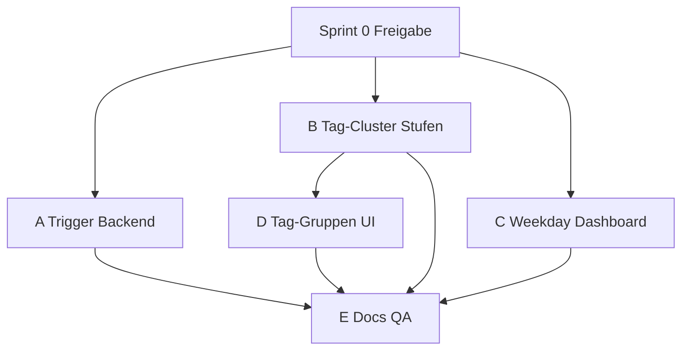

# M10.1 Sprint Plan — Insight-Pipeline, Trigger & Tag-Gruppen-Reifegrad

Last updated: 2026-07-13

Companion to:

- [Freigabe-Vorschlag](proposals/INSIGHT_PIPELINE_TAG_GROUPS_PROPOSAL.md)
- [ADR-0037](adr/0037-insight-triggers-tag-cluster-maturity.md) (Vorgeschlagen → Accepted nach Sprint 0)
- [`M10_SPRINT_PLAN.md`](M10_SPRINT_PLAN.md) § M10.1 deferred

**Tracking:** [`M10_1_INSIGHT_PIPELINE_SPRINT_STATUS.md`](M10_1_INSIGHT_PIPELINE_SPRINT_STATUS.md)

## Ziel

Schließen der Lücke „reife Tracking-Daten, leere Analytics-UI“ ohne inferenzielle
Schwellen (M9) oder ML-Validität (ADR-0016) zu verwässern.

| Problem                                 | Lösung                                       |
| --------------------------------------- | -------------------------------------------- |
| Insights nur nach Nightly Worker        | Multi-Trigger + On-Demand                    |
| Wochentags-Übersicht leer bei flachem Δ | Deskriptive `weekday_summary` im Dashboard   |
| Tag-Gruppen erst ab 90 Tagen            | Stufen: 30 pair / 45 provisional / 90 robust |

**Exit-Kriterium:** Nutzer mit ≥ 30 Tracking-Tagen sieht Tag-Gruppen (mindestens Paar-Modus);
mit ≥ 45 Tagen provisional K-Means; mit ≥ 7 Wochentags-Buckets Balken auf Home;
nach Bulk-Import oder `regenerate` erscheinen Insights ohne auf 03:00 UTC zu warten.

## Voraussetzung

- Freigabe [INSIGHT_PIPELINE_TAG_GROUPS_PROPOSAL.md](proposals/INSIGHT_PIPELINE_TAG_GROUPS_PROPOSAL.md) §10
- ADR-0037 Status → **Accepted** (Sprint 0)

## Nicht im Scope

| Item                              | Grund                    |
| --------------------------------- | ------------------------ |
| `MIN_WEEKDAY_DELTA` senken        | M9-Entscheidung          |
| `ANALYTICS_MIN_TAG_USAGES` senken | M9 False-Positive-Risiko |
| `MIN_ML_ENTRIES` senken           | ADR-0016 TimeSeriesSplit |
| Insight-Gen bei jedem Entry-Save  | M9 hot-path              |
| Hub-Tag-Dämpfung                  | Paket E (optional P2)    |

---

## Sprint-Übersicht

| Paket | Titel                          | Priorität | Abhängigkeit      |
| ----- | ------------------------------ | --------- | ----------------- |
| **0** | Freigabe & Doc-Baseline        | P0        | Proposal merged   |
| **A** | Insight-Trigger (Backend)      | P0        | Sprint 0          |
| **B** | Tag-Gruppen-Stufen             | P0        | — (parallel zu A) |
| **C** | Wochentags-Dashboard & Home    | P1        | —                 |
| **D** | Frontend Tag-Gruppen-Reifegrad | P0        | Paket B           |
| **E** | Docs, i18n, E2E, Quality Gate  | P0        | A–D               |



**Empfohlene PR-Reihenfolge:** `A+B` → `D` → `C` → `E` (Docs kann teilweise mit jedem PR mitziehen).

---

## Sprint 0 — Freigabe & Doc-Baseline

**Ziel:** Entscheidungen formalisieren, keine Produktlogik.

| ID   | Aufgabe                                                                                      |
| ---- | -------------------------------------------------------------------------------------------- |
| S0-1 | Proposal + ADR-0037 in `main` mergen                                                         |
| S0-2 | ADR-0037 Status → **Accepted**                                                               |
| S0-3 | GitHub-Milestone oder Label `m10.1-insight-pipeline` anlegen                                 |
| S0-4 | [`M10_1_INSIGHT_PIPELINE_SPRINT_STATUS.md`](M10_1_INSIGHT_PIPELINE_SPRINT_STATUS.md) anlegen |

### Akzeptanz

- [ ] ADR-0037 Accepted
- [ ] ARCHITECTURE.md Verweis aktuell (bereits im Proposal-PR)

---

## Paket A — Insight-Trigger (Backend)

**Ziel:** Dieselbe Pipeline wie Nightly Worker, zusätzliche Auslöser.

### Aufgaben

| ID  | Aufgabe                                                                                         | Dateien                                        |
| --- | ----------------------------------------------------------------------------------------------- | ---------------------------------------------- |
| A1  | Service `regenerate_insights_for_user(db, user_id, as_of, source)` extrahieren aus Worker-Logik | `insight_worker_service.py`                    |
| A2  | `POST /api/v1/insights/regenerate` — Owner, verified, `analytics_enabled`                       | `endpoints/insights.py`, `schemas/insight.py`  |
| A3  | Rate-Limit 1×/60 min pro User (Redis / SlowAPI)                                                 | `config.py`, endpoint                          |
| A4  | Hook nach erfolgreichem `POST /entries/batch` — BackgroundTask, debounce 5 min                  | `endpoints/entries.py` oder `entry_service.py` |
| A5  | `POST /api/v1/insights/trigger` — Admin-Guard                                                   | `endpoints/insights.py`, `deps/auth.py`        |
| A6  | Response-Schema `InsightRegenerateResponse`                                                     | `schemas/insight.py`                           |
| A7  | Worker CLI `--once` für lokales Dev                                                             | `workers/analytics.py`                         |
| A8  | `AGENTS.md` + `DEVELOPMENT.md`: Worker / `--once` / `regenerate`                                | Root docs                                      |

### Akzeptanz

- [ ] 67-Tage-User: `regenerate` → `insight_count ≥ 1`
- [ ] `analytics_enabled=false` → 403 oder leerer Erfolg ohne Schreiben
- [ ] Batch-Import löst Regeneration aus (Test mit Mock/Integration)
- [ ] Admin-Trigger nur mit Admin-Rolle
- [ ] `pytest tests/test_insight_worker.py tests/test_insights.py` grün
- [ ] OpenAPI / `test_api_contract.py` aktualisiert

---

## Paket B — Tag-Gruppen-Stufen (Backend)

**Ziel:** Deskriptive Tag-Gruppen ab 30 Tagen; robust ab 90.

### Aufgaben

| ID  | Aufgabe                                                                                | Dateien                                        |
| --- | -------------------------------------------------------------------------------------- | ---------------------------------------------- |
| B1  | Konstanten: `MIN_TAG_CLUSTER_PAIR_ENTRIES=30`, `PROVISIONAL=45`, `ROBUST=90`           | `tag_cluster_service.py`                       |
| B2  | `cluster_mode: pair` — Top-N Jaccard-Paare, `min_co_count ≥ 5`, max 6 Gruppen          | `tag_cluster_service.py`                       |
| B3  | `cluster_mode: kmeans` provisional — `k ≤ 3`, Silhouette ≥ 0.08, sonst pair-Fallback   | `tag_cluster_service.py`                       |
| B4  | Robust-Pfad unverändert (`k` 3–6, mixed nodes)                                         | `tag_cluster_service.py`                       |
| B5  | Fenster: `min(available_days, TAG_CLUSTER_WINDOW_DAYS)`                                | `_load_tag_vector_inputs`                      |
| B6  | Schema: `cluster_maturity`, `cluster_mode`, `entries_until_robust`, `silhouette_score` | `schemas/stats.py`, `apps/web/.../insights.ts` |
| B7  | `reason`-Codes erweitern: `entry_count_below_30`, etc.                                 | `tag_cluster_service.py`                       |
| B8  | Tests: 29d insufficient, 35d pair, 67d provisional, 90d robust                         | `test_tag_clusters.py`                         |
| B9  | Fixture aus CSV-Profil (67 Tage) als Regression                                        | `test_tag_clusters.py`                         |

### Akzeptanz

- [ ] Export-Profil 67 Tage → `status: ok`, `cluster_maturity: provisional`
- [ ] 29 Tage → `insufficient_data`
- [ ] Silhouette < 0.08 → Fallback `pair` wenn ≥ 30 Tage
- [ ] `MIN_ML_ENTRIES=90` für Lasso unverändert (Regression `test_multivariate_analytics.py`)

---

## Paket C — Wochentags-Dashboard & Home

**Ziel:** Balken auf Home unabhängig von `weekday_pattern`.

### Aufgaben

| ID  | Aufgabe                                                                  | Dateien                                                                |
| --- | ------------------------------------------------------------------------ | ---------------------------------------------------------------------- |
| C1  | `weekday_summary[]` in `get_dashboard_summary`                           | `dashboard_service.py`                                                 |
| C2  | Schema `WeekdaySummaryItem`                                              | `schemas/dashboard.py`, `api/dashboard.ts`                             |
| C3  | `HomeWeekdayOverview`: Balken aus `weekday_summary`, Labels aus Insights | `homeWeekdayOverview.ts`, `HomeWeekdayOverview.svelte`, `+page.svelte` |
| C4  | Fallback: weiterhin Insight-`weekday_mood_avgs` wenn vorhanden           | `homeWeekdayOverview.ts`                                               |
| C5  | Tests: 67 Tage ohne `weekday_pattern` zeigt Balken                       | `HomeWeekdayOverview.test.ts`, `homeWeekdayOverview.test.ts`           |
| C6  | Dev-Fixtures `weekday_summary` in provisional/robust                     | `phaseFixtures.ts`                                                     |

### Akzeptanz

- [ ] Home zeigt 7 Balken bei ≥ 7 Tagen mit Wochentags-Abdeckung
- [ ] Kein `weekday_pattern` nötig für Balken
- [ ] `weekday_pattern`-Statement weiterhin optional darunter

---

## Paket D — Frontend Tag-Gruppen-Reifegrad

**Ziel:** Provisional/pair visuell von robust unterscheiden.

### Aufgaben

| ID  | Aufgabe                                                                     | Dateien                          |
| --- | --------------------------------------------------------------------------- | -------------------------------- |
| D1  | `TagGroupsSection`: Badge `cluster_maturity`                                | `TagGroupsSection.svelte`        |
| D2  | Copy: `insufficient` dynamisch (`entries_until_robust`, Schwellen 30/45/90) | `de.json`, `en.json`             |
| D3  | Subtitle für `pair` vs `kmeans`                                             | i18n + `TagGroupsSection.svelte` |
| D4  | API-Typen erweitern                                                         | `api/insights.ts`                |
| D5  | Tests                                                                       | `TagGroupsSection.test.ts`       |
| D6  | Optional: Settings-Link „Insights aktualisieren“ → `regenerate`             | `settings/+page.svelte` (P1)     |

### Akzeptanz

- [ ] 67-Tage-Mock: provisional-Badge sichtbar
- [ ] 25-Tage-Mock: Fortschrittstext „30 Tage für erste Muster“
- [ ] Kein kausaler Copy-Drift (neutral bleiben)

---

## Paket E — Docs, i18n, E2E, Quality Gate

**Ziel:** Dokumentation und Architektur konsistent; Release-Qualität.

### Aufgaben

| ID  | Aufgabe                                                                  | Datei                   |
| --- | ------------------------------------------------------------------------ | ----------------------- |
| E1  | `docs/API.md` — regenerate, trigger, TagClusters-Felder, weekday_summary | API.md                  |
| E2  | `docs/PHASE_INSIGHT_MATRIX.md` — Cluster-Stufen, Weekday deskriptiv      | PHASE_INSIGHT_MATRIX.md |
| E3  | `docs/quality/M9_ANALYTICS_THRESHOLDS_REVIEW.md` — Addendum Tag-Cluster  | M9 review               |
| E4  | `docs/adr/0016` + `0021` — Verweise ADR-0037                             | ADR files               |
| E5  | `docs-site` user-guide + api overview                                    | docs-site               |
| E6  | `CHANGELOG.md` — M10.1 Eintrag                                           | CHANGELOG               |
| E7  | E2E: Retro-Import → Insights sichtbar                                    | `user-journeys.spec.ts` |
| E8  | `quality/M10_1_INSIGHT_PIPELINE_QA.md` — manuelle QA-Checkliste          | neu                     |

### Akzeptanz

- [ ] Impact-Matrix aus Proposal §7 vollständig abgearbeitet
- [ ] `pnpm lint && pnpm typecheck && pnpm test` grün
- [ ] `cd backend && uv run pytest` grün
- [ ] E2E smoke grün

---

## Verifikation (Sprint-Closeout)

```bash
# Backend
cd backend && uv run --python 3.12 pytest \
  tests/test_tag_clusters.py \
  tests/test_insight_worker.py \
  tests/test_insights.py \
  tests/test_api_contract.py -q

# Frontend
pnpm lint && pnpm typecheck && pnpm test

# Manuell (67-Tage-Profil)
cd backend && uv run --python 3.12 python -m app.workers.analytics --once  # nach A7
# Login → Home: Weekday-Balken + Daily Brief Insight
# /insights → Tag-Gruppen provisional
```

---

## Risiko-Register (Implementierung)

| Risiko                             | Paket | Mitigation                            |
| ---------------------------------- | ----- | ------------------------------------- |
| Regenerate-Last                    | A     | Rate-Limit, nur Owner                 |
| Instabile provisional Cluster      | B, D  | Badge, Silhouette-Gate, pair-Fallback |
| Doppel-Regeneration Import+Nightly | A     | Idempotent pro Datum                  |
| Doc-Drift                          | E     | Checkliste Proposal §7                |

---

## Referenzen

- [INSIGHT_PIPELINE_TAG_GROUPS_PROPOSAL.md](proposals/INSIGHT_PIPELINE_TAG_GROUPS_PROPOSAL.md)
- [ADR-0037](adr/0037-insight-triggers-tag-cluster-maturity.md)
- [M9 Sprint Plan](M9_SPRINT_PLAN.md) — heavy analytics in worker (bleibt)
- [ADR-0016](adr/0016-timeseries-split-ml-models.md) — ML 90d unverändert
