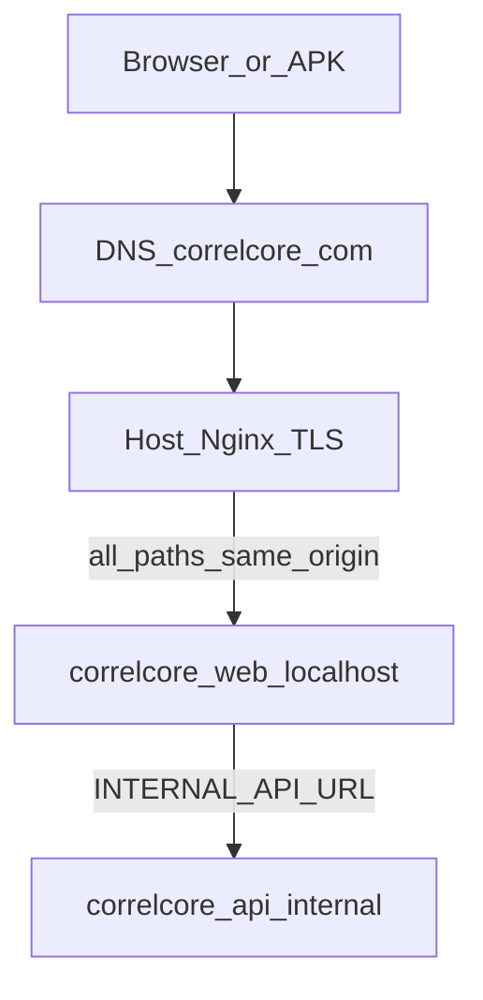
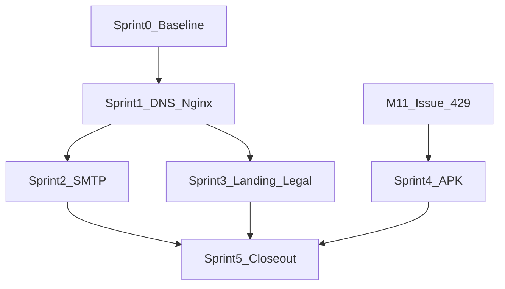

# M10.2 — Public Hosted Launch (correlcore.com)

Last updated: 2026-07-19

**Art:** Ops-/Release-Track (kein Feature-Meilenstein)  
**Tracking:** [`M10_2_PUBLIC_HOSTED_LAUNCH_STATUS.md`](M10_2_PUBLIC_HOSTED_LAUNCH_STATUS.md)  
**Domain:** `correlcore.com`  
**Edge (Launch):** Host-Nginx auf dem NAS  
**Edge (später VPS):** Production-Compose Traefik — Path A in [`selfhost/INSTALL.md`](selfhost/INSTALL.md)  
**Parallel:** M11 (Android); **danach:** M12 (SaaS)  
**Voraussetzung:** M10 Selfhost v1.0 + M10.1 Insight-Pipeline (abgeschlossen)

> **Namensklarheit:** Historisches „M10.1 deferred“ in [`M10_SPRINT_PLAN.md`](M10_SPRINT_PLAN.md)
> (Compose-Profile A/C/G) ist **nicht** dieser Track. Die Insight-Pipeline heißt ebenfalls
> M10.1 und ist **done**. M10.2 = öffentlicher Hosted-Betrieb unter correlcore.com.

---

## 1. Ziel & Exit-Kriterien

Endnutzer erreichen CorrelCore unter `https://correlcore.com` **ohne VPN/Tailscale**:
Landing, Registrierung/Login, echte Verify-/Reset-Mails, optional Android-APK-Download.
Backend bleibt vorerst auf dem NAS. Selfhost für Dritte bleibt domain-agnostisch
(GHCR + INSTALL).

| Exit-Kriterium     | Nachweis                                                                 |
| ------------------ | ------------------------------------------------------------------------ |
| Landing öffentlich | `https://correlcore.com/` → 200, Brand + CTA                             |
| Login ohne VPN     | Register → Verify-Mail → Login aus öffentlichem Netz                     |
| Echte Mail         | Verify/Reset in Inbox (nicht Mailpit); SPF/DKIM ok                       |
| Legal              | `/impressum`, `/privacy` unter correlcore.com                            |
| APK auffindbar     | Landing-CTA → signiertes GitHub-Release-APK (+ SHA256); Obtainium-Hinweis |
| Selfhost unberührt | INSTALL Path A/B nutzbar; keine Pflicht-Domain correlcore.com im Produkt |
| VPS-ready          | Runbook NAS→VPS (Dump, Secrets, DNS-Cutover)                             |

**Nicht in M10.2:** Stripe/Multi-Tenant (M12), Play Closed Testing (M11 Exit), MinIO (M13),
Compose-Profil „external proxy“ / Caddy-Umbau (weiter deferred), Traefik parallel zu Nginx.

---

## 2. Single source of truth — keine Doppelgleise

Ein Thema hat **eine** kanonische Doku. Andere Dateien verlinken nur.

| Thema                         | Kanonisch                                                    | Nicht parallel pflegen                         |
| ----------------------------- | ------------------------------------------------------------ | ---------------------------------------------- |
| Hosted Launch Ops (dieses MS) | dieser Plan + STATUS                                         | Keine zweite „Go-Public Hosted“-Checkliste     |
| Selfhost Install (allgemein)  | [`selfhost/INSTALL.md`](selfhost/INSTALL.md)                 | Hier nur Hosted-Abweichungen                   |
| External Proxy (generisch)    | INSTALL § External reverse proxy                             | Kein zweites Nginx-Handbuch außer Snippet-Link |
| Android Signing / Release-APK | [`selfhost/M11_OPS_CHECKLIST.md`](selfhost/M11_OPS_CHECKLIST.md), #429 | Keine Kopie der Keystore-Schritte hier         |
| Sideload UX                   | [`selfhost/ANDROID_SIDELOAD.md`](selfhost/ANDROID_SIDELOAD.md) | —                                              |
| Landing/Legal **Code**        | M10 Sprint 4 (shipped)                                       | M10.2 = Deploy/Content, kein Rebuild der Pages |
| Insight-Pipeline              | M10.1 (done)                                                 | Nicht erneut unter M10.2 öffnen                |
| SaaS / Billing                | M12                                                          | Hosted Reference ≠ SaaS                        |

### 2.1 Mailpit vs. echter SMTP

| Umgebung                         | Mail                        | Regel                                                                 |
| -------------------------------- | --------------------------- | --------------------------------------------------------------------- |
| Selfhost **Quickstart** / Dev    | Mailpit **bleibt**          | Out-of-box Verify ohne Provider                                       |
| Selfhost **Production** (Path A) | Operator-SMTP               | Wie INSTALL; Mailpit optional/aus                                     |
| **Hosted** correlcore.com        | Echter SMTP @correlcore.com | **Sobald SMTP E2E grün (Sprint 2): Mailpit am Hosted-Stack entfernen** |

Mailpit und Prod-SMTP gleichzeitig am Hosted-Stack = Doppelgleis → vermeiden.
`SMTP_HOST` zeigt nach dem Cutover nur noch auf den Relay, nie auf `mailpit`.

### 2.2 Nginx vs. Traefik

| Phase                         | Edge                         | Traefik im Compose                          |
| ----------------------------- | ---------------------------- | ------------------------------------------- |
| **M10.2 Launch (NAS)**        | **Host-Nginx** TLS + Proxy   | **Nein** — nicht auf 80/443, kein Parallelbetrieb |
| Selfhost Path A (andere Ops)  | Compose-Traefik              | Ja (kanonisch in INSTALL)                   |
| **Später VPS-Umzug**          | Traefik Path A (empfohlen)   | Erst dann; Nginx-Config entfällt oder bleibt bewusst |

**Entscheidung:** Solange Nginx der Edge für correlcore.com ist, **kein** Traefik für diese
Instanz implementieren/aktivieren. Traefik kommt beim NAS→VPS-Cutover (Sprint 5 Runbook),
nicht „schon mal parallel“.

---

## 3. Architektur

### 3.1 Zwei Betriebsarten, eine Codebase

|                    | **Hosted Reference**              | **Selfhost**                                      |
| ------------------ | --------------------------------- | ------------------------------------------------- |
| Wer                | Maintainer                        | Beliebiger Operator                               |
| URL                | `https://correlcore.com`          | Operator-`DOMAIN`                                 |
| Edge               | Host-Nginx → Web localhost        | Traefik (Path A) oder eigener Proxy               |
| Mail               | Echter SMTP @correlcore.com       | Operator-SMTP oder Mailpit (Quickstart)           |
| Images             | dieselben GHCR-Tags               | dieselben GHCR-Tags                               |
| Produktcode        | keine Domain-Pflicht              | keine Domain-Pflicht                              |

### 3.2 Nginx-Topologie (NAS)



- Nginx terminiert TLS; proxied **alles** nach `127.0.0.1:${WEB_HOST_PORT}` (Web).
- Web proxied `/api/*` intern ([ADR-0011](adr/0011-web-internal-reverse-proxy.md)).
- Tailscale nur Admin; Endnutzer öffentlich.

### 3.3 Nginx-Schwächen (bewusst akzeptiert bis VPS)

Siehe STATUS § Risiken. Kurz: manuelle ACME/Headers/Limits; Heimnetz-Exposure;
Synology-`X-Forwarded-Proto`-Fallen. Zielbild VPS = Traefik Path A.

---

## 4. Sprint-Übersicht

| Sprint | Titel                         | Ops-Exit                                              |
| ------ | ----------------------------- | ----------------------------------------------------- |
| 0      | Baseline & Tracking           | Gap-Matrix, Docs, Milestone/Issues, Anti-Doppelgleis  |
| 1      | DNS + Nginx + App-ENV         | `https://correlcore.com` App/Health ohne VPN          |
| 2      | SMTP + Mail-DNS               | Verify/Reset in Inbox; **Mailpit Hosted weg**         |
| 3      | Landing, Legal, Domain-Docs   | Landing/Legal live; `security@` → `.com`              |
| 4      | APK-Kanal                     | Signiertes Release + Landing-CTA (#429)               |
| 5      | VPS-Runbook, Closeout         | Exit-Kriterien; Milestone                             |

Sprint 4 blockiert auf M11 [#429](https://github.com/Sturmi77/correlcore/issues/429); parallel zu 1–3 möglich.



---

## 5. Sprint 0 — Baseline & Tracking

**Ziel:** Ist-Zustand und Entscheidungen festhalten; kein öffentlicher Cutover.

Ops-Checkliste → STATUS § Sprint 0.

Deliverables:

- Dieser Plan + STATUS (Gap-Matrix)
- Roadmap-Links (DESIGN_DOCUMENT, README, COMPLETED_MILESTONES)
- INSTALL-Verweis: Hosted Nginx = M10.2; kein Traefik-Parallel; Compose-Profil G bleibt deferred
- Vorgeschlagene GitHub-Issues (§11); Milestone M10 schließen / M10.2 anlegen (Maintainer)

---

## 6. Sprint 1 — DNS + Nginx + App-Stack (Ops)

**Ziel:** Öffentliche HTTPS-Origin; Landing/Login-Routen; API same-origin. Mail darf noch fehlen.

### 6.1 DNS

| # | Aktion                                              | Fertig wenn                                      |
| - | --------------------------------------------------- | ------------------------------------------------ |
| 1 | A/AAAA `correlcore.com` → Edge-IP                   | `dig +short correlcore.com A` korrekt            |
| 2 | Optional `www` → Apex                               | Redirect HTTPS                                   |
| 3 | TTL während Cutover kurz                            | dokumentiert                                     |
| 4 | Resolve von externem Netz                           | ohne VPN                                         |

### 6.2 App-Stack

| # | Aktion                                                         | Fertig wenn                |
| - | -------------------------------------------------------------- | -------------------------- |
| 1 | Web auf `127.0.0.1:${WEB_HOST_PORT}`                           | localhost-Bind             |
| 2 | **Kein** Traefik auf Host 80/443                               | kein Port-Konflikt         |
| 3 | Pflicht-ENV (unten); Secrets offline backupen                    | Container healthy          |
| 4 | Analytics-Worker an                                            | running                    |
| 5 | Mailpit bis Sprint 2 toleriert; danach entfernen (§2.1)        | in STATUS vermerkt         |

```env
APP_ENV=production
DOMAIN=correlcore.com
FRONTEND_BASE_URL=https://correlcore.com
CORS_ORIGINS=https://correlcore.com
COOKIE_SECURE=true
# SMTP_* → Sprint 2
```

### 6.3 Nginx (Minimum)

| #  | Aktion                                                                 | Fertig wenn              |
| -- | ---------------------------------------------------------------------- | ------------------------ |
| 1  | `server_name correlcore.com`                                           | aktiv                    |
| 2  | TLS + Auto-Renew                                                       | gültiges Zertifikat      |
| 3  | HTTP→HTTPS 301                                                         | Redirect                 |
| 4  | `proxy_pass` → Web localhost                                           | HTML                     |
| 5  | `Host`, `X-Real-IP`, `X-Forwarded-For`, **`X-Forwarded-Proto https`**, `X-Forwarded-Host` | Secure-Cookies |
| 6  | Security-Headers (HSTS, frame deny, nosniff, Referrer, Permissions)    | in Response              |
| 7  | Timeouts/Body für Auth                                                 | kein 413/504             |
| 8  | Optional `limit_req` auf `/api/v1/auth/`                               | dokumentiert             |
| 9  | Ein Upstream (alles → Web); kein Split `/api` nötig                    | einfache Config          |
| 10 | Router WAN 80/443 → Nginx                                              | Mobilfunk-Zugriff        |

Synology-Fallen: fehlendes `X-Forwarded-Proto`, Web Station Header-Rewrite, doppeltes SSL.

Smoke:

```bash
curl -sfI "https://correlcore.com/" | head -20
curl -sf "https://correlcore.com/api/v1/health"
```

---

## 7. Sprint 2 — Echte E-Mail (Ops)

**Ziel:** Verify/Reset über `@correlcore.com`. Danach **Mailpit am Hosted-Stack entfernen**.

| Phase        | Aktion                                                                 |
| ------------ | ---------------------------------------------------------------------- |
| Provider     | Relay wählen (EU/DSGVO bevorzugen); Domain verifizieren; SMTP-Creds    |
| DNS          | SPF, DKIM, DMARC (`p=none` zuerst); MX falls `security@` Inbox         |
| ENV          | `SMTP_HOST/PORT/USER/PASSWORD`, `SMTP_FROM=noreply@correlcore.com`, TLS |
| Cutover      | API neu starten; `SMTP_HOST` ≠ `mailpit`; Mailpit-Container stoppen    |
| E2E          | Register/Verify, Resend, Reset, Spam-Check, Link-Host = correlcore.com |
| Artefakt     | Kurzer Abschnitt in Runbook (keine Secrets) — kein Duplikat von INSTALL |

Selfhost-Quickstart-Compose behält Mailpit unverändert.

---

## 8. Sprint 3 — Landing, Legal, Domain-Docs

Landing = App-Route `/` ([`LandingPage.svelte`](../apps/web/src/lib/components/landing/LandingPage.svelte)),
**keine** zweite Apex-Origin (Cookie/same-origin).

| # | Aktion                                                                 |
| - | ---------------------------------------------------------------------- |
| 1 | Deploy Image mit gewünschter Landing                                   |
| 2 | Design-Parallelarbeit nur in diese Route mergen                        |
| 3 | CTAs `/auth/register`, `/auth/login`; Selfhost-Feature sichtbar        |
| 4 | Hosted Impressum/Privacy inhaltlich korrekt                            |
| 5 | Docs: `security@correlcore.app` → `security@correlcore.com`            |
| 6 | INSTALL-Beispiele bleiben `correlcore.example.com` (generisch)         |
| 7 | APK-CTA erst wenn Asset existiert (sonst verstecken; siehe #450)       |

---

## 9. Sprint 4 — APK auf der Website

**Nicht hier duplizieren:** Signing = [`M11_OPS_CHECKLIST.md`](selfhost/M11_OPS_CHECKLIST.md) A + #429.

M10.2-Anteil:

1. Hosted Capacitor-Build: `VITE_API_BASE_URL=https://correlcore.com/api/v1`
2. Landing-CTA → GitHub Release Asset (Canonical); Obtainium + SHA256
3. Optional Nginx `/downloads/` nur Spiegel — Canonical bleibt GitHub
4. Selfhost-API-Override bleibt ([`ANDROID_SIDELOAD.md`](selfhost/ANDROID_SIDELOAD.md))

---

## 10. Sprint 5 — Selfhost-Trennung, VPS-Runbook, Closeout

1. README/Landing: Hosted **oder** Selfhost gleichwertig  
2. Neues Artefakt [`runbooks/nas-to-vps.md`](runbooks/nas-to-vps.md) (Dump, Secrets, DNS, Traefik Path A Ziel)  
3. Launch-Smoke (STATUS)  
4. Milestone/STATUS Closeout  

Beim VPS-Cutover: Traefik **statt** Nginx (oder bewusst Nginx beibehalten) — nicht beides.

---

## 11. GitHub Issues

| Issue | Titel                                                              | Sprint |
| ----- | ------------------------------------------------------------------ | ------ |
| #459  | `docs(M10.2): sprint plan + status + roadmap`                      | 0      |
| #460  | `ops(M10.2): DNS + Nginx edge for correlcore.com`                  | 1      |
| #461  | `ops(M10.2): SMTP + SPF/DKIM/DMARC; remove hosted Mailpit`         | 2      |
| #462  | `ops(M10.2): hosted landing/legal + domain .app→.com docs`         | 3      |
| #463  | `feat(landing): Android APK download CTA` (blocked by #429)        | 4      |
| #464  | `docs(M10.2): NAS→VPS runbook + selfhost vs hosted`                | 5      |

Bestehend nutzen (nicht neu erfinden): #429, #450, #453. Milestone M10.2 + Attach: Maintainer (API 403 für Agents).

---

## 12. Risiken

| Risiko                    | Mitigation                                      |
| ------------------------- | ----------------------------------------------- |
| CGNAT / kein Port-Forward | Sprint 0/1 klären; ggf. Tunnel/Mini-VPS-Edge    |
| Cookie unter Nginx        | Forwarded-Proto-Checkliste; externes Smoke      |
| Mail Spam                 | SPF/DKIM/DMARC vor Ankündigung                  |
| APK verzögert             | Launch ohne CTA; CTA erst bei Asset             |
| Traefik+Nginx             | §2.2 — nur einer                                |
| Mailpit+SMTP              | §2.1 — nach Sprint 2 Mailpit Hosted weg         |
| Secrets bei Umzug         | Offline-Backup `ENCRYPTION_KEY`                 |

---

## References

- [`DESIGN_DOCUMENT.md`](DESIGN_DOCUMENT.md) § M10.2  
- [`selfhost/INSTALL.md`](selfhost/INSTALL.md) Path A + External reverse proxy  
- [`selfhost/M11_OPS_CHECKLIST.md`](selfhost/M11_OPS_CHECKLIST.md)  
- [`adr/0011-web-internal-reverse-proxy.md`](adr/0011-web-internal-reverse-proxy.md)  
- [`M10_SPRINT_PLAN.md`](M10_SPRINT_PLAN.md) (Selfhost v1.0; deferred compose ≠ M10.2)  
- [`M11_SPRINT_PLAN.md`](M11_SPRINT_PLAN.md)  
