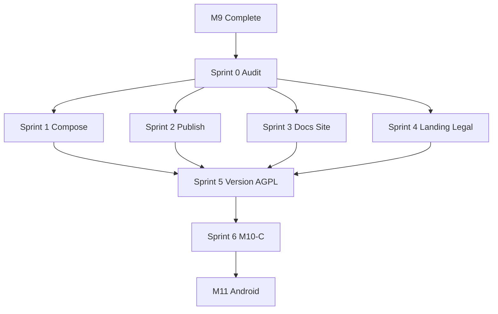

# M10 Sprint Plan — Public Selfhost Release v1.0

Last updated: 2026-07-11

Companion to [`DESIGN_DOCUMENT.md`](DESIGN_DOCUMENT.md) § M10 and
[`M9_SPRINT_STATUS.md`](M9_SPRINT_STATUS.md) (M9 complete 2026-07-11).

**Tracking:** [`M10_SPRINT_STATUS.md`](M10_SPRINT_STATUS.md) — audit matrix and
per-sprint progress.

M10 is a **release milestone**, not a feature milestone. Goal: v1.0 publicly
selfhostable — published images, documented setup, landing/docs, legal pages,
and a tagged GitHub release.

## Overview

| Sprint   | Title                       | Exit criterion                                             |
| -------- | --------------------------- | ---------------------------------------------------------- |
| 0        | Scope & audit               | Gap matrix, GitHub milestone #7 issues, tracking docs      |
| 1        | Compose & install parity    | migrate, MinIO removal, quickstart, bootstrap, smoke tests |
| 2        | Container publish & release | amd64+arm64, Docker Hub, GitHub release workflow           |
| 3        | Docs site                   | MkDocs live (install + user guide + API overview)          |
| 4        | Landing & legal (DSGVO)     | Marketing landing, Impressum, privacy links                |
| 5        | Version, AGPL & go-public   | CHANGELOG 1.0.0, rc tag, branch protection                 |
| 6        | Milestone closeout (M10-C)  | Quality gate, visual QA, tag `v1.0.0`, milestone #7 closed |
| _(opt.)_ | Beta backlog slice          | #272 close, Dependabot, triaged P2 fixes                   |

## Prerequisite

**M9 complete** (2026-07-11). **M8** (Sleep / Health Connect) may run in parallel;
v1.0 may ship without M8 ([`M7_M8_MILESTONE_SWAP.md`](M7_M8_MILESTONE_SWAP.md)).

## Binding premise (non-breaking)

Existing production VPS deployments using `docker compose up -d` on
[`infra/docker/docker-compose.yml`](../infra/docker/docker-compose.yml) must remain
**functionally identical** after M10 Sprint 1 — mood tracking, auth, insights
(worker), HTTPS (Traefik) without operator intervention.

**MinIO exception (M10):** Photo upload is deferred to **M13**. MinIO is not used
by product code (Dev-View probe only). Removing `minio` + `minio-init` from
production compose reduces container count but breaks **no user feature**.

Changes that disable **worker or Traefik** without explicit operator action →
**M10.1**, not M10.

## Compose simplification — decision summary

Evaluated options A–G during Sprint 0 planning. Full analysis in
[`M10_SPRINT_STATUS.md`](M10_SPRINT_STATUS.md) § Compose decisions.

| ID  | Proposal                                     | M10         | Notes                                            |
| --- | -------------------------------------------- | ----------- | ------------------------------------------------ |
| A   | Profile-based single stack                   | **M10.1**   | Breaks legacy default without `COMPOSE_PROFILES` |
| B   | Remove MinIO from production                 | **M10**     | No functional impact until M13                   |
| C   | Traefik → Caddy                              | **M10.1**   | Invasive TLS change                              |
| D   | Two official paths (quickstart + production) | **M10**     | Non-breaking                                     |
| E   | Bootstrap script + `.env.quickstart`         | **M10**     | Additive                                         |
| F   | YAML-DRY + migrate parity                    | **M10**     | Additive fixes                                   |
| G   | External reverse proxy mode                  | **Partial** | INSTALL doc in M10; compose mode M10.1           |

**M10 Sprint 1 package:** **D + E + F + B** (+ G partial INSTALL section).

## COMPOSE_PROFILES matrix (documentation contract)

Applies to **quickstart compose** (M10) and **M10.1+** unified stack (proposal A).

| Path                        | `COMPOSE_PROFILES`  | Compose file                        | Containers (approx.) |
| --------------------------- | ------------------- | ----------------------------------- | -------------------- |
| Eval / first test           | _(empty)_           | `docker-compose.quickstart.yml`     | 6                    |
| Homelab durable             | `worker`            | quickstart                          | 7                    |
| Homelab + GlitchTip         | `worker,monitoring` | quickstart + `--profile monitoring` | 8                    |
| **Production VPS (M10)**    | _(not required)_    | `docker-compose.yml`                | 10 (no MinIO)        |
| Production + monitoring     | `monitoring`        | `docker-compose.yml`                | 11                   |
| Production unified (M10.1+) | `worker,tls`        | single stack (future)               | 8                    |
| Storage (M13+)              | `storage`           | TBD                                 | +2                   |

Operator upgrade guide: [`selfhost/M10_COMPOSE_UPGRADE.md`](selfhost/M10_COMPOSE_UPGRADE.md).

## Dependency graph

## Sprint 0 — Scope & audit

**Goal:** Formal tracking. No feature code.

- Create [`M10_SPRINT_PLAN.md`](M10_SPRINT_PLAN.md) and [`M10_SPRINT_STATUS.md`](M10_SPRINT_STATUS.md)
- Acceptance audit: DESIGN_DOCUMENT § M10 → code → tests → sprint
- Populate GitHub [milestone #7 — M10 Public Selfhost](https://github.com/Sturmi77/correlcore/milestone/7)
- Triage beta P2 backlog ([`selfhost/BETA_FEEDBACK_TRIAGE.md`](selfhost/BETA_FEEDBACK_TRIAGE.md))
- Document: **MkDocs Material** for docs site; **D+E+F+B** for compose

## Sprint 1 — Compose & install parity (non-breaking)

**Goal:** Close INSTALL/compose drift; simplify quickstart.

**Deliverables:**

1. **Production compose (F + B):** `migrate` service, YAML anchors, `FRONTEND_BASE_URL`
   in shared env; remove MinIO services and `api.depends_on.minio`; update `.env.example`
2. **Quickstart (D):** `docker-compose.quickstart.yml`; INSTALL Path B before Path A
3. **Bootstrap (E):** `scripts/bootstrap-selfhost-env.sh --quickstart`, `.env.quickstart.example`
4. **Docs (G partial):** external reverse proxy section in INSTALL
5. **Smoke tests:** [`quality/M10_COMPOSE_SMOKE_TEST.md`](quality/M10_COMPOSE_SMOKE_TEST.md)

**Not in Sprint 1:** proposal A (unified profiles), C (Caddy).

## Sprint 2 — Container publish & GitHub release

- Multi-arch (`linux/amd64`, `linux/arm64`) in [`.github/workflows/release-images.yml`](../.github/workflows/release-images.yml)
- Docker Hub publish for `correlcore-api`, `correlcore-web`
- GitHub release workflow on `v*` tags
- Optional `${IMAGE_REGISTRY}` in compose

## Sprint 3 — Docs site

MkDocs Material under `docs-site/` — install guide, user workflows, API overview,
privacy. Deploy GitHub Pages or `docs.correlcore.app`. CI: `mkdocs build --strict`.

## Sprint 4 — Landing & legal

Marketing landing (replace pre-alpha home), `/impressum`, privacy footer links,
README URL updates. DSGVO checkpoint M10.

## Sprint 5 — Version, AGPL & go-public

CHANGELOG `[1.0.0]`, AGPL metadata in `package.json`, `v1.0.0-rc.1`, branch
protection when repo goes public, `security@correlcore.app` reachable.

## Sprint 6 — Milestone closeout (M10-C)

[`quality/M10_QUALITY_GATE.md`](quality/M10_QUALITY_GATE.md),
[`quality/M10_VISUAL_QA.md`](quality/M10_VISUAL_QA.md), tag **`v1.0.0`**, close
milestone #7.

## M10.1 deferred (post-v1.0)

- Proposal A: unified profile stack (`worker`, `tls`, `monitoring`, `storage`)
- Proposal C: Caddy TLS path
- Proposal G: external-proxy compose profile
- ADR: `compose-tiering.md` + CHANGELOG migration note for `COMPOSE_PROFILES`

## Success metrics

| Metric             | Target                                  |
| ------------------ | --------------------------------------- |
| Docker Hub images  | amd64 + arm64 for api + web             |
| Compose smoke test | PASS quickstart + production regression |
| Docs site          | Install + user guide publicly reachable |
| Legal              | Impressum + privacy linked from landing |
| CHANGELOG          | Full `[1.0.0]` section                  |
| Quality gate M10   | PASS (CQR + SA)                         |
| GitHub release     | `v1.0.0` with release notes             |

## References

- [`DESIGN_DOCUMENT.md`](DESIGN_DOCUMENT.md) § M10
- [`M9_SPRINT_PLAN.md`](M9_SPRINT_PLAN.md)
- [`selfhost/INSTALL.md`](selfhost/INSTALL.md)
- [`selfhost/M10_COMPOSE_UPGRADE.md`](selfhost/M10_COMPOSE_UPGRADE.md)
- [`M13_NOTES.md`](M13_NOTES.md) — MinIO returns with photo upload
- [`CLOSEOUT_SPRINT_PLAN.md`](CLOSEOUT_SPRINT_PLAN.md) §1.2 — GitHub milestone #7
