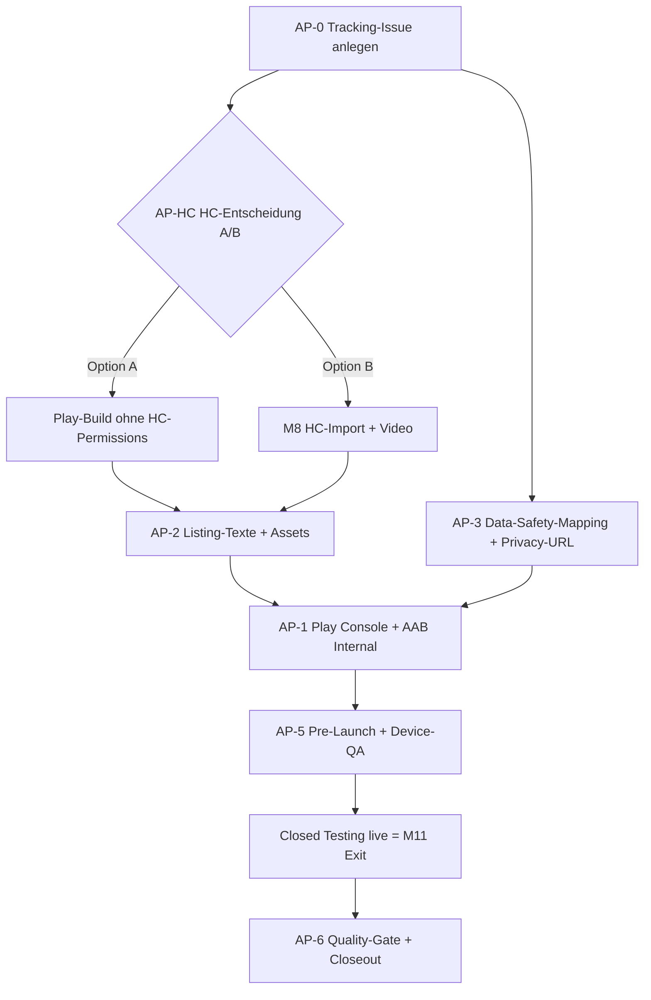

# M11 Play Store — Gap-Analyse & Restplan

Last updated: 2026-08-17

Detailanalyse des verbleibenden Gaps zwischen dem aktuellen Stand und dem
**M11-Exit-Kriterium: Play Store Closed Testing live**.

Bezug: [`M11_SPRINT_PLAN.md`](M11_SPRINT_PLAN.md),
[`M11_NOTES.md`](M11_NOTES.md),
[`selfhost/M11_OPS_CHECKLIST.md`](selfhost/M11_OPS_CHECKLIST.md),
[`DESIGN_DOCUMENT.md`](DESIGN_DOCUMENT.md) § M11,
[ADR-0002](adr/0002-capacitor-statt-twa.md),
[ADR-0006](adr/0006-cookie-auth-mit-capacitor-migration.md),
[ADR-0033](adr/0033-sensitive-health-data-handling-cycle-signals.md).

---

## 1. Kernbefund

**Das Engineering ist fertig. Das Gap zum Play Store ist zu ~95 % Ops- und
Content-Arbeit — kein blockierender Code mehr, mit genau einer technischen
Ausnahme (Health-Connect-Deklaration, § 4).**

Sprints 1–5 sind im Code abgeschlossen und der signierte Sideload-Pfad ist in
**produktiver Nutzung**:

- Signierte APK/AAB + `SHA256SUMS.txt` hängen real an Releases
  (`v1.0.6`–`v1.0.8` und laufend), Signing-Secrets seit 2026-07-18 gesetzt.
- `targetSdkVersion 36`, `minSdkVersion 24` → Play-konform (Play verlangt
  aktuell target ≥ 35).
- Checkliste A der Ops-Checkliste ist vollständig abgehakt.

Was fehlt, ist **ausschließlich Sprint 6 (Play Console Internal → Closed
Testing)** und **Sprint 7 (Quality-Gate / Closeout)**.

### 1.1 Tracking-Loch (Meta-Gap — zuerst schließen)

Issue [#429](https://github.com/Sturmi77/correlcore/issues/429) wurde am
2026-07-23 als *completed* geschlossen. Im Abschlusskommentar steht explizit:

> „Checklist C (M11 exit) was never started and is not tracked anywhere else …
> If the Play track is still intended, it needs its own issue.“

**Dieses Nachfolge-Issue existiert bis heute nicht.** Es gibt derzeit **kein
offenes Issue**, das den Play-Store-Track verfolgt (Suche nach „Play Store“,
„Data Safety“, „Closed Testing“ = 0 offene Treffer). Der Milestone „M11 —
Android / Polish“ ist nicht mehr offen; Milestone #11 ist inzwischen „Backlog“.

→ **Erste Aktion: ein sauberes Ops-Exit-Issue anlegen** (Vorschlag § 6),
sonst ist der Restweg unverfolgt.

---

## 2. Statusmatrix — was steht, was fehlt

| Bereich | Status | Blocker-Typ |
| ------- | ------ | ----------- |
| Capacitor-Shell, Debug-/Release-Build, Signing | ✅ Done | — |
| Signierte APK/AAB an GitHub Releases (Sideload) | ✅ Done, produktiv | — |
| Bearer-Auth + API-Base-URL (ADR-0006) | ✅ Code done; Device-Smoke offen | Manuell |
| Glance-Widget + `GET /widget/summary` | ✅ Code done; Device-QA offen | Manuell |
| FCM-Registrierung + Device-Token-API | ✅ Code done; Live-Push offen | Ops (Firebase) |
| **Play Console Account + App** | ❌ Nicht begonnen | Ops (Mensch, $25) |
| **Play App Signing (Upload-Key = CI-Keystore)** | ❌ Nicht begonnen | Ops (Mensch) |
| **Internal-Testing-Track (AAB-Upload)** | ❌ Nicht begonnen | Ops (Mensch) |
| **Store-Listing-Assets** | ❌ Nicht begonnen | Content |
| **Data Safety Form** | ❌ Nicht begonnen | Content + DSGVO |
| **Health-Connect-Declaration** | ⚠️ Risiko, Entscheidung offen | **Code/Produkt** |
| **Pre-Launch-Report clean** | ❌ Nicht begonnen | Ops (Google-Devices) |
| **Quality-Gate + Security-Audit (§9)** | ❌ Nicht begonnen | Review |
| **DSGVO-Checkpoint M11 (3 Items)** | ❌ Nicht begonnen | DSGVO |

---

## 3. Detail-Gap nach Arbeitspaketen

### AP-1 — Play Console Bootstrap (Ops, Mensch)
- [ ] Google-Play-Console-Entwicklerkonto ($25 einmalig)
- [ ] App `de.correlcore.app` anlegen (Package-ID final = `de.correlcore.app`,
      konsistent mit Manifest/`build.gradle`)
- [ ] **Play App Signing** aktivieren: Google-verwalteter App-Key + der bereits
      genutzte CI-Keystore als **Upload-Key** (empfohlen, weil Recovery über
      Google möglich bleibt). Bewusst festlegen und dokumentieren.
- [ ] Internal-Testing-Track: AAB aus dem CI-Release-Artefakt hochladen
      (`correlcore-<ver>.aab` liegt bereits an jedem `v*`-Tag)

> Agent kann hier **nicht** handeln (Google-Login, Zahlung, Konsole).
> Vorbereitbar: Upload-Anleitung + Version-Mapping (tag → versionCode) prüfen.

### AP-2 — Store-Listing-Assets (Content)
- [ ] Kurzbeschreibung (≤ 80 Zeichen), Langbeschreibung (≤ 4000 Zeichen) —
      DE + EN, keine Health-Claims, konsistent mit README/Landing-Wording
- [ ] Feature-Graphic 1024×500, App-Icon 512×512 (Brand-Assets vorhanden unter
      `docs/assets/brand/`)
- [ ] Screenshots: Phone (≥ 2). 7"/10"-Tablet nur falls Tablet-Support
      deklariert wird
- [ ] Kategorie, Kontaktdaten, Zielgruppe/Content-Rating-Fragebogen

> Agent kann Beschreibungstexte **entwerfen** (DE/EN) und einen Asset-Checklist
> mit Zielformaten liefern; Screenshots erfordern echte Geräte/Emulator.

### AP-3 — Data Safety & Privacy (DSGVO-kritisch, review-blockierend)
- [ ] Data-Safety-Formular wahrheitsgemäß, abgestimmt mit
      [ADR-0033](adr/0033-sensitive-health-data-handling-cycle-signals.md)
      (Zyklus + HC-Realität) — **nur deklarieren, was wirklich ausgeliefert wird**
- [ ] Datenschutzerklärung als **öffentliche URL** (aus M10-Landing) —
      Erreichbarkeit + Play-tauglichkeit verifizieren
- [ ] Health-Connect-Nutzung in der Data-Safety-Section korrekt deklariert

> Agent kann ein **Data-Safety-Mapping-Dokument** vorbereiten (Feld für Feld:
> welche Daten, Zweck, Verschlüsselung, Löschung) als Vorlage für das Formular.

### AP-4 — Firebase / FCM (Sprint-5-Exit, Ops — nicht Closed-Testing-blockierend)
- [ ] Firebase-Projekt; Android-App `de.correlcore.app`
- [ ] `google-services.json` → `apps/android/android/app/` (lokal/CI-Secret)
- [ ] Service-Account (FCM Admin) → API-Secret `FCM_CREDENTIALS_JSON`
- [ ] API mit `FCM_ENABLED=true` + `firebase-admin` deployen
- [ ] Live-Push auf Play-Services-Gerät verifizieren (`POST /devices/push-test`)

> Push ist für Closed Testing **abschaltbar** (Build ohne `google-services.json`
> setzt `FCM_ENABLED=false`). Offenes Akzeptanzkriterium, aber **kein** Exit-Blocker.

### AP-5 — Geräte-QA & Pre-Launch (manuell / Google-Devices)
- [ ] Widget: hell/dunkel, Android 12 & 14, 4×1 & 4×2 ohne Truncation
- [ ] Device-Smoke Auth: Register/Login + Entry aus signierter APK
- [ ] Pre-Launch-Report: keine kritischen Crashes (Google testet auf Realgeräten)

### AP-6 — Quality-Gate & Closeout (Sprint 7)
- [ ] Code-Quality-Review + Security-Audit gemäß Design-Doc §9
- [ ] DSGVO-Checkpoint M11 (Data Safety, Privacy-URL, HC-Deklaration)
- [ ] `CHANGELOG`, `M11_NOTES`-Checkboxen, README-Milestone-Zeile aktualisieren

---

## 4. Das eine technische Risiko: Health-Connect-Deklaration

Dies ist der **einzige Punkt mit echtem Ablehnungsrisiko** und der einzige, an
dem eventuell noch Code entsteht.

**Ist-Stand:** Das Manifest deklariert aktiv:

```
android.permission.health.READ_SLEEP
android.permission.health.READ_HEART_RATE
```

`HealthConnectPlugin.kt` liest Schlaf + Herzfrequenz funktional aus. **Aber:**
laut Klassenkommentar ist *„Writing imported values into entries is Sprint 4“*
(M8 Sprint 4) — der **nutzerseitige Feature-Loop** (Import sichtbar in Entries)
ist möglicherweise noch nicht vollständig ausgeliefert.

**Warum das Play blockiert:** Google verlangt für Apps mit Health-Connect-
Permissions:
1. ein separates **Health-Connect-Declaration-Formular**,
2. **Nachweis der aktiven Nutzung** in einem ausgelieferten Feature
   (i. d. R. Demo-Video),
3. einen **HC-spezifischen Datenschutz-Abschnitt**.

Deklarierte, aber im UI nicht nutzbare HC-Permissions führen regelmäßig zur
**Ablehnung**. Der Sprint-Plan warnt bereits explizit: *„if HC import not ready,
do not declare unused permissions.“*

**Entscheidung (Owner, vor AP-1):**

| Option | Inhalt | Empfehlung |
| ------ | ------ | ---------- |
| **A — HC aus dem Play-Build entfernen** | Product-Flavor / Build ohne HC-Permissions & HC-Plugin für Closed Testing; HC bleibt im Sideload-Build | **Empfohlen** für schnellen Closed-Testing-Exit ohne HC-Review-Aufwand |
| **B — HC-Loop fertigstellen + deklarieren** | M8-Sprint-4-Import in Entries fertig, Demo-Video, HC-Privacy | Nur wenn HC-Import ohnehin jetzt gefinished wird — koppelt M11-Exit an M8 |

Der Sprint-Plan nennt Full-HC-Import ausdrücklich als **Non-Goal für M11**
(„do not block Closed Testing on full Garmin sync“). → **Option A** hält M11 und
M8 entkoppelt und ist der risikoärmste Pfad zum Exit.

---

## 5. Empfohlener Restplan (Reihenfolge)



**Was der Agent jetzt vorbereiten kann (kein Google-Zugang nötig):**

1. **AP-0:** Ops-Exit-Issue formulieren/anlegen (§ 6).
2. **AP-HC:** Option A umsetzen — Play-Build-Variante ohne HC-Permissions
   (Manifest-Flavor / Gradle-Flavor `play` vs. `sideload`), inkl. CI-Schalter.
   *Erst nach Owner-Freigabe der Entscheidung.*
3. **AP-2:** Store-Listing-Copy (DE/EN, Kurz/Lang) entwerfen + Asset-Format-
   Checkliste.
4. **AP-3:** Data-Safety-Mapping-Dokument (Datentyp → Zweck → Verschlüsselung →
   Löschung) als Formular-Vorlage; Privacy-URL-Erreichbarkeit prüfen.
5. **AP-6-Teil:** Vorab-Update der Akzeptanz-Checkboxen-Vorlage in
   `M11_NOTES.md` / Design-Doc, sobald die Ops-Schritte erfolgt sind.

**Was zwingend der Operator/Mensch tut (Agent kann nicht):**

- Google-Konto + $25, App-Anlage, Play App Signing, AAB-Upload
- Screenshots auf Realgerät/Emulator, Pre-Launch-Report, finale Freigabe
- Firebase-Projekt (falls Push live gewünscht)

---

## 6. Tracking-Issues (angelegt 2026-08-17)

Umbrella + ein Issue je Arbeitspaket, jeweils mit Checkliste und Wer/Wie pro
Schritt, als GitHub-Sub-Issues unter dem Umbrella verknüpft:

| Issue | Arbeitspaket |
| ----- | ------------ |
| **#717** | Umbrella — ops(M11-exit): Play Console, Data Safety & Closed Testing |
| **#718** | AP-HC — Health-Connect-Deklaration entscheiden + Play-Build ohne HC (Risiko-Gate) |
| **#719** | AP-1 — Play Console Bootstrap (Account, App, App Signing, AAB Internal) |
| **#720** | AP-2 — Store-Listing-Assets (Texte DE/EN, Grafiken, Screenshots) |
| **#721** | AP-3 — Data Safety Form + Privacy-URL + HC-Deklaration |
| **#722** | AP-4 — Firebase/FCM Live-Push (nicht Closed-Testing-blockierend) |
| **#723** | AP-5 — Device-QA + Pre-Launch-Report |
| **#724** | AP-6 — Quality-Gate + DSGVO-Checkpoint + Closeout |

Rollen-Legende in jedem Issue: 👤 Operator (@Sturmi77) · 🤖 Agent (Claude Code)
· 🔍 Reviewer.

---

## 7. Definition of Done (M11-Exit)

M11 ist erreicht, wenn:

1. **Closed Testing im Play Store live** ist (AAB aus CI, Internal → Closed
   promoted), **und**
2. **Data Safety + öffentliche Privacy-URL + HC-Deklaration** korrekt und
   wahrheitsgemäß hinterlegt sind (bzw. HC per Option A nicht deklariert wird),
   **und**
3. Pre-Launch-Report ohne kritische Crashes, **und**
4. **Design-Doc-Akzeptanzkriterien M11 + DSGVO-Checkpoint** abgehakt oder mit
   Owner + Issue-Link explizit deferred sind.

Der Sideload-Kanal (GitHub Releases + Obtainium) bleibt parallel bestehen.
