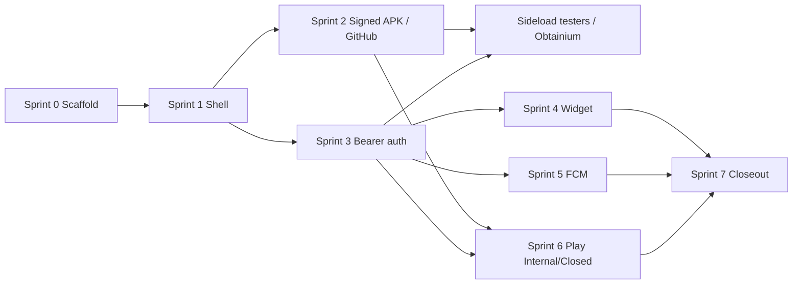

# M11 Sprint Plan — Android App (Pre-Store → Play Closed Testing)

Last updated: 2026-07-18

Companion to [`DESIGN_DOCUMENT.md`](DESIGN_DOCUMENT.md) § M11,
[`M11_NOTES.md`](M11_NOTES.md), [ADR-0002](adr/0002-capacitor-statt-twa.md),
and [ADR-0006](adr/0006-cookie-auth-mit-capacitor-migration.md).

**Goal:** Ship a production-capable Capacitor Android app, distribute it to
testers **without Play Store first**, then enter Play **Internal / Closed
Testing**. Exit criterion remains Play Closed Testing live (per design doc).

**Status:** Sprint 1 (production Capacitor shell) **complete** — committed
`apps/android/android/`, static SPA `build:capacitor`, debug APK via
`pnpm cap:assemble:debug` / CI `assemble-debug`.

## Current baseline

| Item                                         | Status |
| -------------------------------------------- | ------ |
| Capacitor package `apps/android` (#27)       | Done   |
| CI job validates config (no SDK / no APK)    | Done   |
| HC consent foundation (`consent_log`, #31)   | Done   |
| Native `android/` project committed          | Done   |
| Capacitor majors aligned (7.6.7)             | Done   |
| Static SPA webDir (`build-capacitor`)        | Done   |
| Brand icons / splash / `correlcore://` link  | Done   |
| CI `assembleDebug` + APK artifact            | Done   |
| Bearer auth path for Capacitor (ADR-0006)    | Open   |
| Signed release APK/AAB in CI                 | Open   |
| Glance homescreen widget                     | Open   |
| FCM / push in native shell                   | Open   |
| Play Console listing + Data Safety           | Open   |

## Distribution decision (Step 0 — before Play)

### Recommendation: signed APK/AAB on GitHub Releases + Obtainium

| Channel                         | Fit for CorrelCore first wave                                                                                         | Verdict                                      |
| ------------------------------- | --------------------------------------------------------------------------------------------------------------------- | -------------------------------------------- |
| **GitHub Releases (APK/AAB)**   | Matches existing `v*` release culture; AGPL-friendly; CI can attach artifacts; testers install via “Unknown sources” | **Primary — do this first**                  |
| **Obtainium** (client)          | Users subscribe to the GitHub repo/release URL; auto-update without Play                                              | **Recommended install UX for beta cohort**   |
| **Direct APK send** (chat/mail) | Fine for ≤5 device smoke tests; no update channel, easy to lose track of versions                                     | Ad-hoc only                                  |
| **F-Droid**                     | Strong privacy audience; slow inclusion; needs reproducible builds; FCM/proprietary bits complicate policy            | **Phase 2** after GitHub APK is stable       |
| **Play Internal Testing**       | Best path to Closed Testing / Pre-Launch Report; requires Play Console ($25) + AAB                                    | **M11 exit track** (after sideload works)    |

**Do not block M11 engineering on F-Droid.** F-Droid is a follow-on distribution
channel once the signed build, privacy copy, and update story are proven via
GitHub Releases. Self-host / privacy users already expect GitHub + Obtainium;
Play reaches everyone else.

### Sideload security baseline

1. **Upload keystore** in GitHub Secrets (never in git); same key for all
   pre-store and later Play uploads (or use Play App Signing with a separate
   upload key — decide once in Sprint 2).
2. Publish **checksums** (`SHA-256`) next to each APK/AAB on the Release.
3. Document install steps: enable install from unknown sources → download →
   verify checksum (optional) → install → point app at API (SaaS or selfhost).
4. Versioning: Android `versionCode` / `versionName` aligned with git tags
   (e.g. `1.1.0-android.1` during M11 pre-store, then `1.1.0` for Play).

## Sprint overview

| Sprint | Title                              | Exit criterion                                              |
| ------ | ---------------------------------- | ----------------------------------------------------------- |
| 0      | Scaffold (done)                    | `apps/android` + CI validate (#27)                          |
| 1      | Production Capacitor shell         | Committed `android/`, `cap sync` + debug install on device  |
| 2      | Signed CI build + sideload channel | Release workflow attaches signed APK; testers install       |
| 3      | Mobile auth & API wiring           | Login/session works in WebView (Bearer per ADR-0006)        |
| 4      | Widget data + Glance widget        | Homescreen widget + `GET /widget/summary`                   |
| 5      | Push (FCM) for non-selfhost        | Push received on test device (UnifiedPush remains M4.2)     |
| 6      | Play Console Internal → Closed     | Internal track live; Data Safety + assets; Pre-Launch OK    |
| 7      | M11 quality gate / closeout        | Design-doc acceptance + DSGVO checkpoint checked            |

Sprints 4–5 may overlap Sprint 2–3 once the shell installs; Play work (6)
starts only after a sideload build is green.

---

## Sprint 1 — Production Capacitor shell

**Depends on:** M10 complete; web client builds with `adapter-node`.

### Work

- [x] Run `cap add android` and **commit** `apps/android/android/` (stop
      gitignoring the platform tree for release builds).
- [x] Pin Capacitor major versions consistently (`@capacitor/core` /
      `android` / `cli` — all **7.6.7**).
- [x] Capacitor webDir uses static SPA `../web/build-capacitor`
      (`pnpm --filter @correlcore/web build:capacitor`; adapter-node unchanged
      for Docker/selfhost).
- [x] App identity: `appId` `de.correlcore.app`, brand icons/splash,
      deep-link `correlcore://entries/new`.
- [x] Document local path: Android Studio / SDK 35+, USB debug install
      (`apps/android/README.md`).
- [x] CI `assemble-debug` job (JDK 21 + SDK, no signing secrets).

### Exit

- [x] Debug APK builds via `./gradlew assembleDebug` (CI artifact + local
      `pnpm cap:assemble:debug`). Device/emulator UI smoke remains a manual
      check for maintainers.

---

## Sprint 2 — Signed CI build + sideload distribution

**This is the first external deploy — no Play Store.**

### Work

- [ ] Gradle release signing via env / GitHub Secrets
      (`ANDROID_KEYSTORE_BASE64`, `ANDROID_KEYSTORE_PASSWORD`,
      `ANDROID_KEY_ALIAS`, `ANDROID_KEY_PASSWORD`).
- [ ] Extend [`.github/workflows/release-android.yml`](../.github/workflows/release-android.yml):
  - build web → `cap sync` → `assembleRelease` (APK) and/or `bundleRelease` (AAB)
  - upload artifacts on `workflow_dispatch` and on `v*` tags
- [ ] Attach APK (+ SHA-256) to GitHub Release notes (same tag flow as
      container images, or a dedicated `android-v*` tag — pick one and document).
- [ ] Short tester doc: `docs/selfhost/ANDROID_SIDELOAD.md` (or section under
      install docs) covering Obtainium URL, permissions, API base URL.
- [ ] Smoke checklist: cold start, login attempt, offline banner, logout.

### Exit

- At least one signed release APK is downloadable from GitHub Releases and
  installs on Android 12+ without Play.

### Out of scope here

- F-Droid metadata / reproducible builds (track as post-M11 or M11+ issue).
- Play listing copy (Sprint 6).

---

## Sprint 3 — Mobile auth & API wiring

Per [ADR-0006](adr/0006-cookie-auth-mit-capacitor-migration.md):

### Work

- [ ] Capacitor-aware `apiFetch`: In-memory Bearer from
      `TokenResponse.access_token`; refresh via `/auth/refresh` with
      `Authorization` header (no `localStorage` / `sessionStorage`).
- [ ] Configurable API base URL for selfhost (build-time default for SaaS;
      runtime setting or deep-link for selfhost testers).
- [ ] Cookie path remains default for browser/PWA builds.
- [ ] Tests: dual-path auth (cookie web + bearer capacitor) in unit/e2e where
      feasible.
- [ ] Clear session on app lock / logout; document threat notes for Art. 9.

### Exit

- Tester can register/login against a staging or selfhost API from the APK
  and create an entry.

---

## Sprint 4 — Widget endpoint + Glance widget

Scope detail: [`M11_NOTES.md`](M11_NOTES.md).

### Work

- [ ] `GET /api/v1/widget/summary` (≤1 KB, JWT, mood avg / entry status).
- [ ] Jetpack Glance `AppWidget` + WorkManager (15 min, battery-aware).
- [ ] Deep-link “+ Add entry” → `/entries/new` in WebView.
- [ ] QA: Android 12/14, 4×1 and 4×2, light/dark.
- [ ] `docs/features/WIDGET.md`.

### Exit

- Widget acceptance criteria in `M11_NOTES.md` checked (except Play listing
  line, which moves with Sprint 6).

---

## Sprint 5 — FCM for non-selfhost

Design doc: FCM for Play/SaaS users; UnifiedPush primary for selfhost (M4.2).

### Work

- [ ] `@capacitor/push-notifications` + Firebase project (non-selfhost only).
- [ ] Backend device-token registration endpoint (or extend existing push
      stubs from M4.2 if present).
- [ ] Neutral notification copy (“Time for your daily check-in.”) — no streak
      pressure / no health claims.
- [ ] Document that sideload GitHub builds may ship **without** FCM, or with
      FCM optional, so F-Droid-bound builds stay free of proprietary blobs
      later.

### Exit

- Push received on a Google-Play-services test device for the SaaS/staging
  backend.

---

## Sprint 6 — Play Console Internal → Closed Testing

### Work

- [ ] Play Console app created; **Internal testing** track with AAB from CI.
- [ ] Store listing: short/long description, feature graphic, screenshots
      (phone + 7" / 10" if required).
- [ ] **Data Safety** aligned with ADR-0033 / cycle + HC consent reality.
- [ ] Health permissions / HC declaration as applicable (coordinate with M8;
      if HC import not ready, do not declare unused permissions).
- [ ] Privacy policy **public URL** (already on landing from M10).
- [ ] Pre-Launch Report: no critical crashes.
- [ ] Promote Internal → **Closed Testing** (M11 exit).

### Exit

- Closed Testing track live; design-doc Play acceptance items satisfied or
  explicitly deferred with issue links (widget-only deferrals must not block
  Closed Testing if shell+auth+listing are ready — prefer shipping shell
  first).

---

## Sprint 7 — Quality gate & closeout

- [ ] Code quality + security review per design doc §9.
- [ ] DSGVO checkpoint M11 (Data Safety, privacy URL, HC declaration).
- [ ] Update `CHANGELOG`, `M11_NOTES` acceptance checkboxes, README milestone
      row.
- [ ] Optional: open F-Droid prep issue (metadata, reproducible APK, no-FCM
      product flavor).

---

## Dependency map

## Risk register (short)

| Risk                                      | Mitigation                                                              |
| ----------------------------------------- | ----------------------------------------------------------------------- |
| Cookie auth broken in WebView             | Sprint 3 Bearer path; keep web cookies untouched                        |
| Play rejects “thin” WebView shell         | Native widget + push + HC roadmap already justify Capacitor (ADR-0002)  |
| Keystore loss                             | Backup encrypted offline; document recovery / Play App Signing          |
| HC / health-claim copy                    | No medical claims; sync Data Safety with real permissions only          |
| F-Droid delay                             | Keep GitHub+Obtainium as supported channel; F-Droid non-blocking        |
| Capacitor major version skew (7 vs 8)     | Align in Sprint 1 before committing `android/`                          |

## Explicit non-goals for M11

- iOS / App Store
- Full M8 Health Connect **import** (consent exists; native plugin may land
  partially — do not block Closed Testing on full Garmin sync)
- F-Droid official listing (prep only)
- SaaS billing (M12)

## Suggested GitHub issues (create when executing)

1. Commit Capacitor `android/` platform + debug CI build
2. Release signing + GitHub Release APK artifacts
3. Sideload / Obtainium tester doc
4. Capacitor Bearer `apiFetch` switch (ADR-0006)
5. Widget summary API
6. Glance widget + WorkManager
7. FCM Capacitor integration (SaaS flavor)
8. Play Console Internal/Closed + Data Safety checklist
9. (Later) F-Droid reproducible build / no-FCM flavor

## Success definition

M11 is complete when:

1. Testers can install a **signed APK from GitHub Releases** (or Obtainium)
   without Play, and use core journal flows against a real API; **and**
2. Play **Closed Testing** is live with Data Safety + privacy URL; **and**
3. Design-doc M11 acceptance + DSGVO checkpoint are checked (or residual
   gaps tracked with owners).
