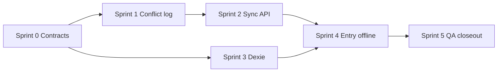

# M4.1 Sprint Plan — Offline-First Sync

Last updated: 2026-06-30

M4.1 delivers true offline-first behaviour: local IndexedDB persistence (Dexie.js),
delta sync via `/sync/push` and `/sync/pull`, field-level Last-Write-Wins merge,
and transparent conflict logging. M4 quick wins (PWA shell, `/offline`, form-level
offline retry) are prerequisites only — they do not replace this milestone.

**GitHub:** Milestone [M4.1 — Offline-First Sync](https://github.com/Sturmi77/correlcore/milestone/8) · Issues [#10](https://github.com/Sturmi77/correlcore/issues/10), [#24](https://github.com/Sturmi77/correlcore/issues/24)

**Companion:** [`M4.1_SPRINT_STATUS.md`](M4.1_SPRINT_STATUS.md) · [`CLOSEOUT_SPRINT_PLAN.md`](CLOSEOUT_SPRINT_PLAN.md) §2

## References

| Document                                      | Content                                     |
| --------------------------------------------- | ------------------------------------------- |
| [ADR-0009](adr/0009-offline-sync-nach-m4.md)  | Scheduling rationale (deferred from M1/M4)  |
| [ADR-0003](adr/0003-sync-conflict-log.md)     | LWW + `sync_conflicts` schema and UX intent |
| [DESIGN_DOCUMENT.md](DESIGN_DOCUMENT.md) §3.5 | Sync protocol contract                      |
| [ARCHITECTURE.md](ARCHITECTURE.md) §4, §9     | Push/pull sequence, conflict log            |
| [API.md](API.md) §10                          | Request/response shapes (planned)           |
| [features/PWA.md](features/PWA.md)            | What M4 already ships vs. M4.1              |

## Prerequisites

- [x] M4 complete — PWA shell cache, `/offline`, install banner, `pwaLifecycle`
- [x] M1 entry CRUD + Fernet at-rest encryption for sensitive fields
- [x] Entry form autosave with in-tab offline retry (bridge only; not IndexedDB)

## Milestone exit criteria

1. User can create and edit a day entry **fully offline**; data survives tab reload.
2. On reconnect, `POST /sync/push` uploads pending changes; server state converges.
3. Second device receives changes via `GET /sync/pull?since=<cursor>`.
4. Simultaneous edits on the same entry field log a row in `sync_conflicts` (critical fields).
5. `GET /api/v1/user/sync-conflicts` returns read-only conflict history.
6. CI green: backend pytest (incl. multi-device conflict), web vitest, E2E offline smoke.
7. GitHub #10 and #24 closed; milestone M4.1 closed.

## Scope (in)

| Layer        | Deliverable                                                                |
| ------------ | -------------------------------------------------------------------------- |
| **Frontend** | Dexie.js schema, `change_log` outbox, `client_id`, sync orchestrator       |
| **Frontend** | Entry flows write local-first; background push on online / app focus       |
| **Frontend** | Retry queue persisted across reload; merge-report handling                 |
| **Backend**  | `POST /api/v1/sync/push`, `GET /api/v1/sync/pull`                          |
| **Backend**  | Field-level LWW merge (`updated_at`); server wins on tie                   |
| **Backend**  | `sync_conflicts` table + Alembic migration                                 |
| **Backend**  | `GET /api/v1/user/sync-conflicts` (paginated, read-only)                   |
| **Backend**  | 90-day conflict retention job (APScheduler / existing worker)              |
| **Docs**     | `API.md` §10 implemented; `PWA.md` updated; `M4.1_VISUAL_QA.md`            |
| **Tests**    | Multi-device pytest; vitest for Dexie + sync store; Playwright offline E2E |

### Synced entities (v1)

| Entity       | Tables / API                                    | Notes                                              |
| ------------ | ----------------------------------------------- | -------------------------------------------------- |
| **Entries**  | `entries`, entry-tag links, entry-symptom links | Primary offline use case                           |
| **Tags**     | Custom tag create/update (habit fields)         | Pull includes user tags; push for custom tags only |
| **Symptoms** | Custom symptom rows                             | Same pattern as tags                               |

Insights, analytics exports, and worker-generated data are **server-authoritative** — pull only, never push from client.

### Critical conflict fields (#24)

Logged when `client_ts` and `server_ts` diverge and values differ:

`mood_score`, `energy`, `stress`, `note_enc` (server stores encrypted; log metadata only per DSGVO), `symptoms` (intensity map)

## Out of scope (deferred)

| Item                                     | Target                | Rationale                                     |
| ---------------------------------------- | --------------------- | --------------------------------------------- |
| Web Push, app lock, install polish       | **M4.2**              | Needs stable offline UX first                 |
| Settings UI „Sync-Verlauf" (full)        | **M4.1 minimal / M9** | Read API in M4.1; rich UI can follow          |
| Manual conflict resolution (pick winner) | **M9+**               | Log + read-only view sufficient for v1        |
| CRDT / OT merge                          | —                     | ADR-0003: LWW + log is sufficient             |
| Capacitor native shell                   | **M11**               | #27                                           |
| Notes composer / `note_raw` retrofit     | **M8**                | Notes epic #194–#202                          |
| Background Sync API (SW)                 | Optional later        | Dexie queue + `online` event is enough for v1 |

## Sprint overview

Execute in order. Each sprint should land as one reviewable PR on `main`.

| Sprint | Title                         | Exit                                            |
| ------ | ----------------------------- | ----------------------------------------------- |
| 0      | Contracts & ADR alignment     | Schemas, API contract, Dexie ERD documented     |
| 1      | Conflict log (backend)        | Migration, model, read API, retention job       |
| 2      | Sync engine (backend)         | `push` / `pull`, LWW merge, conflict write path |
| 3      | Dexie foundation (frontend)   | Local DB, `change_log`, client identity         |
| 4      | Offline entry path (frontend) | Local-first entry CRUD + sync orchestrator      |
| 5      | QA, E2E & closeout            | Visual QA, docs, #10/#24 closed                 |

**Estimated duration:** 2–3 weeks (ADR-0009: ≥3–5 net days for sync core alone; with tests and E2E plan for 2 weeks).

---

## Sprint 0 — Contracts & ADR alignment

**Goal:** Freeze the implementation contract before code. No runtime behaviour change.

### Deliverables

- [x] `docs/adr/0036-offline-sync-v1-scope.md` (or extend ADR-0003 addendum)
  - Entity list, field merge rules, cursor format, idempotency keys
  - Explicit: encrypted `note_enc` conflict log stores no plaintext
- [x] `docs/M4.1_SPRINT_STATUS.md` tracking file (this plan's companion)
- [x] `API.md` §10: finalize request/response JSON schemas and error codes (`409` vs conflict report)
- [x] Dexie ERD diagram in plan or ADR: tables `entries_local`, `change_log`, `sync_meta`
- [x] OpenAPI stubs or `backend/app/schemas/sync.py` skeleton (no endpoints yet)

### Tests

- [x] Contract review only

---

## Sprint 1 — Conflict log (backend)

**Goal:** #24 database and read path — merge write path comes in Sprint 2.

**Issue:** [#24](https://github.com/Sturmi77/correlcore/issues/24)

### Deliverables

- [x] Alembic migration: `sync_conflicts` per ADR-0003 / #24
- [x] SQLAlchemy model `SyncConflict`
- [x] `GET /api/v1/user/sync-conflicts` — paginated, `entity_type` filter, no plaintext health values in response
- [x] APScheduler job: delete rows older than 90 days
- [x] `docs/API.md` — conflict list endpoint documented

### Tests

- [x] Pytest: migration smoke (CI alembic upgrade)
- [x] Pytest: create/list conflict rows; retention job deletes stale rows
- [x] Pytest: response schema never includes decrypted note text

---

## Sprint 2 — Sync engine (backend)

**Goal:** #10 server half — push/pull with LWW and conflict logging.

**Issue:** [#10](https://github.com/Sturmi77/correlcore/issues/10) (backend)

### Deliverables

- [x] `backend/app/schemas/sync.py` — `SyncPushRequest`, `SyncPullResponse`, `SyncChange`, `SyncConflictReport`
- [x] `backend/app/services/sync_service.py`
  - Field-level LWW on `entries` (and linked tag/symptom assignments)
  - Insert `sync_conflicts` when critical fields diverge
  - Cursor encoding (opaque base64 JSON or monotonic revision per user)
- [x] `POST /api/v1/sync/push` — authenticated, idempotent on `change_log` sequence + `client_id`
- [x] `GET /api/v1/sync/pull?since=<cursor>` — delta since cursor; includes entries + custom tags/symptoms
- [x] Router mount in `api/v1/router.py` (replace future comment)
- [x] Structured logging: sync batch size, conflict count — **no** mood/note values

### Tests

- [x] Pytest: push new entry → visible in DB
- [x] Pytest: pull returns only changes after cursor
- [x] Pytest: two devices edit same field → conflict row + server value wins
- [x] Pytest: push idempotency (replay same batch)
- [x] Pytest: RLS / user isolation (user A cannot pull user B)

---

## Sprint 3 — Dexie foundation (frontend)

**Goal:** Local persistence layer without yet rewiring all entry UI.

**Issue:** [#10](https://github.com/Sturmi77/correlcore/issues/10) (frontend foundation)

### Deliverables

- [x] Add `dexie` dependency to `apps/web`
- [x] `apps/web/src/lib/offline/db.ts` — Dexie database version 1
- [x] Tables: `entries`, `change_log`, `sync_meta` (`client_id`, `last_pull_cursor`)
- [x] `apps/web/src/lib/offline/clientId.ts` — stable UUID in `localStorage`
- [x] `apps/web/src/lib/offline/changeLog.ts` — append-only outbox with monotone sequence
- [x] Unit tests: round-trip write/read; sequence monotonicity

### Tests

- [x] Vitest with `fake-indexeddb` (or jsdom IndexedDB shim)
- [x] No change to production entry routes yet (feature flag `offlineSyncEnabled` default off until Sprint 4)

---

## Sprint 4 — Offline entry path (frontend)

**Goal:** End-to-end offline create/edit/sync for day entries.

**Issue:** [#10](https://github.com/Sturmi77/correlcore/issues/10) (integration)

### Deliverables

- [x] `apps/web/src/lib/offline/syncOrchestrator.ts`
  - `pushPending()`, `pullSince(cursor)`, `onOnline` / `visibilitychange` hooks
  - Integrate with existing `pwaLifecycle` store
- [x] `apps/web/src/lib/stores/entriesOffline.ts` (or extend `entries` store)
  - Local-first write path for `/entries` day form
  - Optimistic UI; `SaveStatusBadge` states: `local` | `syncing` | `synced` | `offline`
- [x] Replace in-tab-only offline retry with Dexie-backed queue where feature flag on
- [x] Handle `push` conflict reports — surface neutral copy (no alarmist gamification)
- [x] Settings > App & offline: show last sync time + pending change count
- [x] Feature flag: enable offline sync for verified users (env or preference)

### Tests

- [x] Vitest: orchestrator push/pull mocked fetch
- [x] E2E: `offline entry → reload → online → entry on server` (extend `mobile-entry-foundation.spec.ts`)
- [x] E2E: existing autosave tests still pass when flag off

---

## Sprint 5 — QA, E2E & closeout

**Goal:** Sign off M4.1 and close GitHub milestone.

### Deliverables

- [x] `docs/quality/M4.1_VISUAL_QA.md` — 375 / 768 / 1280, light + dark
  - Offline entry form, pending badge, reconnect sync, settings sync summary
- [x] `docs/M4.1_SPRINT_STATUS.md` — all sprints Done
- [x] `docs/features/PWA.md` — offline-first section updated
- [x] `CHANGELOG.md` — M4.1 entry
- [x] `README.md` — Offline Sync row updated from „Planned" to „Complete" or „Partial"
- [x] Close GitHub #10, #24; close milestone M4.1

### Verification commands

```powershell
.\scripts\local-quality.ps1
cd backend
uv run pytest tests/test_sync_service.py tests/test_sync_conflicts.py -q
cd ../apps/web
pnpm exec vitest run src/lib/offline
pnpm --filter @correlcore/web test:e2e:smoke
```

### Manual QA matrix

| Scenario                                             | Devices    | Pass |
| ---------------------------------------------------- | ---------- | ---- |
| Create entry offline, reload, go online              | Phone PWA  | Pass |
| Edit same entry on phone + desktop                   | 2 browsers | Deferred (beta) |
| Conflict on `mood_score` → row in sync-conflicts API | 2 browsers | Pass |
| Airplane mode → banner → retry → synced              | Phone      | Pass |

---

## Risk register

| Risk                                  | Mitigation                                                                            |
| ------------------------------------- | ------------------------------------------------------------------------------------- |
| Encrypted `note_enc` merge complexity | Sprint 0 contract: compare ciphertext + IV metadata only; decrypt after merge         |
| Multi-tab same browser                | Single `client_id` per origin; serialize push via BroadcastChannel or leader election |
| Large pull payload                    | Cursor pagination; default 30-day window on first pull                                |
| Sync bugs corrupt data                | Idempotent push; integration tests before enabling flag by default                    |
| DSGVO log leakage                     | Reuse `test_log_scrubbing.py` patterns; no health values in sync logs                 |

## Follow-on milestones

| Milestone                               | Depends on M4.1                       |
| --------------------------------------- | ------------------------------------- |
| **M4.2** Push & app lock                | Yes — digest/push needs reliable sync |
| **M7-S8** #147/#148 optional LLM/digest | Yes — push infrastructure             |
| **M11** Capacitor                       | Dexie schema reusable in WebView      |

---

## Sprint dependency graph


