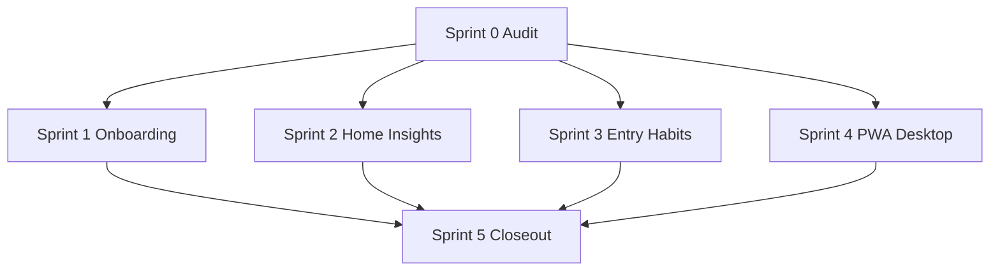

# M5.1 Sprint Plan — UX Polish & Flow Consolidation

Last updated: 2026-07-10

Companion to [`M5_1_UX_POLISH_PLAN.md`](M5_1_UX_POLISH_PLAN.md). Tracks formal
closeout of the `ux(O-xx)` issue cluster (#251–#273) between M5 (Habits core) and
M9 (Beta hardening).

**Note:** Tag co-occurrence heatmap shipped earlier as the M5.1 backlog quick win
(2026-05-29) — see [`quality/M5_1_VISUAL_QA.md`](quality/M5_1_VISUAL_QA.md). This
plan covers the **UX polish** scope defined in DESIGN_DOCUMENT v0.13.

## Overview

| Sprint | Title                      | Issues (GitHub)              | Exit                                              |
| ------ | -------------------------- | ---------------------------- | ------------------------------------------------- |
| 0      | Scope & audit              | —                            | Issue matrix complete; tracking docs in place     |
| 1      | Onboarding & Entry bridge  | #251, #260, #261, #263       | W2 funnel verified; verify → entry without login  |
| 2      | Home & Insights UX         | #252, #254†, #264, #266, #268 | Brief-first Home; maturity-gated analytics      |
| 3      | Entry & Habits surfaces    | #262, #265, #267              | Unified entry sheet; inline habit setup           |
| 4      | PWA, Settings & Desktop    | #269, #270, #271, #273        | Contextual PWA/export; sticky Trends range        |
| 5      | Milestone closeout (M5.1-C) | —                           | Visual QA, docs, quality gate, GitHub hygiene     |

† **#254 (O-05):** Original sparkline ≥3-entry gate superseded by Phase-3 **O-55**
(sparkline removed). Acceptance satisfied via removal.

**Out of scope:** #272 Password reset UI (backend dependency) — not required for
M5.1 exit per [`frontend/O-20_PASSWORD_RESET_PLAN.md`](frontend/O-20_PASSWORD_RESET_PLAN.md).

## Implementation heritage

Feature work landed incrementally via GUI optimization:

- **Phase 1 (O-01–O-20):** PRs #281, #284 — auth, onboarding, Home, Trends, PWA
- **Phase 2 (O-21–O-42):** Sprints H–M — IA, entry unification, spacing
- **Phase 3 (O-43–O-56):** Mobile Insights correctness, Home top-insight brief

M5.1 formalizes verification and milestone exit rather than greenfield development.

## Dependency graph



| Dependency | Reason                                      |
| ---------- | ------------------------------------------- |
| #251 → #260 | `openEntry` contract before inline tags     |
| #261 → W2   | Post-verify session before seamless funnel  |
| Sprint 5 → M9 | Beta testers after UX flows are signed off |

## Sprint 0 — Scope & audit

- Create [`M5_1_SPRINT_STATUS.md`](M5_1_SPRINT_STATUS.md) tracking document.
- Map each in-scope issue to code anchor and automated test evidence.
- Reconcile doc drift (`OPTIMIZATION_BACKLOG`, `README`, exit checkboxes).

## Sprint 1 — Onboarding & Entry bridge

**Verify:**

- Register → check-email → verify → `/?openEntry=1` → `GlobalEntrySheet`
- `OnboardingTagSuggestions` + habit hint on first entry
- Legacy routes redirect (`/onboarding`, `/onboarding/retro`, `/profile`)

**Key files:** `openEntry.ts`, `GlobalEntrySheet.svelte`, `verify-email/+page.svelte`,
`onboarding/+page.server.ts`, `OnboardingTagSuggestions.svelte`

**Tests:** `user-journeys.spec.ts`, `legacyRedirects.test.ts`, `GlobalEntrySheet.test.ts`

## Sprint 2 — Home & Insights UX

**Verify:**

- `InsightFeed` empty CTA → `OPEN_ENTRY_HOME_PATH`
- `HomeDailyBrief` brief-first + `home-weekly-bridge`
- No `HomeSparkline` on Home (O-55)
- `insightAnalyticsGate.ts` gates matrix, co-occurrence, advanced analytics

**Key files:** `HomeDailyBrief.svelte`, `InsightFeed.svelte`, `insightAnalyticsGate.ts`,
`insights/+page.svelte`

## Sprint 3 — Entry & Habits surfaces

**Verify:**

- All viewports use `GlobalEntrySheet` via `entryNavigation.ts`
- `/entries/new` redirects to `/?openEntry=1`
- `HabitsPanel` inline setup (`habits-empty-setup`)
- Heatmap `selectDate` → `EntryHistorySheet` on Trends and Insights

## Sprint 4 — PWA, Settings & Desktop

**Verify:**

- PWA banner gated: `entry_count >= 1` OR `onboarding_retro_completed`
- Settings export section (`settings-section-export`)
- Check-email `mailto:` deep link (`check-email-open-mail`)
- Trends sticky toolbar (`trends-sticky-toolbar`) with persisted `analysisRange`

## Sprint 5 — Milestone closeout (M5.1-C)

**Deliverables:**

- [`quality/M5_1_UX_VISUAL_QA.md`](quality/M5_1_UX_VISUAL_QA.md) — UX flow QA matrix
- Update [`M5_1_UX_POLISH_PLAN.md`](M5_1_UX_POLISH_PLAN.md) exit criteria
- Update `README.md`, `CHANGELOG.md`, `MOBILE_WEB_IMPLEMENTATION_PLAN.md`
- Close GitHub issues #251–#271, #273 (leave #272 open)

**Quality gate:**

```bash
pnpm lint && pnpm typecheck && pnpm test
cd backend && uv run --python 3.12 ruff check . && uv run --python 3.12 pytest
pnpm --filter @correlcore/web test:e2e:journeys --workers=1
pnpm --filter @correlcore/web test:e2e:mobile --workers=1
pnpm --filter @correlcore/web test:e2e:smoke
```

## Success metrics

| Metric                         | Target (from GUI optimization audit) |
| ------------------------------ | ------------------------------------ |
| W1 account funnel              | ≤5 steps, ≤3 screens                 |
| W2 first entry                 | ≤4 steps, ≤60s                       |
| Duplicate maturity UI          | 1 block per screen                   |
| Legacy onboarding reachable    | Redirect only                        |
| End-to-end without dead ends   | Mobile 390/430 + Desktop 1280+       |

## References

- [`M5_1_UX_POLISH_PLAN.md`](M5_1_UX_POLISH_PLAN.md) — issue ledger
- [`frontend/GUI_OPTIMIZATION_IMPLEMENTATION_PLAN.md`](frontend/GUI_OPTIMIZATION_IMPLEMENTATION_PLAN.md)
- [`frontend/OPTIMIZATION_BACKLOG.md`](frontend/OPTIMIZATION_BACKLOG.md)
- [`DESIGN_DOCUMENT.md`](DESIGN_DOCUMENT.md) — M5.1 acceptance criteria
