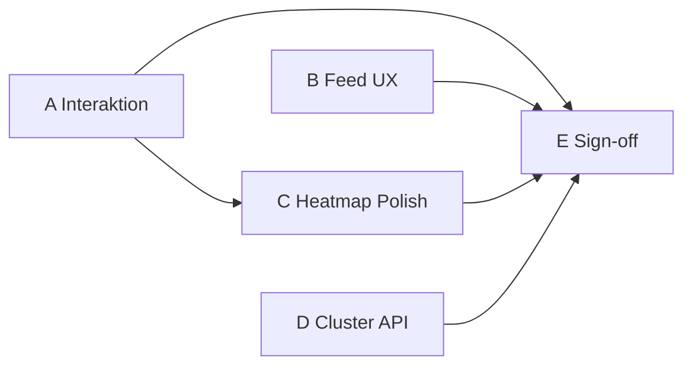

# M7 Sprint 9 — Spec Complete (Feature-Complete ohne Sleep / Cycle / LLM)

Last updated: 2026-06-28

Companion to [`M7_SPRINT_PLAN.md`](M7_SPRINT_PLAN.md) and [`M7_SPRINT_STATUS.md`](M7_SPRINT_STATUS.md).

## Ziel

M7 wird von **„Kern-Shipped“** (Sprints 1–7) auf **„Spec Complete“** gehoben: alle
Akzeptanzkriterien aus ADR-0025, [`features/symptom-analytics.md`](features/symptom-analytics.md)
und [`frontend/SYMPTOM_VISUALIZATION.md`](frontend/SYMPTOM_VISUALIZATION.md), die **ohne neue
Datenquellen** umsetzbar sind.

**Explizit außerhalb Sprint 9** (eigene Milestones / optional):

| Thema                                      | Ziel                | Grund                                       |
| ------------------------------------------ | ------------------- | ------------------------------------------- |
| Schlaf × Symptom                           | M8                  | `sleep_minutes` fehlt                       |
| Zyklus × Lifestyle                         | M7.1 / M8           | Produkt + Datenvolumen                      |
| Ollama / Weekly Digest                     | Sprint 8 (optional) | LLM + M4 Push                               |
| Changepoint (#149)                         | Post-M7             | Could-have, `ruptures`                      |
| Dedizierte `SymptomInsightCard`-Komponente | —                   | `InsightCard` reicht; nur UX-Gaps schließen |

## Exit-Kriterium

- Alle Sprint-9-Checkboxen in diesem Dokument erfüllt.
- Offene Spec-Checkboxen in SYMPTOM_VISUALIZATION §11 und symptom-analytics §M7 entweder
  `[x]` oder mit **documented deviation** (z. B. custom SVG statt `DualAxisChart`).
- Quality Gate: [`quality/M7_QUALITY_GATE.md`](quality/M7_QUALITY_GATE.md) Verdikt
  **„M7 spec complete“**.
- CI grün: `pytest`, `pnpm lint`, `pnpm typecheck`, `pnpm test`.

---

## Sprint-Übersicht (empfohlene Reihenfolge)

| Phase | Paket | Titel                               | Dauer (Richtwert) | Abhängigkeit                |
| ----- | ----- | ----------------------------------- | ----------------- | --------------------------- |
| 1     | **A** | Interaktion & Entry-Drilldown       | 1–2 Tage          | —                           |
| 2     | **B** | Feed Confounder UX                  | 1 Tag             | —                           |
| 3     | **C** | Heatmap-Polish & Parität            | 1–2 Tage          | A (Detail-Sheet-Pattern)    |
| 4     | **D** | Kombinierte Cluster-API (#150 Rest) | 2–3 Tage          | — (parallel zu A–C möglich) |
| 5     | **E** | Docs, Spec-Sign-off, Hygiene        | 0,5–1 Tag         | A–D                         |

**Gesamt:** ca. 5–8 Entwicklertage (1 Sprint à 1–2 Wochen).



---

## Paket A — Interaktion & Entry-Drilldown

**Ziel:** Nutzer können von Symptom-Visualisierungen in bestehende Entry-Flows springen —
analog `/trends` und Tag-Co-Occurrence.

### Aufgaben

| ID  | Aufgabe                                                                                                                                          | Dateien / Touchpoints                                                                                                        |
| --- | ------------------------------------------------------------------------------------------------------------------------------------------------ | ---------------------------------------------------------------------------------------------------------------------------- |
| A1  | `selectDate` von `SymptomAnalyticsSection` auf `/insights` an Entry-History/Sheet binden                                                         | `apps/web/src/routes/insights/+page.svelte`, ggf. `EntryHistorySheet` / bestehendes Overlay-Pattern von Trends               |
| A2  | Kalender-Zelle und Comparison-Heatmap-Symptom-Zelle öffnen denselben Drawer für `entry_date`                                                     | `SymptomAnalyticsSection.svelte`, `ComparisonHeatmap` event bubbling (bereits `on:selectDate`)                               |
| A3  | **Symptom×Tag Detail-Sheet**: Klick auf befüllte Zelle öffnet Metrik-Panel (Phi, Jaccard, Lift, Fisher/co_count, base rates, confounder-Hinweis) | Neues `SymptomCooccurrenceDetailSheet.svelte` oder Erweiterung `CooccurrenceEntrySheet`; `SymptomCooccurrenceHeatmap.svelte` |
| A4  | Optional: Link „Methodik“ im Detail-Sheet → `CorrelationDisclaimer`                                                                              | `insights/+page.svelte` disclaimer state                                                                                     |

### Akzeptanzkriterien

- [ ] Klick auf Kalendertag in `SymptomCalendarHeatmap` öffnet Entry für dieses Datum (oder leeren Entry-Flow).
- [ ] Klick auf Symptom×Tag-Zelle mit Daten öffnet Detail-Sheet mit allen Backend-Feldern aus `SymptomTagCooccurrenceCell`.
- [ ] Keyboard: Enter auf fokussierter Zelle öffnet dasselbe Sheet (siehe Paket C).
- [ ] Component-Tests für Sheet-Open und `selectDate`-Wiring.

### Nicht-Ziel

- Neues API-Feld; Payload kommt aus bestehendem `GET /insights/symptom-tag-cooccurrence`.

---

## Paket B — Feed Confounder UX

**Ziel:** Weekday-Confounder sichtbar im Insight-Feed, nicht nur in der Heatmap.

### Aufgaben

| ID  | Aufgabe                                                                                                                        | Dateien                                            |
| --- | ------------------------------------------------------------------------------------------------------------------------------ | -------------------------------------------------- |
| B1  | `InsightCard`: wenn `payload.confounder === 'weekday'` (oder `flags.weekday_confounded`), muted Variante + Subtitle (i18n)     | `InsightCard.svelte`, `en.json` / `de.json`        |
| B2  | `insightRanking.ts`: confounded Cards nach gleicher `confidence × effect_size` sortieren (tie-breaker: non-confounded zuerst)  | `apps/web/src/lib/utils/insightRanking.ts` + Tests |
| B3  | Sicherstellen, dass `symptom_mood_association` und `symptom_tag_cooccurrence` im Feed ab `provisional` erscheinen (Regression) | `InsightFeed.svelte`, `InsightFeed.test.ts`        |

### Akzeptanzkriterien

- [ ] Confounded Symptom-Insights rendern mit reduzierter Kontrast-Variante und erklärendem Subtitle.
- [ ] Zwei Insights mit gleicher Effektstärke: nicht-confounded rankt höher.
- [ ] Keine rohen p-Werte in der UI (nur `*` / FDR-Hinweis wo spezifiziert).
- [ ] Unit-Tests für Ranking und Card-Variante.

### Spec-Mapping

- SYMPTOM_VISUALIZATION §6 Confounder Handling, §11 `SymptomInsightCard` confounder/sort.
- symptom-analytics §M7 „confounder field surfaced“.

---

## Paket C — Heatmap-Polish & Parität

**Ziel:** Symptom- und Tag-Co-Occurrence-Heatmaps auf gleichen Reifegrad; A11y/E2E-Hooks.

### Aufgaben

| ID  | Aufgabe                                                                                                                                                 | Dateien                                                                              |
| --- | ------------------------------------------------------------------------------------------------------------------------------------------------------- | ------------------------------------------------------------------------------------ |
| C1  | **Tag-Heatmap Cluster-Sort**: `sortMode` + Toggle bei `robust` (Reuse `cooccurrenceClusterOrder.ts`)                                                    | `TagCooccurrenceHeatmap.svelte`, `tagCooccurrenceMatrix.ts`, `insights/+page.svelte` |
| C2  | `co_count` als Subscript/Secondary in Zellenlabel (Symptom×Tag; optional Tag×Tag)                                                                       | `SymptomCooccurrenceHeatmap.svelte`, `TagCooccurrenceHeatmap.svelte`                 |
| C3  | Tooltips mit Base-Rate-Kontext (z. B. „9 of 12 symptom days“) — i18n keys                                                                               | `en.json` / `de.json`                                                                |
| C4  | Keyboard-Navigation: Pfeiltasten + Enter auf Grid (Roving tabindex)                                                                                     | Symptom + Tag Heatmap-Komponenten                                                    |
| C5  | `data-testid` auf neuen/angepassten Interaktionselementen für E2E                                                                                       | Komponenten + optional `m7-insights-mobile.spec.ts` Erweiterung                      |
| C6  | Spec-Abweichungen dokumentieren: Trend-Overlay nutzt custom SVG (nicht `DualAxisChart`) — in SYMPTOM_VISUALIZATION als **accepted deviation** markieren | `SYMPTOM_VISUALIZATION.md`                                                           |
| C7  | Spec-Abweichung: Calendar nutzt eigenes GitHub-Grid (nicht M2 `CalendarHeatmap`) — als **accepted deviation** markieren                                 | `SYMPTOM_VISUALIZATION.md`                                                           |

### Akzeptanzkriterien

- [ ] Tag-Co-Occurrence-Heatmap: Cluster-Toggle nur in `robust`; Default alphabetisch.
- [ ] Symptom×Tag: FDR `*` bei `p_value_corrected < 0.10` (bereits vorhanden — Regression test).
- [ ] `early_patterns`: nur Counts, keine Lift-Farbe (bereits vorhanden — Regression test).
- [ ] Screenreader: `aria-label` / `title` enthält Symptom, Tag, Lift/Count, confounder state.
- [ ] E2E-Smoke: mindestens ein Test öffnet Symptom-Detail-Sheet oder Entry-Drawer von `/insights`.

### Bereits erledigt (nur verifizieren + Spec `[x]`)

- Confounder-Muting auf Symptom×Tag-Zellen.
- Cluster-Sort auf Symptom×Tag-Heatmap.
- Lift-Farbskala ab `provisional`.
- Calendar/Trend ≥5 Occurrences, Show-all 8/4.

---

## Paket D — Kombinierte Cluster-API (#150 Backend-Rest)

**Ziel:** Sprint-3-Restpunkt — Tag-Groups können Symptome einbeziehen (Jaccard auf kombinierter Matrix).

### Aufgaben

| ID  | Aufgabe                                                                                                                                    | Dateien                                                         |
| --- | ------------------------------------------------------------------------------------------------------------------------------------------ | --------------------------------------------------------------- |
| D1  | Kombinierte Co-Occurrence-Vektoren: Tags **und** Symptome als Knoten; Jaccard-Distanz aus 90-Tage-Binary-Präsenz                           | `tag_cluster_service.py` oder neues `signal_cluster_service.py` |
| D2  | API: `TagClustersResponse` erweitern **additiv** — z. B. `cluster_kind: "tags_only" \| "mixed"` oder `members: { type, id, slug, name }[]` | `schemas/stats.py`, `insights.py` endpoint                      |
| D3  | Frontend `TagGroupsSection`: gemischte Cluster rendern (Symptom-Icon + Tag-Farbe)                                                          | `TagGroupsSection.svelte`, API types                            |
| D4  | Worker-Hook: nightly recompute bleibt idempotent; `insufficient_data` wenn < 90 entries oder < 5 aktive Signale                            | `workers/analytics.py`                                          |
| D5  | Tests: deterministische Cluster auf Fixture-Daten; API-Integration                                                                         | `test_tag_clusters.py`, ggf. neuer Service-Test                 |

### Akzeptanzkriterien

- [ ] Mindestens ein QA-Seed-User zeigt Tag-Groups mit Symptom **oder** dokumentiertes `insufficient_data` bei dünnem Seed.
- [ ] Bestehende Tag-only-Clients brechen nicht (additive Felder, Default-Verhalten).
- [ ] Copy bleibt neutral („Signals that often appear together“ — kein „AI“).
- [ ] ADR-0025 / symptom-analytics §M7 #150 Backend-Checkbox `[x]`.

### Design-Entscheidung (festhalten in PR)

**Empfehlung:** `members[]` mit `kind: "tag" | "symptom"` statt separatem Endpoint — ein Cluster-Call, ein UI-Block.

---

## Paket E — Docs, Spec-Sign-off & Hygiene

**Ziel:** Repo-Dokumentation spiegelt „M7 spec complete“; keine veralteten offenen Checkboxen.

### Aufgaben

| ID  | Aufgabe                                                                                                   |
| --- | --------------------------------------------------------------------------------------------------------- |
| E1  | `M7_SPRINT_STATUS.md`: Sprint 9 Tracking; Milestone „Spec complete“                                       |
| E2  | `M7_QUALITY_GATE.md`: Verdikt aktualisieren; Sprint-9-Checkliste                                          |
| E3  | `M7_NOTES.md`: Acceptance Criteria auf Stand bringen                                                      |
| E4  | `SYMPTOM_VISUALIZATION.md` §11: erledigte Punkte `[x]`; Abweichungen C6/C7 dokumentiert                   |
| E5  | `symptom-analytics.md` §M7 / Sprint-free: erledigte Punkte `[x]`                                          |
| E6  | `README.md`: M7 Status „Spec complete“ (nach Sprint-9-Exit)                                               |
| E7  | `CHANGELOG.md`: Sprint 9 Eintrag                                                                          |
| E8  | GitHub: Issues #146/#150 schließen oder kommentieren; Titel/Milestone M7 (#149 offen lassen als deferred) |

### Akzeptanzkriterien

- [ ] Ein Leser findet in ≤3 Klicks: was M7 umfasst, was deferred ist, was Sprint 8 optional ist.
- [ ] Kein Widerspruch zwischen SPRINT_PLAN, STATUS, QUALITY_GATE.

---

## Spec-Traceability (Kurzmatrix)

| Spec-Quelle                        | Sprint-9-Paket | Status vor S9                                 |
| ---------------------------------- | -------------- | --------------------------------------------- |
| Calendar → Entry drawer            | A              | Offen (Event nicht wired)                     |
| Symptom×Tag cell → detail modal    | A              | Offen                                         |
| Feed confounder mute + sort        | B              | Offen                                         |
| Tag heatmap cluster sort           | C              | Offen                                         |
| Keyboard + data-testid             | C              | Offen                                         |
| Combined Jaccard clusters API      | D              | Offen (Sprint 3 Rest)                         |
| Methodology trigger links          | A + E          | Teilweise (`CorrelationDisclaimer` existiert) |
| `SymptomInsightCard` eigenständig  | —              | **Nicht geplant** (InsightCard reicht)        |
| DualAxisChart / M2 CalendarHeatmap | C6/C7          | Abweichung dokumentieren                      |
| Sleep / Cycle / LLM                | —              | Explizit excluded                             |

---

## Qualitäts-Gates (Sprint 9)

```bash
# Backend
cd backend && uv run --python 3.12 ruff check .
cd backend && uv run --python 3.12 pytest

# Web
pnpm --filter @correlcore/web lint
pnpm --filter @correlcore/web typecheck
pnpm --filter @correlcore/web test
pnpm --filter @correlcore/web test:e2e:smoke   # nach C5

# Optional manuell
cd backend && uv run --python 3.12 python scripts/seed_m7_qa.py --reset
cd backend && uv run --python 3.12 python scripts/verify_m7_qa_api.py
# Browser: m7-qa@localhost.dev — Drawer, Detail-Sheet, Cluster-Toggle
```

---

## Risiken & Mitigationen

| Risiko                             | Mitigation                                                   |
| ---------------------------------- | ------------------------------------------------------------ |
| Kombinierte Cluster API breaking   | Nur additive Schema-Felder; Feature-Flag oder `cluster_kind` |
| Detail-Sheet Duplikat zu Tag-Sheet | Shared `CooccurrenceMetricsPanel` Subkomponente              |
| Spec „DualAxisChart“               | Documented deviation; kein Rewrite in Sprint 9               |
| GUI-QA Zeit                        | Automatisierte Tests A3/B/C5; manuell nur Smoke              |

---

## Nach Sprint 9

| Nächster Schritt  | Milestone                |
| ----------------- | ------------------------ |
| Ollama + Digest   | Sprint 8 (optional)      |
| Changepoint       | Post-M7 / Beta-getrieben |
| Cycle × Lifestyle | M7.1                     |
| Sleep × Symptom   | M8                       |
