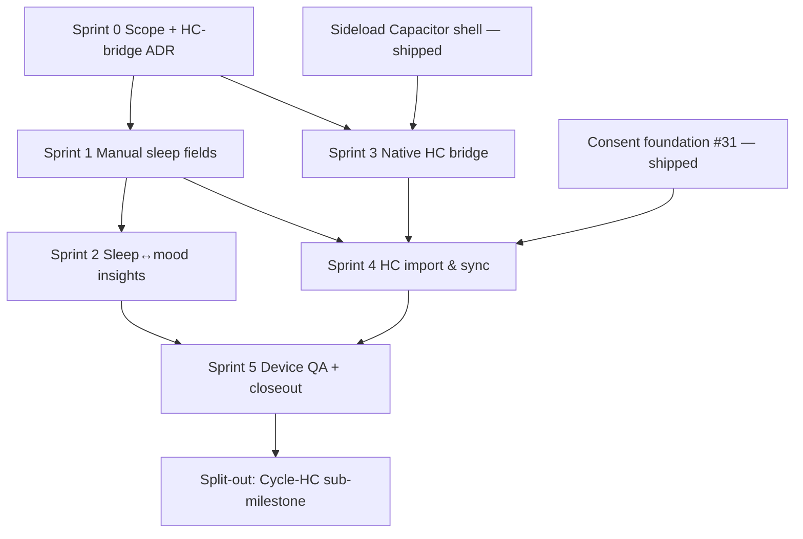

# M8 Sprint Plan — Sleep & Health Connect

Last updated: 2026-08-02

Companion to [`M8_NOTES.md`](M8_NOTES.md) (scope, acceptance criteria, guardrails),
[`DESIGN_DOCUMENT.md`](DESIGN_DOCUMENT.md) § M8, and the pre-planning analysis that
produced this plan. Milestone numbering context: [`M7_M8_MILESTONE_SWAP.md`](M7_M8_MILESTONE_SWAP.md).

**Tracking:** `M8_SPRINT_STATUS.md` (to be created in Sprint 0) — audit matrix and
per-sprint progress.

## Direction decisions (2026-08-01/02)

1. **M8 core = S1 (manual sleep fields) + S2 (Health Connect sleep+HR import).** Built
   on the **already-shipped sideload Capacitor shell** (GitHub Releases APK, M11
   Sprints 1–5). The Health Connect API is on-device and does **not** require Google
   Play distribution — only the Play _Health-apps Developer Declaration_ is Play-bound,
   and that is deferred to the later Play-Store exit ([#429](https://github.com/Sturmi77/correlcore/issues/429)).
   **M8 is therefore decoupled from #429.**
2. **Cycle Health Connect (original Sprint 3: `READ_MENSTRUATION`, phase bands) is split
   out** into its own sub-milestone (highest Art. 9 / Play-review / medical-framing
   risk). Manual `cycle_day` stays exactly as today. See _Out of scope_ below.
3. The DSGVO Art. 9 **consent foundation already shipped** (Issue #31: `consent_log`,
   `POST/GET /api/v1/user/me/consents`, Settings toggle, `canUseHealthConnectImport()`
   gate). M8 _wires_ that gate to a real import path; it does not rebuild it.

## Overview

| Sprint | Title                                | Android? | Exit criterion                                                                                                 |
| ------ | ------------------------------------ | -------- | -------------------------------------------------------------------------------------------------------------- |
| 0      | Scope, tracking & HC-bridge decision | no       | Status doc + gap matrix; ADR picking HC bridge strategy (§ Sprint 0)                                           |
| 1      | Manual sleep fields                  | no       | `sleep_minutes`/`sleep_quality` on entries; API + export `sleep:[]` populated                                  |
| 2      | Sleep↔mood insight extension         | no       | Sleep columns in design matrix; Sleep↔mood correlation in insights feed                                        |
| 3      | Native Health Connect bridge         | yes      | Capacitor HC plugin + manifest permissions + rationale screen; permission grant works on sideload APK          |
| 4      | HC sleep+HR import & sync            | yes      | Consent-gated import writes `source=WEARABLE`; import limited to sleep+HR (enforced); per-field disable toggle |
| 5      | Device QA, docs & closeout           | yes      | Sideload device QA; `HEALTH_CONNECT.md`; account-delete removes imported data; quality gate green              |

## Scope boundary (binding)

| Rule                                                                   | Rationale                                                                                                    |
| ---------------------------------------------------------------------- | ------------------------------------------------------------------------------------------------------------ |
| Import limited to **sleep + heart rate** — technically enforced        | Data minimization; M8_NOTES acceptance criterion + DSGVO checkpoint                                          |
| **No** movement profiles, location, steps, Body-Battery-type metrics   | Out of declared scope; Garmin shares only "wellness" data via HC                                             |
| On-device only (Health Connect) — **no** cloud aggregator / vendor API | Privacy-first / selfhost USP; aggregators route Art. 9 data via 3rd party + recurring cost (see analysis §5) |
| Manual entry always wins over imported values                          | M8_NOTES: sync writes only into empty fields                                                                 |
| Import blocked until server-side consent granted                       | Reuse existing `canUseHealthConnectImport()` gate (Issue #31)                                                |
| No algorithmic ovulation prediction; no medical-claim copy             | Framing guardrails (carries into the split-out Cycle-HC milestone)                                           |

## Out of scope / deferred

| Item                                                      | Target                                                                      | Reason                                                           |
| --------------------------------------------------------- | --------------------------------------------------------------------------- | ---------------------------------------------------------------- |
| Cycle Health Connect (`READ_MENSTRUATION`, phase bands)   | **New Cycle-HC sub-milestone**                                              | Highest Art. 9 / medical-framing / Play-review sensitivity       |
| Play Store _Health-apps Declaration_ + Data-Safety review | Play-Store exit ([#429](https://github.com/Sturmi77/correlcore/issues/429)) | Play-distribution gate, not an API gate                          |
| Apple HealthKit / iOS import                              | When an iOS Capacitor app exists                                            | No iOS app today (M11 iOS note)                                  |
| Direct Garmin / Fitbit / Oura cloud APIs                  | COULD, post-M8 opt-in                                                       | Vendor lock, TOS risk; HC is the sanctioned path                 |
| Extended sleep fields (bedtime, deep-sleep phases)        | Decision in Sprint 0/1                                                      | Spec/#172 is `sleep_minutes`+`sleep_quality`; extension optional |

## Dependency graph



| Dependency             | Reason                                                               |
| ---------------------- | -------------------------------------------------------------------- |
| Shell (shipped) → S3   | Native HC needs the existing Capacitor Android project               |
| #31 (shipped) → S4     | Import path is gated by the consent record + `is_consent_granted`    |
| S1 → S2/S4             | Sleep columns must exist before insights and before import writes    |
| S3 → S4                | Bridge must expose HC records before backend import can consume them |
| S1+S2 → (web/selfhost) | Deliver value to non-Android users independent of the native track   |

## Sprint 0 — Scope, tracking & HC-bridge decision

**Goal:** Formal tracking + resolve the one open prerequisite. No feature code.

**Deliverables:**

- `docs/M8_SPRINT_STATUS.md` — acceptance-criteria audit mapped to sprints (mirror M9 style).
- **ADR: Health Connect bridge strategy** — evaluate `@capacitor-community/health-connect`
  (plugin maturity, maintained record types, sleep/HR/permission support) vs. a thin
  in-repo Kotlin bridge under `apps/android/.../de/correlcore/app/` (mirroring existing
  `push/` and `widget/` plugins). Record decision + version pinning.
- Confirm sleep-field shape (Sprint 1) — `sleep_minutes`+`sleep_quality` only, or extended.
- Baseline verification commands (see Closeout).

**Key refs:** [`M8_NOTES.md`](M8_NOTES.md), `apps/android/android/app/src/main/java/de/correlcore/app/`,
`apps/android/android/app/src/main/AndroidManifest.xml`.

## Sprint 1 — Manual sleep fields (web + backend, no Android)

**Goal:** Ship per-day sleep tracking to _all_ users (web/selfhost included) — the
highest value/effort lever, fully decoupled from the native track.

**Deliverables:**

- Alembic migration **037** (next after 036): add nullable `sleep_minutes` (int, CHECK
  range) and `sleep_quality` (int 1..5, CHECK) to `entries`.
- Model + schema: `backend/app/models/entry.py`, `backend/app/schemas/entry.py`.
- API create/update accept sleep fields; `entry_service.py` persists them.
- Export: populate the existing `sleep=[]` slot in `backend/app/services/export_service.py`.
- Web entry form fields (slider/stepper) — `apps/web/src/routes/entries/`.
- Sync contract: add sleep fields to `SyncEntryPayload` (`backend/app/schemas/sync.py`).

**Tests:** backend schema/migration/export tests (`test_entries.py`, `test_export_service.py`);
web component test; visual QA 375/768 px light+dark.

## Sprint 2 — Sleep↔mood insight extension

**Goal:** Surface sleep in the existing insight engine — extension, not rewrite.

**Deliverables:**

- Add sleep columns to `multivariate_analytics.build_design_matrix()` (line ~123).
- Sleep↔mood correlation surfaced in the insights feed (consumed by `insight_engine.py`).
- Guard for sparse data (correlation only when enough sleep points present).

**Tests:** analytics unit tests with/without sleep data; insight feed snapshot.

**Note:** Sleep×Symptom Spearman (ADR-0025 Level-1) can ride here **or** move with the
Cycle-HC split — decide in Sprint 0. Default: keep the mood correlation here; defer
Sleep×Symptom only if it entangles with the split.

## Sprint 3 — Native Health Connect bridge (Android)

**Goal:** Read sleep + HR from Health Connect inside the sideload Capacitor app.

**Deliverables:**

- Capacitor HC plugin per the Sprint-0 ADR; `androidx.health.connect:connect-client`
  dependency in the Gradle build.
- `AndroidManifest.xml`: `android.permission.health.READ_SLEEP` + `READ_HEART_RATE`
  (+ the HC permissions-rationale activity/intent-filter). **No** other health perms.
- **Rationale screen** explaining exactly which data is read and why (acceptance criterion).
- JS bridge exposes HC records to the WebView; guarded by `canUseHealthConnectImport()`.

**QA:** permission grant/deny flow on a real device from the **sideload APK** (not just
Play); verify HC permission screen launches (watch for hardened-ROM edge cases, e.g. GrapheneOS).

## Sprint 4 — HC sleep+HR import & sync (Android)

**Goal:** Persist imported records safely, consent-gated, minimized, manual-wins.

**Deliverables:**

- Import endpoint (e.g. `POST /api/v1/health/import`) or extended sync path, gated by
  `consent_service.is_consent_granted(..., "health_connect")`.
- Imported rows tagged `source=EntrySource.WEARABLE`; import **only** sleep + HR
  (technically enforced server-side, not just client-side).
- Manual values win: import writes only into empty `sleep_minutes`/`sleep_quality`.
- Settings **per-field disable toggle** for HC sync (wire into existing Settings privacy UI).
- Background sync trigger (WorkManager-aligned; battery-aware) from the native side.

**Tests:** import gated by consent (extend `consent.test.ts` + backend); minimization
enforced (reject non-sleep/HR types); manual-wins merge; `source=WEARABLE` set.

## Sprint 5 — Device QA, docs & milestone closeout

**Deliverables:**

- `docs/features/HEALTH_CONNECT.md` — documents every permission, data flow, consent,
  and the sideload-vs-Play distinction.
- Account-delete removes imported HC data (verify `ondelete=CASCADE` coverage; test).
- `docs/quality/M8_QUALITY_GATE.md` + `M8_VISUAL_QA.md`.
- Copy lint (`noGamificationCopy.test.ts`) + style-contract lint pass.
- Update `README.md`, `CHANGELOG.md`, `DESIGN_DOCUMENT.md` M8 exit checkboxes;
  `milestone:M8` GitHub hygiene; open the Cycle-HC sub-milestone issue.

**Quality gate:**

```bash
pnpm lint && pnpm typecheck && pnpm test && pnpm build
pnpm check:style-contract
cd backend && uv run --python 3.12 ruff check . && uv run --python 3.12 pytest
pnpm --filter @correlcore/web test:e2e:smoke
pnpm --filter @correlcore/android validate
```

## Success metrics

| Metric                             | Target                                                  |
| ---------------------------------- | ------------------------------------------------------- |
| Manual sleep fields (web/selfhost) | Create/edit/export + Sleep↔mood insight: 100% pass      |
| HC import scope                    | Sleep + HR only; non-allowed types rejected server-side |
| Consent gate                       | 0 imports possible without a granted `consent_log`      |
| Manual-wins                        | Import never overwrites a user-entered sleep value      |
| Account delete                     | Imported HC data removed (verified test)                |
| Play dependency                    | 0 — M8 ships on sideload APK, independent of #429       |
| New external cloud integrations    | 0 (on-device Health Connect only)                       |
| Medical-claim copy                 | 0 (copy lint green)                                     |

## References

- [`M8_NOTES.md`](M8_NOTES.md) — authoritative scope, acceptance criteria, guardrails
- [`M7_M8_MILESTONE_SWAP.md`](M7_M8_MILESTONE_SWAP.md) — numbering context
- [`M11_NOTES.md`](M11_NOTES.md) — Capacitor shell (shipped) + Play-exit ([#429](https://github.com/Sturmi77/correlcore/issues/429))
- [`adr/0002-capacitor-statt-twa.md`](adr/0002-capacitor-statt-twa.md) — Capacitor / HC bridge basis
- [`adr/0025-symptom-analytics.md`](adr/0025-symptom-analytics.md) — Sleep×Symptom rollout order
- [`adr/0032-cycle-tracking-as-domain-extension.md`](adr/0032-cycle-tracking-as-domain-extension.md),
  [`adr/0033-sensitive-health-data-handling-cycle-signals.md`](adr/0033-sensitive-health-data-handling-cycle-signals.md) — Cycle-HC sub-milestone basis
- Issues: [#31](https://github.com/Sturmi77/correlcore/issues/31) (consent, shipped),
  [#172](https://github.com/Sturmi77/correlcore/issues/172) (sleep_quality field),
  [#429](https://github.com/Sturmi77/correlcore/issues/429) (Play exit)
