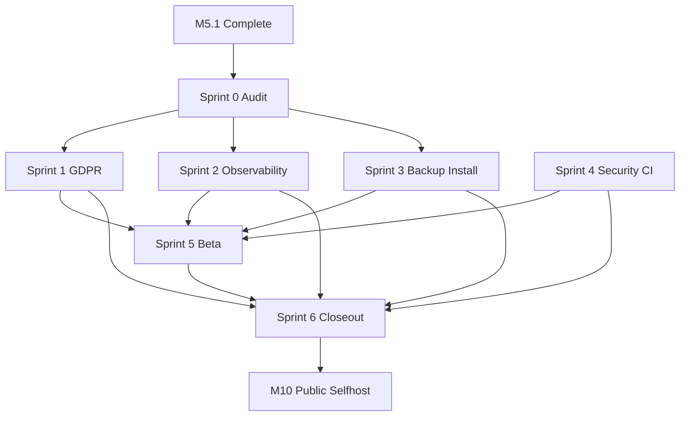

# M9 Sprint Plan — Beta Hardening

Last updated: 2026-07-11

Companion to [`DESIGN_DOCUMENT.md`](DESIGN_DOCUMENT.md) § M9 and
[`M5_1_SPRINT_STATUS.md`](M5_1_SPRINT_STATUS.md). Tracks formal closeout of
Beta-Härtung between M5.1 (UX polish, complete) and M10 (Public Selfhost v1.0).

**Tracking:** [`M9_SPRINT_STATUS.md`](M9_SPRINT_STATUS.md) — audit matrix and
per-sprint progress.

M9 is **not a feature milestone**. It hardens ops, privacy paths, backup/restore,
and external testability. M8 (Sleep / Health Connect) may run in parallel but is
not a blocker for M9.

## Overview

| Sprint | Title                       | Issues (GitHub) | Exit criterion                                              |
| ------ | --------------------------- | --------------- | ----------------------------------------------------------- |
| 0      | Scope & audit               | #29             | Issue matrix complete; tracking docs in place                 |
| 1      | GDPR self-service           | #29 (partial)   | PRIVACY.md + in-app link; delete/export E2E; Art. 18 doc    |
| 2      | Observability               | #29 (partial)   | Selfhosted GlitchTip active; PII-free events; incident RB   |
| 3      | Backup & install            | —               | restic/LUKS docs; restore test; consolidated Install-Guide  |
| 4      | Security & CI               | —               | Audit CI gates; style-contract lint; pentest complete       |
| 5      | Beta program                | —               | 5–10 testers onboarded; feedback triaged                    |
| 6      | Milestone closeout (M9-C)   | #29             | Quality gate, visual QA, README/CHANGELOG, GitHub hygiene   |

## API usage minimization (binding)

M9 must not introduce new external API dependencies. This applies to the product
and to how sprints are executed.

### Product architecture

| Rule | Rationale |
| ---- | --------- |
| No cloud LLM, no Ollama (#148), no weekly digest (#147) | Deferred to M7-S8; see [`quality/M7_QUALITY_GATE.md`](quality/M7_QUALITY_GATE.md) |
| GlitchTip selfhosted only (Compose profile `monitoring`) | DSGVO checkpoint; optional DSN — app runs with zero error-reporting traffic when unset |
| No third-party analytics or feedback SaaS | Beta feedback via email / structured GitHub issues |
| No new REST endpoints unless audit proves a gap | Delete, export, preferences already ship in [`backend/app/api/v1/endpoints/user.py`](backend/app/api/v1/endpoints/user.py) |
| Heavy analytics stay in nightly worker | [`backend/app/workers/analytics.py`](backend/app/workers/analytics.py); respect `analytics_enabled` |
| Notes-in-analysis M9: config threshold review only | Per-entry opt-out API deferred to M10 |
| Full DSFA → M12 | M9 documents selfhost-only scope note |

### Implementation workflow

- **Audit-first:** verify existing code before writing new features (Sprint 0 matrix).
- **Local verification:** `docker compose` + `pytest` / `vitest` / Playwright — no manual API probing loops.
- **One PR per sprint theme** to limit CI and staging churn.
- **Documentation batched** under `docs/selfhost/` instead of scattered infra README edits.

## Out of scope / deferred

| Item                              | Target  | API-minimization reason              |
| --------------------------------- | ------- | ------------------------------------ |
| Ollama / weekly digest (#147–#148)| M7-S8   | LLM / push infra                     |
| M8 Sleep / Health Connect (#31)   | M8      | Wearable API integration             |
| Slug HMAC (#62)                   | M9+     | Crypto refactor, not beta blocker    |
| Per-entry notes opt-out API       | M10     | New API surface                      |
| DSFA (full)                       | M12     | Cloud SaaS launch                    |
| CRDT conflict-resolution UI       | M9+     | Sync API extension                   |
| Uptime Kuma / Loki / Prometheus   | post-M9 | No `/metrics` by design (ADR-0007)   |

## Dependency graph



| Dependency    | Reason                                                        |
| ------------- | ------------------------------------------------------------- |
| M5.1 → M9     | Beta testers after UX flows signed off                        |
| Sprint 1 → 5  | Privacy policy before external testers                        |
| Sprint 2+3 → 5| Monitoring + backup docs before tester onboarding             |
| Sprint 4 → 5  | Pentest before public beta                                    |
| M9 → M10      | Exit = stable enough for public selfhost release              |

## Sprint 0 — Scope & audit

**Goal:** Formal tracking and gap matrix. No feature code.

- Create [`M9_SPRINT_STATUS.md`](M9_SPRINT_STATUS.md) with acceptance-criteria audit.
- Map GitHub [#29](https://github.com/Sturmi77/correlcore/issues/29) to sprint slices.
- Record baseline verification commands (see Closeout below).
- Cross-link README, DESIGN_DOCUMENT, MOBILE_WEB_IMPLEMENTATION_PLAN.

## Sprint 1 — GDPR & privacy self-service

**Goal:** Close legal and user-facing privacy paths without new APIs.

**Deliverables:**

- `docs/PRIVACY.md` + in-app link from Settings privacy section
- Playwright E2E: account deletion dialog → `DELETE /user/me` → session cleared
- Playwright E2E: ZIP export download via `GET /user/export`
- Art. 18 (restriction): documented support workflow in [`DSGVO.md`](DSGVO.md) — no new endpoint
- DSGVO M3 checkpoint: `analytics_enabled` opt-out verified end-to-end

**Key files:** [`apps/web/src/routes/settings/+page.svelte`](../apps/web/src/routes/settings/+page.svelte),
[`backend/app/api/v1/endpoints/user.py`](../backend/app/api/v1/endpoints/user.py),
[`backend/tests/test_user_endpoints.py`](../backend/tests/test_user_endpoints.py),
[`backend/tests/test_export_service.py`](../backend/tests/test_export_service.py)

**Tests:** new `apps/web/tests/e2e/gdpr-self-service.spec.ts`; extend backend export endpoint test if missing

## Sprint 2 — Observability (selfhosted)

**Goal:** Activate error tracking — GlitchTip only, PII-free.

**Deliverables:**

- Optional `sentry-sdk` integration (FastAPI + SvelteKit) with `before_send` PII scrub
- Env `GLITCHTIP_DSN` optional — zero outbound traffic when unset
- GlitchTip healthcheck in Compose ([`infra/docker/docker-compose.yml`](../infra/docker/docker-compose.yml))
- `docs/runbooks/incident-response.md` (DSGVO §8, 72h process)
- Staging test: triggered 500 → GlitchTip event contains no mood/notes/email

**Key files:** [`backend/app/main.py`](../backend/app/main.py),
[`docs/adr/0007-healthchecks-and-logging.md`](adr/0007-healthchecks-and-logging.md),
[`backend/tests/test_log_scrubbing.py`](../backend/tests/test_log_scrubbing.py)

## Sprint 3 — Backup, restore & install guide

**Goal:** Document selfhost operations; one local restore cycle.

**Deliverables:**

- `docs/selfhost/INSTALL.md` — Docker Compose, Traefik, DNS, secrets (consolidate
  [`infra/dockhand/README.md`](../infra/dockhand/README.md), [`RUNBOOK_DEPLOYMENT.md`](RUNBOOK_DEPLOYMENT.md))
- Backup section: `pg_dump` + restic ([`adr/0005-verschluesselung-at-rest.md`](adr/0005-verschluesselung-at-rest.md))
- LUKS volume note for VPS deployments
- `docs/quality/M9_BACKUP_RESTORE_TEST.md` — protocol + result
- User-manual pointer: [`frontend/USER_WORKFLOWS.md`](frontend/USER_WORKFLOWS.md) + beta checklist

## Sprint 4 — Security hardening & CI

**Goal:** Close M4 release-readiness security backlog — CI/local only.

**Deliverables:**

- CI job: `pip-audit` (backend) + `pnpm audit --audit-level=high` (web)
- Style-contract lint for design tokens ([`frontend/UI_COMPONENT_SYSTEM.md`](frontend/UI_COMPONENT_SYSTEM.md) §9)
- External penetration test against staging; results in `docs/quality/M9_PENTEST.md`
- AV-Vertrag template (Hetzner) as static Markdown

**Reference:** [`quality/M4_RELEASE_READINESS.md`](quality/M4_RELEASE_READINESS.md) P1/P2 items

## Sprint 5 — Beta program & feedback

**Goal:** 5–10 external testers without third-party analytics.

**Deliverables:**

- Beta onboarding doc: instance URL, test accounts, feedback template (GitHub issue / email)
- Symptom analytics usability review ([`features/symptom-analytics.md`](features/symptom-analytics.md) §M9)
- Notes-in-analysis: worker threshold review (`ANALYTICS_MIN_TAG_USAGES` etc.) — no per-entry API
- Feedback triage: P0/P1 → M9 fix; remainder → M10 / M9+

## Sprint 6 — Milestone closeout (M9-C)

**Deliverables:**

- [`quality/M9_QUALITY_GATE.md`](quality/M9_QUALITY_GATE.md)
- [`quality/M9_VISUAL_QA.md`](quality/M9_VISUAL_QA.md) — Settings privacy, install flows
- Update `README.md`, `CHANGELOG.md`, `DESIGN_DOCUMENT.md` exit checkboxes
- Close GitHub #29; `milestone:M9` hygiene

**Quality gate:**

```bash
pnpm lint && pnpm typecheck && pnpm test && pnpm build
pnpm check:style-contract
cd backend && uv run --python 3.12 ruff check . && uv run --python 3.12 pytest
cd backend && uv run --python 3.12 pip-audit --skip-editable --ignore-vuln PYSEC-2026-1325
pnpm audit --prod --audit-level=high
pnpm --filter @correlcore/web test:e2e:smoke
pnpm --filter @correlcore/web test:e2e:gdpr --workers=1
```

## Success metrics

| Metric                         | Target                                      |
| ------------------------------ | ------------------------------------------- |
| GDPR self-service E2E          | Delete + ZIP export + privacy link: 100% pass |
| GlitchTip PII leak (staging)   | 0 events with mood/notes/email              |
| Restore test                   | 1 documented successful backup→restore cycle |
| Beta testers                   | 5–10 active; ≥1 feedback round complete     |
| Pentest                        | 0 open Critical/High at M9 exit             |
| New external API integrations  | 0                                           |
| New REST endpoints             | 0 (unless audit documents a gap)            |

## References

- [`DESIGN_DOCUMENT.md`](DESIGN_DOCUMENT.md) — M9 acceptance criteria
- [`DSGVO.md`](DSGVO.md) — milestone checkpoints
- [`CLOSEOUT_SPRINT_PLAN.md`](CLOSEOUT_SPRINT_PLAN.md) — deferred-work index (#29)
- [`M5_1_UX_POLISH_PLAN.md`](M5_1_UX_POLISH_PLAN.md) — pre-M9 gate
- [`adr/0007-healthchecks-and-logging.md`](adr/0007-healthchecks-and-logging.md)
- [`adr/0005-verschluesselung-at-rest.md`](adr/0005-verschluesselung-at-rest.md)
- [`quality/M4_RELEASE_READINESS.md`](quality/M4_RELEASE_READINESS.md)
