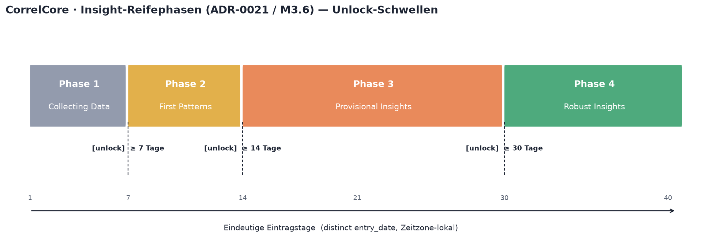
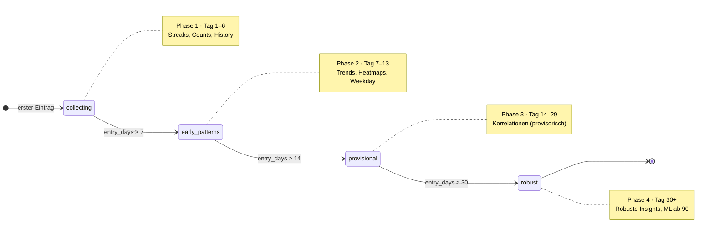
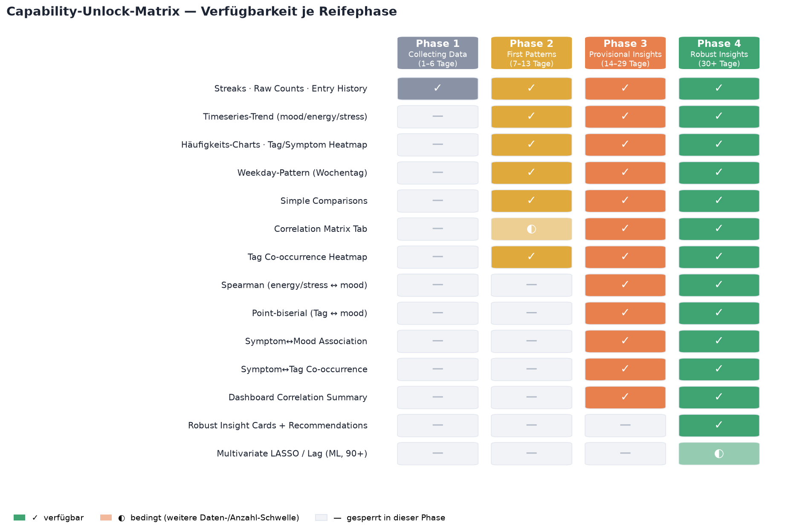
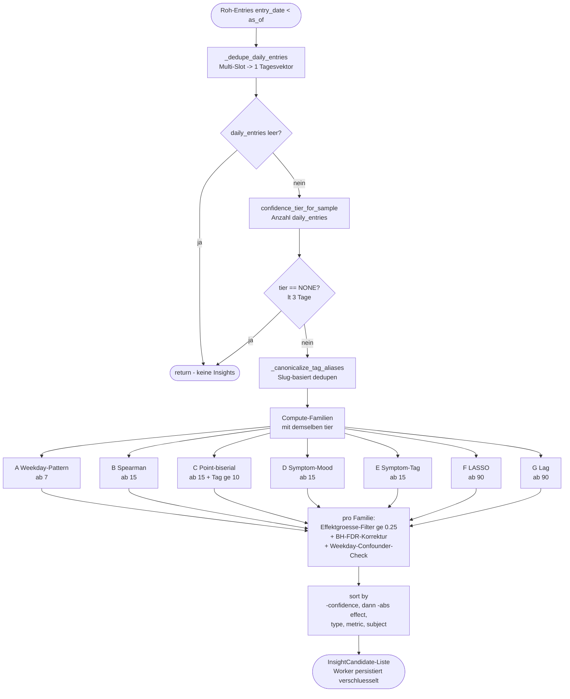
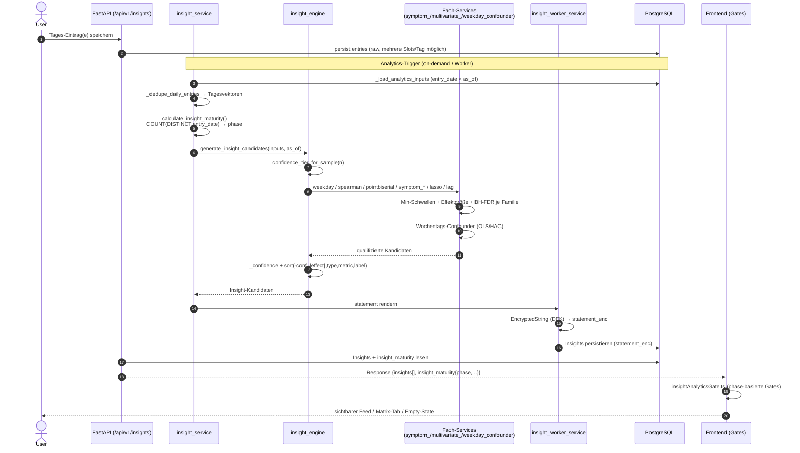
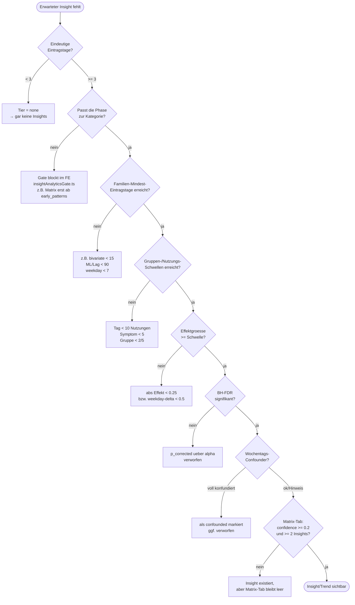

# Phasen- & Insight-Referenz (Entwickler-Doku)

> **Status:** Draft · **Bezug:** [ADR-0021](adr/0021-insight-maturity-phases.md), [INSIGHT_MATURITY.md](frontend/INSIGHT_MATURITY.md), Milestone **M3.6** · **Zielgruppe:** Entwickler:innen (nicht Endnutzer)
>
> Diese Datei ist die **entwicklerseitige Single Source of Truth** dafür, welche Reifephasen es gibt,
> **wodurch** eine Phase freigeschaltet wird, welche **Insights / Trend-Visualisierungen** je Phase verfügbar sind
> und **wie** jeder Insight berechnet wird (Methode, Eingangsdaten, Schwellenwerte, erwartete Aussage).
>
> Wo Werte direkt aus dem Code stammen, ist die Quelle in Backticks referenziert (Datei + Konstante),
> damit die Doku bei Code-Änderungen gezielt nachgeführt werden kann. Stabile Vertragswerte
> (Phase-Keys, `insight_type`-Werte, i18n-Keys, Feldnamen) bleiben in Original-Schreibweise.

---

## 0. Wie dieses Dokument zu lesen ist

Es gibt in CorrelCore **zwei getrennte, aber gekoppelte Stufensysteme**. Das ist die häufigste Verwechslungsquelle:

| System | Zweck | Wertebereich | Quelle |
| --- | --- | --- | --- |
| **Insight Maturity Phase** (ADR-0021) | **Freischalt-/UX-Gating** — was der User in der App überhaupt zu sehen bekommt | `collecting` / `early_patterns` / `provisional` / `robust` (Phase 1–4) | `backend/app/services/insight_service.py` → `calculate_insight_maturity()` |
| **Insight Tier** (Confidence-Ladder) | **statistische Verlässlichkeit** eines konkret berechneten Insights | `none` / `early` / `preliminary` / `developing` / `robust` | `backend/app/services/insight_engine.py` → `confidence_tier_for_sample()` |

- Die **Phase** entscheidet, ob eine Insight-/Trend-Kategorie im Frontend **sichtbar/aktiv** ist (Gate).
- Der **Tier** und die **methodenspezifischen statistischen Schwellen** entscheiden, ob ein einzelner Insight
  überhaupt **erzeugt** wird und mit welchem Confidence-Label er erscheint.
- Beide basieren auf derselben Grundgröße: **eindeutige Eintragstage** (`COUNT(DISTINCT entry_date)` pro User),
  nicht auf der Anzahl der Roh-Einträge (Multi-Slot pro Tag wird per `_dedupe_daily_entries()` zu einem Tagesvektor kollabiert).

> ⚠️ **Wichtige Schwellen-Divergenz:** Die Phasengrenzen (7 / 14 / 30) sind **nicht identisch** mit den
> Tier-Grenzen der Analytics-Engine (3 / 8 / 15 / 30). Deshalb ist z.B. in Phase 3 (`provisional`, ab Tag 14)
> die bivariate Analyse (Spearman/Point-biserial) technisch erst ab **15** Tagen aktiv (`MIN_BIVARIATE_ENTRIES = 15`).
> Diese Divergenz ist gewollt (siehe [§5](#5-bekannte-schwellen-divergenzen--gotchas)), muss aber bei jeder
> Erweiterung mitgedacht werden.

### Inhalt

1. [Überblick — Phasen & Unlock-Schwellen](#1-überblick--phasen--unlock-schwellen)
2. [Capability-Unlock-Matrix](#2-capability-unlock-matrix)
3. [Phasendetails — was der User pro Phase sieht](#3-phasendetails--was-der-user-pro-phase-sieht)
4. [Insight-Katalog — Berechnung, Eingaben, erwartete Aussage](#4-insight-katalog--berechnung-eingaben-erwartete-aussage)
5. [Bekannte Schwellen-Divergenzen & Gotchas](#5-bekannte-schwellen-divergenzen--gotchas)
6. [Erweiterbarkeit — geplante & künftige Dimensionen](#6-erweiterbarkeit--geplante--künftige-dimensionen)
7. [End-to-End-Datenfluss (Sequenz)](#7-end-to-end-datenfluss-sequenz)
8. [Debug-Entscheidungsbaum „Warum sehe ich (k)einen Insight?“](#8-debug-entscheidungsbaum-warum-sehe-ich-keinen-insight)
9. [Konstanten-Schnellreferenz](#9-konstanten-schnellreferenz)
10. [Insight-Objekt — Feldreferenz & Beispiel-Payload](#10-insight-objekt--feldreferenz--beispiel-payload)
11. [Glossar](#11-glossar)
12. [Quellen (Repo-intern)](#12-quellen-repo-intern)
13. [Wartung & Änderungshistorie](#13-wartung--änderungshistorie)

---

## 1. Überblick — Phasen & Unlock-Schwellen



| Phase | Key | Eintragstage | UI-Label | Badge-Farbe (Token) | Icon | Nächste Schwelle |
| --- | --- | --- | --- | --- | --- | --- |
| 1 | `collecting` | **1–6** | Collecting Data | `--color-text-muted` | `loader-circle` | 7 → First Patterns |
| 2 | `early_patterns` | **7–13** | First Patterns | `--color-gold` | `sparkles` | 14 → Provisional Insights |
| 3 | `provisional` | **14–29** | Provisional Insights | `--color-warning` | `flask-conical` | 30 → Robust Insights |
| 4 | `robust` | **30+** | Robust Insights | `--color-success` | `shield-check` | — (Endzustand) |

**Freischaltbedingung (formal):** Der User erreicht Phase _n_, sobald die Anzahl **eindeutiger Eintragstage**
den unteren Schwellenwert erreicht. Es gibt kein Zurückfallen im UI-Contract (die Phase leitet sich rein aus
dem aktuellen Count ab; ein sinkender Count wäre nur durch Löschungen möglich).



> Jeder Übergang löst genau **eine** Milestone-Card aus (i18n `maturity.milestone.*`), die nach Dismiss über
> `reached_milestone_keys[]` persistiert wird (`insightMaturityMilestones.ts` → `shouldShowMaturityMilestone`).

### API-Vertrag (in **jeder** `/api/v1/insights/*`-Response verpflichtend)

Quelle: `backend/app/schemas/insight.py` → `InsightMaturity`, erzeugt in `calculate_insight_maturity(entry_count)`.

```json
{
  "insight_maturity": {
    "phase": "early_patterns",
    "phase_index": 2,
    "current_entries": 9,
    "next_phase_at": 14,
    "next_phase_label": "Provisional Insights",
    "entries_until_next": 5,
    "user_message_key": "maturity.early_patterns.description"
  }
}
```

- Das Frontend **berechnet die Phase nie selbst**, sondern liest sie aus diesem Objekt (ADR-0021, M3.6-Akzeptanzkriterium).
- In Phase 4 (`robust`) sind `next_phase_at`, `next_phase_label`, `entries_until_next` = `null`.
- `user_message_key` verweist auf i18n; das Backend erzeugt **nie** direkt user-sichtbaren Text.

---

## 2. Capability-Unlock-Matrix

Welche Insight-Familien und Trend-Visualisierungen sind je Phase sichtbar/aktiv?
`✓` = verfügbar · `◐` = bedingt (zusätzliche Anzahl-/Datenschwelle) · `—` = in dieser Phase gesperrt.



| Capability | P1 `collecting` | P2 `early_patterns` | P3 `provisional` | P4 `robust` | Frontend-Gate (Quelle) |
| --- | :---: | :---: | :---: | :---: | --- |
| Streaks · Raw Counts · Entry History | ✓ | ✓ | ✓ | ✓ | immer (keine Korrelation) |
| Timeseries-Trend (mood/energy/stress) | — | ✓ | ✓ | ✓ | `canShowAdvancedAnalytics(phase)` ≠ `collecting` |
| Häufigkeits-Charts · Tag/Symptom Heatmap | — | ✓ | ✓ | ✓ | `canShowAdvancedAnalytics()` |
| Weekday-Pattern (Wochentag) | — | ✓ | ✓ | ✓ | Engine ab `MIN_WEEKDAY_ENTRIES = 7` |
| Simple Comparisons | — | ✓ | ✓ | ✓ | `canShowAdvancedAnalytics()` |
| Correlation Matrix Tab | — | ◐ | ✓ | ✓ | `canShowMatrixTab()` + `≥ 2` Matrix-Insights |
| Tag Co-occurrence Heatmap | — | ✓ | ✓ | ✓ | `canShowTagCooccurrence()` (early+) |
| Spearman (energy/stress ↔ mood) | — | — | ✓ | ✓ | Engine ab `MIN_BIVARIATE_ENTRIES = 15` |
| Point-biserial (Tag ↔ mood) | — | — | ✓ | ✓ | Engine ab `15` + `ANALYTICS_MIN_TAG_USAGES = 10` |
| Symptom ↔ Mood Association | — | — | ✓ | ✓ | Engine ab `MIN_SYMPTOM_ANALYTICS_ENTRIES = 15` |
| Symptom ↔ Tag Co-occurrence | — | — | ✓ | ✓ | `canShowSymptomCooccurrence()` (provisional+) |
| Dashboard Correlation Summary | — | — | ✓ | ✓ | rendert Korrelationen erst ab `provisional` |
| Robust Insight Cards + Recommendations | — | — | — | ✓ | Tier `robust` ab `ROBUST_ENTRY_COUNT = 30` |
| Multivariate LASSO / Lag (ML) | — | — | — | ◐ | Engine ab `MIN_ML_ENTRIES = 90` |

**Frontend-Gate-Funktionen** (`apps/web/src/lib/utils/insightAnalyticsGate.ts`):

```ts
canShowAdvancedAnalytics(phase)  // phase !== null && phase !== 'collecting'
canShowMatrixTab(phase, insights) // early_patterns+ UND countMatrixInsights(insights) >= 2
canShowTagCooccurrence(phase)     // early_patterns | provisional | robust
canShowSymptomCooccurrence(phase) // provisional | robust
```

`isMatrixInsight()` (`insightMatrixGate.ts`): zählt nur `pointbiserial` / `symptom_mood_association`
mit `effect_size !== null` **und** `confidence >= 0.2`. `MATRIX_TAB_MIN_INSIGHTS = 2`.

> Merke: In Phase 2 ist der Matrix-Tab per Phase-Gate erlaubt (`◐`), aber es existieren praktisch noch keine
> qualifizierenden Insights, weil deren Engine-Schwelle erst bei 15 Tagen greift → Tab bleibt de facto leer,
> bis Phase 3 erreicht ist.

---

## 3. Phasendetails — was der User pro Phase sieht

### Phase 1 — `collecting` (Tag 1–6)

- **Verfügbar:** Streaks, Roh-Counts, Eintragshistorie. **Keine** Korrelationsinhalte, **keine** Trend-Analytics.
- **Empty/Locked-States:** phase-aware, erklären _warum_ (nicht generischer Lock). i18n: `maturity.collecting.*`.
- **Tonalität:** ermutigend („We're building your foundation.") — nie „No data yet".
- **Dev-Fixture:** `phaseFixtures.ts` → 3 Einträge, Insight-Feed leer, Analytics gesperrt.

### Phase 2 — `early_patterns` (Tag 7–13)

- **Neu freigeschaltet:** Timeseries-Trend, Häufigkeits-Charts, Tag-Heatmap, **Weekday-Pattern**, einfache Vergleiche, Tag-Co-occurrence.
- **Bewusst noch gesperrt:** bivariate Korrelationen (Spearman/Point-biserial), Symptom-Analytics, Dashboard-Correlation-Summary.
- **Badge-Beispiel:** „First hint · 7 entries" + Warn-Icon; Tooltip „Based on limited data — patterns may change."
- **Milestone-Card (einmalig):** „🔍 New: First Patterns unlocked!" (i18n: `maturity.milestone.collecting_to_early_patterns`).
- **Dev-Fixture:** 9 Einträge.

### Phase 3 — `provisional` (Tag 14–29)

- **Neu freigeschaltet:** volle bivariate Korrelationen (Spearman, Point-biserial), Symptom↔Mood, Symptom↔Tag-Co-occurrence, Dashboard-Correlation-Summary.
- **Pflicht-UX:** Uncertainty-Ribbon an allen Korrelations-Charts; Badge „Provisional · N entries"; Copy „Early correlation — more data will clarify this."
- **Dev-Fixture:** 21 Einträge.

### Phase 4 — `robust` (Tag 30+)

- **Neu freigeschaltet:** vollwertige Robust-Insight-Cards mit Recommendations; Confidence-Tier `robust`.
- **Bedingt (`◐`):** Multivariate ML (LASSO / Lag) erst ab **90** Eintragstagen — de-facto Sub-Gate innerhalb von Phase 4.
- **UX:** Abschluss-Zustand im Journey-Banner (einmalige Celebration-Animation); Copy „Your data shows a consistent pattern."
- **Dev-Fixture:** 42 Einträge (deckt ML nicht ab; für LASSO/Lag manuell ≥ 90 Tage nötig).

---

## 4. Insight-Katalog — Berechnung, Eingaben, erwartete Aussage

Alle Werte aus `backend/app/services/insight_engine.py`, `multivariate_analytics.py`, `symptom_analytics.py`,
`weekday_confounder.py`. Persistiertes Schema: `backend/app/models/insight.py` (`Insight`).

### 4.0.1 Engine-Pipeline (`generate_insight_candidates`)

Ablauf pro Worker-Lauf, exakt in Code-Reihenfolge (`insight_engine.py`):



- Der **Tier ist pro Lauf global** (aus der Tagesanzahl), wird aber von jeder Familie nochmals durch ihre
  **eigene** Mindestschwelle gefiltert — deshalb die „ab N"-Annotationen an den Zweigen.
- Persistenz: der Worker (`insight_worker_service.py`) bindet den DEK des Users und schreibt `statement_enc` verschlüsselt (`Insight.statement_enc`).

### 4.0 Gemeinsame Konzepte

- **Grundeinheit:** deduplizierte **Tagesvektoren** (`mood_score`, `energy`, `stress` ∈ 1–5; Tag-/Symptom-Mengen).
  `stress` wird nur in der View invertiert (`display_metric_value`), **roh** in der DB & Berechnung.
- **Temporale Integrität:** Analytics nutzt ausschließlich `entry_date < as_of` (`_load_analytics_inputs`) —
  kein Look-ahead-Bias durch `created_at`/`updated_at` bei nachgetragenen Einträgen.
- **Multiple-Testing-Korrektur:** Benjamini-Hochberg FDR pro Insight-Familie (`_fdr_results`, `FDR_ALPHA = 0.05`;
  Symptom/ML nutzen `α = 0.10`). Nicht-signifikante Kandidaten werden verworfen.
- **Mindest-Effektgröße:** `MIN_ABS_EFFECT_SIZE = 0.25` (bivariate), analog in Symptom-/Lag-Analyse.
- **Confidence-Score** (`_confidence`): `tier_weight · effect_weight · p_weight`, gerundet auf 2 Nachkommastellen,
  wobei `tier_weight` = {early 0.35, preliminary 0.55, developing 0.75, robust 0.95},
  `effect_weight = min(1, |effect|/0.8)`, `p_weight = 1 − p_corrected` (bzw. 0.65 falls kein p-Wert).
  **Wird dem User nie als Zahl gezeigt** (nur als Maturity-Badge, ADR-0018 abgelöst durch ADR-0021).
- **Confounder-Check (Wochentag):** OLS mit Newey-West/HAC-Standardfehlern (`weekday_confounder.py`),
  Mo–Sa-Dummies, Sonntag = Referenz, `MIN_OLS_ROWS = 10`, `α = 0.10`. Ist eine Assoziation nach Wochentags-
  Adjustierung nicht mehr signifikant, wird der Insight mit Hinweis versehen
  („Note: this pattern occurs primarily on specific weekdays.") bzw. bei Co-occurrence als confounded markiert.
- **Sprach-Prinzip:** nie kausal/medizinisch. Immer „pattern / association / co-occurrence, not a cause/diagnosis".

### 4.1 Confidence-Tier-Ladder (interne Verlässlichkeit)

`confidence_tier_for_sample(sample_n)` in `insight_engine.py`:

| Tier | Schwelle (Eintragstage) | Konstante |
| --- | --- | --- |
| `none` | < 3 → keine Insights | — |
| `early` | ≥ 3 | `EARLY_ENTRY_COUNT = 3` |
| `preliminary` | ≥ 8 | `PRELIMINARY_ENTRY_COUNT = 8` |
| `developing` | ≥ 15 | `DEVELOPING_ENTRY_COUNT = 15` |
| `robust` | ≥ 30 | `ROBUST_ENTRY_COUNT = 30` |

Der Tier wird beim Generieren allen an diesem Tag berechneten Kandidaten zugewiesen (`generate_insight_candidates`).

### 4.2 Insight-Familien im Detail

Legende: **Methode** · **Eingangsdaten** · **Min-Schwellen** · **Effektgröße** · **erwartete Aussage** · **`insight_type`**.

---

#### A) Weekday-Pattern — `weekday_pattern`

- **Methode:** Delta des mittleren `mood_score` je Wochentag gegen den Gesamtmittelwert; ausgewählt wird der Wochentag mit größter absoluter Abweichung. (`_weekday_candidates`)
- **Eingangsdaten:** alle Tagesvektoren, gruppiert nach `entry_date.weekday()`.
- **Min-Schwellen:** `MIN_WEEKDAY_ENTRIES = 7`; ausgelöst, wenn `|delta| ≥ MIN_WEEKDAY_DELTA = 0.5`.
- **Effektgröße:** `delta` (Wochentag-Mittel − Gesamtmittel). Kein p-Wert (Flag `method="weekday_delta"`).
- **Payload:** `weekday_mood_avgs`, `weekday_entry_counts`, `overall_mood_avg`, `early_pattern` (bool bei < 15 Tagen).
- **Erwartete Aussage:** „Mondays currently line up with higher/lower mood than your overall average. This is an early calendar pattern, not a diagnosis."
- **Erste Phase mit Sichtbarkeit:** **Phase 2** (`early_patterns`).

#### B) Spearman-Rangkorrelation (Metrik ↔ Metrik) — `spearman`

- **Methode:** `scipy.stats.spearmanr` für die Paare `(energy, mood_score)` und `(stress, mood_score)`; anschließend BH-FDR.
- **Eingangsdaten:** Tagesvektoren; benötigt ≥ 2 verschiedene Werte je Metrik.
- **Min-Schwellen:** `MIN_BIVARIATE_ENTRIES = 15`; `|rho| ≥ 0.25`; signifikant nach FDR (`α = 0.05`).
- **Effektgröße:** `rho`. Payload: `left_metric`, `right_metric`, `rho`, `p_corrected`.
- **Erwartete Aussage:** „In your entries so far, energy tends to be higher/lower when mood is higher. This is a data pattern, not a diagnosis."
- **Erste Phase mit Sichtbarkeit:** **Phase 3** (`provisional`) — obwohl Phase 3 ab Tag 14 beginnt, greift die Engine erst ab 15.

#### C) Point-biserial (Tag ↔ Mood) — `pointbiserial`

- **Methode:** `scipy.stats.pointbiserialr` zwischen Tag-Präsenz (binär) und `mood_score`; BH-FDR + Wochentags-Confounder-Check.
- **Eingangsdaten:** Tagesvektoren + Tag-Zuordnungen (aktive Tags, Alias-kanonisiert via Slug).
- **Min-Schwellen:** `MIN_BIVARIATE_ENTRIES = 15`; getaggte Tage ≥ `ANALYTICS_MIN_TAG_USAGES = 10`; ungetaggte Tage ≥ `MIN_TAG_GROUP_SIZE = 2`; `|coef| ≥ 0.25`.
- **Effektgröße:** `coefficient`. Payload: `tagged_count`, `untagged_count`, `tagged_mood_avg`, `untagged_mood_avg`, `p_corrected`; Flag `weekday_confounded`.
- **Erwartete Aussage:** „Days tagged Walk currently line up with higher mood scores in your data. Treat this as a pattern to reflect on, not a cause." (+ ggf. Wochentags-Hinweis)
- **Erste Phase mit Sichtbarkeit:** **Phase 3**. Speist zusammen mit (D) die **Correlation-Matrix** (ab 2 qualifizierenden Insights mit `confidence ≥ 0.2`).

#### D) Symptom ↔ Mood/Energy/Stress-Association — `symptom_mood_association`

- **Methode:** Point-biserial Symptom-Präsenz ↔ Metrik (`compute_symptom_metric_associations`); BH-FDR (`α = 0.10`) + Wochentags-Confounder.
- **Eingangsdaten:** Tagesvektoren + Symptom-Zuordnungen (`intensity > 0`).
- **Min-Schwellen:** `MIN_SYMPTOM_ANALYTICS_ENTRIES = 15`; Symptom-Tage ≥ `MIN_SYMPTOM_USAGES = 5` (und Vergleichsgruppe ≥ 5); `|coef| ≥ 0.25`.
- **Effektgröße:** `coefficient`. Payload u.a. `symptom_metric_avg`, `comparison_metric_avg`, `symptom_n`, `comparison_n`, `confounder`.
- **Erwartete Aussage:** „Days with Headache currently line up with lower energy in your data. Treat this as an association, not a cause."
- **Erste Phase mit Sichtbarkeit:** **Phase 3**.

#### E) Symptom ↔ Tag Co-occurrence — `symptom_tag_cooccurrence`

- **Methode:** Kontingenz (Fisher/Lift) mit `phi`, `jaccard`, `lift`; BH-FDR (`α = 0.10`) + Wochentags-Confounder für Paare (`is_pair_cooccurrence_weekday_confounded`).
- **Eingangsdaten:** Symptom- und Tag-Präsenz pro Tag.
- **Min-Schwellen:** `MIN_SYMPTOM_ANALYTICS_ENTRIES = 15`; Symptom ≥ 5 & Tag ≥ 5 Nutzungen; Karten-Schwelle `MIN_CARD_LIFT_DELTA = 0.67`, Heatmap `MIN_HEATMAP_LIFT_DELTA = 0.50`.
- **Effektgröße:** `phi` (fällt auf `lift − 1` zurück, falls `phi == 0`). Payload: `phi`, `jaccard`, `lift`, `co_count`, Einzel-Counts.
- **Erwartete Aussage:** „Headache currently appears together with Coffee more than expected from their individual frequencies. This is a co-occurrence pattern, not a cause."
- **Erste Phase mit Sichtbarkeit:** **Phase 3** (Frontend-Gate `canShowSymptomCooccurrence` = provisional+).

#### F) Multivariate LASSO — `symptom_cluster` (payload `method="lasso"`)

- **Methode:** LASSO-Regression über Design-Matrix aller Signale; TimeSeriesSplit-CV (`TIMESERIES_SPLITS = 5`). (`run_lasso_models`)
- **Eingangsdaten:** Tagesvektoren + Tags + Symptome (binäre Features ab `MIN_BINARY_FEATURE_USAGES = 5`).
- **Min-Schwellen:** `MIN_ML_ENTRIES = 90`; `|coef| ≥ MIN_ABS_LASSO_COEFFICIENT = 0.05`.
- **Effektgröße:** größter absoluter Koeffizient. Payload: Top-Features + Koeffizienten, `alpha`, `cv_score`.
- **Erwartete Aussage:** „Across your tracked signals, mood currently varies most with Walk, Coffee, Sleep. This is a multivariate pattern, not a cause."
- **Erste Phase mit Sichtbarkeit:** **Phase 4**, aber erst ab **90** Eintragstagen (`◐`).

#### G) Lag-Analyse (zeitversetzt) — `symptom_cluster` (payload `method="lag"`)

- **Methode:** Kreuzkorrelation Feature(t−k) ↔ Target(t) über Lags 1..`MAX_LAG_DAYS = 7`; BH-FDR (`LAG_FDR_ALPHA = 0.10`). (`run_lag_analysis`)
- **Eingangsdaten:** wie (F); benötigt `MIN_LAG_OBSERVATIONS = 10` je Lag-Paar.
- **Min-Schwellen:** `MIN_ML_ENTRIES = 90`; `|correlation| ≥ MIN_ABS_LAG_CORRELATION = 0.25`.
- **Effektgröße:** `correlation`. Payload: `lag_days`, `feature`, `target`, `p_value_corrected`.
- **Erwartete Aussage:** „Poor sleep logged 1 day(s) earlier currently lines up with lower mood. Treat this as a time-shifted pattern, not a cause."
- **Erste Phase mit Sichtbarkeit:** **Phase 4** (≥ 90 Tage).

### 4.3 Worked Examples — durchgerechnet je Familie

Jeweils ein **erfundenes, aber realistisches** Zahlenbeispiel: von den Eingangsdaten über Schwellen-Check,
Effektgröße und FDR bis zum gerenderten Statement. Zweck: Bei einem unklaren Insight nachvollziehen können,
**warum** er (nicht) erzeugt wurde. Zahlen sind illustrativ, nicht aus echten Läufen.

> Notation: `n` = Eintragstage im Fenster; „✅/❌ Schwelle" = Vergleich gegen die Konstante aus §9.

#### A) `weekday_pattern` — Montags-Delta

- **Eingabe:** `n = 21`. Mittelwerte `mood_score` je Wochentag: Mo 2.6, Di 3.2, Mi 3.3, Do 3.1, Fr 3.6, Sa 3.8, So 3.4. Gesamtmittel `overall_mood_avg = 3.28`.
- **Auswahl:** größte |Abweichung| → Montag: `delta = 2.6 − 3.28 = −0.68`.
- **Schwellen:** `n = 21 ≥ MIN_WEEKDAY_ENTRIES (7)` ✅ · `|delta| = 0.68 ≥ MIN_WEEKDAY_DELTA (0.5)` ✅ · kein p-Wert (`method="weekday_delta"`).
- **`early_pattern`-Flag:** `n < 15`? Nein (`21`) → Flag `false`.
- **Ergebnis:** Insight wird erzeugt. Statement: „Mondays currently line up with lower mood than your overall average. This is an early calendar pattern, not a diagnosis."
- **Gegenprobe (kein Insight):** wäre Mo 3.0 → `delta = −0.28`, `< 0.5` ❌ → verworfen.

#### B) `spearman` — energy ↔ mood

- **Eingabe:** `n = 18` Tagesvektoren, Paare `(energy, mood_score)`, ≥ 2 verschiedene Werte je Metrik.
- **Berechnung:** `spearmanr` → `rho = 0.52`, roh `p = 0.006`. BH-FDR über die 2 bivariaten Paare → `p_corrected = 0.011`.
- **Schwellen:** `n = 18 ≥ MIN_BIVARIATE_ENTRIES (15)` ✅ · `|rho| = 0.52 ≥ 0.25` ✅ · `p_corrected = 0.011 < FDR_ALPHA (0.05)` ✅.
- **Ergebnis:** Insight erzeugt, `effect_size = 0.52`. Statement: „In your entries so far, energy tends to be higher when mood is higher. This is a data pattern, not a diagnosis."
- **Gegenprobe:** bei `n = 14` würde die Familie gar nicht laufen (Phase 3 ab Tag 14, Engine aber erst ab 15 → §5-Gotcha).

#### C) `pointbiserial` — Tag „Walk" ↔ mood

- **Eingabe:** `n = 21`. Tag „Walk": 12 getaggte Tage (`tagged_mood_avg = 3.9`), 9 ungetaggte (`untagged_mood_avg = 3.1`).
- **Berechnung:** `pointbiserialr(tag_presence, mood)` → `coefficient = 0.41`, `p_corrected = 0.021` (BH-FDR über alle Tag-Paare).
- **Schwellen:** `n = 21 ≥ 15` ✅ · getaggte Tage `12 ≥ ANALYTICS_MIN_TAG_USAGES (10)` ✅ · ungetaggte `9 ≥ MIN_TAG_GROUP_SIZE (2)` ✅ · `|coef| = 0.41 ≥ 0.25` ✅ · FDR ✅.
- **Confounder:** Wochentags-OLS → Tag-Effekt bleibt signifikant → `weekday_confounded = false`.
- **Ergebnis:** Insight erzeugt, `effect_size = 0.41`, `confidence ≈ 0.62 ≥ 0.2` → **qualifiziert für Matrix-Tab**. (Entspricht der Beispiel-Payload in §10.)
- **Gegenprobe:** nur 8 getaggte Tage → `8 < 10` ❌ → kein Insight (selten genutzter Tag).

#### D) `symptom_mood_association` — „Headache" ↔ energy

- **Eingabe:** `n = 20`. Symptom „Headache" an `symptom_n = 6` Tagen (`symptom_metric_avg = 2.4`), Vergleichsgruppe `comparison_n = 14` (`comparison_metric_avg = 3.3`).
- **Berechnung:** Point-biserial Symptom-Präsenz ↔ energy → `coefficient = −0.38`, `p_corrected = 0.048` (BH-FDR mit `SYMPTOM_FDR_ALPHA = 0.10`).
- **Schwellen:** `n = 20 ≥ MIN_SYMPTOM_ANALYTICS_ENTRIES (15)` ✅ · Symptom-Tage `6 ≥ MIN_SYMPTOM_USAGES (5)` ✅ · Vergleichsgruppe `14 ≥ 5` ✅ · `|coef| = 0.38 ≥ 0.25` ✅ · `0.048 < 0.10` ✅.
- **Ergebnis:** Insight erzeugt. Statement: „Days with Headache currently line up with lower energy in your data. Treat this as an association, not a cause."
- **Gegenprobe:** nur 4 Headache-Tage → `4 < 5` ❌ → verworfen.

#### E) `symptom_tag_cooccurrence` — „Headache" ↔ „Coffee"

- **Eingabe:** `n = 22`. „Headache" an 7 Tagen, „Coffee" an 9 Tagen, gemeinsam `co_count = 5`.
- **Berechnung:** Kontingenz → `lift = 1.74`, `phi = 0.44`, `jaccard = 0.45`; BH-FDR (`α = 0.10`) signifikant.
- **Schwellen:** `n = 22 ≥ 15` ✅ · Symptom `7 ≥ 5` & Tag `9 ≥ 5` ✅ · Karten-Schwelle `lift − 1 = 0.74 ≥ MIN_CARD_LIFT_DELTA (0.67)` ✅ (Heatmap-Schwelle 0.50 ebenfalls ✅) · Confounder-Check bestanden.
- **Effektgröße:** `phi = 0.44` (Fallback `lift − 1` nur falls `phi == 0`).
- **Ergebnis:** Karte **und** Heatmap-Zelle. Statement: „Headache currently appears together with Coffee more than expected from their individual frequencies. This is a co-occurrence pattern, not a cause."
- **Gegenprobe:** `lift = 1.5` → `lift − 1 = 0.5 < 0.67` ❌ als Karte (erschiene aber noch in der Heatmap, da `0.5 ≥ 0.50`).

#### F) `symptom_cluster` (`method="lasso"`) — multivariat

- **Eingabe:** `n = 96` (≥ 90). Design-Matrix aus Metriken + binären Tag-/Symptom-Features (nur Features mit `≥ MIN_BINARY_FEATURE_USAGES = 5` Nutzungen). Target `mood_score`.
- **Berechnung:** LASSO mit TimeSeriesSplit-CV (`TIMESERIES_SPLITS = 5`) → gewähltes `alpha = 0.03`, `cv_score = 0.31`. Koeffizienten: Walk `+0.22`, Coffee `−0.09`, Sleep `+0.14`, Rest `≈ 0`.
- **Schwellen:** `n = 96 ≥ MIN_ML_ENTRIES (90)` ✅ · beibehalten werden nur `|coef| ≥ MIN_ABS_LASSO_COEFFICIENT (0.05)` → Walk, Coffee, Sleep ✅ (Rest verworfen).
- **Ergebnis:** Statement: „Across your tracked signals, mood currently varies most with Walk, Sleep, Coffee. This is a multivariate pattern, not a cause." (`effect_size` = größter |coef| = 0.22).
- **Gegenprobe:** `n = 80` → `< 90` ❌ → die ganze Familie läuft nicht (auch kein Dev-Fixture deckt das ab, §9-Hinweis).

#### G) `symptom_cluster` (`method="lag"`) — zeitversetzt

- **Eingabe:** `n = 96`. Feature „poor sleep" (binär), Target `mood_score`. Lags `1..MAX_LAG_DAYS (7)`; je Lag-Paar `≥ MIN_LAG_OBSERVATIONS = 10` Beobachtungen.
- **Berechnung:** Kreuzkorrelation → Lag 1: `correlation = −0.31`, `p_value_corrected = 0.04` (BH-FDR, `LAG_FDR_ALPHA = 0.10`). Lags 2–7 unter Schwelle.
- **Schwellen:** `n ≥ 90` ✅ · Lag-1-Beobachtungen `= 41 ≥ 10` ✅ · `|correlation| = 0.31 ≥ MIN_ABS_LAG_CORRELATION (0.25)` ✅ · `0.04 < 0.10` ✅.
- **Ergebnis:** Statement: „Poor sleep logged 1 day(s) earlier currently lines up with lower mood. Treat this as a time-shifted pattern, not a cause." (`lag_days = 1`, `effect_size = −0.31`).
- **Gegenprobe:** `|correlation| = 0.2` → `< 0.25` ❌ → kein Lag-Insight.

### 4.4 Backend ↔ Frontend-Landkarte (Debug-Brücke)

Bidirektionale Zuordnung: **welche Engine-Mechanik** landet in **welcher GUI-Komponente** — und umgekehrt.
Gedacht fürs Debugging: „Diese Karte sieht falsch aus" → zuständige Backend-Funktion; bzw. „Dieser Insight-Typ
ändert sich" → betroffene Svelte-Komponenten.

#### 4.4.1 Richtung Backend → Frontend (pro `insight_type`)

| `insight_type` | Backend-Compute (§4.2) | Primäre GUI-Komponente(n) | Zusatz-/Aggregat-View | Screenshot |
| --- | --- | --- | --- | --- |
| `weekday_pattern` | `_weekday_candidates` (`insight_engine.py`) | [`InsightCard.svelte`](../apps/web/src/lib/components/insights/InsightCard.svelte) im [`InsightFeed.svelte`](../apps/web/src/lib/components/insights/InsightFeed.svelte) | Wochentag-Trend: [`MetricTimeseries.svelte`](../apps/web/src/lib/components/trends/MetricTimeseries.svelte) (Route `/trends`) | [slot](assets/phase_matrix/screenshots/) `InsightCard__early_patterns.png` |
| `spearman` | `spearmanr` + BH-FDR (`insight_engine.py`) | [`InsightCard.svelte`](../apps/web/src/lib/components/insights/InsightCard.svelte) | — | [slot](assets/phase_matrix/screenshots/) `InsightCard__provisional.png` |
| `pointbiserial` | `pointbiserialr` + Confounder (`insight_engine.py`) | [`InsightCard.svelte`](../apps/web/src/lib/components/insights/InsightCard.svelte) | **Correlation-Matrix:** [`InsightMatrix.svelte`](../apps/web/src/lib/components/insights/InsightMatrix.svelte) (`isMatrixInsight`) | [slot](assets/phase_matrix/screenshots/) `InsightMatrix__provisional.png` |
| `symptom_mood_association` | `compute_symptom_metric_associations` (`symptom_analytics.py`) | [`InsightCard.svelte`](../apps/web/src/lib/components/insights/InsightCard.svelte) (Sonderpfad Zeile ~74) | **Correlation-Matrix:** [`InsightMatrix.svelte`](../apps/web/src/lib/components/insights/InsightMatrix.svelte); [`SymptomAnalyticsSection.svelte`](../apps/web/src/lib/components/insights/symptoms/SymptomAnalyticsSection.svelte) | [slot](assets/phase_matrix/screenshots/) `InsightMatrix__provisional.png` |
| `symptom_tag_cooccurrence` | Kontingenz/Lift (`symptom_analytics.py`) | [`InsightCard.svelte`](../apps/web/src/lib/components/insights/InsightCard.svelte) (Sonderpfad Zeile ~78) + [`CooccurrenceEntrySheet.svelte`](../apps/web/src/lib/components/insights/CooccurrenceEntrySheet.svelte) | **Heatmaps:** [`TagCooccurrenceHeatmap.svelte`](../apps/web/src/lib/components/insights/TagCooccurrenceHeatmap.svelte), [`SymptomCooccurrenceHeatmap.svelte`](../apps/web/src/lib/components/insights/symptoms/SymptomCooccurrenceHeatmap.svelte) | [slot](assets/phase_matrix/screenshots/) `TagCooccurrenceHeatmap__provisional.png` |
| `symptom_cluster` (`method="lasso"`) | `run_lasso_models` (`multivariate_analytics.py`) | [`InsightCard.svelte`](../apps/web/src/lib/components/insights/InsightCard.svelte) | [`SymptomAnalyticsSection.svelte`](../apps/web/src/lib/components/insights/symptoms/SymptomAnalyticsSection.svelte) | [slot](assets/phase_matrix/screenshots/) `InsightCard__robust.png` (ML braucht ≥ 90) |
| `symptom_cluster` (`method="lag"`) | `run_lag_analysis` (`multivariate_analytics.py`) | [`InsightCard.svelte`](../apps/web/src/lib/components/insights/InsightCard.svelte) | [`SymptomTrendOverlay.svelte`](../apps/web/src/lib/components/insights/symptoms/SymptomTrendOverlay.svelte) | [slot](assets/phase_matrix/screenshots/) `InsightCard__robust.png` (Lag braucht ≥ 90) |

#### 4.4.2 Richtung Frontend → Backend (pro GUI-Komponente)

| GUI-Komponente | Rolle in der UI | Speist sich aus (Backend/API) | Gate / Sichtbarkeit |
| --- | --- | --- | --- |
| [`InsightFeed.svelte`](../apps/web/src/lib/components/insights/InsightFeed.svelte) | Liste aller Insight-Karten | `GET /api/v1/insights` → `insights[]` | rankt via `insightRanking.ts`, filtert via `insightFeedFilter.ts` |
| [`InsightCard.svelte`](../apps/web/src/lib/components/insights/InsightCard.svelte) | Einzelner Insight (alle Typen) | ein `InsightResponse`-Objekt (`schemas/insight.py`, siehe §10) | — (Rendering pro `insight_type`) |
| [`InsightMatrix.svelte`](../apps/web/src/lib/components/insights/InsightMatrix.svelte) | Correlation-Matrix-Tab | `pointbiserial` + `symptom_mood_association` mit `effect_size ≠ null`, `confidence ≥ 0.2` | `canShowMatrixTab` (`insightAnalyticsGate.ts`) + `MATRIX_TAB_MIN_INSIGHTS = 2` |
| [`TagCooccurrenceHeatmap.svelte`](../apps/web/src/lib/components/insights/TagCooccurrenceHeatmap.svelte) | Tag×Tag-Heatmap | Co-occurrence-Aggregat (`tagCooccurrenceMatrix.ts` ← API) | `canShowTagCooccurrence` (early_patterns+) |
| [`SymptomCooccurrenceHeatmap.svelte`](../apps/web/src/lib/components/insights/symptoms/SymptomCooccurrenceHeatmap.svelte) | Symptom×Tag-Heatmap | `symptom_tag_cooccurrence`-Aggregat / `GET /stats` Symptom-Heatmap | `canShowSymptomCooccurrence` (provisional+) |
| [`SymptomAnalyticsSection.svelte`](../apps/web/src/lib/components/insights/symptoms/SymptomAnalyticsSection.svelte) | Container Symptom-Analytics | Symptom-Insights + `fetchSymptomHeatmap` | `canShowAdvancedAnalytics` (≠ collecting) |
| [`InsightMaturityBadge.svelte`](../apps/web/src/lib/components/insights/InsightMaturityBadge.svelte) | Phase-Badge (Farbe/Icon) | `insight_maturity.phase` / `phase_index` (§1) | immer sichtbar |
| [`InsightJourneyBanner.svelte`](../apps/web/src/lib/components/insights/InsightJourneyBanner.svelte) | Fortschritts-Banner | `insight_maturity.next_phase_at` / `entries_until_next` | phasenabhängige Copy |
| [`InsightPhaseMilestoneCard.svelte`](../apps/web/src/lib/components/insights/InsightPhaseMilestoneCard.svelte) | Meilenstein-Karte bei Phasenwechsel | `insight_maturity` + `insightMaturityMilestones.ts` | `shouldShowMaturityMilestone` |
| [`MetricTimeseries.svelte`](../apps/web/src/lib/components/trends/MetricTimeseries.svelte) | Metrik-Zeitreihe (Route `/trends`) | `GET /stats` Zeitreihen (kein einzelner Insight) | — (kontextualisiert `weekday_pattern`) |

> **Debug-Brücke in der Praxis:** In der Response ist `insight_type` das Bindeglied. Beispiel: Eine falsch
> aussehende Matrix-Zelle → `insight_type` der Zeile prüfen → über 4.4.1 die Backend-Funktion finden
> (`pointbiserial` → `insight_engine.py`, `symptom_mood_association` → `symptom_analytics.py`) → mit dem
> Worked Example (§4.3) und dem Debug-Baum (§8) gegenprüfen.

#### 4.4.3 Screenshots

Die „Screenshot"-Slots oben verweisen auf [`assets/phase_matrix/screenshots/`](assets/phase_matrix/screenshots/).
Da das Repo (noch) keine gerenderten UI-Screenshots enthält, ist dort eine **reproduzierbare Aufnahme-Anleitung**
hinterlegt (Dev Mode + Phase-Preset). Sobald eine Datei `<Komponente>__<preset>.png` existiert, kann sie hier
direkt eingebettet werden, z.B.:

```markdown

```

**Aufnahme-Kurzrezept:** Web-App lokal starten → **Settings → Developer** → Dev Mode + Phase-Preset wählen
(`DEV_PHASE_PRESETS` in `phaseFixtures.ts`; Routen `/`, `/insights`, `/trends` lesen `getDevPhaseFixture`) →
Komponente aufnehmen → als `<Komponente>__<preset>.png` ablegen. Details:
[`screenshots/README.md`](assets/phase_matrix/screenshots/README.md).

---

## 5. Bekannte Schwellen-Divergenzen & Gotchas

1. **Phase-Grenze ≠ Engine-Grenze.** Phase 3 startet bei 14 Tagen, bivariate/Symptom-Analytics aber erst bei **15**
   (`MIN_BIVARIATE_ENTRIES` / `MIN_SYMPTOM_ANALYTICS_ENTRIES`). → Am Tag 14 ist die Phase „provisional", der Insight-Feed
   kann jedoch noch leer sein. Empty-State muss das abfangen.
2. **Matrix-Tab in Phase 2 leer.** Gate erlaubt ab `early_patterns` (`◐`), qualifizierende Insights entstehen aber frühestens
   in Phase 3. Nicht als Bug melden.
3. **ML als Sub-Gate.** LASSO/Lag hängen an `MIN_ML_ENTRIES = 90`, nicht an der Phase. Dev-Fixture `robust` (42) deckt das nicht ab.
4. **`ANALYTICS_MIN_TAG_USAGES = 10`** ist bewusst strenger als die globale Tier-Schwelle — ein selten genutzter Tag erzeugt nie einen Insight.
5. **Zwei „robust".** `InsightTier.ROBUST` (Engine) ≠ `InsightMaturityPhase.ROBUST` (Phase). Beide bei 30, aber unterschiedliche Bedeutung.
6. **Frontend rechnet nicht.** Phase kommt immer aus der API (`insight_maturity`). Gates in `insightAnalyticsGate.ts` konsumieren nur den gelieferten Phase-Key.

---

## 6. Erweiterbarkeit — geplante & künftige Dimensionen

Das Modell ist bewusst additiv. Beim Hinzufügen einer neuen Insight-/Trend-Dimension sind folgende Stellen zu berühren:

**Checkliste „neuer Insight-Typ / neue Kontext-Dimension"**

- [ ] `InsightType` in `backend/app/models/insight.py` ergänzen (+ Alembic-Migration wie `014_/015_`).
- [ ] Compute-Funktion + Statement in `insight_engine.py` (oder Fach-Service) mit **eigenen** Min-Schwellen & FDR-Familie.
- [ ] In `generate_insight_candidates()` einhängen (Tier wird global gesetzt).
- [ ] Phase-Zuordnung in dieser Matrix (§2) + ggf. neues Gate in `insightAnalyticsGate.ts`.
- [ ] Backend↔Frontend-Landkarte (§4.4) ergänzen: zuständige Svelte-Komponente(n) + Screenshot-Slot.
- [ ] i18n-Keys (`maturity.*` bzw. neue `insight.*`), Copy-Tonalität je Phase (nicht-kausal).
- [ ] Dev-Fixture in `phaseFixtures.ts` erweitern (GUI-QA je Preset).
- [ ] DSGVO-Checkpoint: keine sensiblen Rohdaten in `insight_maturity`/Notification-Payloads.

### Bereits vorgesehene, noch nicht (voll) ausgewertete Dimensionen

| Dimension | Status im Code | Geplante Auswertung | Erwartete Aussage (später) |
| --- | --- | --- | --- |
| **Wochentag** | Feld vorhanden; `weekday_pattern`-Insight aktiv; Confounder-Check produktiv | Erweiterung zu Wochentag-Segmenten je Metrik/Tag | „An welchen Wochentagen häufen sich bestimmte Muster" |
| **Office/Homeoffice-Kontext** (`entries.work_context`: `homeoffice` / `office` / `vacation` / `sick` / `weekend` / `travel`) | **Feld existiert** (Design §2.7), fließt noch **nicht** in einen eigenen Insight-Typ ein | Kategoriale Assoziation `work_context ↔ mood/energy/stress` (analog Point-biserial/ANOVA), als eigener `insight_type` z.B. `work_context_association` | „Büro-Tage stehen mit niedrigerer/höherer Stimmung in Zusammenhang als Homeoffice-Tage" |
| **Schlaf/Wearables** (Garmin/Health Connect, Design §2.8) | v1 manuell; Import geplant | Schlafdauer/-qualität, HRV, Ruhepuls als Features in Spearman/LASSO/Lag | „Schlafqualität am Vortag hängt mit heutiger Energie zusammen" (zeitversetzt) |
| **Zyklus-Tracking** (ADR-0031/0032/0033) | als Domain-Extension modelliert | sensible Behandlung, opt-in | phasenbezogene Muster mit strengem Sensibilitäts-Handling |
| **Fotos/Medien** (M13) | post-SaaS-Backlog | keine Analytik in Kernpfad | — |

> **Design-Prinzip für neue Dimensionen:** Jede neue Dimension erhält (a) eine **Phase-Sichtbarkeit** in §2,
> (b) **eigene statistische Min-Schwellen** (nicht die globale Tier-Grenze wiederverwenden), (c) einen
> **Wochentags-/Confounder-Check**, wo eine Verwechslung plausibel ist, und (d) nicht-kausale Copy je Phase.

---

## 7. End-to-End-Datenfluss (Sequenz)

Vom Roh-Eintrag bis zum gerenderten Insight-Feed. Zeigt, **wo** dedupliziert, temporal gefiltert,
verschlüsselt und im Frontend gegated wird.



> **Merke:** Die Phase entsteht in `insight_service`, die einzelnen Insights in `insight_engine` + Fach-Services.
> Das Frontend **rechnet nie** — es konsumiert nur `phase` und die gelieferte Insight-Liste.

---

## 8. Debug-Entscheidungsbaum „Warum sehe ich (k)einen Insight?“

Hilfe für QA/Support/Entwickler:innen, wenn ein erwarteter Insight **nicht** erscheint. Von oben nach unten prüfen.



**Schnell-Checkliste (Reihenfolge = Filterkette):**

1. `COUNT(DISTINCT entry_date)` ≥ 3? (sonst Tier `none`)
2. Phase erlaubt die Kategorie? (`insightAnalyticsGate.ts`)
3. Familien-Mindestschwelle erreicht? (weekday 7 / bivariate 15 / symptom 15 / ML+Lag 90)
4. Gruppen-/Nutzungsschwellen? (Tag ≥ 10, Symptom ≥ 5, Vergleichsgruppe ≥ 2 bzw. 5)
5. `|Effekt|` ≥ Schwelle? (0.25 bivariate; weekday-delta 0.5)
6. BH-FDR signifikant? (α = 0.05 bivariate, 0.10 Symptom/ML/Lag)
7. Wochentags-Confounder bestanden? (sonst Hinweis/verworfen)
8. Matrix-Tab zusätzlich: `confidence ≥ 0.2` **und** ≥ 2 qualifizierende Insights.

---

## 9. Konstanten-Schnellreferenz

Alle im Fluss relevanten Schwellen an **einer** Stelle — für schnelles Nachschlagen beim Debuggen.
Bei Code-Änderung: hier **und** an der Detailstelle (§4) nachführen.

### Phasen (UI-Gating) — `insight_service.py`

| Konstante / Grenze | Wert | Bedeutung |
| --- | --- | --- |
| Phase 1 `collecting` | 1–6 Tage | Sammeln, keine Analytics |
| Phase 2 `early_patterns` | 7–13 Tage | erste Muster (weekday) |
| Phase 3 `provisional` | 14–29 Tage | bivariate/Symptom (Engine erst ab 15) |
| Phase 4 `robust` | 30+ Tage | volle Analytics; ML erst ab 90 |

### Confidence-Tier (statistisch) — `insight_engine.py`

| Konstante | Wert |
| --- | --- |
| `EARLY_ENTRY_COUNT` | 3 |
| `PRELIMINARY_ENTRY_COUNT` | 8 |
| `DEVELOPING_ENTRY_COUNT` | 15 |
| `ROBUST_ENTRY_COUNT` | 30 |

### Engine / Bivariate / Weekday

| Konstante | Wert | Datei |
| --- | --- | --- |
| `MIN_WEEKDAY_ENTRIES` | 7 | `insight_engine.py` |
| `MIN_WEEKDAY_DELTA` | 0.5 | `insight_engine.py` |
| `MIN_BIVARIATE_ENTRIES` | 15 | `insight_engine.py` |
| `MIN_TAG_GROUP_SIZE` | 2 | `insight_engine.py` |
| `MIN_ABS_EFFECT_SIZE` | 0.25 | `insight_engine.py` |
| `FDR_ALPHA` | 0.05 | `insight_engine.py` |
| `ANALYTICS_MIN_TAG_USAGES` | 10 | `config.py` |

### Symptom-Analytics — `symptom_analytics.py`

| Konstante | Wert |
| --- | --- |
| `MIN_SYMPTOM_ANALYTICS_ENTRIES` | 15 |
| `MIN_SYMPTOM_USAGES` | 5 |
| `SYMPTOM_FDR_ALPHA` | 0.10 |
| `MIN_CARD_LIFT_DELTA` | 0.67 |
| `MIN_HEATMAP_LIFT_DELTA` | 0.50 |

### Multivariate / ML / Lag — `multivariate_analytics.py`

| Konstante | Wert |
| --- | --- |
| `MIN_ML_ENTRIES` | 90 |
| `MAX_LAG_DAYS` | 7 |
| `MIN_BINARY_FEATURE_USAGES` | 5 |
| `MIN_LAG_OBSERVATIONS` | 10 |
| `MIN_ABS_LASSO_COEFFICIENT` | 0.05 |
| `MIN_ABS_LAG_CORRELATION` | 0.25 |
| `LAG_FDR_ALPHA` | 0.10 |
| `TIMESERIES_SPLITS` | 5 |

### Weekday-Confounder — `weekday_confounder.py`

| Konstante | Wert |
| --- | --- |
| Methode | OLS + Newey-West/HAC |
| `MIN_OLS_ROWS` | 10 |
| `alpha` | 0.10 |
| `min_effect` | 0.25 |

### Frontend-Gates — `insightAnalyticsGate.ts`

| Gate | Bedingung |
| --- | --- |
| `canShowAdvancedAnalytics` | Phase ≠ `collecting` |
| `canShowTagCooccurrence` | `early_patterns`+ |
| `canShowMatrixTab` | `early_patterns`+ **und** ≥ 2 Matrix-Insights |
| `canShowSymptomCooccurrence` | `provisional`+ |
| `MATRIX_TAB_MIN_INSIGHTS` | 2 |
| `isMatrixInsight` | `pointbiserial`/`symptom_mood_association`, `effect_size ≠ null`, `confidence ≥ 0.2` |

### Dev-QA-Fixtures — `phaseFixtures.ts`

| Preset | Eintragstage |
| --- | --- |
| `collecting` | 3 |
| `early_patterns` | 9 |
| `provisional` | 21 |
| `robust` | 42 |

> ⚠️ Kein Fixture deckt `MIN_ML_ENTRIES = 90` ab — LASSO/Lag lassen sich damit nicht über die Presets testen.

---

## 10. Insight-Objekt — Feldreferenz & Beispiel-Payload

Struktur eines einzelnen Insights in der API-Response (`schemas/insight.py`). Persistierte Felder sind
verschlüsselt, wo mit 🔒 markiert.

| Feld | Typ | Bedeutung |
| --- | --- | --- |
| `id` | UUID | Primärschlüssel |
| `insight_type` | enum | eine der 7 Familien (`weekday_pattern`, `spearman`, `pointbiserial`, `symptom_mood_association`, `symptom_tag_cooccurrence`, `symptom_cluster`) |
| `statement` | string 🔒 | gerenderter, nicht-kausaler Text (DB-Feld `statement_enc`, im API-Schema als `statement` aliased) |
| `confidence` | float (0–1) | interner Score, **wird dem User nie als Zahl gezeigt** |
| `tier` | enum | `early` / `preliminary` / `developing` / `robust` |
| `effect_size` | float \| null | familienabhängige Effektgröße (rho / coefficient / phi / delta) |
| `payload` | object | familienspezifische Rohwerte (siehe §4.2) |
| `weekday_confounded` | bool | true, wenn Muster nach Wochentags-Adjustierung wegfällt/abgeschwächt |
| `as_of` | date | Stichtag der Berechnung (`entry_date < as_of`) |
| `created_at` / `updated_at` | datetime | Persistenz-Metadaten (nicht für Analytics genutzt) |

### Beispiel-Response (illustrativ)

```jsonc
{
  "insights": [
    {
      "id": "a1b2c3d4-...",
      "insight_type": "pointbiserial",
      "statement": "Days tagged Walk currently line up with higher mood scores in your data. Treat this as a pattern to reflect on, not a cause.",
      "confidence": 0.62,
      "tier": "developing",
      "effect_size": 0.41,
      "weekday_confounded": false,
      "payload": {
        "tagged_count": 12,
        "untagged_count": 9,
        "tagged_mood_avg": 3.9,
        "untagged_mood_avg": 3.1,
        "p_corrected": 0.021
      },
      "as_of": "2026-07-05"
    }
  ],
  "insight_maturity": {
    "phase": "provisional",
    "phase_index": 3,
    "current_entries": 21,
    "next_phase_at": 30,
    "next_phase_label": "Robust Insights",
    "entries_until_next": 9,
    "user_message_key": "maturity.provisional.body"
  }
}
```

> Der Block `insight_maturity` ist in **jeder** `/api/v1/insights/*`-Response verpflichtend (siehe §1) und die
> **einzige** Phasenquelle fürs Frontend.

---

## 11. Glossar

| Begriff | Definition |
| --- | --- |
| **Eintragstag** | Ein Kalendertag mit ≥ 1 Eintrag. Analytics-Grundeinheit; `COUNT(DISTINCT entry_date)`. Mehrere Slots/Tag → ein Tagesvektor. |
| **Tagesvektor** | Dedupliziertes Tages-Aggregat (`mood_score`, `energy`, `stress`, Tag-/Symptom-Mengen) via `_dedupe_daily_entries()`. |
| **Phase (Insight Maturity)** | UI-Gating-Stufe (`collecting`…`robust`). Bestimmt Sichtbarkeit im Frontend. |
| **Tier (Confidence)** | Statistische Verlässlichkeitsstufe eines konkreten Insights (`none`…`robust`). |
| **Confidence-Score** | Interner Zahlwert `tier_weight · effect_weight · p_weight`; nie als Zahl im UI. |
| **Effektgröße** | Familienabhängig: `rho` (Spearman), `coefficient` (Point-biserial), `phi`/`lift` (Co-occurrence), `delta` (Weekday), Koeffizient (LASSO), `correlation` (Lag). |
| **BH-FDR** | Benjamini-Hochberg False-Discovery-Rate-Korrektur pro Insight-Familie. |
| **Confounder-Check** | Wochentags-OLS (HAC/Newey-West); prüft, ob ein Muster nur ein Wochentagseffekt ist. |
| **Matrix / Correlation-Matrix** | Frontend-Tab aus Point-biserial + Symptom-Mood-Insights (`isMatrixInsight`, ab 2 qualifizierenden). |
| **`as_of`** | Stichtag: Analytics nutzt nur `entry_date < as_of` (kein Look-ahead-Bias). |
| **work_context** | Kontextfeld (`homeoffice`/`office`/`vacation`/`sick`/`weekend`/`travel`); existiert, noch **kein** eigener Insight-Typ. |

---

## 12. Quellen (Repo-intern)

- Phasenmodell / API-Vertrag: `docs/adr/0021-insight-maturity-phases.md`, `docs/frontend/INSIGHT_MATURITY.md`, `docs/DESIGN_DOCUMENT.md` (§ „Insight Maturity", M3.6)
- Phasenberechnung: `backend/app/services/insight_service.py` → `calculate_insight_maturity()`
- Schema/Modell: `backend/app/schemas/insight.py`, `backend/app/models/insight.py`
- Insight-Engine: `backend/app/services/insight_engine.py`
- Fach-Services: `backend/app/services/symptom_analytics.py`, `backend/app/services/multivariate_analytics.py`, `backend/app/services/weekday_confounder.py`
- Frontend-Gates: `apps/web/src/lib/utils/insightAnalyticsGate.ts`, `insightMatrixGate.ts`, `insightMaturityMilestones.ts`
- Dev-QA-Fixtures: `apps/web/src/lib/dev/phaseFixtures.ts`
- Office/Wearables/Zyklus (geplant): `docs/DESIGN_DOCUMENT.md` §2.7/§2.8, ADR-0031/0032/0033
- Doku-Index / Einstieg: [`README.md`](../README.md) → Abschnitt **Documentation** (dort ist dieses Dokument als „Phase & Insight Matrix" verlinkt)

---

## 13. Wartung & Änderungshistorie

**Pflege-Regel:** Diese Datei ist an den Code gekoppelt. Bei Änderungen an Phasen-Schwellen, Engine-Konstanten,
Gates oder dem `insight_maturity`-Vertrag ist sie im **selben PR** nachzuführen. Besonders betroffen:

- **Konstanten** → §4.2 **und** die Schnellreferenz §9 (beide Stellen synchron halten).
- **Neue Insight-Familie / Kontext-Dimension** → Checkliste in §6 abarbeiten (u.a. §2-Matrix, §4.2, §9, Gate).
- **API-Vertrag** (`insight_maturity`, Feldnamen) → §1, §10 Beispiel-Payload.
- **Diagramme** (PNG unter `assets/phase_matrix/` + Mermaid in §1/§4/§7/§8) bei Strukturänderungen regenerieren.

> Konvention: Stabile Vertragswerte (Phase-Keys, `insight_type`, i18n-Keys, Feldnamen) bleiben in Original-Schreibweise;
> erklärender Fließtext ist auf Deutsch (Abweichung von der „Docs auf Englisch“-Regel ist bewusst und mit dem Owner abgestimmt).

| Datum | Änderung | PR |
| --- | --- | --- |
| 2026-07-05 | Initiale Fassung: Phasen, Capability-Matrix, Insight-Katalog, PNG-Diagramme | #312 |
| 2026-07-05 | Mermaid-Diagramme (Phasen-State, Engine-Pipeline, Datenfluss, Debug-Baum), TOC, Konstanten-Schnellreferenz, Feld-/Payload-Referenz, Glossar, Wartungshinweis | #312 |
| 2026-07-05 | Worked Examples je Insight-Familie (§4.3) inkl. Gegenproben; README-Doku-Index-Link (bidirektional) | #312 |
| 2026-07-05 | Backend↔Frontend-Landkarte (§4.4): `insight_type`↔Svelte-Komponenten (beide Richtungen), Screenshot-Slots + Aufnahme-Rezept (Dev-Mode-Presets) | #312 |
