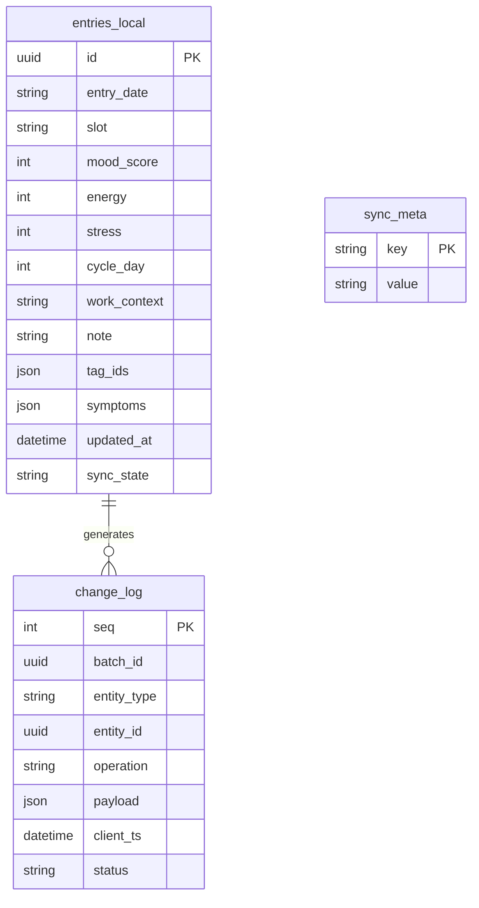

# ADR-0036: Offline-Sync v1 Scope & Implementation Contract

**Datum:** 2026-06-30
**Status:** Accepted
**Bezug:** Milestone M4.1 · Issues [#10](https://github.com/Sturmi77/correlcore/issues/10), [#24](https://github.com/Sturmi77/correlcore/issues/24) · [ADR-0003](0003-sync-conflict-log.md) · [ADR-0009](0009-offline-sync-nach-m4.md) · [ADR-0005](0005-verschluesselung-at-rest.md)

## Kontext

M4 lieferte PWA-Shell-Caching, `/offline` und form-level Offline-Retry — aber keine
IndexedDB-Persistenz, keine `/sync/*`-API und keine `sync_conflicts`-Tabelle.
M4.1 schließt diese Lücke mit Dexie.js, Delta-Sync und transparentem Conflict-Logging.

ADR-0003 definiert das Merge-Prinzip (LWW + Conflict-Log). ADR-0009 verschob den
Lieferzeitpunkt nach M4. Dieses ADR **friert den v1-Implementierungsvertrag ein**
(Sprint 0), damit Backend (Sprint 1–2) und Frontend (Sprint 3–4) parallel planbar sind.

## Entscheidung

### 1. Synced Entities (v1)

| Entity | Server-Tabelle(n) | Push | Pull | Notes |
| ------ | ----------------- | ---- | ---- | ----- |
| **Entry** | `entries`, `entry_tags`, `entry_symptoms` | Ja | Ja | Primärer Offline-Use-Case |
| **Tag** (custom) | `tags` | Ja (nur `user_id IS NOT NULL`) | Ja | Curated Defaults sind read-only |
| **Symptom** (custom) | `symptoms` | Ja (nur custom rows) | Ja | Default-Symptome sind read-only |

**Server-authoritative (Pull-only, kein Client-Push):**

- Insights (`insights`)
- Analytics / Worker-Outputs
- Curated default tags und symptoms (nur lesen, nie pushen)

### 2. Field-Level Merge Rules

Merge-Prinzip: **Last-Write-Wins (LWW)** pro Feld. Entscheidend ist `updated_at`
(UTC, server-maintained). Bei Gleichstand gewinnt der **Server**.

#### Entry scalar fields

| Feld | Merge | Conflict-Log (#24) | Notes |
| ---- | ----- | ------------------ | ----- |
| `mood_score` | LWW | Ja | 1..5 |
| `energy` | LWW | Ja | 1..5 |
| `stress` | LWW | Ja | 1..5 |
| `note` / `note_enc` | LWW | Ja (metadata only) | Siehe §2.1 |
| `work_context` | LWW | Nein | Enum |
| `cycle_day` | LWW | Nein | Optional 1..35 |
| `slot` | Server wins on create | Nein | Immutable nach Create |
| `entry_date` | Server wins on create | Nein | Immutable nach Create |
| `source` | Server wins on create | Nein | Set at create |

#### Entry relation fields

| Feld | Merge | Conflict-Log | Notes |
| ---- | ----- | ------------ | ----- |
| `tag_ids` | LWW auf Assignment-Set (`updated_at` des Entry) | Nein | Replace semantics |
| `symptoms` | LWW auf Intensity-Map | Ja | Map `{symptom_id: intensity}` |

#### Tag / Symptom (custom master rows)

| Feld | Merge | Conflict-Log |
| ---- | ----- | ------------ |
| `name`, `icon`, `color`, `category` (tags) | LWW | Nein |
| `habit_type`, `target_frequency` (tags) | LWW | Nein |
| `name` (symptoms) | LWW | Nein |

### 2.1 Encrypted `note_enc` — Conflict-Log ohne Plaintext

`note_enc` ist Fernet-ciphertext (ADR-0005). Für Merge und Conflict-Logging gilt:

1. **Merge:** Vergleich auf **Ciphertext-Ebene** (opaque token bytes / base64 wire form).
   Zwei Clients mit identischem Klartext aber unterschiedlicher Nonce erzeugen
   unterschiedlichen Ciphertext → LWW entscheidet; kein Re-Encrypt-Vergleich nötig.
2. **Conflict-Log (`sync_conflicts`):** `client_value` und `server_value` enthalten
   **keinen entschlüsselten Note-Text**. Erlaubt:
   - `{"present": true}` / `{"present": false}` — ob ein Note-Wert existierte
   - `{"changed": true}` — Konflikt erkannt, Inhalt absichtlich redacted
   - Optional: `ciphertext_hash` (SHA-256 des Ciphertexts) für Support-Debugging
3. **API `GET /user/sync-conflicts`:** Response enthält **niemals** Klartext-Notes
   oder Mood-Werte — nur Feldname, Timestamps, redacted JSONB-Marker, `entity_id`.

### 3. Cursor Format

Pull-Cursor ist **opaque** für Clients (opaque string, nicht parsen).

**Encoding:** Base64url (ohne Padding) über JSON:

```json
{"user_rev": 12345, "wall": "2026-06-30T12:00:00.000000Z"}
```

| Feld | Bedeutung |
| ---- | --------- |
| `user_rev` | Monotonic integer pro User — inkrementiert bei jedem server-seitigen Write auf synced entities |
| `wall` | ISO-8601 UTC — Tie-Breaker und Audit; nicht allein für Delta-Selektion |

- **Erster Pull** (`since` fehlt oder leer): liefert Änderungen der letzten **30 Tage**
  (konfigurierbar, Default 30). Cursor in Response setzt `user_rev` auf aktuellen Stand.
- **Folge-Pulls:** `since=<cursor>` liefert alle Änderungen mit `user_rev > cursor.user_rev`.
- **Pagination:** Wenn `changes.length >= page_size` (Default 200), Response enthält
  `has_more: true` und `cursor` als Fortsetzungspunkt (gleicher Batch, nächste Seite).

### 4. Idempotency Keys

Push-Idempotenz verhindert Doppel-Writes bei Netzwerk-Retries.

| Key | Scope | Rule |
| --- | ----- | ---- |
| `client_id` | Pro Browser-Origin | Stabile UUID in `localStorage` (ein Tab-Set pro Origin) |
| `batch_id` | Pro Push-Request | Client-generierte UUID; Server speichert verarbeitete `(user_id, client_id, batch_id)` |
| `seq` | Pro Change in `change_log` | Monotone Integer pro `client_id`; strictly increasing |

**Replay-Regel:** Identischer `(client_id, batch_id)` → `200 OK` mit gespeichertem
Ergebnis (gleiche `cursor`, gleiche `conflicts`), **keine** erneute DB-Mutation.

**Out-of-order `seq`:** Changes mit `seq <= last_applied_seq` für diesen `client_id`
werden übersprungen (bereits angewendet).

### 5. Client IndexedDB Schema (Dexie v1)

Dexie-Datenbankname: `correlcore-offline` (Version 1).



#### `entries_local`

Lokale Entry-Darstellung (Plaintext `note` — Device-At-Rest-Schutz ist OS/Browser-
Scope; Server-Pfad bleibt Fernet). `sync_state`: `local` | `pending` | `synced` | `conflict`.

#### `change_log`

Append-only Outbox. `operation`: `upsert` | `delete`. `status`: `pending` | `acked` |
`failed`. `seq` auto-increment pro DB-Instanz.

#### `sync_meta`

Key-Value Store:

| Key | Value |
| --- | ----- |
| `client_id` | UUID string |
| `last_pull_cursor` | Opaque cursor from last successful pull |
| `last_push_at` | ISO timestamp |
| `last_pull_at` | ISO timestamp |

**Multi-Tab:** Ein `client_id` pro Origin. Push-Serialisierung via `BroadcastChannel`
oder Leader-Election (Sprint 4) — nicht in Sprint 0 implementiert, aber Contract reserviert.

### 6. HTTP Error Semantics

| Code | Wann | Body |
| ---- | ---- | ---- |
| `200` | Push/Pull erfolgreich | `SyncPushResponse` / `SyncPullResponse` |
| `400` | Schema-/Seq-Fehler | FastAPI `detail` |
| `401` / `403` | Auth | Standard |
| `409` | **Nicht** für LWW-Konflikte | Reserviert für harte Invarianten (z. B. Slot-Kollision bei Online-CRUD) |
| `422` | Validierungsfehler | FastAPI `detail` |

**LWW-Konflikte** werden **nicht** als HTTP `409` signalisiert. Stattdessen enthält
`SyncPushResponse.conflicts[]` einen `SyncConflictReport` pro betroffenem kritischen Feld.
Der Server wendet den Gewinner an und der Client aktualisiert lokalen State.

### 7. Conflict-Log Schema (ADR-0003 Addendum)

`entity_type` CHECK erweitert für v1:

```sql
entity_type IN ('entry', 'tag', 'symptom')
```

(`habit` aus ADR-0003 Draft entfällt — Habit-Felder leben auf `tags`.)

Retention: **90 Tage** via APScheduler (Sprint 1).

## Alternativen erwogen

| Option | Ergebnis |
| ------ | -------- |
| CRDT / OT für Notes | Verworfen (ADR-0003) |
| HTTP 409 bei jedem LWW-Konflikt | Verworfen — würde Retry-Queues blockieren |
| Plaintext in `sync_conflicts` | Verworfen — DSGVO / Art. 9 |
| Per-Field Cursor statt `user_rev` | Verworfen — zu komplex für v1 |

## Konsequenzen

- Sprint 1–2 implementieren Backend exakt nach diesem Contract.
- Sprint 3–4 implementieren Dexie + Orchestrator exakt nach ERD oben.
- `backend/app/schemas/sync.py` ist die kanonische Pydantic-Spiegelung.
- `docs/API.md` §10 ist die öffentliche API-Referenz.
- Abweichungen erfordern ADR-0036-Amendment oder Nachfolger-ADR.

## Implementierungs-Mapping

| Sprint | ADR-0036 Abschnitt |
| ------ | ------------------ |
| 0 | Gesamtes ADR (dieses Dokument) |
| 1 | §7 Conflict-Log + Read API |
| 2 | §1–4, §6 Push/Pull |
| 3 | §5 Dexie ERD |
| 4 | §5 Orchestrator + Feature-Flag |
| 5 | Contract frozen — nur QA/Docs |
