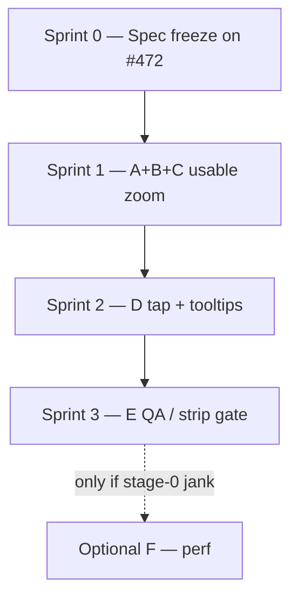

# Trends Compare Axis Zoom — Sprint Plan

Last updated: 2026-07-20 (CAZ-0 confirmed)

Companion to:

- Product/concept: [`COMPARE_AXIS_ZOOM_PLAN.md`](COMPARE_AXIS_ZOOM_PLAN.md)
- Engineering slices: [`COMPARE_AXIS_ZOOM_IMPLEMENTATION_PLAN.md`](COMPARE_AXIS_ZOOM_IMPLEMENTATION_PLAN.md)
- Tracker: [#472](https://github.com/Sturmi77/correlcore/issues/472)

This plan sequences the implementation slices into **shippable sprints**. Each
sprint ends with **one PR** (draft early, ready-for-review at exit). Slices are
**not** one-sprint-each: A/B alone lack user value; C is the core; D/E are
follow-ups.

**Effort labels** below mean relative engineering weight (Low / Medium / High),
not calendar duration.

---

## Goal

Ship display-only shared-axis zoom for Trends Compare (metric timeline +
`ComparisonHeatmap`) so bird’s-eye patterns are readable on Web / PWA /
Capacitor, with interpretability safeguards (sum vs mean, coverage, partial
buckets).

---

## Sprint overview

| Sprint | ID    | Title                       | Impl. slices              | Effort     | PR                                  | Status                        |
| ------ | ----- | --------------------------- | ------------------------- | ---------- | ----------------------------------- | ----------------------------- |
| 0      | CAZ-0 | Spec freeze                 | WP0                       | Low        | docs already (#473, #477)           | **Done** — §4 confirmed 2026-07-20 |
| 1      | CAZ-1 | Usable bird’s-eye zoom      | **A + B + C**             | High       | one feature PR                      | **Ready to start**                 |
| 2      | CAZ-2 | Drill-in + interpretability | **D**                     | Medium     | one feature PR                      | Not started                   |
| 3      | CAZ-3 | Strip gate + Capacitor QA   | **E** (+ **F** if needed) | Low–Medium | one feature PR (+ optional perf PR) | Not started                   |

---

## Dependency graph

| Rule                           | Reason                                                                      |
| ------------------------------ | --------------------------------------------------------------------------- |
| Sequential sprints             | Shared axis components conflict if edited in parallel (same lesson as M3.8) |
| No “A-only” or “B-only” sprint | Chrome without bucket render is a no-op for users                           |
| F only after E                 | Perf work needs a measured failure on device                                |

---

## Sprint 0 — Spec freeze (CAZ-0)

**Goal:** Product defaults locked so Sprint 1 does not re-litigate UX.

### Checklist

- [x] On [#472](https://github.com/Sturmi77/correlcore/issues/472) / product chat: accept concept plan §4
  1. Default stage **7**
  2. **Hide** range chips in Compare (year/365d axis window)
  3. Stages **`1/3/7/14/28`**
  4. Tap zoom-in **one stage finer**
- [x] No further §4 overrides — implement §4 as written
- [x] Implementation + sprint plan merged (docs PRs #473, #477)

### Exit

**Met (2026-07-20).** Sprint 1 (CAZ-1) may start.

---

## Sprint 1 — Usable bird’s-eye zoom (CAZ-1 = A + B + C)

**Goal:** First user-visible zoom. `+/-` changes shared bucket columns for
**Lines + Heatmap** over a **365d** window. Strip mode gated or forced to
stage 0.

**Branch (suggested):** `cursor/compare-axis-zoom-s1-d121`  
**PR:** one PR titled e.g. `feat(trends): Compare shared-axis zoom (CAZ-1)`  
**Closes / refs:** `#472` (partial — leave open until Sprint 3, or use
checklist on the issue)

### Scope in

| Slice | Deliverable                                                                                               |
| ----- | --------------------------------------------------------------------------------------------------------- |
| A     | `compareAxisZoom.ts`, persist `cc_trend_compare_zoom`, unit tests                                         |
| B     | `+/-` + status in `TrendsComparePanel`; Compare load = year/365d                                          |
| C     | Bucket cells/series on Heatmap + `MetricTimeseries`; shared cursor keys; relative colour; partial styling |

### Scope out (→ later sprints)

- Tap-on-bucket zoom-in (Sprint 2)
- Full dual-encoding legend + coverage tooltips (Sprint 2)
- Capacitor device checklist sign-off (Sprint 3)
- Strip bucket aggregation beyond gate (follow-up after v1)

### Day-to-day order inside the sprint

1. Land A (utils + tests) — commit early
2. Wire B chrome + 365d page load
3. Wire C heatmap + lines + cursor
4. Strip gate (minimum): no dual-truth with `zoomStage > 0`
5. Tests green; draft → ready PR

### Key files

- `apps/web/src/lib/utils/compareAxisZoom.ts` (**new**)
- `apps/web/src/lib/utils/comparePanelSettings.ts`
- `apps/web/src/lib/components/trends/TrendsComparePanel.svelte`
- `apps/web/src/lib/components/trends/ComparisonHeatmap.svelte`
- `apps/web/src/lib/components/trends/MetricTimeseries.svelte`
- `apps/web/src/lib/stores/timelineCursor.ts` (axis = bucket starts)
- `apps/web/src/routes/trends/+page.svelte`
- i18n zoom status strings (minimal)

### Verify / exit criteria

- [ ] Default stage **7** (or overridden default) with empty localStorage
- [ ] `+/-` walks stages `1/3/7/14/28`; status visible; persists
- [ ] Compare data window 365 days; range does not shrink the shared axis
- [ ] Chart + heatmap show **identical** column counts/positions after each zoom
- [ ] Heatmap cell = sum; metric point = mean of days with entries
- [ ] Partial buckets rendered, not upscaled
- [ ] Stage 0 parity with pre-feature daily Compare (smoke)
- [ ] Strip + coarse zoom cannot disagree (gate)
- [ ] Unit + component tests for buckets, panel zoom, heatmap sums
- [ ] `pnpm --filter @correlcore/web test` (targeted) + lint/typecheck on touch set
- [ ] PR opened/updated; ready for review

### Risks owned in this sprint

R1 (relative colour), R4 (DOM at stage 0 — measure later), R5 (range), R8
(no KW labels), R9 (cursor keys), R10 (strip gate minimum).

---

## Sprint 2 — Drill-in + interpretability (CAZ-2 = D)

**Goal:** Interaction and reading model match the concept: tap zooms in;
day opens sheet; users understand sum vs mean and sparse weeks.

**Branch:** `cursor/compare-axis-zoom-s2-d121`  
**PR:** `feat(trends): Compare zoom drill-in and encoding tooltips (CAZ-2)`  
**Depends:** Sprint 1 merged

### Scope in

- Multi-day tap → one stage finer + scroll/focus interval
- Day tap → existing `EntryHistorySheet` / `selectDate` (O-17 preserved)
- Affordance copy (“tap to enlarge” / equivalent)
- Legend: heatmap sum vs metric mean
- Tooltip/cursor card: interval, values, coverage, partial `k of N`
- Full DE/EN i18n for zoom strings

### Scope out

- Pinch; long-press → sheet; coverage heat overlay

### Key files

- `TrendsComparePanel.svelte` (zoomInBucket handler)
- `ComparisonHeatmap.svelte` / `MetricTimeseries.svelte` (tap routing)
- Cursor overlay / detail card if present
- `en.json` / `de.json`

### Verify / exit criteria

- [ ] Multi-day tap decreases stage and keeps interval in view
- [ ] Day tap opens history once; stage unchanged
- [ ] Legend + tooltip fields present (coverage required)
- [ ] No “KW” labelling
- [ ] Component tests for both tap paths
- [ ] PR ready for review

### Risks owned

R2, R3, R6, R7 (status already from S1; reinforce affordances).

---

## Sprint 3 — Harden for Capacitor + close v1 (CAZ-3 = E, optional F)

**Goal:** Ship-quality on mobile WebView; strip/marker edge cases closed;
#472 closable.

**Branch:** `cursor/compare-axis-zoom-s3-d121`  
**PR:** `feat(trends): Compare zoom Capacitor QA and strip gate (CAZ-3)`  
**Depends:** Sprint 2 merged

### Scope in

- Finalise Strip gate UX (reset to stage 0 **or** disable Strips when zoomed —
  pick one, document in PR)
- Marker/note dedupe per bucket polish if gaps remain from S1
- Capacitor / device checklist from implementation plan §7.2 — results on #472
- File follow-up issue for strip Z-score bucket policy if deferred

### Optional F (same sprint only if E fails perf)

- If stage 0 janks on target device: column virtualisation **or** soft-cap
  minimum stage on coarse pointer
- Prefer **separate small PR** if F is non-trivial, still within Sprint 3

### Verify / exit criteria

- [ ] Checklist on #472 completed (pass/fail per row)
- [ ] No Pinch required; `+/-` and taps work under touch + horizontal scroll
- [ ] No dual-truth strip/zoom combination
- [ ] Concept + implementation plan status → **Implemented** with PR links
- [ ] Close or reduce #472 to residual follow-ups only

---

## PR discipline (every sprint)

1. Branch from latest `main` after previous sprint merge.
2. Open **draft PR** early linking `#472`.
3. Commit at each testable milestone (A → B → C inside Sprint 1).
4. Before review: targeted tests + lint/typecheck on touched packages.
5. One sprint → **one primary PR** (plus optional F PR in Sprint 3).
6. Do not start the next sprint’s code until the previous PR is merged (or
   explicitly stacked with agreement).

---

## Mapping: Sprint ↔ slice ↔ concept WP

| Sprint | Slices  | Concept WPs                        |
| ------ | ------- | ---------------------------------- |
| 0      | —       | WP0                                |
| 1      | A, B, C | WP1, WP2, WP3 (+ WP6 minimum gate) |
| 2      | D       | WP4, WP5                           |
| 3      | E, (F)  | WP6 finish, WP7, (WP8)             |

---

## Out of scope for this sprint series

- Pinch-to-zoom
- Backend granularity APIs
- Habit `TagHeatmap` / symptom calendar zoom
- ISO calendar-week buckets
- LayerChart adoption
- Parallel React GUI
- Full strip Z-score aggregation design (tracked as follow-up after CAZ-3)

---

## Status log

| Date | Event |
| --- | --- |
| 2026-07-20 | Sprint plan created from impl-plan slice regrouping (A+B+C / D / E+F) |
| 2026-07-20 | Concept #473 merged; impl-plan docs PR #477 |
| 2026-07-20 | **CAZ-0 confirmed:** default 7d, hide range chips, stages 1/3/7/14/28, tap = one-stage zoom-in → CAZ-1 ready |
