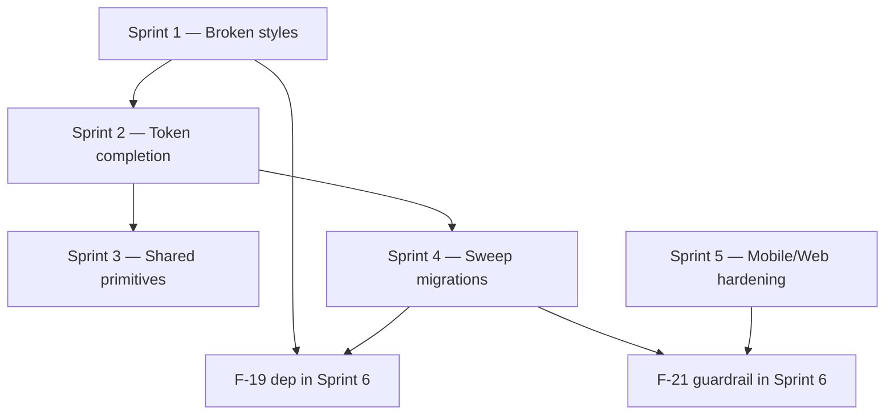

# GUI-Konsistenz-Audit — Sprint Plan

Last updated: 2026-07-12

> **Phase 2 (2026-07-13):** abgeschlossen (#354–#374).
> [`GUI_CONSISTENCY_SPRINT_PLAN_PHASE2.md`](GUI_CONSISTENCY_SPRINT_PLAN_PHASE2.md).
>
> **Phase 3 (2026-07-13):** offene PR-Review-Punkte (Codex #351, #355–#357, #364, #366) →
> [`GUI_CONSISTENCY_SPRINT_PLAN_PHASE3.md`](GUI_CONSISTENCY_SPRINT_PLAN_PHASE3.md).

Companion to [`GUI_CONSISTENCY_AUDIT_2026-07-12.md`](GUI_CONSISTENCY_AUDIT_2026-07-12.md)
(the source audit — read that first for full evidence/measure/acceptance
text per finding; this plan only sequences it into shippable batches). The
audit already proposed six work packages with a sound dependency order;
this plan adopts that structure, renames WP → Sprint for consistency with
the rest of `docs/frontend/`, and adds per-sprint verify/test detail.

**Spot-checked before writing this plan** (not taken on faith): F-01
(`variant-filled-primary` used in 17 files, genuinely undefined in
`app.css` — only `variant-ghost-surface/-error` and `variant-soft-warning`
exist as shims), F-08 (`app.html` hardcodes `data-theme="dark"`, the
inline bootstrap script only reads `localStorage`, no `matchMedia` call
anywhere), and F-16 (icon size distribution — 9× `18`, 7× `14`, 2× `16`,
plus the two `CorrelCoreLogo` outliers — matches exactly what Sprint 3 of
`INSIGHT_STATEMENT_PATTERN_SPRINT_PLAN.md` found when it introduced
`--icon-sm`/`--icon-md`). All three confirmed accurate.

**Note on F-16 specifically:** this isn't a new problem — it's the
"~21 remaining instances are incremental follow-up" gap that
[Sprint 3 / ISP-9](INSIGHT_STATEMENT_PATTERN_SPRINT_PLAN.md#sprint-3--visual-refresh--done)
deliberately left open. Sprint 4 here (F-16) is that follow-up, not
duplicate work.

## Overview

| Sprint | WP (audit) | Findings                                      | Priority | Effort | Title                         |
| ------ | ---------- | --------------------------------------------- | -------- | ------ | ----------------------------- |
| 1      | WP-1       | F-01, F-02, F-03                              | P0       | S      | Broken styles                 |
| 2      | WP-2       | F-06, F-13, F-20 (+ token parts of F-10/F-12) | P1/P2    | S      | Token completion              |
| 3      | WP-3       | F-05, F-07                                    | P1       | M      | Shared primitives             |
| 4      | WP-4       | F-10, F-11, F-12, F-15, F-16                  | P1/P2    | M      | Sweep migrations              |
| 5      | WP-5       | F-04, F-08, F-09                              | P1       | M      | Mobile/Web hardening          |
| 6      | WP-6       | F-14, F-17, F-18, F-19, F-21                  | P2/P3    | S–M    | Principles, docs & guardrails |

**Out of scope for this plan:** the F-05 `BottomSheet` primitive only
needs ≥4 of 9 sheets migrated to satisfy its acceptance criterion — full
migration of all 9 is explicitly follow-up beyond this plan. (F-17 is
**in** scope, assigned to Sprint 6 below — it's doc-only, not excluded;
see that sprint's verify list.)

## Dependency graph



| Dependency               | Reason                                                                                                                                                                                                                                                                                                                                                                                                                                                                    |
| ------------------------ | ------------------------------------------------------------------------------------------------------------------------------------------------------------------------------------------------------------------------------------------------------------------------------------------------------------------------------------------------------------------------------------------------------------------------------------------------------------------------- |
| S2 → S3, S2 → S4         | Tokens (scrim, `text-2xs/2xl`, `transition-fast/sheet`, `--tap-target`) must exist in `app.css` before component migrations reference them — same "don't build on a shape that's about to change" logic as ISP-1 → ISP-4 in the Insight-Statement-Pattern plan.                                                                                                                                                                                                           |
| S1, S4 → F-19 (S6)       | Can't remove `@skeletonlabs/*` from `package.json` until nothing references the shim classes it justified (F-01 replaces the primary-button variants; F-15, bundled into Sprint 4, replaces the `-500`/`-token` legacy status classes).                                                                                                                                                                                                                                   |
| S4, S5 → F-21 (S6)       | The CI guardrail script fails on hex literals, undefined `var()` refs, off-canon breakpoints, and un-exempted size literals — landing it before the sweeps (S4) and breakpoint consolidation (S5) means it's red from day one against code nobody's touched yet.                                                                                                                                                                                                          |
| S3 ⊥ S5, except one file | Mostly independent — `BottomSheet`/`ScreenHeader` work and breakpoint/touch-target/theme-bootstrap work touch different files. The exception: `TrendsCompareSettingsSheet.svelte` is in both (S3 migrates it to `BottomSheet`, S5/F-09 fixes its `min-height: 32px` touch target). Do the F-09 touch-target fix on that one file _after_ its `BottomSheet` migration, or the two changes will conflict in the same region — everything else in S3/S5 can run in parallel. |

## Sprint 1 — Broken styles (F-01, F-02, F-03)

**Verify:**

- `grep -rn 'variant-filled-primary\|variant-soft-primary\|variant-ghost-primary' apps/web/src` → 0 hits after migrating all 17 files to the shared `Button` component (`variant` prop) or, where a native `<button>` must stay, a newly-defined `.btn--primary` class in `app.css`.
- `--color-success-highlight` defined in both theme blocks (dark + light), no more `rgba(34, 197, 94, ...)` fallback literal in `forgot-password/+page.svelte`. `.variant-soft-warning`'s color source fixed from `--color-error` to `--color-warning` (the "mini-bug" the audit flags inside F-02 — don't miss it, it's not called out as its own finding number).
- `DEFAULT_TAG_COLOR` extracted to `lib/constants/`, no hex literal left in `settings/tags/+page.svelte`. Confirm which of the audit's two options (theme-independent neutral vs. current-theme-primary-on-create) actually shipped, with a comment explaining the choice — the audit recommends (a) but leaves it a judgment call.

**Key files:** `app.css` (new tokens/classes), `Button.svelte`, the 17 files listed in the audit's F-01 evidence (auth routes, onboarding, `entries/day`, `settings/tags`, `TagPicker`, `SymptomChecker`, `InsightJourneyExplainer`), `settings/tags/+page.svelte`, new `lib/constants/tagDefaults.ts` (or similar).

**Tests:** existing component tests for anything touched by the `Button` migration; visual check in both themes (login/register submit, forgot-password success banner, new-tag color swatch).

**Acceptance:** primary CTAs render filled in both themes; no undefined Skeleton variant classes remain; tag defaults documented, not silently hardcoded.

## Sprint 2 — Token completion (F-06, F-13, F-20 + token parts of F-10/F-12)

**Verify:**

- `--color-scrim` defined per-theme (dark: `oklch(0 0 0 / 0.48)`, light: weaker), all sheet backdrops migrated onto it; `--color-surface-inverse` reference gone.
- Dead/undefined tokens resolved: `--color-mood-primary` → `--color-metric-mood`, `--color-surface-muted` → `--color-strip-track-bg`, `--app-header-height` either defined or its `calc()` uses simplified; `--color-muted` deleted (0 real usages); `--color-primary-soft`/`--color-primary-highlight` alias resolved to one name.
- **`--color-gold` needs a decision, not a plain deletion:** it has 0 real component usages, but `scripts/check-contrast.mjs` hard-requires it (`requiredTokens`, line 10) and checks 4 dark/light contrast pairs against it (`informationalPairs`). Deleting the token without touching the checker breaks `pnpm check:contrast` for everyone, including Sprint 1-4 work that has nothing to do with this token. Either (a) update `check-contrast.mjs` to drop `--color-gold` from both lists in the same change, or (b) keep the token defined (it's a semantic duplicate of `--color-warning`, cheap to keep) and only remove it from the checker once something else needs the slot. Don't do this as an isolated one-line CSS deletion.
- `--tap-target: 44px` defined; `min-height: 2.75rem` occurrences (7×) migrated to it alongside the existing `44px` literals (34×) for a single canonical form.
- From F-10/F-12: land just the **new tokens** here (`--text-2xs`, `--text-2xl`, `--transition-fast`, `--transition-sheet`) — the _migration_ of existing literals onto them is Sprint 4's job, not this one's. Landing an unused token isn't a regression; migrating call sites before Sprint 3/4 are scoped would be.

**Key files:** `app.css`, `scripts/check-contrast.mjs` (only if `--color-gold` is actually removed, not kept per option (b) above), plus the handful of components F-06/F-13 name directly (4 sheets for scrim, `SymptomTrendOverlay.svelte`, `InsightsAnalysisToolbar.svelte`/`TrendsAnalysisToolbar.svelte`).

**Tests:** `pnpm check:contrast` (ADR-0027 pairs) must stay green — this sprint touches color tokens directly. Visual check: any sheet's backdrop in light mode should read visibly softer than dark.

**Acceptance:** every token named in F-06/F-13/F-20 exists exactly once, in the right place, with no dead or duplicate entries; nothing in this sprint yet requires touching component call sites beyond the sheets/files named above.

## Sprint 3 — Shared primitives (F-05, F-07)

**Verify:**

- `BottomSheet.svelte` extracted into `common/`, `<dialog>`-based per `ESLINT_SVELTE_GUARDRAILS.md` §1, uses `--color-scrim` from Sprint 2, `env(safe-area-inset-bottom)` padding. At least the 4 Trends/Insights sheets sharing the identical old backdrop value migrated onto it (`TrendsCompareSettingsSheet`, `CooccurrenceEntrySheet`, `HabitDetailSheet`, `EntryHistorySheet`); the 5 remaining sheets (`EntrySheet`, `CorrelationDisclaimer`, `InsightJourneyExplainer`, `SymptomCooccurrenceDetailSheet`, `EventAlignedSmallMultiplesSheet`) and the 2 settings-route modal backdrops stay follow-up.
- `ScreenHeader` added to Home (decide: visible or a new `visuallyHidden` prop, since Home's Daily-Brief design may not want a second on-screen title competing with the statement-first hierarchy from the Insight-Statement-Pattern work), `entries/day/[date]`, and **all three** onboarding routes — the audit's F-07 evidence (lines 108/161) points at `routes/onboarding/+page.svelte` (the main guided flow, two raw `<h1>`s for its tags/summary steps), not just `profile`/`retro`; don't scope this to two routes when a third has the same violation. Auth routes' distinct `auth-page-title` pattern documented as an intentional exception in `UI_COMPONENT_SYSTEM.md`, not silently left inconsistent.

**Key files:** new `common/BottomSheet.svelte` (+ test), the 4 sheet components named above, `routes/+page.svelte` (Home), `ScreenHeader.svelte` (new prop), `routes/entries/day/[date]/+page.svelte`, `routes/onboarding/+page.svelte`, `routes/onboarding/profile/+page.svelte`, `routes/onboarding/retro/+page.svelte`, `UI_COMPONENT_SYSTEM.md`.

**Tests:** new `BottomSheet.test.ts`; extend `ScreenHeader.test.ts` for the new prop (if added); an axe/a11y pass confirming no "page has no level-one heading" on Home, entries/day, or onboarding.

**Acceptance:** every navigable primary route renders exactly one `<h1>`; ≥4 sheets on the shared primitive; no new sheet may be added without it (guardrail note added to `UI_COMPONENT_SYSTEM.md`, enforced in Sprint 6's F-21 script only insofar as that script can detect it — likely a doc-level rule more than a lint rule here).

## Sprint 4 — Sweep migrations (F-10, F-11, F-12, F-15, F-16)

The largest sprint by file count, but each item is a mechanical mapping
from a literal to a token — low risk per change, high review tedium.
Consider splitting into per-finding PRs rather than one giant diff, even
though they're bundled here as one audit-recommended work package.

**Verify:**

- F-10: `grep -rnE 'font-size:\s*[0-9.]+rem' apps/web/src --include='*.svelte'` under 10 remaining hits, each with a `/* token-exempt: <reason> */` comment (SVG axis labels in `MetricTimeseries.svelte` are the documented exception). `--text-2xl` reference in `routes/dev/+page.svelte` now resolves to a real token (added in Sprint 2).
- F-11: `grep -rnE 'border-radius:\s*[0-9]' apps/web/src --include='*.svelte'` ≤ 5 justified remaining hits.
- F-12: no bare `ms` literals in Svelte `transition:` declarations outside commented keyframe animations.
- F-15: `grep -rnE '\-500\b|600-300-token' apps/web/src --include='*.svelte'` → 0 (note `-E`: plain `grep`'s basic regex treats `|` as a literal character, not alternation, and would silently report 0 hits even with legacy classes still present — false-pass risk). Skeleton legacy shims removed from `app.css:654–680`.
- F-16: icon `size={}` literals replaced by `IconRender`/`IconButton` channeling a typed `'sm' | 'md'` prop mapped to the `--icon-sm`/`--icon-md` pixel values (`14`/`18`) — the same values `lib/constants/iconSizes.ts` already exports as `ICON_SIZE_SM`/`ICON_SIZE_MD` from Sprint 3 of the Insight-Statement-Pattern work; reuse that module rather than re-deriving the numbers. `16 → 14 or 18`, `20/22 → 18` per the audit's mapping; `40/72` (landing-page logo) stay exempt.

**Key files:** `app.css` (`--text-2xs`/`--text-2xl` already added in Sprint 2), dozens of `.svelte` files across `components/insights`, `components/home`, `components/trends`, `IconRender.svelte`/`IconButton.svelte`, `lib/constants/iconSizes.ts` (reused, not recreated).

**Tests:** existing component tests should be unaffected (pure style-value swaps); re-run full suite since this sprint touches the most files of any in this plan; visual spot-check Home/Insights/Trends in both themes per the audit's own acceptance note.

**Acceptance:** grep counts above hold; no visual regression at 390/430/768/1280px in either theme.

## Sprint 5 — Mobile/Web hardening (F-04, F-08, F-09)

**Verify:**

- F-04: **Decided — implement the audit's proposal as-is: canonical set is 360/480/768/1024.** `FRONTEND.md:81` (plus `:84/88/753`) documents 375 instead — since the audit's set wins, update those references to 360, don't add 375 as a second small breakpoint. Document the canonical set as a comment contract in `app.css`. `760px` → `767px` and `48rem` → `768px` fixed in the four components that drift from the shell breakpoint (`InsightPhaseMilestoneCard`, `HabitsPanel`, `InsightJourneyExplainer`, `HabitDetailBody`); remaining odd breakpoints (520/420/430/640/680/720/860) mapped down to ≤5 distinct values app-wide, or converted to container queries where the break is genuinely component-internal rather than viewport-driven.
- F-08: **Decided — Variante A, honor system preference.** Extend the inline bootstrap script in `app.html` with a `matchMedia('(prefers-color-scheme: light)')` check so a first-time visitor with light OS gets light, not the current hardcoded dark default. Delete the now-genuinely-dead `@media (prefers-color-scheme: dark)` fallback block in `app.css` (~50 duplicated token lines) in the **same change** as `scripts/check-contrast.mjs`'s fallback-block extraction (`extractBlock('system dark fallback', /:root:not\(\[data-theme\]\)\s*\{/)`) — it fails with "Missing X in system dark fallback" for every required token if the block disappears first.
- F-09: Trends-Compare controls and `SymptomCalendarHeatmap` interactive cells reach ≥44px touch targets on mobile (heatmap cells via hit-area padding/`::after`, not a visual size change to the 12×12px cells themselves — density is intentional there).

**Key files:** `app.css` (breakpoint contract comment, dead fallback block removal), `scripts/check-contrast.mjs` (fallback-block extraction removed alongside it), `FRONTEND.md` §1.6 (375 → 360, matching the decided canon), `app.html` (bootstrap script — Variante A), `InsightPhaseMilestoneCard.svelte`, `HabitsPanel.svelte`, `InsightJourneyExplainer.svelte`, `HabitDetailBody.svelte`, `TrendsComparePanel.svelte`, `TrendsCompareQuickFilters.svelte`, `TrendsCompareSettingsSheet.svelte` (after its Sprint 3 `BottomSheet` migration, see dependency note above), `SymptomCalendarHeatmap.svelte`.

**Tests:** `pnpm test:e2e:mobile`, existing Sprint-1-era Playwright touch-target coverage extended to Trends-Compare; `mobile-theme-parity.spec.ts` must stay green through the F-08 change either way.

**Acceptance:** no `760px`/`48rem` remain; ≤5 distinct breakpoints app-wide, matching 360/480/768/1024; a first-time visitor with light OS preference and no stored choice gets light theme, not dark; all named interactive elements meet the 44px/24px targets.

## Sprint 6 — Principles, docs & guardrails (F-14, F-17, F-18, F-19, F-21)

**Verify:**

- F-14: **Decided — don't violate the heatmap-color principle.** `SymptomCalendarHeatmap`'s "symptom present" cells move off `--color-warning` onto `--color-heatmap-3/4` (intensity, not verdict-color); no exception documented in `FRONTEND.md` §1.5 — the principle stands as written.
- F-17: doc-only — rewrite `FRONTEND.md` §4.2 to describe the real 1–5 scale and `--color-metric-*` tokens (source of truth: `lib/config/metrics.ts`/`ENTRY_CONTRACT`), removing the fictional −2…+2 red-green traffic-light scale that doesn't exist in code and would contradict §1.5 anyway.
- F-18: audit pass (not a fixed code change) — build the Screen × State matrix (Loading/Error/Empty/Offline) in `UI_COMPONENT_SYSTEM.md`; migrate manually-built states onto `DataState`/`EmptyState`/`InlineAlert` where there's no documented reason for a bespoke one.
- F-19: remove `@skeletonlabs/skeleton` and `@skeletonlabs/tw-plugin` from `package.json` — only after Sprint 1 (F-01) and Sprint 4 (F-15) have removed every reference to what these packages justified.
- F-21: `apps/web/scripts/check-style-tokens.mjs`, wired into `ci-web.yml` beside `check:contrast`. Land last on purpose — running it before Sprints 4/5 land would fail CI against known, already-scoped legacy rather than catching new regressions.

**Key files:** `SymptomCalendarHeatmap.svelte`, `FRONTEND.md` (§4.2 rewrite), `UI_COMPONENT_SYSTEM.md`, `package.json`/`pnpm-lock.yaml`, new `apps/web/scripts/check-style-tokens.mjs`, `.github/workflows/ci-web.yml`.

**Acceptance:** `SymptomCalendarHeatmap` uses `--color-heatmap-3/4`, not `--color-warning`; `FRONTEND.md` matches shipped code; state-coverage matrix exists; Skeleton packages gone with green build; guardrail CI job exists and is green against the post-Sprint-5 codebase.

## Regression commands

```bash
pnpm check:contrast       # from the repo root — ADR-0027 pairs, critical for Sprints 1, 2, 5
cd apps/web
pnpm lint && pnpm format:check && pnpm typecheck
pnpm test                 # 97 files / 473 tests baseline per the audit
pnpm build
pnpm test:e2e:smoke       # plus test:e2e:mobile for Sprints 3 and 5
```

`check:contrast` only exists in the root `package.json` (`docs/DEVELOPMENT.md:109` confirms: run it from the repo root, not from `apps/web`) — it isn't defined in `apps/web/package.json`, so running it after `cd apps/web` fails before any UI verification happens.

Manual check after every sprint: baseline viewports from `surfaceContract.ts`
(390/430/768/1280/1440), dark **and** light.

## What this plan deliberately doesn't decide

- **F-03's default tag color** — theme-independent neutral vs.
  create-time-primary is a product call the audit itself only
  recommends, doesn't mandate. Flag it for a one-line decision before
  Sprint 1 ships, don't let an agent pick silently.

**Resolved (2026-07-12):** F-08 → Variante A (system preference honored),
F-14 → no exception, principle enforced as written, F-04 → audit's
360/480/768/1024 set implemented as proposed, `FRONTEND.md`'s 375
references updated to match rather than the reverse. See the Sprint 5/6
verify sections above for the concrete implications of each.
