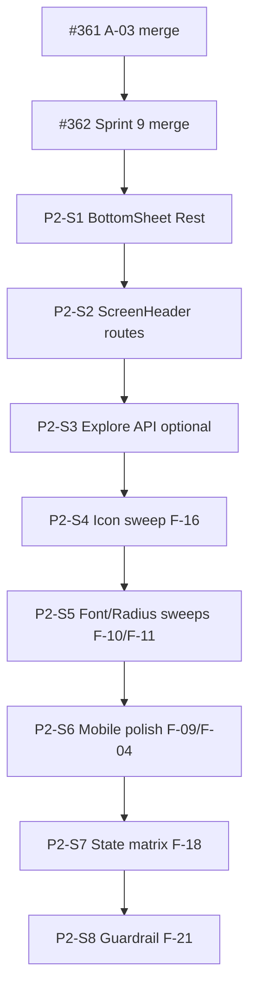

# GUI-Konsistenz & Codebase-Audit — Sprint Plan Phase 2

Last updated: 2026-07-13

> **Phase 2 abgeschlossen (2026-07-13).** Alle P2-Sprints merged (#361–#374).
> Offene Codex-Review-Punkte →
> [`GUI_CONSISTENCY_SPRINT_PLAN_PHASE3.md`](GUI_CONSISTENCY_SPRINT_PLAN_PHASE3.md).

Companion to:

- [`GUI_CONSISTENCY_SPRINT_PLAN.md`](GUI_CONSISTENCY_SPRINT_PLAN.md) (Phase 1, Sprints 1–6)
- [`GUI_CONSISTENCY_SPRINT_PLAN_PHASE3.md`](GUI_CONSISTENCY_SPRINT_PLAN_PHASE3.md) (PR-Review-Follow-up)
- [`GUI_CONSISTENCY_AUDIT_2026-07-12.md`](GUI_CONSISTENCY_AUDIT_2026-07-12.md)
- [`CODEBASE_AUDIT_2026-07-12.md`](CODEBASE_AUDIT_2026-07-12.md)
- [`INSIGHT_METRICS_IMPLEMENTATION_PLAN.md`](INSIGHT_METRICS_IMPLEMENTATION_PLAN.md)

Phase 1 (Sprints 1–7) und Phase 2 (P2-S0–P2-S8) sind **gemerged**
(#354–#374). Dieses Dokument bleibt als **historische Referenz** für die
umgesetzte Reihenfolge (BottomSheet, ScreenHeader, Explore-API, Sweeps, Guardrail).

## Stand (2026-07-13) — abgeschlossen

| PR        | Status    | Inhalt                                                           |
| --------- | --------- | ---------------------------------------------------------------- |
| #354–#357 | ✅ merged | GUI Sprints 1–4 (broken styles, tokens, partial sweeps)          |
| #355–#356 | ✅ merged | Codebase A-01/A-02/A-04/A-06/A-07, A-05 work-context metrics     |
| #358      | ✅ merged | GUI Sprint 5 — `BottomSheet` + 4 Sheet-Migrationen, Home `<h1>`  |
| #359      | ✅ merged | GUI Sprint 6 — `/status` Token-Migration (F-15)                  |
| #360      | ✅ merged | GUI Sprint 7 — `matchMedia`, Breakpoints, Trends-Compare Touch   |
| #361      | ✅ merged | A-03 Explore-Events (client-seitige Presence-Lookups)            |
| #362      | ✅ merged | GUI Sprint 9 — Heatmap-Farben, `FRONTEND.md` §4.2, Skeleton-Deps |
| #365–#374 | ✅ merged | P2-S1–S8 (BottomSheet rest, ScreenHeader, API, Sweeps, Guardrail) |

**Phase-2-Scope erledigt:** F-05, F-07, F-09, F-04, F-10/F-11/F-12/F-16, F-18, F-21, A-03 API.

## Pragmatische Reihenfolge (Überblick)



| P2-Sprint | Findings / Thema                     | Risiko             | Abhängigkeit    |
| --------- | ------------------------------------ | ------------------ | --------------- |
| **0**     | #361 + #362 mergen                   | niedrig            | —               |
| **1**     | F-05 Rest-Sheets                     | mittel (Verhalten) | #358            |
| **2**     | F-07 ScreenHeader                    | niedrig (UX)       | —               |
| **3**     | A-03 API `/event-windows`            | mittel (FE+BE)     | #361            |
| **4**     | F-16 Icons                           | niedrig            | —               |
| **5**     | F-10, F-11, F-12 Sweeps              | mittel (visuell)   | kleine PRs      |
| **6**     | F-09 Heatmap touch, F-04 Breakpoints | niedrig            | —               |
| **7**     | F-18 State matrix                    | niedrig (Audit)    | —               |
| **8**     | F-21 Guardrail                       | hoch (CI)          | P2-S4–S6 fertig |

---

## P2-Sprint 0 — In-flight PRs abschließen

**Ziel:** Grüne CI, dann merge.

### #361 — A-03 Explore-Events (Frontend)

**Fix (2026-07-13):** `exploreEventWindows.test.ts` — `EntryResponse`/`TagCategory`
Fixture-Typen korrigiert (`source: 'direct'`, `work_context: 'office'`,
`category: 'sport'`). Ursache der roten CI: `svelte-check` in `pnpm lint`, nicht
Vitest.

**Verify nach Merge:**

```bash
pnpm --filter @correlcore/web lint
pnpm --filter @correlcore/web test
```

Dev: Preset `provisional`/`robust` → Explore-Button nur an tag/symptom-Karten;
Klick öffnet `EventAlignedSmallMultiplesSheet`.

**Bekanntes Restrisiko:** N+1-API-Calls beim Sheet-Öffnen → P2-Sprint 3.

### #362 — GUI Sprint 9 (Teil)

- F-14: `SymptomCalendarHeatmap` → `--color-heatmap-4`
- F-17: `FRONTEND.md` §4.2/§4.3
- F-19: `@skeletonlabs/*` aus `package.json` entfernen

**Verify:** `pnpm install`, `pnpm --filter @correlcore/web build`, `pnpm check:contrast`

---

## P2-Sprint 1 — BottomSheet Rest-Migration (F-05)

**Ziel:** Alle verbleibenden modalen Sheets auf `BottomSheet.svelte` (oder
bewusst dokumentierte Ausnahme).

**Noch nicht migriert** (grep `backdrop` / kein `BottomSheet`-Import):

| Komponente                    | Pfad                                                                 |
| ----------------------------- | -------------------------------------------------------------------- |
| Entry sheet                   | `components/entries/EntrySheet.svelte`                               |
| Correlation disclaimer        | `components/insights/CorrelationDisclaimer.svelte`                   |
| Journey explainer             | `components/insights/InsightJourneyExplainer.svelte`                 |
| Symptom co-occurrence detail  | `components/insights/symptoms/SymptomCooccurrenceDetailSheet.svelte` |
| Event-aligned small multiples | `components/trends/EventAlignedSmallMultiplesSheet.svelte`           |

**Maßnahme:** Je 1–2 Sheets pro PR; bestehende Tests (`CorrelationDisclaimer.test.ts`,
`EntrySheet`-Tests) grün halten. `UI_COMPONENT_SYSTEM.md`: „neue Sheets nur via
`BottomSheet`".

**Akzeptanz:** Kein dupliziertes Backdrop-Styling mit abweichendem Scrim; Fokus/
Escape-Verhalten konsistent.

---

## P2-Sprint 2 — ScreenHeader / `<h1>` (F-07)

**Ziel:** Jede navigierbare Primär-Route hat genau ein `<h1>`.

| Route                                    | Aktuell       | Maßnahme                                                       |
| ---------------------------------------- | ------------- | -------------------------------------------------------------- |
| `routes/entries/day/[date]/+page.svelte` | raw `<h1>`    | `ScreenHeader` (sichtbar oder `visuallyHidden` nach UX-Review) |
| `routes/onboarding/+page.svelte`         | 2× raw `<h1>` | `ScreenHeader` pro Step oder ein hidden + step `<h2>`          |
| `routes/onboarding/profile/+page.svelte` | raw `<h1>`    | `ScreenHeader`                                                 |
| `routes/onboarding/retro/+page.svelte`   | raw `<h1>`    | `ScreenHeader`                                                 |

Auth-Routen (`auth-page-title`) bleiben dokumentierte Ausnahme.

**Tests:** `ScreenHeader.test.ts` erweitern; optional axe auf den vier Routen.

---

## P2-Sprint 3 — Explore-Events Backend (A-03 Nachfolger)

**Ziel:** Ein Request statt N+1 beim Sheet-Öffnen.

**Vorschlag:** `GET /insights/{id}/event-windows?range=…` liefert:

- `events: { onset, label? }[]`
- `points: TimeseriesPoint[]` (oder nur relevante Metrik)

**Frontend:** `openExploreEvents` in `routes/insights/+page.svelte` auf Endpoint
umstellen; `exploreEventWindows.ts` für reine Mapping-Helpers behalten.

**Akzeptanz:** Sheet öffnet unter 1 s bei 90-Tage-Fenster / ~30 Entries (lokal);
Dev-Fixtures weiterhin ohne Backend.

**PR:** Backend + Frontend gemeinsam (oder Backend zuerst mit Feature-Flag).

---

## P2-Sprint 4 — Icon-Größen (F-16)

**Ziel:** `size={}`-Literale → `IconRender`/`IconButton` mit `'sm' | 'md'` via
`lib/constants/iconSizes.ts`.

**Scope:** ~21 verbleibende Instanzen (Audit); Logo 40/72 exempt.

**Verify:**

```bash
grep -rn 'size={[0-9]' apps/web/src --include='*.svelte' | wc -l
```

Ziel: nur exempt + Icon-Kanal.

**Risiko:** niedrig; rein visuell.

---

## P2-Sprint 5 — Font / Radius / Transition Sweeps (F-10, F-11, F-12)

**Nicht als ein Mega-PR** — Aufteilung nach Bereich:

1. `components/home/` + `components/common/`
2. `components/insights/`
3. `components/trends/` + `routes/`

**Verify (aus Phase-1-Plan):**

```bash
grep -rnE 'font-size:\s*[0-9.]+rem' apps/web/src --include='*.svelte'  # <10 + exempt
grep -rnE 'border-radius:\s*[0-9]' apps/web/src --include='*.svelte'   # ≤5 + exempt
```

**Risiko:** visuelle Regression → manuell 390/768/1280, dark + light.

---

## P2-Sprint 6 — Mobile Polish (F-09, F-04 Rest)

- **F-09:** `SymptomCalendarHeatmap` — 12×12px Zellen behalten, Touch via
  `::after` / Padding auf ≥44px Hit-Area (keine visuelle Vergrößerung).
- **F-04:** Verbleibende Odd-Breakpoints auf 360/480/768/1024 mappen oder als
  Container-Query dokumentieren; `FRONTEND.md` §1.6 auf 360 synchronisieren.

**Tests:** `pnpm --filter @correlcore/web test:e2e:mobile` (insb.
`mobile-theme-parity.spec.ts` nach F-08 bereits merged).

---

## P2-Sprint 7 — State Coverage (F-18)

**Ziel:** Screen × State Matrix in `UI_COMPONENT_SYSTEM.md` (Loading / Error /
Empty / Offline). Bestehende `DataState` / `EmptyState` / `InlineAlert` nutzen,
wo keine begründete Sonderlösung.

Kein Big-Bang — pro Screen ein Follow-up-Ticket wenn Lücke.

---

## P2-Sprint 8 — CI Guardrail (F-21)

**Erst nach P2-S4–S6** — sonst CI rot auf Legacy.

**Lieferung:** `apps/web/scripts/check-style-tokens.mjs` + Job in `ci-web.yml`
(neben `check:contrast`).

**Baseline:** Script einmal gegen `main` laufen lassen; verbleibende Treffer
entweder fixen oder mit `token-exempt` kommentieren, bevor Job required wird.

---

## Regression (jeder P2-Sprint)

```bash
pnpm check:contrast                    # Repo-Root
pnpm --filter @correlcore/web lint
pnpm --filter @correlcore/web test
pnpm --filter @correlcore/web build
pnpm --filter @correlcore/web test:e2e:smoke
```

Mobile-relevant: zusätzlich `test:e2e:mobile` ab P2-S1 (Sheets) und P2-S6.

## Was Phase 2 bewusst nicht entscheidet

- Sichtbar vs. `visuallyHidden` für Onboarding/`entries/day` `<h1>` — UX-Review
  vor P2-Sprint 2.
- Ob P2-Sprint 3 (Backend) vor oder nach F-16/Sweeps — empfohlen **nach** P2-S1/2,
  **vor** breiten Sweeps, wenn Explore in Produktion genutzt wird.
