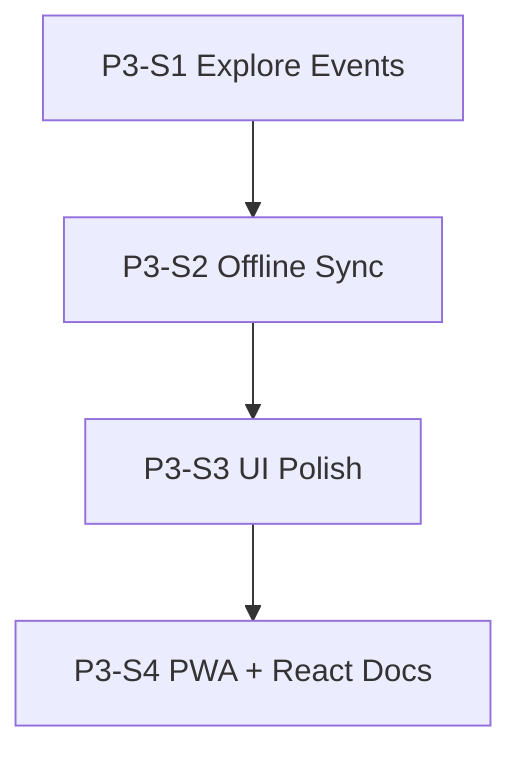

# GUI-Konsistenz & PR-Review — Sprint Plan Phase 3

Last updated: 2026-07-13

Companion to:

- [`GUI_CONSISTENCY_SPRINT_PLAN_PHASE2.md`](GUI_CONSISTENCY_SPRINT_PLAN_PHASE2.md) (abgeschlossen, #354–#374)
- [`GUI_CONSISTENCY_SPRINT_PLAN.md`](GUI_CONSISTENCY_SPRINT_PLAN.md) (Phase 1)
- [`PARALLEL_REACT_GUI.md`](PARALLEL_REACT_GUI.md)

Phase 2 (P2-S0–P2-S8) ist **merged** (#361–#374). Dieser Plan adressiert die
**13 offenen Codex-Review-Punkte** aus PRs vom 12.–13. Juli 2026, die weder
mit „Fixed“-Replies noch durch spätere Merges vollständig erledigt wurden.

Quelle: PR-Review-Auswertung 2026-07-13 (Codex-Threads #351, #355, #356, #357,
#364, #366; #358/#361/#357-Screim obsolet durch BottomSheet/API-Nachfolger).

## Stand (2026-07-13)

| PR-Bereich                   | Offene Punkte           | P3-Sprint |
| ---------------------------- | ----------------------- | --------- |
| #366 Explore Events API      | 3 funktionale Bugs      | **P3-S1** |
| #364 Offline-Sync            | 4 Edge Cases            | **P3-S2** |
| #356 / #357 UI-Polish        | 2 visuelle Regressionen | **P3-S3** |
| #355 / #351 PWA & React-Docs | 5 Infra/Doku-Lücken     | **P3-S4** |

**Bereits erledigt (nicht in Phase 3):**

- #348 / #350 / #353 — alle Codex-Kommentare mit „Fixed“ beantwortet
- #358 BottomSheet `showModal` — behoben in #365 (`browser && dialog` sync)
- #361 Client-N+1-Lookups — obsolet seit #366 Backend-Endpoint
- #357 SymptomCooccurrenceDetailSheet Doppel-Scrim — obsolet seit BottomSheet-Migration

## Findings-Register (R-01 … R-13)

| ID   | Quelle | Priorität | Kurzbeschreibung                                                                 |
| ---- | ------ | --------- | -------------------------------------------------------------------------------- |
| R-01 | #366   | P1        | Explore Events ignoriert Toolbar-Range `week` (sendet `30d`)                     |
| R-02 | #366   | P1        | Hidden/inactive Tags: Endpoint liefert keine historischen Events                 |
| R-03 | #366   | P1        | Kein Request-ID-Guard → stale Explore-Responses bei schnellem Klickwechsel       |
| R-04 | #364   | P0        | Onboarding-Tag-Erstellung übersprungen wenn Offline-Sync aktiv (auch online)     |
| R-05 | #364   | P1        | IndexedDB-Hydration mit stale Tag/Symptom-Arrays nach API-Fehler                 |
| R-06 | #364   | P1        | Slot-Merge: Sync-Konflikt-`entity_id` ≠ IndexedDB-Client-UUID                    |
| R-07 | #364   | P1        | Dedupe löscht Einträge ohne zugehörige `change_log`-Outbox                       |
| R-08 | #356   | P2        | `HomeDailyBrief` Inline-`--bar-color` überschreibt high/low-Highlights           |
| R-09 | #357   | P2        | `--app-header-height` erzeugt ~64px Lücke ohne festen Header                     |
| R-10 | #355   | P2        | Prod-SW als `type: 'module'` statt SvelteKit-empfohlenem `classic`               |
| R-11 | #351   | P3        | `pnpm dev:react` / `dev:all` dokumentiert, aber nicht in Root-`package.json`     |
| R-12 | #351   | P3        | Cookie-Guidance in `PARALLEL_REACT_GUI.md` widersprüchlich (Port vs. Host)       |
| R-13 | #351   | P3        | Setup-Rezept + Cutover-Checklist unvollständig (Shell-Schritte, forgot-password) |

## Reihenfolge (Überblick)



| P3-Sprint | Findings               | Risiko                 | Abhängigkeit                                         |
| --------- | ---------------------- | ---------------------- | ---------------------------------------------------- |
| **P3-S1** | R-01, R-02, R-03       | mittel (FE+BE)         | —                                                    |
| **P3-S2** | R-04, R-05, R-06, R-07 | hoch (Datenintegrität) | — (parallel zu S1 möglich, aber S2 zuerst empfohlen) |
| **P3-S3** | R-08, R-09             | niedrig (visuell)      | —                                                    |
| **P3-S4** | R-10, R-11, R-12, R-13 | niedrig (Docs/Infra)   | React-Scaffold optional                              |

**Empfehlung:** P3-S2 vor P3-S1, wenn nur eine Kapazität — Offline-Sync betrifft
Persistenz; Explore Events ist Analyse-UX. Wenn zwei parallele PRs möglich: S1 + S2
gleichzeitig (keine Datei-Überlappung).

---

## P3-Sprint 1 — Explore Events Hardening (R-01, R-02, R-03)

**Ziel:** `EventAlignedSmallMultiplesSheet` zeigt konsistente, korrekte Daten für
alle Toolbar-Ranges und Tag-Zustände; keine Race bei schnellem Insight-Wechsel.

**Quelle:** Codex #366 (`openExploreEvents`, `stats_service.py`, `insight_service.py`)

### R-01 — Week-Range respektieren

**Problem:** `timeseriesRangeToCooccurrence('week')` → `'30d'`; Endpoint und
Timeseries liefern 30 Tage statt 7.

**Optionen (eine wählen, in PR beschreiben):**

| Option            | Aufwand | Beschreibung                                                                                                                    |
| ----------------- | ------- | ------------------------------------------------------------------------------------------------------------------------------- |
| **A (empfohlen)** | mittel  | `TagCooccurrenceRange` um `"7d"` erweitern; `week` → `7d` mappen; `_cooccurrence_window` + Timeseries-Range `"week"` für Punkte |
| B                 | klein   | Client sendet `start_date`/`end_date` aus `analysisDateWindow(range)` als Query-Params                                          |
| C                 | klein   | Nur Frontend: nach API-Response auf Week-Fenster filtern (Events + Points) — Backend bleibt 30d                                 |

**Key files:**

- `apps/web/src/lib/utils/analysisRange.ts` (+ Test)
- `backend/app/schemas/stats.py` (`COOCCURRENCE_RANGE_DAYS`)
- `backend/app/services/stats_service.py` (`cooccurrence_range_to_timeseries`)
- `backend/app/services/insight_service.py` (`get_insight_event_windows`)
- `backend/tests/test_insights.py` (Week-Fenster-Assertion)
- `apps/web/src/routes/insights/+page.svelte`

**Akzeptanz:** Toolbar `week` → Sheet zeigt nur Events/Punkte der letzten 7 Tage
(manuell + Test mit festem `as_of`).

### R-02 — Historische Events für inactive/hidden Tags

**Problem:** `list_tag_presence_dates_by_slug` nutzt `active_tag_predicate`; UI zeigt
Explore-Button weiterhin auf inactive-Tag-Insights → leeres Sheet.

**Optionen:**

| Option            | Beschreibung                                                                                                                |
| ----------------- | --------------------------------------------------------------------------------------------------------------------------- |
| **A (empfohlen)** | Endpoint „event windows“ ohne `active_tag_predicate` (nur Lesezugriff auf historische `EntryTag`-Zeilen für `subject_slug`) |
| B                 | Explore-Button in `InsightCard` ausblenden wenn `isInactiveTag`                                                             |

Option A hält UX konsistent (Nutzer sieht Karte + kann historische Events erkunden).
Option B ist schneller, aber schlechtere UX.

**Key files:**

- `backend/app/services/stats_service.py` (`list_tag_presence_dates_by_slug`)
- optional `InsightCard.svelte` wenn Option B
- `backend/tests/test_insights.py` (hidden tag mit historischen Entries)

### R-03 — Stale-Response-Guard

**Problem:** `openExploreEvents` ohne Request-ID; Pattern existiert bereits für
Cooccurrence/Symptom-Loader auf derselben Seite.

**Maßnahme:** `exploreEventsRequestId` inkrementieren; vor State-Assignment prüfen
dass Insight-ID und Request-ID noch aktuell sind (analog `symptomWindowRequestId`).

**Key files:**

- `apps/web/src/routes/insights/+page.svelte`
- optional Vitest für Race (mock delayed fetch)

**Akzeptanz:** Schneller Doppelklick auf zwei Insights → Sheet zeigt immer Daten
des zuletzt gewählten Insights.

### Verify (P3-S1)

```bash
cd backend && uv run --python 3.12 pytest tests/test_insights.py -k event_windows
pnpm --filter @correlcore/web lint
pnpm --filter @correlcore/web test
```

Manuell: Insights → Range `week` → Explore auf Tag- und Symptom-Insight; inactive Tag
mit Historie; schneller Insight-Wechsel während Laden.

---

## P3-Sprint 2 — Offline-Sync Edge Cases (R-04, R-05, R-06, R-07)

**Ziel:** Keine stillen Datenverluste oder falschen lokalen Zustände bei
Online+Offline-Sync, Slot-Kollisionen oder Dedupe.

**Quelle:** Codex #364

### R-04 — Onboarding-Tags nicht überspringen wenn online

**Problem:** `resolveOnboardingTags()` in `EntryForm.svelte` returned bei
`canUseOfflineSync()` sofort — `completeOnboarding()` wird nie aufgerufen.

**Maßnahme:** Early-return nur wenn `canUseOfflineSync() && !navigator.onLine`
(oder `offline`-Store true). Online: `completeOnboarding()` wie bisher.

**Key files:**

- `apps/web/src/lib/components/entries/EntryForm.svelte`
- Test: Onboarding-Flow mit `canUseOfflineSync` mock + `navigator.onLine === true`

### R-05 — Keine Hydration mit stale Selections

**Problem:** Nach `Promise.allSettled` für Tags/Symptoms: bei `rejected` werden
alte `selectedTagIds`/`selectedSymptoms` trotzdem an `hydrateServerEntryFromApi`
übergeben.

**Maßnahme:**

- Bei `rejected`: Arrays für den neuen Entry leeren **oder** Hydration überspringen
- Hydration nur wenn beide Fetches `fulfilled` (oder explizit partial mit leeren Arrays)

**Key files:**

- `apps/web/src/lib/components/entries/EntryForm.svelte` (Load-Block ~Zeile 295–311)
- Test: simulierter Tag-Fetch-Fehler → IndexedDB ohne falsche Tag-IDs

### R-06 — Konflikt-`entity_id` bei Slot-Merge

**Problem:** Server merged Client-UUID in bestehenden Slot → Konflikt-Report mit
`entry.id` (Server), IndexedDB-Row mit `change.id` (Client) → Client erkennt
Konflikt nicht (`entity_id === row.entity_id`).

**Maßnahme (Backend + Frontend abgestimmt):**

- Backend: bei Slot-Merge Konflikt mit **Client-`change.id`** melden **oder**
  zusätzliches Feld `canonical_entity_id`
- Frontend: `syncOrchestrator` Konflikt-Match auch auf remapped IDs prüfen

**Key files:**

- `backend/app/services/sync_service.py`
- `apps/web/src/lib/offline/syncOrchestrator.ts` (oder wo Konflikte verarbeitet werden)
- `backend/tests/` Sync-Tests für Slot-Merge-Szenario

### R-07 — Dedupe + Outbox

**Problem:** `deleteStaleEntriesForDateSlot` löscht `entries`-Rows, lässt
`change_log` für gelöschte Client-IDs stehen → Duplikat kann zurückkommen.

**Maßnahme:**

- Vor Delete: pending changes für stale IDs auf canonical ID umschreiben **oder**
- Stale Rows mit pending outbox **nicht** löschen; stattdessen als `superseded` markieren
- Outbox-Einträge für gelöschte IDs entfernen/rewriten

**Key files:**

- `apps/web/src/lib/stores/entriesOffline.ts`
- `apps/web/src/lib/offline/` (change_log / pending changes)
- Vitest für Dedupe mit pending change

### Verify (P3-S2)

```bash
cd backend && uv run --python 3.12 pytest tests/ -k sync
pnpm --filter @correlcore/web test -- EntryForm entriesOffline sync
pnpm --filter @correlcore/web test:e2e:smoke
```

Manuell: Entry-Sheet-Onboarding mit Offline-Sync-Flag; Flugmodus-Toggle; zwei Geräte
gleicher Slot (falls Testsetup vorhanden).

---

## P3-Sprint 3 — Toolbar & Home Polish (R-08, R-09)

**Ziel:** Keine visuellen Regressionen aus Sprint-4/5-Token-Arbeit.

**Quelle:** Codex #356, #357

### R-08 — Work-Context-Bar-Highlights

**Problem:** Inline `style="--bar-color: …"` auf jeder Zeile überschreibt
`[data-highlight='high'|'low']` CSS-Regeln in `HomeDailyBrief.svelte`.

**Maßnahme (empfohlen):**

- Metrik-Basisfarbe als `--bar-metric-color` setzen
- CSS: `--bar-color: var(--bar-metric-color)` default; high/low überschreiben nur
  wenn `data-highlight !== 'none'`
- Oder: Inline-Style nur setzen wenn `data-highlight === 'none'`

**Key files:**

- `apps/web/src/lib/components/home/HomeDailyBrief.svelte`
- `HomeDailyBrief.test.ts` (optional: stress-invertiertes high/low)

### R-09 — Phantom Header Offset

**Problem:** `--app-header-height: 3.5rem` global, aber kein fixer App-Header;
`InsightsAnalysisToolbar` / `TrendsAnalysisToolbar` sticky `top` zu groß.

**Maßnahme (empfohlen):**

- `--app-header-height` auf `0px` setzen **oder** Token entfernen und Toolbar
  `top: var(--space-2)` (wie früherer Fallback)
- `FRONTEND.md` / `UI_COMPONENT_SYSTEM.md` kurz synchronisieren falls Toolbar-Verhalten
  dokumentiert ist

**Key files:**

- `apps/web/src/app.css`
- `apps/web/src/lib/components/insights/InsightsAnalysisToolbar.svelte`
- `apps/web/src/lib/components/trends/TrendsAnalysisToolbar.svelte`

### Verify (P3-S3)

```bash
pnpm --filter @correlcore/web lint
pnpm --filter @correlcore/web test -- HomeDailyBrief
pnpm check:contrast
```

Manuell: Home (Work-Context mit stress + high/low), Insights/Trends Toolbar scroll
(390px, kein Gap oben).

---

## P3-Sprint 4 — PWA & Parallel-React Docs (R-10, R-11, R-12, R-13)

**Ziel:** Korrekte SW-Registration; React-Parallel-Doku entspricht Repo-Realität.

**Quelle:** Codex #355, #351

### R-10 — Service-Worker Registration

**Problem:** `registerProdServiceWorker` nutzt `{ type: 'module' }`; SvelteKit
Manual-Registration empfiehlt `classic` für Production-Bundles.

**Maßnahme:**

```ts
await navigator.serviceWorker.register('/service-worker.js', {
  type: import.meta.env.DEV ? 'module' : 'classic',
});
```

**Key files:**

- `apps/web/src/lib/utils/serviceWorker.ts`
- Manuell: `pnpm build && pnpm preview` — SW registriert, Update-Flow ok

### R-11 — React-Dev-Scripts

**Problem:** `AGENTS.md` / `PARALLEL_REACT_GUI.md` nennen `pnpm dev:react` und
`pnpm dev:all`, Root-`package.json` hat sie nicht; `apps/web-react/` nur `CLAUDE.md`.

**Optionen:**

| Option | Beschreibung                                                                             |
| ------ | ---------------------------------------------------------------------------------------- |
| A      | Scripts in Root-`package.json` hinzufügen **mit** `echo`/Guard wenn kein Package         |
| B      | Docs auf „geplant / nach Scaffold“ umstellen bis `apps/web-react/package.json` existiert |

**Empfehlung:** B jetzt (ehrliche Doku); A wenn React-Scaffold als separates Ticket.

### R-12 — Cookie-Guidance korrigieren

**Problem:** `PARALLEL_REACT_GUI.md` behauptet teils „separate cookie jars“ pro
Port; HTTP-Cookies sind host-/path-scoped, nicht port-scoped
(`auth_cookies.py` setzt kein `Domain`).

**Maßnahme:** Abschnitt „Sessions per port“ umschreiben:

- `:5173` und `:5174` sind **verschiedene Origins** (CORS/JS), aber **Cookies für
  `localhost` werden zwischen Ports geteilt** wenn Path passt
- Side-by-side-Vergleich: gleiche Session möglich, nicht isoliert — Login einmal reicht
- `127.0.0.1` vs `localhost` bleiben getrennte Cookie-Jars

### R-13 — Setup & Cutover-Checklist

**Maßnahmen:**

1. Setup-Block: API in Terminal 1; `cd ..` / neues Terminal für `pnpm dev`
2. Cutover-Checklist: `/auth/forgot-password` ergänzen
3. `AGENTS.md`-Tabelle: React-Zeile mit „(after scaffold)“ wenn R-11 Option B

**Key files:**

- `docs/frontend/PARALLEL_REACT_GUI.md`
- `AGENTS.md`
- optional `docs/DEVELOPMENT.md`

### Verify (P3-S4)

```bash
pnpm --filter @correlcore/web build
# SW: preview + DevTools → Application → Service Workers
grep -n 'dev:react' package.json docs/frontend/PARALLEL_REACT_GUI.md AGENTS.md
```

---

## PR-Schnitt (empfohlen)

| PR  | Sprint | Titel (Vorschlag)                                                          |
| --- | ------ | -------------------------------------------------------------------------- |
| 1   | P3-S2  | `fix(web): offline-sync onboarding, hydration, dedupe outbox`              |
| 2   | P3-S1  | `fix(api+web): explore event-windows week range, hidden tags, stale guard` |
| 3   | P3-S3  | `fix(web): HomeDailyBrief highlights + toolbar sticky offset`              |
| 4   | P3-S4  | `fix(web): SW classic registration + parallel React doc corrections`       |

P3-S2 und P3-S1 können parallel; P3-S3 und P3-S4 unabhängig danach.

---

## Regression (jeder P3-Sprint)

```bash
pnpm check:contrast
pnpm check:style-tokens
pnpm --filter @correlcore/web lint
pnpm --filter @correlcore/web test
pnpm --filter @correlcore/web build
pnpm --filter @correlcore/web test:e2e:smoke
cd backend && uv run --python 3.12 ruff check . && uv run --python 3.12 pytest
```

Backend-lastige Sprints (P3-S1, P3-S2): API-Tests vor Merge obligatorisch.

---

## Entscheidungen vor Implementierung

| Sprint     | Entscheidung                                 | Default wenn keine Antwort                |
| ---------- | -------------------------------------------- | ----------------------------------------- |
| P3-S1 R-01 | `7d`-Range vs. Client-Filter vs. Query-Dates | Option A (`7d` im Schema)                 |
| P3-S1 R-02 | Historische Events vs. Button ausblenden     | Option A (Endpoint ohne active filter)    |
| P3-S2 R-06 | Konflikt-ID Client vs. Server vs. beide      | Backend emit `client_entity_id` im Report |
| P3-S4 R-11 | Scripts jetzt vs. Doku „geplant“             | Doku ehrlich (Option B)                   |

---

## Nach Phase 3

Wenn alle R-01–R-13 geschlossen:

- Phase-2-Dokument als historisch markieren (kein offener Scope)
- Optional: verbleibende `exploreEventWindows.ts` Client-Helfer (`buildExploreEventWindows`)
  als deprecated entfernen oder auf reine Test-Utilities kürzen
- React-Scaffold (`apps/web-react`) als separates Epic, nicht Teil von Phase 3
