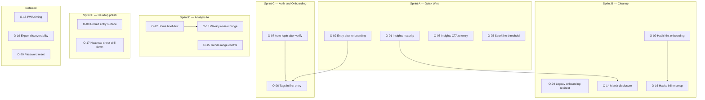

# CorrelCore — GUI Optimization Implementation Plan

**Date:** 2026-06-30  
**Status:** Approved for execution  
**Epic:** GUI Workflow Optimization (workflow analysis PR [#255](https://github.com/Sturmi77/correlcore/pull/255))

## Canonical references

| Document                                                              | Purpose                                      |
| --------------------------------------------------------------------- | -------------------------------------------- |
| [`USER_WORKFLOWS.md`](USER_WORKFLOWS.md)                              | 10 user workflows (W1–W10), personas, routes |
| [`FRICTION_AUDIT.md`](FRICTION_AUDIT.md)                              | Step matrices, friction scores, ADR checks   |
| [`OPTIMIZATION_BACKLOG.md`](OPTIMIZATION_BACKLOG.md)                  | Issue index O-01–O-20 with GitHub links      |
| [`FRONTEND_STREAMLINE_CONCEPT.md`](../FRONTEND_STREAMLINE_CONCEPT.md) | IA principles (brief-first, findings-first)  |

**Regression:** `pnpm --filter @correlcore/web test:e2e:journeys --workers=1` (12 tests)

---

## Goals

1. Reduce **time-to-first-entry** for new users (target: onboarding + first log ≤ 90s).
2. Reduce **daily capture friction** (maintain ≤ 60s rule, ADR-0013).
3. Remove **duplicate status UI** on Insights and Home.
4. Improve **weekly analysis** discoverability without adding a 6th nav tab (ADR-0017).

## Non-goals

- Gamification (streaks, badges) — DESIGN_DOCUMENT §1.4
- New primary navigation item — ADR-0017
- Password reset until backend exists (O-20 tracks dependency)
- Figma Code Connect publish (Sprint H)

---

## Dependency graph



---

## Sprint breakdown

### Sprint A — Quick wins (high impact, low effort)

**Goal:** Remove obvious friction in first-week paths without ADR changes.

| Issue                                                     | Title                                       | Workflows | Est. scope     |
| --------------------------------------------------------- | ------------------------------------------- | --------- | -------------- |
| [#250](https://github.com/Sturmi77/correlcore/issues/250) | O-01 Insights maturity consolidate (mobile) | W5, W6    | 1–2 components |
| [#251](https://github.com/Sturmi77/correlcore/issues/251) | O-02 EntrySheet after onboarding            | W2, W3    | 2 routes       |
| [#252](https://github.com/Sturmi77/correlcore/issues/252) | O-03 Insights empty CTA → entry             | W5        | 1 component    |
| [#254](https://github.com/Sturmi77/correlcore/issues/254) | O-05 Sparkline ≥3 entries                   | W5        | 1 route        |

**Shared implementation notes:**

- Introduce `?openEntry=1` query param on Home (used by O-02, O-03).
- Run `test:e2e:journeys` + `test:e2e:mobile` after each issue.

**Exit criteria:** All four issues closed; journey E2E green; no duplicate maturity block on mobile Insights.

---

### Sprint B — Cleanup and secondary surfaces

**Goal:** Close legacy paths; improve Habits and Insights detail disclosure.

| Issue                                                     | Title                                    | Workflows |
| --------------------------------------------------------- | ---------------------------------------- | --------- |
| [#253](https://github.com/Sturmi77/correlcore/issues/253) | O-04 Legacy onboarding redirect          | W2        |
| [#263](https://github.com/Sturmi77/correlcore/issues/263) | O-09 Habit hint in onboarding            | W2, W7    |
| [#273](https://github.com/Sturmi77/correlcore/issues/273) | O-11 Check-email mail-app deep link      | W1        |
| [#268](https://github.com/Sturmi77/correlcore/issues/268) | O-14 Matrix/co-occurrence maturity gates | W5, W6    |
| [#265](https://github.com/Sturmi77/correlcore/issues/265) | O-16 Habits inline setup on empty panel  | W7        |

**Exit criteria:** `/onboarding/retro` and `/profile` redirect; matrix hidden until ≥2 pointbiserial insights; empty Habits tab offers inline tag→habit flow.

---

### Sprint C — Auth and onboarding restructure

**Goal:** Shorten new-user funnel. Requires ADR work before coding.

| Step | Action                                        | Issue                                                          |
| ---- | --------------------------------------------- | -------------------------------------------------------------- |
| C1   | ADR amendment: post-verify session            | [#261](https://github.com/Sturmi77/correlcore/issues/261) O-07 |
| C2   | Backend: verify-email sets cookies + redirect | #261                                                           |
| C3   | Frontend: remove manual login after verify    | #261                                                           |
| C4   | ADR update: tags in first entry               | [#260](https://github.com/Sturmi77/correlcore/issues/260) O-06 |
| C5   | Inline tag suggestions in EntrySheet          | #260                                                           |
| C6   | Deprecate or slim `/onboarding` wizard        | #260                                                           |

**Depends on:** Sprint A O-02 (`openEntry` param).

**Exit criteria:** Register → verify → first entry without manual login; optional tag onboarding inline.

---

### Sprint D — Analysis information architecture

**Goal:** Brief-first Home; better weekly review without extra nav.

| Issue                                                     | Title                                   | Workflows  |
| --------------------------------------------------------- | --------------------------------------- | ---------- |
| [#264](https://github.com/Sturmi77/correlcore/issues/264) | O-12 Home Daily Brief brief-first       | W3, W5, W6 |
| [#266](https://github.com/Sturmi77/correlcore/issues/266) | O-13 Home bridge to top insight/trend   | W6         |
| [#271](https://github.com/Sturmi77/correlcore/issues/271) | O-15 Trends global sticky range control | W6         |

**Design input:** [`FRONTEND_STREAMLINE_CONCEPT.md`](../FRONTEND_STREAMLINE_CONCEPT.md) Home + Insights sections.

**Exit criteria:** Home zone 2 leads with insight/context before CTA dominance; one range control on Trends desktop.

---

### Sprint E — Desktop entry and drill-down consistency

**Goal:** Phase 5 entry workspace; consistent drill-down patterns.

| Issue                                                     | Title                                         | Workflows |
| --------------------------------------------------------- | --------------------------------------------- | --------- |
| [#262](https://github.com/Sturmi77/correlcore/issues/262) | O-08 Unified desktop entry surface            | W3, W4    |
| [#267](https://github.com/Sturmi77/correlcore/issues/267) | O-17 Heatmap drill-down via EntryHistorySheet | W4, W6    |

**Exit criteria:** `FRONTEND_STATUS.md` Entry web → green; no full-page route break from Trends heatmaps on mobile.

---

### Sprint F — Deferred backlog

**Goal:** Polish remaining low-friction items without backend dependencies.

| Issue                                                     | Title                              | Workflows |
| --------------------------------------------------------- | ---------------------------------- | --------- |
| [#269](https://github.com/Sturmi77/correlcore/issues/269) | O-18 PWA install after first entry | W10       |
| [#270](https://github.com/Sturmi77/correlcore/issues/270) | O-19 Export section prominence     | W9        |

**Exit criteria:** New users see entry CTA before PWA banner; export panel visible near top of Settings on mobile.

---

### Still blocked → planned as Sprint G

| Issue                                                     | Item                | Plan                                                         |
| --------------------------------------------------------- | ------------------- | ------------------------------------------------------------ |
| [#272](https://github.com/Sturmi77/correlcore/issues/272) | O-20 Password reset | [`O-20_PASSWORD_RESET_PLAN.md`](O-20_PASSWORD_RESET_PLAN.md) |

**Sprint G** implements backend + frontend + E2E. Reuses email-verification token pattern (ADR-0004).

---

## Technical patterns (reuse across sprints)

### `openEntry` query contract

```
/?openEntry=1  →  Home mounts, opens EntrySheet once, then strips query (replaceState)
```

Used by: O-02, O-03, potentially O-06.

### Single maturity object per screen

Rule from FRONTEND_STREAMLINE: one `InsightStageHeader` OR `MobileInsightLead`, never both. Phase badge on cards must not restate full phase model.

### Maturity gates for advanced UI

| UI element             | Show when                             |
| ---------------------- | ------------------------------------- |
| Insight cards          | `phase !== collecting'` or ≥7 entries |
| Matrix tab             | ≥2 pointbiserial insights             |
| Co-occurrence sections | `min_count` threshold met             |
| Home sparkline         | ≥3 entry points (O-05)                |

### Test matrix per sprint

| Gate              | Command                                                     |
| ----------------- | ----------------------------------------------------------- |
| Lint/types        | `pnpm lint && pnpm typecheck`                               |
| Unit              | `pnpm test`                                                 |
| Journeys          | `pnpm --filter @correlcore/web test:e2e:journeys`           |
| Mobile regression | `pnpm --filter @correlcore/web test:e2e:mobile --workers=1` |
| Smoke             | `pnpm --filter @correlcore/web test:e2e:smoke`              |

---

## Success metrics (post-implementation)

Track against DESIGN_DOCUMENT §1.6:

| Metric                      | Baseline (audit)       | Target                   |
| --------------------------- | ---------------------- | ------------------------ |
| Steps W1 (account → app)    | 7 GUI steps, 4 screens | ≤5 steps, 3 screens      |
| Steps W2 (first entry)      | 9 steps, ~2 min        | ≤4 steps, ≤60s           |
| Steps W3 (daily mobile)     | 2 taps minimum         | unchanged (already good) |
| Duplicate maturity blocks   | 2 on mobile Insights   | 1                        |
| Legacy onboarding reachable | yes                    | redirect only            |

---

## GitHub tracking

- **Issues:** O-01–O-20 — full index in [`OPTIMIZATION_BACKLOG.md`](OPTIMIZATION_BACKLOG.md)
- **Epic PR:** [#255](https://github.com/Sturmi77/correlcore/pull/255) (analysis deliverables)
- **Quick wins:** #250–#254 · **Strategic:** #260–#263 · **IA/Polish:** #264–#271 · **Deferred/Blocked:** #269–#272
