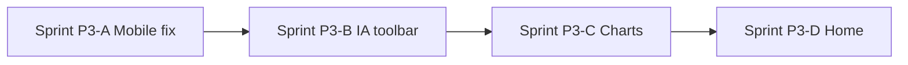

# CorrelCore — GUI Optimization Phase 3

**Date:** 2026-07-02  
**Predecessor:** Phase 2 complete — [`GUI_OPTIMIZATION_PHASE2.md`](GUI_OPTIMIZATION_PHASE2.md) (O-21–O-42, PR #288–#302)  
**Source:** User findings (Heute + Erkenntnisse), Codex review follow-ups (#302), [`FRONTEND_STREAMLINE_CONCEPT.md`](../FRONTEND_STREAMLINE_CONCEPT.md)

> **Naming:** „Phase 3“ here means **GUI optimization round 3** (after O-01–O-42). It is **not** the completed [Mobile Insights Phase 3](../MOBILE_INSIGHTS_PHASE3_SPRINT_PLAN.md) (`MobileInsightLead` hierarchy).

Phase 2 delivered IA foundations (global `analysisRange`, findings-first Insights, EntrySheet unification, spacing tokens). Phase 3 targets **interpretability** and **mobile correctness**: insights that actually render on phone, analytics that stay visible, charts that fit the viewport, and a Home screen that surfaces one strong insight instead of duplicate CTAs and low-signal facts.

---

## 1. Product decisions (locked)

Decisions from planning review (2026-07-02):

| Area | Decision |
| ---- | -------- |
| **Heute — dual CTA** | Zone-3 „Heutigen Eintrag bearbeiten“ entfernen, wenn Entry existiert; kompakte Aktion in `HomeTodayContext` bleibt |
| **Heute — Sparkline** | Entfernen zugunsten Insight-Lead (7/14-Tage-Frage entfällt) |
| **Heute — Facts-Row** | Ersetzen durch **Top Insight** (robuster Lead-Snippet, kein Häufigkeits-Ranking) |
| **Erkenntnisse — Mobile empty** | Bug: robust + Insights vorhanden, Mobile zeigt trotzdem Empty — unabhängig von Zeitraum/Filter |
| **Erkenntnisse — Analytics** | „Analyse vertiefen“ Accordion auflösen — **alles permanent sichtbar** (O-14-Gates bleiben) |
| **Erkenntnisse — Toolbar** | **Zweizeilig** sticky: Zeile 1 = Zeitspanne, Zeile 2 = Kategorie-Chips + Matrix-Link |
| **Symptom-Kalender** | GitHub-Grid behalten + **Legende / Kurz-Erklärung** |
| **Mobile Range** | Insights **max. 90 Tage** (`quarter`); `year` auf Mobile nicht anbieten oder auf `quarter` mappen |
| **Sprint-Reihenfolge** | **Insights first**, dann Heute |

---

## 2. Root-cause summary (findings → code)

### 2.1 Heute

| Finding | Root cause | Files |
| ------- | ---------- | ----- |
| Zwei Bearbeiten-Buttons | ADR-0017 Zone 1 + Zone 3; Streamline-Spec „kein CTA wenn Entry existiert“ nie umgesetzt (O-08 verfestigte Dual-CTA) | `+page.svelte`, `HomeTodayContext.svelte` |
| Sparkline wertlos | Mood-only, 7d, day-slot, keine Einordnung; Streamline wollte Integration in Brief | `HomeSparkline.svelte`, `+page.svelte` |
| Auffälliger Tag / Symptom | DE-Label „Tag“ = Kalendertag; Metrik = reine 7d-Häufigkeit, kein Insight | `HomeDailyBrief.svelte`, `de.json` |

### 2.2 Erkenntnisse

| Finding | Root cause | Files |
| ------- | ---------- | ----- |
| Mobile immer Empty | **Render-Gap:** bei `compactInsights && primaryMobileInsight && remaining.length === 0` wird `InsightFeed` nicht gemountet; zusätzlich `feedLoading` maskiert Cache, `compactInsights` erst nach `onMount` | `insights/+page.svelte` L666–694 |
| Empty-Copy „keine passenden…“ | `insights.length === 0` + Phase `robust` → `insights.feed.empty_phase.robust` | `InsightFeed.svelte` |
| Accordion | Bewusst O-22 findings-first + lazy co-occurrence fetch | `insights/+page.svelte` `
` |
| Symptom-Analytics versteckt | O-24: `showSymptomAnalytics` nur bei `filterTab === 'symptoms'` | `insights/+page.svelte` |
| Zwei Toolbars | O-22 + O-23 parallel, nicht integriert | `insights-sticky-toolbar`, `insights-findings-toolbar` |
| Charts overflow Mobile | Insights nutzt fixes `compareDailyAxisLayout`; Trends nutzt `compareDailyAxisLayoutFromRoot` | `SymptomAnalyticsSection.svelte`, `SymptomTrendOverlay.svelte` |
| Kalender schwer lesbar | 10–12px GitHub-Grid ohne Legende; lange Ranges → horizontales Scrollen | `SymptomCalendarHeatmap.svelte` |

### 2.3 Frühere Entscheidungen, die Phase 3 revidiert

| ID | Phase-2-Entscheidung | Phase-3-Revision |
| -- | -------------------- | ---------------- |
| Streamline Sprint D | Kein generischer CTA nach Entry | **O-54** umsetzen |
| O-05 | Sparkline-Gate ≥3 Entries | **O-55** Sparkline entfernen |
| O-12 / Facts-Row | Brief-first + Facts behalten | **O-56** Facts → Top Insight |
| O-22 | Analytics unter Fold (`
`) | **O-48** permanent |
| O-24 | Symptom-Analytics an Filter gebunden | **O-49** entkoppeln |
| O-23 | `year` in globaler Range | **O-52** Mobile-Cap 90d auf Insights |

---

## 3. Backlog O-43 – O-56

Legende: **Open** = Phase 3 backlog. Impact / Effort wie Phase 2.

### 3.1 Insights — Mobile correctness & loading (Sprint P3-A)

| ID | Impact | Effort | Title | Klasse | Root cause / notes |
| -- | ------ | ------ | ----- | ------ | ------------------ |
| O-43 | **Critical** | Medium | Fix mobile Insights feed: robust phase + insights present must not show empty | Bugfix | Render-Gap L666–694; repro: Mobile, beliebiger Filter/Range |
| O-44 | High | Low | Stale-while-revalidate: show cached `insightStore` during `loadInsights()` | Bugfix | `feedLoading` blocks cached cards |
| O-45 | High | Low | `compactInsights` without layout flash (SSR-safe initial mobile branch) | Bugfix | `compactInsights` false until `onMount` |
| O-46 | Medium | Low | InsightFeed subtitle uses `$analysisRange` window, not hardcoded 90d | Vereinfachen | `InsightFeed.svelte` `insights.feed.subtitle` |

### 3.2 Insights — IA & toolbar (Sprint P3-B)

| ID | Impact | Effort | Title | Klasse | Notes |
| -- | ------ | ------ | ----- | ------ | ----- |
| O-47 | High | Medium | Insights: zweizeilige sticky Toolbar (Range Zeile 1, Filter+Matrix Zeile 2) | Zusammenführen | Ersetzt getrennte `sticky-toolbar` + `findings-toolbar` |
| O-48 | High | Medium | Remove `
` accordion — analytics body always visible | Eliminieren | Lazy-fetch on mount when `showAdvancedAnalytics`; keep O-14 gates |
| O-49 | High | Low | Decouple `SymptomAnalyticsSection` from `filterTab === 'symptoms'` | Revidiert O-24 | Symptom block always in analytics when phase allows |

### 3.3 Insights — Charts & mobile range (Sprint P3-C)

| ID | Impact | Effort | Title | Klasse | Notes |
| -- | ------ | ------ | ----- | ------ | ----- |
| O-50 | High | Medium | Insights heatmaps: `compareDailyAxisLayoutFromRoot` (parity with Trends) | Vereinfachen | `SymptomAnalyticsSection.svelte` |
| O-51 | High | Medium | `SymptomTrendOverlay`: responsive width, readable axis labels | Vereinfachen | HTML labels or adaptive viewBox |
| O-52 | High | Low | Mobile Insights: cap analysis range at 90d (`quarter`); hide or remap `year` | Vereinfachen | `analysisRange` store or page guard ≤640px |
| O-53 | Medium | Medium | Symptom calendar: legend + interpretation copy (intensity / presence) | Vereinfachen | `SymptomCalendarHeatmap.svelte`, i18n |

### 3.4 Heute — Brief-first cleanup (Sprint P3-D)

| ID | Impact | Effort | Title | Klasse | Notes |
| -- | ------ | ------ | ----- | ------ | ----- |
| O-54 | High | Low | Remove Zone-3 home CTA when `todayEntry` exists | Eliminieren | Streamline Sprint D; keep `home-today-action` |
| O-55 | Medium | Low | Remove `HomeSparkline` zone and related fetch gate (O-05) | Eliminieren | Delete component usage; optional keep util for Trends |
| O-56 | High | Medium | Replace Daily Brief facts row with Top Insight snippet | Zusammenführen | Drop frequency tags/symptoms; bridge uses insight preview |

---

## 4. Sprint plan (execution order)

Insights first, dann Heute. Jeder Sprint = ein PR, rebased auf `main`.

### Sprint P3-A — Insights Mobile correctness

**Branch:** `cursor/sprint-p3a-insights-mobile-03a1`  
**Issues:** O-43, O-44, O-45, O-46  
**Goal:** Mobile zeigt vorhandene Insights zuverlässig; kein falscher robust-Empty-State.

| Task | Acceptance |
| ---- | ---------- |
| Fix render condition in `+page.svelte` | Mobile + ≥1 insight → Lead **oder** Feed sichtbar; nie Empty bei `insights.length > 0` |
| SWR loading | Cached insights visible while refetching; skeleton only when cache empty |
| Mobile hydration | No desktop→mobile layout jump on first paint |
| Dynamic subtitle | Context line matches selected `analysisRange` days + `entryCount` |

**Tests:** Extend `page.test.ts`, `mobile-insights-foundation.spec.ts` with fixture: robust + 3 insights, assert no `insight-feed-empty` on mobile viewport.

**Risk:** Low — isolated to `/insights` load/render lifecycle.

---

### Sprint P3-B — Insights IA & permanent analytics

**Branch:** `cursor/sprint-p3b-insights-ia-03a1`  
**Issues:** O-47, O-48, O-49  
**Goal:** Zweizeilige Toolbar; Analytics ohne Aufklappen; Symptom-Block immer erreichbar.

| Task | Acceptance |
| ---- | ---------- |
| `InsightsAnalysisToolbar.svelte` (new) | Row 1: `SegmentedControl` range; Row 2: filter `TabBar` + matrix link |
| Remove `
` | Analytics sections visible by default when `canShowAdvancedAnalytics` |
| Fetch on mount | Co-occurrence / tag clusters load when section visible (not on toggle) |
| O-24 revision | `SymptomAnalyticsSection` not gated by `filterTab` |

**Tests:** E2E opens `/insights` on mobile — symptom heatmap visible without accordion + without switching to Symptome tab.

**Risk:** Medium — cross-component IA; revokes O-24 filter binding (document in PR).

---

### Sprint P3-C — Insights charts & mobile range

**Branch:** `cursor/sprint-p3c-insights-charts-03a1`  
**Issues:** O-50, O-51, O-52, O-53  
**Goal:** Charts interpretierbar; kein horizontal page overflow; Mobile max 90d.

| Task | Acceptance |
| ---- | ---------- |
| Responsive heatmap axis | Same pattern as `TrendsComparePanel` |
| Trend overlay | Axis labels readable at 390px; plot uses available width |
| Mobile range cap | ≤640px: range options `week` \| `month` \| `quarter` only; switching to desktop restores `year` |
| Calendar legend | Visible legend for cell colors + 1-line „how to read“ copy |

**Tests:** `mobile-insights-foundation.spec.ts` — `document.documentElement.scrollWidth <= clientWidth` at 390px with quarter range + mock heatmap.

**Risk:** Medium — chart geometry; coordinate with O-52 store persistence (don't corrupt desktop `year` preference).

---

### Sprint P3-D — Home brief cleanup

**Branch:** `cursor/sprint-p3d-home-brief-03a1`  
**Issues:** O-54, O-55, O-56  
**Goal:** Ein Entry-Pfad; kein Sparkline; Brief = Top Insight.

| Task | Acceptance |
| ---- | ---------- |
| Conditional Zone-3 CTA | `{#if !todayEntry}` wraps full-width CTA only |
| Remove sparkline zone | `HomeSparkline` import/usage removed; `HOME_SPARKLINE_*` constants gone |
| Top Insight facts | Facts row shows ranked top insight (statement + confidence) or compact phase fallback |
| Weekly bridge | `trendsBridgePreview` from insight label, not tag frequency |

**Tests:** `page.test.ts` — with mock `todayEntry`, assert `home-cta` absent, `home-today-action` present; no `home-sparkline`.

**Risk:** Low — Home-only; reverses O-05 sparkline gate (intentional).

---

## 5. Dependency graph

| Blocker | Blocked |
| ------- | ------- |
| O-43 (mobile feed fix) | O-47–O-53 (QA baseline) |
| O-48 (permanent analytics) | O-49, O-50–O-53 (symptom section always visible) |
| O-52 (mobile range cap) | O-50, O-51 (chart density) |
| P3-A–C complete | P3-D (Home can ship independently but Insights-first order) |

---

## 6. Exit criteria (Phase 3 complete)

- [x] Mobile `/insights`: user in `robust` with insights never sees `insight-feed-empty` unless API truly returns zero insights
- [x] Analytics sections visible without user toggle; O-14 maturity gates unchanged
- [x] Two-row analysis toolbar on Insights; range + filter visually grouped
- [x] Symptom heatmap/trend charts: no page-level horizontal overflow at 390px with quarter range
- [x] Symptom calendar has legend + interpretation copy
- [x] Home: single edit action when today's entry exists; no sparkline; facts row = top insight
- [x] `OPTIMIZATION_BACKLOG.md` O-43–O-56 marked Done
- [x] `FRICTION_AUDIT.md` Phase 3 section updated

---

## 7. Out of scope (Phase 3)

- Backend insight engine changes (new insight types)
- Trends page redesign (only shared chart utilities)
- Figma resync (optional follow-up)
- Desktop Home layout beyond CTA/sparkline/facts changes

---

## 8. References

- [`OPTIMIZATION_BACKLOG.md`](OPTIMIZATION_BACKLOG.md) — O-43–O-56 index
- [`FRONTEND_STREAMLINE_CONCEPT.md`](../FRONTEND_STREAMLINE_CONCEPT.md) — Home brief intent
- [`GUI_OPTIMIZATION_PHASE2.md`](GUI_OPTIMIZATION_PHASE2.md) — completed predecessor
- PR #302 — Codex range/slot lifecycle fixes (prerequisite for stable Insights loading)
