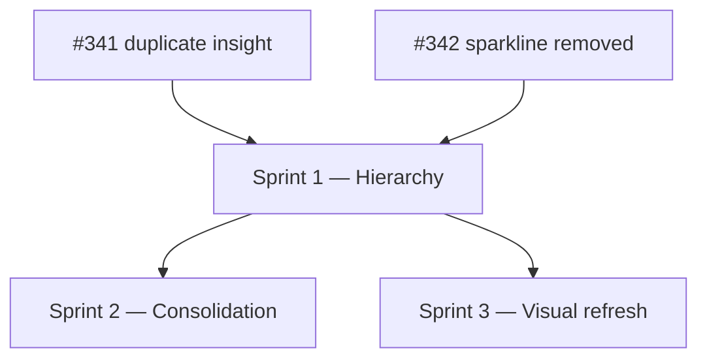

# Insight-Statement-Pattern — Sprint Plan

Last updated: 2026-07-11

Companion to [`INSIGHT_STATEMENT_PATTERN.md`](INSIGHT_STATEMENT_PATTERN.md)
(the design-direction record — read that first for the _why_ behind each
item). This plan sequences the **not-yet-implemented** items from that doc
into shippable batches. IDs are prefixed `ISP-` and are not yet backed by
GitHub issues — file them individually before starting a sprint if this
team wants GitHub-tracked work, or work straight off this table for a
solo pass.

## Already landed (Sprint 0, retroactive)

| PR                                                      | Title                                                              | Status     |
| ------------------------------------------------------- | ------------------------------------------------------------------ | ---------- |
| [#341](https://github.com/Sturmi77/correlcore/pull/341) | Remove duplicate insight display in `HomeDailyBrief`               | **Merged** |
| [#342](https://github.com/Sturmi77/correlcore/pull/342) | Remove synthetic sparkline from expanded `InsightCard`             | **Merged** |
| [#343](https://github.com/Sturmi77/correlcore/pull/343) | Document all remaining proposals in `INSIGHT_STATEMENT_PATTERN.md` | Open       |

These removed two sources of misleading content (duplicated statement,
fabricated trend line) without touching layout — a safe base for the
hierarchy work below.

## Overview

| ID    | Sprint | Priority | Effort | Title                                                                      |
| ----- | ------ | -------- | ------ | -------------------------------------------------------------------------- |
| ISP-1 | 1      | High     | Medium | `InsightCard`: statement becomes Level 0, `buildTitle()` becomes a caption |
| ISP-2 | 1      | High     | Low    | `HomeDailyBrief`: swap title/statement visual weight                       |
| ISP-3 | 1      | Medium   | Low    | `InsightFeed`: pass `featured` to the top-ranked insight                   |
| ISP-4 | 2      | Medium   | Medium | Consolidate 6 evidence components into one evidence row                    |
| ISP-5 | 3      | Low      | Low    | Metric-color identity (accent by `insight.metric`)                         |
| ISP-6 | 3      | Low      | Low    | Use `--text-xl` for the featured statement                                 |
| ISP-7 | 3      | Low      | Medium | Purposeful motion (reveal animation, `prefers-reduced-motion`-aware)       |
| ISP-8 | 3      | Low      | Low    | Card-elevation rule (interactive vs. static surfaces)                      |
| ISP-9 | 3      | Low      | Medium | Icon-size scale tokens (`--icon-sm/-md/-lg`)                               |

**Out of scope for this plan:** replacing the removed sparkline with a
real historical-data chart (needs a backend endpoint decision, separate
scoping); a full visual identity change beyond the insight-bearing
surfaces; the earlier React-vs-Svelte question (resolved as orthogonal —
this plan assumes the existing SvelteKit codebase).

## Dependency graph



| Dependency               | Reason                                                                                                                                                                     |
| ------------------------ | -------------------------------------------------------------------------------------------------------------------------------------------------------------------------- |
| S1 → ISP-4               | The evidence row replaces markup inside `InsightCard`'s header/meta area — needs the new card shape from ISP-1 first, or the two changes will conflict in the same region. |
| S1 → ISP-6               | `text-xl` targets the featured statement — that text has to already be the primary element (ISP-1) before its size matters.                                                |
| ISP-3 ⊥ S1               | Independent of the hierarchy swap — could ship in Sprint 1 as a quick win alongside ISP-1/ISP-2, or standalone earlier if useful as a smaller first PR.                    |
| ISP-5/7/8/9 ⊥ each other | No cross-dependencies — can be split across separate small PRs in any order within Sprint 3.                                                                               |

## Sprint 1 — Hierarchy (the core fix)

**Verify:**

- `InsightCard` collapsed state: `insight.statement` renders first, largest,
  full-color; `buildTitle()`'s output is a small `Level 2` caption (or
  dropped in favor of the metric accent from ISP-5, if sequenced together).
- `MaturityBadge` moves out of the card header into the meta row — confirm
  it no longer renders as its own block above the statement.
- `HomeDailyBrief` lead: `.daily-brief__statement` becomes the `h2`-weight
  line; `.daily-brief__title` (`subject_label ?? metric`) becomes a Level-2
  caption or is dropped.
- `MobileInsightLead` needs no direct changes — confirm visually that it
  inherits the fix once `InsightCard` is updated (it wraps `InsightCard`
  with `featured`).
- `InsightFeed` passes `featured` to `filtered[0]`; the rest of the list
  stays at the current compact treatment.

**Key files:** `InsightCard.svelte`, `HomeDailyBrief.svelte`,
`InsightFeed.svelte`, `MobileInsightLead.svelte` (verification only)

**Tests:** `InsightCard.test.ts`, `HomeDailyBrief.test.ts`,
`InsightFeed.test.ts` (add an assertion that the first rendered card has
`data-featured="true"`), existing `insights/+page.test.ts` /
`page.test.ts` for Home

**Acceptance:** a screenshot of `/insights` and `/` shows the statement
sentence as the visually dominant text on every card, with no card
showing two different renderings of the same insight (regression guard
for the #341 class of bug).

## Sprint 2 — Consolidation

**Verify:**

- `InsightMaturityBadge`, `InsightConfidenceScale`, `InsightQualityMeter`,
  `InsightJourneyBanner`, `InsightJourneyExplainer` are replaced by one
  evidence-row component (tier chip + confidence dots + sample count) used
  identically in `InsightCard`'s Level-2 area, `InsightFeed`, and
  `MobileInsightLead`.
- `InsightStageHeader`'s milestone-progress copy is confirmed out of scope
  (distinct from per-insight evidence) and left untouched — check its one
  call site in `MobileInsightLead` still compiles against the new card
  shape from Sprint 1.
- No component that previously imported one of the five consolidated
  components is left with a dangling import.

**Key files:** new `InsightEvidence.svelte` (or similar), `InsightCard.svelte`,
`InsightFeed.svelte`, `MobileInsightLead.svelte`; deletions in
`components/insights/{InsightMaturityBadge,InsightConfidenceScale,InsightQualityMeter,InsightJourneyBanner,InsightJourneyExplainer}.svelte`

**Tests:** new `InsightEvidence.test.ts` covering tier/confidence/sample
rendering; update or remove the five components' existing test files;
grep the full `apps/web/src` tree for any remaining import of the
removed components before merging.

**Acceptance:** exactly one component renders the maturity/confidence/
sample signal, wherever it appears.

## Sprint 3 — Visual refresh

Five independent, low-risk items — each is a legitimate standalone PR and
none blocks the others. All reuse the existing `app.css` token system;
ISP-9 is the only one introducing new tokens (icon sizes), and those are
additive.

**Verify (per item):**

- **ISP-5 Metric-color identity:** insight card accent (direction glyph,
  left border) is colored via `--color-metric-mood/-energy/-stress` by
  `insight.metric`, not a generic primary/success/error. Confirm the
  tokens are now referenced somewhere other than `charts.ts`.
- **ISP-6 `text-xl`:** the featured card's statement uses `--text-xl`;
  non-featured cards keep their current size. Confirm the jump reads as
  intentional, not just "slightly bigger," at both the `text-xl` min and
  max clamp values.
- **ISP-7 Motion:** a ~300ms reveal (opacity + translateY, existing
  `--transition-interactive` easing) plays when the featured statement
  first renders; confirm it's suppressed under
  `prefers-reduced-motion: reduce`.
- **ISP-8 Elevation rule:** interactive/tappable cards (`InsightCard`,
  `EntryLaunchButton`, `TagPicker`, …) get `box-shadow` plus a real hover/
  press state; static info panels (`HomeDailyBrief` lead, `InlineAlert`,
  disclaimer boxes) stay border-only. Confirm `InsightCard`'s previously
  dead `transition: box-shadow 200ms` now actually fires on hover.
- **ISP-9 Icon scale:** before introducing `--icon-sm/-md/-lg`, audit the
  actual size distribution (`size={14/16/18/20/22/40/72}` found during the
  original grep) and pick values that cover the real usage, not three
  arbitrary round numbers — then migrate call sites incrementally.

**Key files:** `app.css` (ISP-9 tokens only), `InsightCard.svelte` (ISP-5,
ISP-6, ISP-7, ISP-8), `Panel.svelte` / other card-like `common/`
components (ISP-8 rule applied consistently), icon call sites across
`components/` (ISP-9, can be migrated file-by-file)

**Tests:** mostly visual/manual — these are presentation-only changes.
Where a component has snapshot or DOM-structure tests, confirm class names
referenced by tests (e.g. `insight-card__direction--{dirClass}`) still
match after the color-by-metric change.

## Governance

- No 6th nav tab, no new screens — this plan only touches existing
  insight-bearing surfaces (ADR-0017).
- No gamification — evidence-row consolidation must not turn
  confidence/maturity into a score-like or competitive display
  (DESIGN_DOCUMENT §1.4).
- **Color tokens stay fixed** — no new palette entries. ISP-5 and ISP-8
  reuse existing tokens; ISP-9 is the only addition (new icon-size scale,
  not colors).
- Confounder notes, disclaimer links, and the medical/correlation
  disclaimer must remain reachable at Level 2 in every sprint — none of
  this plan removes user-facing safety copy, only repositions it.

## Regression commands

```bash
pnpm --filter @correlcore/web lint
pnpm --filter @correlcore/web typecheck
pnpm --filter @correlcore/web test
pnpm --filter @correlcore/web test:e2e:smoke
```

Run the full `test:e2e:mobile` suite after Sprint 1 specifically — it's
the sprint most likely to shift layout enough to affect mobile viewport
snapshots (`mobile-theme-parity.spec.ts`, `m7-insights-mobile.spec.ts`).
