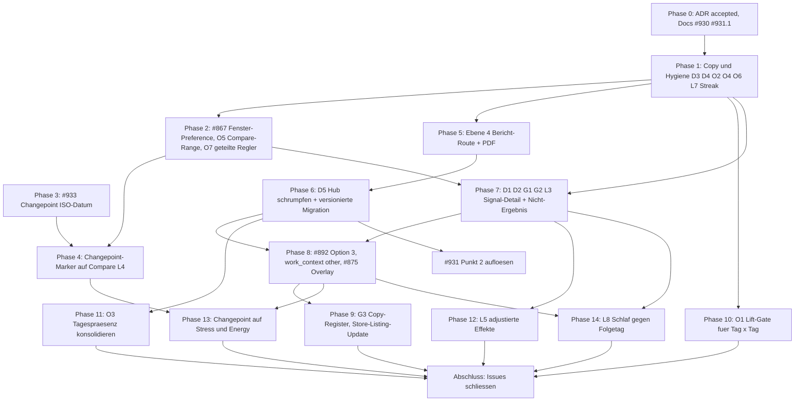

# Umsetzungsplan: Insight Surface Layers

**Stand:** 2026-09-18 · **Status:** Vorschlag zur Umsetzung · **Grundlage:** [ADR-0043](../adr/0043-insight-surface-layers.md)

Dieses Dokument führt die sechs offenen Analyse- und Feature-Issues im Bereich #875–#933 zu einer
durchgehenden Umsetzungssequenz zusammen. Es ersetzt keine der Issues — es ordnet sie, macht die
Wechselwirkungen explizit und benennt je Schritt die betroffenen Stellen im Code.

Betroffene Issues:

- [#928](https://github.com/Sturmi77/correlcore/issues/928) — Darstellungsformen aus User-Perspektive (D1–D5, O1–O7, L1–L9)
- [#930](https://github.com/Sturmi77/correlcore/issues/930) — Zielgruppen- und Positionierungsschärfung (G1–G6)
- [#875](https://github.com/Sturmi77/correlcore/issues/875) — Burnout-Prävention als Domain-Erweiterung
- [#892](https://github.com/Sturmi77/correlcore/issues/892) — Morgens/Mittags/Abends aus Log-Zeit ableiten
- [#931](https://github.com/Sturmi77/correlcore/issues/931) — DESIGN_DOCUMENT §2.10 Export-Status und Matrix-Widerspruch
- [#933](https://github.com/Sturmi77/correlcore/issues/933) — Changepoint-Payload braucht ein ISO-Datum

Mitberührt: [#867](https://github.com/Sturmi77/correlcore/issues/867) (globaler Trend-Zeitraum, Vorarbeit für Phase 2),
[#720](https://github.com/Sturmi77/correlcore/issues/720) / [#721](https://github.com/Sturmi77/correlcore/issues/721)
(Store-Listing und Data Safety — laufen bewusst **nicht** hinter diesem Plan).

## Ausgangslage

Die sechs Issues sind kein Stapel unabhängiger Features, sondern eine Kette: #928 ist das Gate für
#930, #875 und #931 Punkt 2; #933 ist die einzige harte Voraussetzung für den Changepoint-Marker;
#892 hat seinen alten Konsumenten (#891) verloren und seinen neuen in #875 gefunden.

Bereits erledigt und nutzbar: [ADR-0043](../adr/0043-insight-surface-layers.md) fixiert das
Vier-Ebenen-Modell, die Evidenzsprache mit zwei Nennern, die Umdefinition von
`Time-to-First-Insight` und die zwei Vorbedingungen für das Schrumpfen von Ebene 1. Die
Amendment-Notiz in [ADR-0017](../adr/0017-frontend-screen-architecture.md) ist ebenfalls drin.

Die Entscheidungen D1–D5 und G1–G6 werden in diesem Plan als **getroffen** behandelt (Votum der
Issue-Threads): D1 ja, D2 ja, D3 natürliche Häufigkeiten mit zwei Nennern, D4 Wörter trennen, D5 Hub
schrumpft mit versionierter Migration; G1/G2/G4/G5/G6 wie votiert, G3 zurückgestellt bis Ebene 2
steht; #875 Option 1 mit benanntem Composite, opt-in; #892 Option 3 als Unterpunkt von #875.

## Abhängigkeiten

Nicht in dieser Kette und bewusst **nicht** wartend: #720 / #721 (Store-Listing, Data Safety) laufen
mit dem heutigen Mood/Habit-Anker weiter. G3 wird später ein Listing-Update, kein Blocker für den
Play-Store-Pfad.

Die Phasen 10–14 sind die vormals „bewusst liegengelassenen" Punkte aus #928 (O1, O3, L3, L5, L8)
plus die Changepoint-Erweiterung aus #875 §C.3. Sie sind eingeplant, nicht geparkt — die Recherche
hat gezeigt, dass drei davon deutlich billiger sind als angenommen und zwei davon größer.

## Phase 0 — Basis herstellen

- [ADR-0043](../adr/0043-insight-surface-layers.md) von `Proposed` auf `Accepted` setzen, Datum ergänzen.
- #931 Punkt 1: [docs/DESIGN_DOCUMENT.md](../DESIGN_DOCUMENT.md) §2.10 Zeile 278 korrigieren. Nicht nur „PNG implementiert", sondern der volle Befund: PNG ist implementiert (in `InsightMatrix.svelte`), PDF existiert in **keiner** Ebene, und Export hat keine gemeinsame Fläche. Verweis auf ADR-0043 Ebene 4.
- §1.6: `Time-to-First-Insight < 14 Tage` wird zu `Time-to-First-Answer < 14 Tage` (Befund oder Nicht-Befund). Das ist die in ADR-0043 §5 festgehaltene Vorbedingung für D2 — muss vor Phase 7 stehen, sonst widerspricht die Metrik der Positionierung.
- #930 Docs-Änderung an [docs/DESIGN_DOCUMENT.md](../DESIGN_DOCUMENT.md): §1.3 bleibt P1+P2, ergänzt um eine **Auslöser-Liste** (Rückkehr nach Krankheit, neuer Remote-Job, ärztliche Bitte um Aufzeichnung, Phase schlechten Schlafs) und einen eigenen Abschnitt „Betrieb / Vertriebsweg" (Operator als Kanal, `DEPLOYMENT_MODE` aus [backend/app/core/config.py](../../backend/app/core/config.py), Zeile 102). Keine neuen Personas. §1.5 Nicht-Ziele (heute Zeilen 68–74) um drei Zeilen erweitern: kein ADHS-Produkt, kein Symptom-Tracker als Produktkategorie, keine Team-Sicht / Arbeitgeber-Auswertung / Multi-Tenant / Support-Versprechen für Fremdbetrieb. Tiefe als Produktprinzip deklarieren (Verweis ADR-0043), nicht als Segmentachse.
- Issue-Kommentare mit den formalen Entscheidungen zu D1–D5 und G1–G6, damit die Threads geschlossen lesbar sind. #928 und #930 bleiben offen bis die jeweiligen Implementierungsphasen durch sind; #931 Punkt 2 bleibt bis Phase 6.

## Phase 1 — Copy und Hygiene (D3, D4, L7 und die Überschneidungen)

Reine Copy- und i18n-Arbeit, keine Architekturfolgen, sofort sichtbar. Beide Locales gemeinsam
ändern — [localeCompleteness.test.ts](../../apps/web/src/lib/i18n/localeCompleteness.test.ts)
erzwingt Parität.

- **D3 Evidenzsprache.** Das Muster existiert schon an den neuesten Stellen und wird zur Regel: `trends.compare.coincidence.summary` („Beide an {both} von {aTotal} Tagen mit {a} · {both} von {bTotal} Tagen mit {b}") und `trends.esm.split_counts`. Übertragen auf: Insight-Karte (`insights.card.*`), Tag-Kookkurrenz und Matrix. Lift/p/FDR bleiben internes Gate und Expertendetail hinter Disclosure.
- Präzisierung gegenüber #928: Die Tag-Kookkurrenz ist **nicht** eine nackte Zahl ohne Nenner. `TagCooccurrencePair` liefert bereits `count`, `pct_of_a` und `pct_of_b` (`get_tag_cooccurrence` in [stats_service.py](../../backend/app/services/stats_service.py), Zeilen 531–538) — beide Nenner sind also vorhanden und müssen nur in die Copy gezogen werden. Das macht diesen Teil von O1 zu reiner Copy-Arbeit. Der wirklich fehlende Teil ist das interne Gate und wird eigenes Arbeitspaket (Phase 10).
- **D4 Wörter trennen.** „Zeitversatz" bezeichnet ausschließlich Korrelation mit Vorzeichen (`insights.lag_heatmap.*`, `insights.card.lag_*`). „Abfolge" bezeichnet die Präsenzfolge (`trends.compare.lag1.*`). Keine gemeinsame Beschriftung mehr. Löst O2 auf der Copy-Seite.
- **M05 umbenennen.** `insights.matrix.*` heißt heute „Korrelations-Matrix" und ist eine sortierte Tabelle. Umbenennen in Richtung Bericht/Tabelle, konsistent mit dem Ziel aus Phase 5. Löst O4 zusammen mit einer einzigen Konfidenz-Darstellung.
- **O6 eine Konfidenzsprache.** [InsightEvidence.svelte](../../apps/web/src/lib/components/insights/InsightEvidence.svelte) ist die kanonische Quelle (Reife-Chip + Punkteskala + n). Matrix-Prozentspalte und Habit-r auf dieselbe Darstellung ziehen; das Unsicherheitsband aus `SymptomTrendOverlay` als Muster dokumentieren, nicht als vierten Begriff.
- **L7 Ghost-Tabs entfernen.** `trends.tabs.mood`, `.activities`, `.health` aus [de.json](../../apps/web/src/lib/i18n/locales/de.json) und [en.json](../../apps/web/src/lib/i18n/locales/en.json) löschen (`TrendTab = 'compare' | 'habits'`). Nicht nachbauen. In [USER_WORKFLOWS.md](USER_WORKFLOWS.md) W6 die Tab-Liste „Compare | Health | Habits" auf den Ist-Stand korrigieren, ebenso W9 (`/settings/data` statt `/settings`, ZIP ergänzen).
- **Streak-Namenserbe auflösen.** Billiger als gedacht, weil es keine Datenbankspalten gibt: `current_streak` / `longest_streak` werden in `get_entry_streak` ([stats_service.py](../../backend/app/services/stats_service.py), Zeilen 277–315) zur Laufzeit aus `Entry.entry_date` gerechnet. Entscheidend ist der zweite Befund: `fetchEntryStreak` in [stats.ts](../../apps/web/src/lib/api/stats.ts) hat **keinen Produktions-Aufrufer** — nur Tests, Dev-Fixtures und E2E-Mocks; die UI-Zahlen sind mit #852 verschwunden. Ebenso sind `trends.streak.*`, `trends.consistency.*` und `home.streak_label` verwaiste i18n-Keys ohne Komponentenreferenz.
  - Verwaiste i18n-Keys löschen. Die Wächter bleiben: [noGamificationCopy.test.ts](../../apps/web/src/lib/i18n/noGamificationCopy.test.ts) verbietet das Wort in Copy, [TrendsHealthContext.test.ts](../../apps/web/src/lib/components/trends/TrendsHealthContext.test.ts) die Rekordzahlen.
  - Für den Endpunkt `GET /api/v1/entries/stats/streak` die ehrliche Wahl treffen: **stilllegen** statt umbenennen. Er hat keinen Konsumenten, und ein Rename wäre ein Contract-Bruch (Pydantic, OpenAPI-Regen, `stats.ts`-DTO, alle Mocks) für eine Funktion, die niemand aufruft.
  - `computeEntryStreak` in [streak.ts](../../apps/web/src/lib/utils/streak.ts) ebenfalls prüfen und entfernen — aber `localIsoDate` und `shiftIsoDate` bleiben, die haben rund 15 Importeure und sind allgemeine Datums-Helfer. Sie gehören in ein Datums-Util umgezogen, dann verschwindet der Dateiname mit.

## Phase 2 — Ein ehrliches Zeitfenster (#867 plus O5)

Der Kern des Vertrauensbruchs: Home rechnet server-fix 28 Tage
([dashboard_service.py](../../backend/app/services/dashboard_service.py) `TREND_WINDOW_DAYS = 28`),
Trends/Insights nutzen den Client-Store `cc_analysis_range`, und Compare ignoriert beides und fixiert
365 Tage.

- **#867 Server-Preference.** Spalte `trend_window_days` auf [user_preference.py](../../backend/app/models/user_preference.py) (Integer-Enum 14 | 28 | 90, Default 28) plus Alembic-Migration, Pydantic-Schema in [user_preferences.py](../../backend/app/schemas/user_preferences.py), Service-Zweig in [user_preferences_service.py](../../backend/app/services/user_preferences_service.py). `dashboard_service` parametrisieren; `trend_window_days` in der `/dashboard/summary`-Antwort spiegelt den effektiv genutzten Wert (existiert bereits als Feld).
- Settings-UI ergänzen, und [analysisRange.ts](../../apps/web/src/lib/stores/analysisRange.ts) so anpassen, dass der Server-Wert die Quelle ist und `localStorage` nur noch Cache. Damit gilt „ein Fenster pro Aussage" tatsächlich für Home, Trends und Insights.
- **O5 Compare bekommt den Regler zurück.** In [trends/+page.svelte](../../apps/web/src/routes/trends/+page.svelte): `showRangeControl={activeTab !== 'compare'}` (Zeile 458) auf `true`, `activeRange = activeTab === 'compare' ? 'year' : uiRange` und `compareWindowDays = 365` (Zeilen 167–171) durch den gewählten Range ersetzen, den Reaktiv-Block `activeTab !== 'compare'` (Zeilen 372–381) entschärfen, `displayRange` (Zeile 405) nachziehen. Das erfüllt das dokumentierte, bis heute offene W6-Kriterium „User can switch time range (week/month/quarter/year)".
- **Fenster sichtbar beschriften.** Compare zeigt heute nur den Zoom-Status („{days} days / cell", `COMPARE_ZOOM_STAGES = [1,3,7,14,28]`) und im Heatmap-Header die sichtbare Datumsspanne. Ein Label „letzte {n} Tage" am Chart ergänzen, analog `habits.window_last`. Der Zoom bleibt davon getrennt: Fenster = Grundgesamtheit, Zoom = Auflösung.
- **ESM von Compare erreichbar machen.** [EventAlignedSmallMultiplesSheet](../../apps/web/src/lib/components/trends/EventAlignedSmallMultiplesSheet.svelte) hängt heute nur an einer Insight-Karte ab Phase `provisional`. Wer in Compare zwei Zeilen pinnt, bekommt eine „diese Frage prüfen"-Aktion. Das ist der Zugang von Ebene 3 zu Ebene 2 und wird in Phase 7 auf das Signal-Detail umgehängt.
- Regressionsrisiko: die Compare-Achse ist auf ein Jahr ausgelegt (`clampAxisRangeToData` in [trendsDateAxis.ts](../../apps/web/src/lib/utils/trendsDateAxis.ts), Bucket-Logik in [compareAxisZoom.ts](../../apps/web/src/lib/utils/compareAxisZoom.ts)). Bei 7-Tage-Fenster muss die Zoom-Stufe sinnvoll geklemmt werden, sonst zeigt eine Zelle mehr Tage als das Fenster hat. Dafür Tests in [UnifiedStripChart.test.ts](../../apps/web/src/lib/components/trends/UnifiedStripChart.test.ts) und [ComparisonHeatmap.test.ts](../../apps/web/src/lib/components/trends/ComparisonHeatmap.test.ts) erweitern.
- **O7 gemeinsame Regler — gehört hierher, nicht in eine Hygiene-Runde.** Der Breakpoint ist `DESKTOP_SHELL_BREAKPOINT_PX = 768` ([surfaceContract.ts](../../apps/web/src/lib/ui/surfaceContract.ts)). [CompareOverlayControls.svelte](../../apps/web/src/lib/components/trends/CompareOverlayControls.svelte) ist das aus #919 vorhandene Muster und wird zur Vorlage: der Parent besitzt State und Persistenz, die geteilte Komponente besitzt Markup und Gate-Copy, `testIdPrefix` erlaubt zwei DOM-Instanzen.
  - Doppeltes Markup zusammenführen: Sortierung ([TrendsComparePanel.svelte](../../apps/web/src/lib/components/trends/TrendsComparePanel.svelte) 600–614 gegen [TrendsCompareSettingsSheet.svelte](../../apps/web/src/lib/components/trends/TrendsCompareSettingsSheet.svelte) 159–174), Modus (577–597 gegen 137–157), Layer-Checkboxen (534–573 gegen 80–121). Der State liegt schon gemeinsam auf Seitenebene — dupliziert ist nur die Oberfläche.
  - Der eigentliche Befund ist keine Dopplung, sondern eine **Lücke**: Fokus-/Cluster-Chips (Panel 618–648) und der Dichte-/Zoom-Regler (Panel 652–681) existieren **nur** auf dem Desktop und fehlen im mobilen Sheet vollständig.
  - Daraus folgt eine harte Bedingung für O5: der neue Zeitraum-Regler muss in **beide** Flächen, sonst ist das W6-Kriterium desktop-only erfüllt und der Vorwurf „zwei Pfeile, zwei Grundgesamtheiten" bleibt für Mobilnutzer bestehen.

## Phase 3 — #933 Changepoint bekommt ein ISO-Datum

Backend-only, keine Blocker, kann parallel zu Phase 1/2 laufen.

- In [changepoint.py](../../backend/app/services/insights/changepoint.py) `_changepoint_candidates` erweitern. Die Daten liegen bereits vor: `AnalyticsEntry.entry_date` existiert, und die Sequenz ist über `_dedupe_daily_entries` datumssortiert und tagesweise dedupliziert — `changepoint_index` zeigt also sauber auf `entries[index]`.
- Payload ergänzen um `changepoint_date` (`entries[index].entry_date`, letzter Tag des Vorher-Segments), `shift_date` (`entries[index + 1].entry_date`, erster Tag des Nachher-Segments) und `changepoint_dates` für die volle `changepoints`-Liste. Beide Daten, weil `detect_changepoints()` laut Docstring „zero-based indices immediately before a detected shift" liefert und die Segmente `moods[:index+1]` / `moods[index+1:]` sind: der Wechsel liegt **zwischen** zwei Tagen, nicht auf einem.
- `subject_label` von `entry_47` auf das Datum umstellen, `statement` ebenso.
- Erkennung bleibt unverändert: PELT `rbf`, Penalty 3.0, `MIN_SEGMENT_SIZE = 5`, max. 3 Changepoints, `ANALYTICS_MIN_ENTRIES_CHANGEPOINT = 60`. Keine neuen Serien — Stress-/Energy-Changepoints sind ausdrücklich nicht in diesem Scope (§C.3 in #875 ist an dieser Stelle falsch und wird beim Durchgang auf „mood-only" korrigiert).
- Tests: Index→Datum bei Lücken in der Eintragsfolge, Randfall `index + 1` außerhalb der Serie. [test_changepoint.py](../../backend/tests/test_changepoint.py) deckt heute nur `detect_changepoints` ab — `_changepoint_candidates` hat noch keinen Test.
- Kein OpenAPI-Regen nötig: `payload` ist im Schema bereits `dict[str, Any]` beziehungsweise `additionalProperties: true`.

## Phase 4 — Changepoint-Marker auf der Compare-Achse (L4)

Rider auf Phase 2, kein eigenständiges Feature. Die Infrastruktur ist vollständig vorhanden, es fehlt
nur der Produzent.

- [EventMarkerLayer.svelte](../../apps/web/src/lib/components/trends/EventMarkerLayer.svelte) kennt `phase_transition` in `EventMarkerKind`, aber nichts erzeugt es — der Kind existiert bisher nur in Tests. `trends/+page.svelte` übergibt `markers` gar nicht an `TrendsComparePanel`, obwohl das Prop existiert und dort mit Koinzidenz- und Lag-1-Markern gemerged wird.
- Changepoint-Insights laden, `changepoint_date` / `shift_date` aus dem Payload zu einem Marker `kind: 'phase_transition'` machen und über den bestehenden `markers`-Pfad einspeisen. Bei aktiver Zoom-Stufe die Marker auf Bucket-Starts remappen — das Muster existiert in [MetricTimeseries.svelte](../../apps/web/src/lib/components/trends/MetricTimeseries.svelte) (Zeilen 233–249) und [UnifiedStripChart.svelte](../../apps/web/src/lib/components/trends/UnifiedStripChart.svelte) (207–224).
- `before_avg` / `after_avg` als zwei Segment-Mittellinien zeichnen. Das sind genau die zwei Werte, die das Mockup G3 zeigt, und sie liegen schon im Payload.
- Die in Phase 2 entstehende Frage entscheiden: ein Changepoint **außerhalb** des gewählten Fensters verschwindet nicht, sondern bleibt als Randmarker sichtbar. Sonst wechselt die Aussage mit dem Fenster, und genau das war der O5-Vorwurf.
- Ebene 1 (der Satz) muss mit: `statement` wird heute als englischer Backend-String durchgereicht (`stripLegacyInsightStatementTails` übersetzt nicht). Für den Changepoint wird die Karte aus dem Payload lokalisiert gerendert (Datum, Richtung, zwei Mittelwerte) statt `statement` roh anzuzeigen. Das ist die in #933 als „offene Kleinigkeit" markierte Stelle und betrifft nur diese Insight-Familie.
- Leitplanke: Formulierung „Niveauwechsel", nicht „ausgelöst durch". Der Changepoint bleibt in der neutralen Ebene und wandert **nicht** in das Belastungs-Overlay aus Phase 8.

## Phase 5 — Ebene 4: die Bericht-Fläche (Vorbedingung für D5) ✅

Ohne diese Fläche ist D5 nicht durchführbar: `correlation_matrix` aus dem Default zu nehmen würde
den einzigen PNG-Export des Produkts entfernen.

- [x] Neue sekundäre Route `/insights/report` innerhalb der Insights-Route. Kein fünfter Primary Screen, Bottom-Nav unverändert — so festgelegt in ADR-0043 §2.
- [x] Inhalt nach Mockup E6: Effekt, Abdeckung (Sample-n bis Phase 7 beide Nenner liefert), **eine** Konfidenzskala (`InsightEvidence`), Datenreife, Abdeckungszahlen, Disclaimer, Zeilen abwählbar. Dichte ist hier richtig, weil ein Ausdruck eine Tabelle sein soll.
- [x] Export an einem Ort zusammenführen: `exportPng()` nach [insightMatrixExport.ts](../../apps/web/src/lib/utils/insightMatrixExport.ts) verlagert; CSV/JSON über `downloadExport` / `saveBlob`; **PDF** clientseitig neu. ZIP bleibt auf `/settings/data` (Datenschutz-Export).
- [x] ADR-0043 §1: Export-Controls nicht mehr in `InsightMatrix` — Link zur Bericht-Route statt PNG-Button.
- [x] Datenschutz: Der Bericht zeigt aggregierte Zeilen, kein Einzeltag. Disclaimer und Nicht-Diagnose-Hinweis im Bericht.

## Phase 6 — D5: Ebene 1 schrumpfen, mit versionierter Migration ✅

Jetzt existiert ein Landeplatz. Der Default-Flip allein wirkt aber nicht.

- [x] Befund im Code: `merge()` in [sectionPreferences.ts](../../apps/web/src/lib/utils/sectionPreferences.ts) behandelt gespeicherte Präferenzen als maßgeblich und hängt nur **fehlende** Keys aus den Defaults an.
- [x] **Versionierung:** Spalte `insight_sections_version` (Alembic `050`) plus einmalige Transformation in `migrate_insight_sections_to_current` (Backend + Frontend-Spiegel). Lazy Persistenz beim GET/PATCH `/user/preferences`.
- [x] Neuer Default: `stage_header` + `insight_feed` an; `correlation_matrix`, `lag_heatmap`, `dismissed`, `symptom_analytics`, `tag_groups`, `tag_cooccurrence` aus dem Default-Viewport (Keys bleiben gültig). Hub zeigt „Weitere Werkzeuge"-Zeile inkl. Bericht-/Settings-Links und ausgeblendeter Erkenntnisse.
- [x] Explizite `enabled: false`-Wahlen bleiben erhalten; reine Legacy-Defaults werden auf das schlanke Layout ersetzt.
- [x] #931 Punkt 2 / §2.10 und ADR-0017 an ADR-0043 angeglichen.

## Phase 7 — D1, D2, G1, G2: Ebene 2 und das Nicht-Ergebnis

Der eine echte Neubau. Zweistufig, damit die Evidenzsprache validiert wird, bevor die Fläche entsteht.

- **Schritt A — G2 in der Karte.** `insight-card__level2` in [InsightCard.svelte](../../apps/web/src/lib/components/insights/InsightCard.svelte) (Zeilen 510–547) existiert und enthält heute nur `InsightEvidence` plus ein technisches Meta-Grid. Dort den Verteilungsvergleich „mit / ohne" mit zwei Nennern einsetzen. Keine neue Route, kein Nav, reversibel. Das macht den häufigsten Insight-Typ (`pointbiserial`) erstmals prüfbar und schließt L2.
- Dafür ist eine **Payload-Erweiterung im Backend** nötig: die Karte kennt heute nur `effect_size`, `confidence` und `sample_n`. Für zwei Nenner und eine Verteilungsdarstellung braucht `pointbiserial` die Gruppengrößen und eine Verteilungsangabe (Zählungen je Stufe oder Quantile) im Payload. Analog zum Lag-Profil, das schon über `payload.method === 'lag'` und `payload.lag_profile` läuft. Payload ist untypisiert (`JSONB` / `dict[str, Any]`), also additiv ohne Contract-Bruch.
- **Schritt B — D2 Nicht-Ergebnis.** Derselbe Rahmen, anderes Ende, plus nächste Handlung (Mockup E3). Überlappende Verteilungen **sind** die Antwort „X hat nichts verändert" — das schließt L9 fast kostenlos mit ab. Voraussetzung ist die §1.6-Änderung aus Phase 0, sonst zählt dieses Ergebnis metrisch weiter als „kein Insight".
- **Schritt C — D1 Signal-Detail.** Route `/insights/signal/[id]` als sekundäre Fläche (ADR-0043 §2). Ablauf nach Mockup E2: Satz → mit/ohne (G2) → Verlauf/ESM → **G1 Streudiagramm hinter Progressive Disclosure**. Lift bleibt hinter ⓘ. Das schließt L1, L2 und L6 auf einer Fläche und ist der Landeplatz für die Lag-Heatmap aus Phase 6.
- Jede Ebene-1-Aussage bekommt genau **einen** Vorwärtspfad hierher (ADR-0043 §1), und die in Phase 2 gebaute Compare-Aktion zeigt hierher statt direkt aufs ESM.
- **G4 Forest-Plot wird nicht gebaut**, aber **L3 wird beantwortet.** ADR-0017 Zeile 15 verwirft die duale Stärke×Konfidenz-Darstellung für diese Zielgruppe wörtlich, also ist der Forest-Plot nicht die Antwort. Die Lücke selbst ist echt: ein Effekt von 0,33 bei n=18 und einer von 0,62 bei n=34 sehen heute fast gleich aus. Die Antwort liegt in einem Muster, das die App schon besitzt und nur an einer Stelle nutzt — das explizite Unsicherheitsband in `SymptomTrendOverlay` (bis Phase `robust`). Dieses Band auf das Signal-Detail und den Bericht ausdehnen. Zusammen mit den zwei Nennern (n steht dann im Satz) ist L3 gedeckt, ohne eine abstrakte Geometrie einzuführen.
- **L5 ist nicht mehr zurückgestellt**, sondern Phase 12 — mit dem Produktentscheid als erstem Schritt.
- Datenschutz: G1/G2 zeigen erstmals Einzeltage als Punkte. Bleibt lokal zum Account, erhöht aber die Re-Identifizierbarkeit in geteilten Screenshots — dieselbe Behandlung wie beim PNG-Export vorsehen.

## Phase 8 — #892 Option 3, `work_context` neutral, #875 Belastungs-Overlay

Erst hier, weil der Overlay sonst als neunte Sektion auf einem Hub landet, der gerade geschrumpft
wurde.

- **#892 Option 3.** Nicht-uniques, abgeleitetes Feld `logged_local_hour` / `inferred_period` aus der **ersten** lokalen Schreibzeit des Tages; `entries.slot` bleibt `day`. TZ-Logik aus [widget_service.py](../../backend/app/services/widget_service.py) wiederverwenden (`resolve_zone`, IANA vom Client, Fallback UTC). ADR-0016 bleibt gewahrt: Write-Zeit nur als Kovariate zu `entry_date`, nie als Zeitindex. In Export und Delete einbeziehen. Optionen 2, 4 und 6 im Issue-Body ausdrücklich verwerfen: `slot` zu schreiben riskiert 409 gegen den Unique-Constraint `(user_id, entry_date, slot)` und bricht die Tracking-Consistency-Berechnung, die in [streak.ts](../../apps/web/src/lib/utils/streak.ts) ausschließlich `slot === 'day'` zählt.
- **`work_context` braucht einen neutralen Wert.** Der Enum in [entry.py](../../backend/app/models/entry.py) (Zeilen 82–90) ist `homeoffice | office | vacation | sick | weekend | travel` — es gibt kein `other`. Wer in Elternzeit, Studium, Rente oder Arbeitslosigkeit ist, muss falsch labeln oder das Feld leer lassen. Das trifft ausgerechnet die in #875 vorgeschlagene Leitsituation (Wiedereinstieg nach Krankheit). Enum-Wert `other` plus Migration und UI-Option ist Voraussetzung sowohl für den Recovery-Teil des Composite als auch für G3 in Phase 9.
- **#875 Option 1.** Feature-Doc analog [cycle-tracking.md](../features/cycle-tracking.md): Framing, opt-in, Sprache, Composite-Definition mit Heuristik-Kennzeichnung.
- Opt-in Boolean auf `user_preferences` (nicht Feature-Flag), Default `false` — anders als `cycle_tracking_enabled`, das `true` ist. `analytics_enabled` bleibt Master-Switch. Kein eigenes Delete nötig, weil es ein Thin Overlay auf bestehenden Entry-Daten ist.
- Benannter Composite als Insight-/Home-Payload **ohne** neues Persistenzfeld am Entry: „Belastungsmuster der letzten 14 Tage" aus Stress↑ + Energy↓ + `fatigue`-Häufigkeit, beide Nenner gegen die Vorperiode, Trend-Slope über Fenster als Input. Maturity-gegated, als Heuristik gekennzeichnet.
- Keine neuen Tags. `overtime` ≈ `work_intense`, `recovery_day` ≈ `vacation`/`weekend`; das Recovery-Signal `achievement` ist mit #890 schon entstanden. Das After-Hours-Signal kommt aus `inferred_period` („Erst-Log nach 22:00"), nicht aus einem neuen Tap.
- Landung auf **Ebene 1** als eigener opt-in Bereich nach Mockup E5, mit Disclaimer, der Leitplanke „niemals mit einem Arbeitgeber" und zwei CTAs nach Ebene 2. Keine parallele Burnout-IA, keine neunte Hub-Sektion.
- Keine klinischen Inventare (MBI/CBI), keine neuen Pflichtfelder, kein Changepoint im Overlay.

## Phase 9 — G3 und die Positionierungsfolge

- Erst wenn Ebene 2 ausgeliefert ist und die Fenster ehrlich sind: das Copy-Register „Arbeitsmuster-Vokabular" aktivieren. Klinisches Vokabular nie. Mood/Habit nicht streichen, solange W3/W7 der Alltag sind; `work_context` bleibt Differenzierungsfeld, wird nicht Kategorie-Titel.
- Store-Listing (#720) ist bis dahin mit dem heutigen Anker ausgeliefert; G3 wird ein Listing-Update. Die Data-Safety-Deklaration (#721) muss mit der **finalen** Copy übereinstimmen — je näher an „Belastung/Burnout", desto größer das in der SWOT genannte Health-Claim-Risiko.

## Phase 10 — O1: eine Kookkurrenz-Statistik statt drei (Backend-Gate)

Die Copy-Hälfte ist in Phase 1 erledigt. Hier folgt die Statistik-Hälfte, und die ist eine echte
Asymmetrie: Symptom×Tag ist die statistisch ehrlichste Fläche der App, Tag×Tag die naivste.

- Ist-Stand Symptom×Tag ([symptom_analytics.py](../../backend/app/services/symptom_analytics.py)): Lift (`observed / expected`, Zeilen 349–351), Fisher-exakt, phi, jaccard, Benjamini-Hochberg mit `SYMPTOM_FDR_ALPHA = 0.10`, plus Confounder-Erkennung über Wochentag, Arbeitssituation und Kalenderkontext aus [weekday_confounder.py](../../backend/app/services/weekday_confounder.py).
- Ist-Stand Tag×Tag (`get_tag_cooccurrence` in [stats_service.py](../../backend/app/services/stats_service.py), Zeilen 465–548): reine Zählung plus zwei Prozentwerte. Kein Lift, kein Signifikanztest, keine Confounder-Flags, und die Aggregation läuft auf Entry-/Slot-Ebene statt tagesweise dedupliziert.
- Also: Lift, Fisher/FDR und die Confounder-Prüfung für Tag×Tag nachziehen. `_cooccurrence_stats` und `weekday_confounder.py` sind wiederverwendbar; nicht wiederverwendbar ist die Tagesaggregation — `_dedupe_daily_symptom_entries` hat kein Tag-Pendant.
- Zweck ist bewusst **nicht** eine dritte Zahl in der Oberfläche, sondern das Gate: welches Paar überhaupt gezeigt wird. `min_count` steht heute auf Default 2 ohne jede Signifikanzprüfung — das ist der Grund, warum „Sport + Spaziergang: 12" ohne Einordnung erscheinen kann. Lift und FDR entscheiden über die Auswahl und das Ranking, die Anzeige bleibt bei den zwei Nennern.
- Achtung Mehrfachtests: die beiden Familien nutzen unterschiedliche Alphas (`SYMPTOM_FDR_ALPHA = 0.10` gegen `FDR_ALPHA = 0.05` in [insights/shared.py](../../backend/app/services/insights/shared.py)). Eine dritte Familie darf das nicht weiter zersplittern — Alpha bewusst wählen und dokumentieren.

## Phase 11 — O3: Tagespräsenz konsolidieren

Korrektur am Inventar von #928: Es sind nicht „4× dasselbe". Es sind **zwei Flächen auf einer
geteilten Komponente plus zwei eigenständige Geometrien**.

- Geteilt ist bereits: [ComparisonHeatmap.svelte](../../apps/web/src/lib/components/trends/ComparisonHeatmap.svelte) dient sowohl den Compare-Kontextzeilen (`TrendsComparePanel`) als auch der Symptom-Heatmap in `SymptomAnalyticsSection` — dieselbe Komponente, nur ein anderer `headingKey`. Die Vermutung aus #928 trifft also zu, und es ist nichts zu tun.
- Der „Symptomverlauf" ist dagegen **nicht** dieselbe Komponente, sondern `SymptomTrendOverlay` — ein Liniendiagramm mit Unsicherheitsband, keine Tageszellen. Es gehört gar nicht in die O3-Gruppe, sondern ist die Vorlage für L3 in Phase 7.
- Echte Arbeit ist genau eine Stelle: das Habit-Raster [TagHeatmap.svelte](../../apps/web/src/lib/components/trends/TagHeatmap.svelte) baut ein eigenes CSS-Grid (`repeat(var(--day-count), 0.8rem)`) statt `DailyAxisLayout` zu nutzen, obwohl es dieselbe `heatmapLevel`-Skala verwendet. Auf die geteilte Achse und das geteilte Zellen-Primitiv ziehen — damit fällt die dritte Achsen-Implementierung weg und das Raster ist mit den Compare-Zeilen ausgerichtet.
- `SymptomCalendarHeatmap` bleibt eigenständig und wird **nicht** vereinheitlicht: die Wochentag×Woche-Achse ist ihr Alleinstellungsmerkmal (Saisonalität) und der einzige Ort, an dem das sichtbar wird. Zu entscheiden ist nur, ob sie binär bleibt (`cell.present`) oder Intensitätsstufen bekommt — heute wirft sie Intensität weg, die `ComparisonHeatmap` zeigt.

## Phase 12 — L5: adjustierte Effekte und Confounder sichtbar machen

Erst ab Ebene 2, weil ein adjustierter Effekt auf Ebene 1 kausaler klingt als ein roher. Erster
Schritt ist der Produktentscheid, den #928 als Frage 4 stellt und der bis heute offen ist.

- Ist-Stand: [multivariate_analytics.py](../../backend/app/services/multivariate_analytics.py) rechnet LassoCV (`MIN_ML_ENTRIES = 90`, `MIN_ABS_LASSO_COEFFICIENT = 0.05`, `TIMESERIES_SPLITS = 5`) und eine Lag-Analyse mit `LAG_FDR_ALPHA = 0.10`. Beide landen als `InsightType.SYMPTOM_CLUSTER` mit `payload.method` `"lasso"` oder `"lag"`.
- Der entscheidende Befund: **kein Payload enthält heute einen rohen und einen adjustierten Effekt für dasselbe Paar.** Die OLS-adjustierten Koeffizienten werden in `weekday_confounder.py` berechnet, aber nur als Boolean-Gate benutzt und **nie serialisiert**. In der UI erscheint davon lediglich ein Hinweissatz (`insights.work_context_confounded_note`, gerendert in [InsightCard.svelte](../../apps/web/src/lib/components/insights/InsightCard.svelte) Zeilen 371–374) und ein gestrichelter Zellrand in `SymptomCooccurrenceHeatmap`.
- Umsetzung, wenn der Entscheid „ja" lautet: den adjustierten Koeffizienten neben dem rohen ins Payload schreiben — das ist die konkrete fehlende Daten-Hälfte, nicht eine neue Rechnung.
- Darstellung nur im Signal-Detail hinter Disclosure, und **nicht** als „bereinigter" Wert. Das Wort fällt nicht; die Aussage bleibt in der Form der zwei Nenner („auch an Tagen mit derselben Arbeitssituation: X von Y"). Ein Nicht-Übrigbleiben ist dabei ein gültiges Ergebnis und trifft sich mit D2.
- Wenn der Entscheid „nein" lautet: als solches im ADR festhalten und den Hinweissatz behalten. Nicht ein drittes Mal vertagen.

## Phase 13 — Changepoint auf Stress- und Energy-Serien

Erweiterung der Engine, nicht Reuse — genau die Korrektur, die #875 §C.3 fehlerhaft als „bereits
abgedeckt" führt.

- Heute läuft die Erkennung ausschließlich auf `mood_score` (`metric = "mood_changepoint"`). `_changepoint_candidates` über eine Serienliste generalisieren, `metric` wird `stress_changepoint` / `energy_changepoint`.
- Mehrfachtest-Frage, die vor dem Code zu klären ist: drei Serien verdreifachen die Changepoint-Familien. PELT liefert keinen p-Wert, die Kontrolle sind Penalty und die Obergrenze von drei Changepoints — zu entscheiden ist, ob die Obergrenze pro Serie oder global gilt.
- Das Gate `ANALYTICS_MIN_ENTRIES_CHANGEPOINT = 60` liegt über der `robust`-Schwelle von 30. Eine Stress-Changepoint-Familie ist also für die meisten Nutzer lange unsichtbar. Das ist ein Argument dafür, den heuristischen Composite aus Phase 8 als sichtbares Artefakt zu behandeln und diese Familie als späte Belohnung, nicht umgekehrt.
- Der Marker aus Phase 4 wird unverändert wiederverwendet, ebenso die Leitplanke: neutrale Ebene, keine Prognose-Lesart, nicht im Belastungs-Overlay. Deshalb steht diese Phase hinter dem Framing-Entscheid aus Phase 8 und nicht direkt hinter Phase 4.

## Phase 14 — L8: Schlaf gegen den Folgetag

Auch hier war die Einschätzung zu pessimistisch: die **Erkennung existiert schon**, es fehlt die
Darstellung.

- `run_lag_analysis` in [multivariate_analytics.py](../../backend/app/services/multivariate_analytics.py) verschiebt Prädiktoren per `shift(lag_days)` über Lags 1–7 und behandelt Schlaf ausdrücklich als Prädiktor, nie als Ziel („prior sleep explains mood/energy", Zeilen 431–454). Der Zusammenhang „Schlaf heute Nacht → Stimmung morgen" ist also bereits ein Insight, mit FDR-Korrektur.
- Was fehlt, ist dreierlei:
  - **Die Serie.** Die Timeseries-API liefert nur `sleep_quality_avg` — `sleep_minutes` ist kein Timeseries-Key. Für einen Vergleich auf der Compare-Achse muss die Dauer dazu; das ist eine Schema-Änderung mit OpenAPI-Regen (`export_openapi.py`, dann `pnpm --filter @correlcore/api-types generate`).
  - **Der Ort.** Die Lag-Aussage bekommt ihr Zuhause im Signal-Detail aus Phase 7, mit der Lag-Achse und den zwei Nennern. `_sleep_spearman_candidates` in [correlation.py](../../backend/app/services/insights/correlation.py) bleibt daneben, ist aber ausdrücklich **taggleich** — die beiden dürfen in der UI nicht denselben Namen tragen (das ist D4 in der Anwendung).
  - **Die optionale Compare-Geste.** Die Schlafserie um einen Tag versetzt anzeigen, als benannter, beschrifteter Modus — keine stille Transformation. Beschriftung „Zeitversatz", nicht „Abfolge".
- Wird durch Phase 8 nicht billiger als gedacht, aber ergänzt: `inferred_period` liefert zusätzlich „Erst-Log nach 22:00" als Kovariate neben der Schlafdauer.

## Abschluss

- Erst wenn die Phasen 0–14 durch sind: #928, #930, #931, #875, #892, #933 schließen. Nach der Regel in [AGENTS.md](../../AGENTS.md) tragen nur die jeweils abschließenden PRs `Closes`; Teil-PRs verwenden `Relates to`. Die Analyse-Issues #928 und #930 dürfen nicht mit einem Docs- oder Chart-PR geschlossen werden.
- #928 trägt die meisten Einzelpunkte (O1–O7, L1–L9, D1–D5). Beim Abschluss explizit auflisten, welche davon umgesetzt und welche bewusst verworfen wurden — G4 (Forest-Plot) und L7-Nachbau sind Verwerfungen, nicht Auslassungen.
- Weiterhin offen bleibt danach nur: die in #930 H.4 gewünschte Interview-Validierung (in diesem Plan bewusst kein Arbeitspaket) und `multivariate`-Themen, die Phase 12 als „nein" entscheidet.
