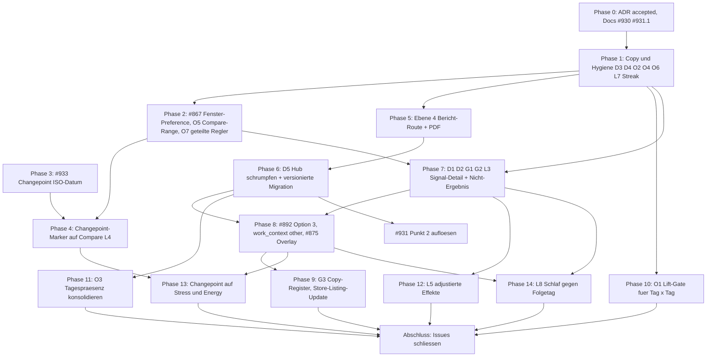

# Umsetzungsplan: Insight Surface Layers

**Stand:** 2026-09-18 · **Status:** Vorschlag zur Umsetzung · **Grundlage:** [ADR-0043](../adr/0043-insight-surface-layers.md)

Dieses Dokument führt die sechs offenen Analyse- und Feature-Issues im Bereich #875–#933 zu einer
durchgehenden Umsetzungssequenz zusammen. Es ersetzt keine der Issues — es ordnet sie, macht die
Wechselwirkungen explizit und benennt je Schritt die betroffenen Stellen im Code.

Betroffene Issues:

- [#928](https://github.com/Sturmi77/correlcore/issues/928) — Darstellungsformen aus User-Perspektive (D1–D5, O1–O7, L1–L9)
- [#930](https://github.com/Sturmi77/correlcore/issues/930) — Zielgruppen- und Positionierungsschärfung (G1–G6)
- [#875](https://github.com/Sturmi77/correlcore/issues/875) — Burnout-Prävention als Domain-Erweiterung
- [#892](https://github.com/Sturmi77/correlcore/issues/892) — Morgens/Mittags/Abends aus Log-Zeit ableiten
- [#931](https://github.com/Sturmi77/correlcore/issues/931) — DESIGN_DOCUMENT §2.10 Export-Status und Matrix-Widerspruch
- [#933](https://github.com/Sturmi77/correlcore/issues/933) — Changepoint-Payload braucht ein ISO-Datum

Mitberührt: [#867](https://github.com/Sturmi77/correlcore/issues/867) (globaler Trend-Zeitraum, Vorarbeit für Phase 2),
[#720](https://github.com/Sturmi77/correlcore/issues/720) / [#721](https://github.com/Sturmi77/correlcore/issues/721)
(Store-Listing und Data Safety — laufen bewusst **nicht** hinter diesem Plan).

## Ausgangslage

Die sechs Issues sind kein Stapel unabhängiger Features, sondern eine Kette: #928 ist das Gate für
#930, #875 und #931 Punkt 2; #933 ist die einzige harte Voraussetzung für den Changepoint-Marker;
#892 hat seinen alten Konsumenten (#891) verloren und seinen neuen in #875 gefunden.

Bereits erledigt und nutzbar: [ADR-0043](../adr/0043-insight-surface-layers.md) fixiert das
Vier-Ebenen-Modell, die Evidenzsprache mit zwei Nennern, die Umdefinition von
`Time-to-First-Insight` und die zwei Vorbedingungen für das Schrumpfen von Ebene 1. Die
Amendment-Notiz in [ADR-0017](../adr/0017-frontend-screen-architecture.md) ist ebenfalls drin.

Die Entscheidungen D1–D5 und G1–G6 werden in diesem Plan als **getroffen** behandelt (Votum der
Issue-Threads): D1 ja, D2 ja, D3 natürliche Häufigkeiten mit zwei Nennern, D4 Wörter trennen, D5 Hub
schrumpft mit versionierter Migration; G1/G2/G4/G5/G6 wie votiert, G3 zurückgestellt bis Ebene 2
steht; #875 Option 1 mit benanntem Composite, opt-in; #892 Option 3 als Unterpunkt von #875.

## Abhängigkeiten

Nicht in dieser Kette und bewusst **nicht** wartend: #720 / #721 (Store-Listing, Data Safety) laufen
mit dem heutigen Mood/Habit-Anker weiter. G3 wird später ein Listing-Update, kein Blocker für den
Play-Store-Pfad.

Die Phasen 10–14 sind die vormals „bewusst liegengelassenen" Punkte aus #928 (O1, O3, L3, L5, L8)
plus die Changepoint-Erweiterung aus #875 §C.3. Sie sind eingeplant, nicht geparkt — die Recherche
hat gezeigt, dass drei davon deutlich billiger sind als angenommen und zwei davon größer.

## Phase 0 — Basis herstellen ✅

- [x] [ADR-0043](../adr/0043-insight-surface-layers.md) von `Proposed` auf `Accepted` setzen, Datum ergänzen.
- [x] #931 Punkt 1: [docs/DESIGN_DOCUMENT.md](../DESIGN_DOCUMENT.md) §2.10 Export-Befund + Verweis ADR-0043 Ebene 4.
- [x] §1.6: `Time-to-First-Answer < 14 Tage`.
- [x] #930 Docs: §1.3 Auslöser + Betrieb/Vertriebsweg; §1.5 Nicht-Ziele erweitert.
- Issue-Kommentare zu D1–D5 / G1–G6 bleiben optional bis zum Abschluss-PR.

## Phase 1 — Copy und Hygiene (D3, D4, L7 und die Überschneidungen) ✅

Reine Copy- und i18n-Arbeit, keine Architekturfolgen, sofort sichtbar. Beide Locales gemeinsam
ändern — [localeCompleteness.test.ts](../../apps/web/src/lib/i18n/localeCompleteness.test.ts)
erzwingt Parität.

- [x] **D3 Evidenzsprache.** Zwei Nenner auf Karte, Kookkurrenz, Matrix-Frequenzspalte; Lift/p/FDR intern.
- [x] **D4 Wörter trennen.** „Zeitversatz" vs. „Abfolge" (Lag-1).
- [x] **M05 umbenennen.** Matrix-Heading Richtung Bericht/Tabelle.
- [x] **O6 eine Konfidenzsprache.** `InsightEvidence` kanonisch (Matrix/Habits angepasst).
- [x] **L7 Ghost-Tabs entfernen.** Nur `compare` | `habits`; W6/W9 Docs korrigiert.
- [x] **Streak-Namenserbe.** Endpoint stillgelegt; i18n-Keys und `streak.ts` entfernt; Datumshilfe in `isoDate.ts`.

## Phase 2 — Ein ehrliches Zeitfenster (#867 plus O5) ✅

- [x] **#867 Server-Preference.** `trend_window_days` (14|28|90, Default 28); Alembic `054` (nach Merge auf Stack 050–053).
- [x] Settings-UI + `analysisRange` vom Server; `localStorage` nur Cache.
- [x] **O5 Compare** nutzt dasselbe Fenster (kein festes Jahr); Label „letzte {n} Tage".
- [x] Compare → Insights Layer-2 („diese Frage prüfen"); ESM bleibt Unlock hinter Reife.
- [x] **O7** Fokus/Zoom auch im mobilen Settings-Sheet; geteilte Overlay-Controls.

## Phase 3 — #933 Changepoint bekommt ein ISO-Datum ✅

Backend-only, keine Blocker, kann parallel zu Phase 1/2 laufen.

- [x] In [changepoint.py](../../backend/app/services/insights/changepoint.py) `_changepoint_candidates` erweitern. Die Daten liegen bereits vor: `AnalyticsEntry.entry_date` existiert, und die Sequenz ist über `_dedupe_daily_entries` datumssortiert und tagesweise dedupliziert — `changepoint_index` zeigt also sauber auf `entries[index]`.
- [x] Payload ergänzen um `changepoint_date` (`entries[index].entry_date`, letzter Tag des Vorher-Segments), `shift_date` (`entries[index + 1].entry_date`, erster Tag des Nachher-Segments) und `changepoint_dates` für die volle `changepoints`-Liste. Beide Daten, weil `detect_changepoints()` laut Docstring „zero-based indices immediately before a detected shift" liefert und die Segmente `moods[:index+1]` / `moods[index+1:]` sind: der Wechsel liegt **zwischen** zwei Tagen, nicht auf einem.
- [x] `subject_label` von `entry_47` auf das Datum umstellen, `statement` ebenso.
- [x] Erkennung bleibt unverändert: PELT `rbf`, Penalty 3.0, `MIN_SEGMENT_SIZE = 5`, max. 3 Changepoints, `ANALYTICS_MIN_ENTRIES_CHANGEPOINT = 60`. Stress-/Energy-Changepoints folgen in Phase 13 (mitgeliefert in derselben Engine-Erweiterung).
- [x] Tests: Index→Datum bei Lücken in der Eintragsfolge, Randfall `index + 1` außerhalb der Serie — in [test_changepoint.py](../../backend/tests/test_changepoint.py).
- [x] Kein OpenAPI-Regen nötig: `payload` ist im Schema bereits `dict[str, Any]` beziehungsweise `additionalProperties: true`.

## Phase 4 — Changepoint-Marker auf der Compare-Achse (L4) ✅

Rider auf Phase 2, kein eigenständiges Feature. Die Infrastruktur ist vollständig vorhanden, es fehlt
nur der Produzent.

- [x] [EventMarkerLayer.svelte](../../apps/web/src/lib/components/trends/EventMarkerLayer.svelte) kennt `phase_transition` in `EventMarkerKind`; `trends/+page.svelte` speist Changepoint-Insights als `markers` in `TrendsComparePanel` ein (Merge mit Koinzidenz-/Lag-1).
- [x] Mapper in [changepointMarkers.ts](../../apps/web/src/lib/utils/changepointMarkers.ts): `shift_date` / `changepoint_date` → `kind: 'phase_transition'`; Bucket-Remap bleibt in MetricTimeseries / UnifiedStripChart.
- [x] Changepoint **außerhalb** des sichtbaren Fensters bleibt als Randmarker (`axisStart` / `axisEnd` Clamp).
- [x] Ebene 1: `InsightCard` lokalisiert aus Payload (`formatChangepointStatement`) statt Roh-`statement`.
- [x] `before_avg` / `after_avg` in Marker-Beschreibung und lokalisiertem Satz (Segment-Mittellinien als Chart-Overlay bewusst nicht — Marker + Aussage reichen für L4).
- [x] Leitplanke: Formulierung „Niveauwechsel" / „Level shift", nicht „ausgelöst durch"; nicht im Belastungs-Overlay (`belastung_pattern` only).

## Phase 5 — Ebene 4: die Bericht-Fläche (Vorbedingung für D5) ✅

Ohne diese Fläche ist D5 nicht durchführbar: `correlation_matrix` aus dem Default zu nehmen würde
den einzigen PNG-Export des Produkts entfernen.

- [x] Neue sekundäre Route `/insights/report` innerhalb der Insights-Route. Kein fünfter Primary Screen, Bottom-Nav unverändert — so festgelegt in ADR-0043 §2.
- [x] Inhalt nach Mockup E6: Effekt, Abdeckung (Sample-n bis Phase 7 beide Nenner liefert), **eine** Konfidenzskala (`InsightEvidence`), Datenreife, Abdeckungszahlen, Disclaimer, Zeilen abwählbar. Dichte ist hier richtig, weil ein Ausdruck eine Tabelle sein soll.
- [x] Export an einem Ort zusammenführen: `exportPng()` nach [insightMatrixExport.ts](../../apps/web/src/lib/utils/insightMatrixExport.ts) verlagert; CSV/JSON über `downloadExport` / `saveBlob`; **PDF** clientseitig neu. ZIP bleibt auf `/settings/data` (Datenschutz-Export).
- [x] ADR-0043 §1: Export-Controls nicht mehr in `InsightMatrix` — Link zur Bericht-Route statt PNG-Button.
- [x] Datenschutz: Der Bericht zeigt aggregierte Zeilen, kein Einzeltag. Disclaimer und Nicht-Diagnose-Hinweis im Bericht.

## Phase 6 — D5: Ebene 1 schrumpfen, mit versionierter Migration ✅

Jetzt existiert ein Landeplatz. Der Default-Flip allein wirkt aber nicht.

- [x] Befund im Code: `merge()` in [sectionPreferences.ts](../../apps/web/src/lib/utils/sectionPreferences.ts) behandelt gespeicherte Präferenzen als maßgeblich und hängt nur **fehlende** Keys aus den Defaults an.
- [x] **Versionierung:** Spalte `insight_sections_version` (Alembic `050`) plus einmalige Transformation in `migrate_insight_sections_to_current` (Backend + Frontend-Spiegel). Lazy Persistenz beim GET/PATCH `/user/preferences`.
- [x] Neuer Default: `stage_header` + `insight_feed` an; `correlation_matrix`, `lag_heatmap`, `dismissed`, `symptom_analytics`, `tag_groups`, `tag_cooccurrence` aus dem Default-Viewport (Keys bleiben gültig). Hub zeigt „Weitere Werkzeuge"-Zeile inkl. Bericht-/Settings-Links und ausgeblendeter Erkenntnisse.
- [x] Explizite `enabled: false`-Wahlen bleiben erhalten; reine Legacy-Defaults werden auf das schlanke Layout ersetzt.
- [x] #931 Punkt 2 / §2.10 und ADR-0017 an ADR-0043 angeglichen.

## Phase 7 — D1, D2, G1, G2: Ebene 2 und das Nicht-Ergebnis ✅

Der eine echte Neubau. Zweistufig, damit die Evidenzsprache validiert wird, bevor die Fläche entsteht.

- [x] **Schritt A — G2 in der Karte.** `WithWithoutDistribution` in `insight-card__level2` plus natürliche Häufigkeiten mit zwei Nennern auf der Karte. Payload um `with_distribution` / `without_distribution` / `with_good_count` / `without_good_count` erweitert.
- [x] **Schritt B — D2 Nicht-Ergebnis.** Neuer Typ `null_association` (Alembic `051`) für kleine Effekte; gleiche G2-Fläche, Badge „Kein Muster“, Next-Actions auf dem Signal-Detail. §1.6 → Time-to-First-Answer.
- [x] **Schritt C — D1 Signal-Detail.** Route `/insights/signal/[id]` mit Satz → G2 → ESM → G1-Scatter hinter Disclosure und L3 mean±SE-Bändern. CTA „Zusammenhang prüfen“ ist der eine Vorwärtspfad von Ebene 1. Compare verweist auf Insights (Layer 2), nicht auf ESM.
- [x] ADR-0043 auf Accepted; G4 Forest-Plot bewusst nicht gebaut.

## Phase 8 — #892 Option 3, `work_context` neutral, #875 Belastungs-Overlay ✅

- [x] **#892 Option 3.** `logged_local_hour` / `inferred_period` from first local write (`POST /entries?tz=`); `slot` stays `day`; export includes both fields.
- [x] **`work_context.other`** (+ UI / i18n) for non-work life contexts.
- [x] Feature doc [`docs/features/belastung-erholung.md`](../features/belastung-erholung.md); opt-in `belastung_overlay_enabled` (default false); composite `belastung_pattern` (heuristic); Layer-1 `BelastungOverlay` with employer guardrail and CTAs to signal detail.

## Phase 9 — G3 und die Positionierungsfolge ✅

- [x] Copy-Register [`docs/features/arbeitsmuster-vokabular.md`](../features/arbeitsmuster-vokabular.md) aktiviert (Preferred / Avoid / Never). Klinisches Vokabular nie. Mood/Habit bleiben; `work_context` bleibt Differenzierungsfeld.
- [x] DESIGN §1.3–§1.5 (Auslöser, Betrieb/Vertriebsweg, Nicht-Ziele, G3-Anker) + ADR-0043 Open Question G3 geschlossen.
- [x] Store-Listing (#720) und Data-Safety-Mapping (#721) auf das Register abgestimmt — kein Burnout-Produktclaim; Belastung-Overlay deklariert keine neuen Play-Datentypen.
- [x] Leichte Landing-i18n (Arbeitssituation im Hero-Subtitle) + `noClinicalProductCopy.test.ts`.

## Phase 10 — O1: eine Kookkurrenz-Statistik statt drei (Backend-Gate) ✅

- [x] Tag×Tag nutzt dieselbe Familie wie Symptom×Tag: tägliche Deduplizierung, Lift, Fisher-exakt, BH-FDR mit `COOCCURRENCE_FDR_ALPHA = 0.10` (bewusst **nicht** `insights/shared.FDR_ALPHA = 0.05`).
- [x] `_cooccurrence_stats` ist signal-agnostisch; `heatmap_tag_tag_associations` / `compute_tag_tag_associations` in [`symptom_analytics.py`](../../backend/app/services/symptom_analytics.py); `get_tag_cooccurrence` gated in [`stats_service.py`](../../backend/app/services/stats_service.py).
- [x] Anzeige bleibt `count` + zwei Nenner (`pct_of_a` / `pct_of_b`); Lift/FDR entscheiden nur, welche Paare erscheinen. Confounder-Checks laufen mit (weekday / work_context / calendar), ohne neues Response-Feld.

## Phase 11 — O3: Tagespräsenz konsolidieren ✅

- [x] `ComparisonHeatmap` bleibt die geteilte Fläche für Compare-Kontextzeilen und Symptom-Heatmap — keine weitere Arbeit.
- [x] `TagHeatmap` nutzt denselben `DailyAxisLayout`-Vertrag (`--axis-label-width` / `--axis-day-width` / `--axis-gap`) wie Compare; Datumsspanne über `buildIsoDateRange`; Default-Pitch = `compareDailyAxisLayoutFromRoot`, Compact/Coarse über `habitDailyAxisLayout`.
- [x] `SymptomCalendarHeatmap` bleibt eigenständig (Wochentag×Woche) — unverändert.

## Phase 12 — L5: adjustierte Effekte und Confounder sichtbar machen ✅

- [x] **#928 Q4 = YES** (ADR-0043): OLS-Koeffizienten und Same-Situation-Häufigkeiten serialisieren; Darstellung nur Layer 2 hinter Disclosure; nie „bereinigt"/„cleaned".
- [x] `evaluate_metric_association_*` + `same_work_context_metric_frequencies` + `situation_adjustment_payload` in [`weekday_confounder.py`](../../backend/app/services/weekday_confounder.py); Payload auf `pointbiserial` und `symptom_mood_association`.
- [x] Signal-Detail Disclosure (`insights.signal.same_*`); Layer-1 Hinweissätze unverändert.

## Phase 13 — Changepoint auf Stress- und Energy-Serien ✅

Erweiterung der Engine, nicht Reuse — genau die Korrektur, die #875 §C.3 fehlerhaft als „bereits
abgedeckt" führt.

- [x] `_changepoint_candidates` über Serienliste mood/stress/energy; `metric` = `mood_changepoint` / `stress_changepoint` / `energy_changepoint`.
- [x] Mehrfachtest-Entscheidung: **`MAX_CHANGEPOINTS = 3` gilt pro Serie** (nicht global über mood/stress/energy). Kontrolle weiter über PELT-Penalty + Cap — kein p-Wert/FDR.
- [x] Gate `ANALYTICS_MIN_ENTRIES_CHANGEPOINT = 60` unverändert; Composite aus Phase 8 bleibt die frühe sichtbare Fläche.
- [x] Marker/Framing aus Phase 3/4 wiederverwendet (ISO-Daten, `phase_transition`, lokalisierte Aussage); nicht im Belastungs-Overlay.

## Phase 14 — L8: Schlaf gegen den Folgetag ✅

Auch hier war die Einschätzung zu pessimistisch: die **Erkennung existiert schon**, es fehlt die
Darstellung.

- [x] Timeseries liefert `sleep_minutes_avg` (nullable, nur geloggte Tage); OpenAPI + api-types regen; Chart-Normalisierung 0–720 min → 1–5-Domäne.
- [x] Signal-Detail: Lag-Achse (`lag_profile`) + zwei Nenner (Median-Split `high_*` / `low_*` im Lag-Payload); D4-Badges „Zeitversatz“ vs. „Derselbe Kalendertag“ für Spearman.
- [x] Compare: beschrifteter Modus **Zeitversatz (+1 Tag bei Schlaf)** — keine stille Verschiebung, getrennt von Lag-1 **Abfolge**.
- [x] `_sleep_spearman_candidates` bleibt taggleich und teilt nicht den Zeitversatz-Namen.

## Abschluss

- Erst wenn die Phasen 0–14 durch sind: #928, #930, #931, #875, #892, #933 schließen. Nach der Regel in [AGENTS.md](../../AGENTS.md) tragen nur die jeweils abschließenden PRs `Closes`; Teil-PRs verwenden `Relates to`. Die Analyse-Issues #928 und #930 dürfen nicht mit einem Docs- oder Chart-PR geschlossen werden.
- #928 trägt die meisten Einzelpunkte (O1–O7, L1–L9, D1–D5). Beim Abschluss explizit auflisten, welche davon umgesetzt und welche bewusst verworfen wurden — G4 (Forest-Plot) und L7-Nachbau sind Verwerfungen, nicht Auslassungen.
- Weiterhin offen bleibt danach nur: die in #930 H.4 gewünschte Interview-Validierung (in diesem Plan bewusst kein Arbeitspaket) und `multivariate`-Themen, die Phase 12 als „nein" entscheidet.
