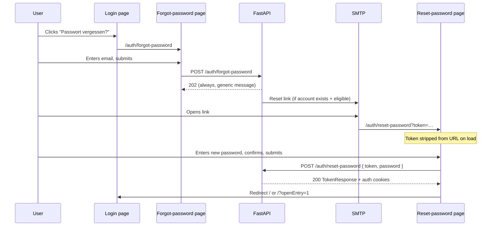

# O-20 — Password Reset Flow (Implementation Plan)

**Date:** 2026-07-01  
**Issue:** [#272](https://github.com/Sturmi77/correlcore/issues/272)  
**Workflow:** W1 Account & Vertrauen  
**Status:** Implemented (Sprint G)  
**Depends on:** Native JWT auth (ADR-0004), existing email infrastructure (Issue #39)

---

## Goal

Close the last GUI optimization backlog item: let users who forgot their password recover access without support contact, while preserving the same privacy and anti-enumeration guarantees as registration and email verification.

**Out of scope for O-20:** Account lock after repeated failed logins (mentioned in ADR-0004 but not implemented today), MFA recovery, Authentik/OIDC migration (Phase 2).

---

## User journey



### UX principles (reuse from verify-email)

| Principle                           | Rationale                                                                                            |
| ----------------------------------- | ---------------------------------------------------------------------------------------------------- |
| **No auto-submit on link open**     | Mail scanners / safe-link rewriters must not burn the token                                          |
| **Token in URL only for landing**   | Frontend strips `token` from address bar via `history.replaceState`; API receives token in JSON body |
| **Generic success on forgot**       | Always `202` whether email exists — same pattern as `resend-verification`                            |
| **Generic error on reset**          | Invalid/expired/used token → single `400` message (no enumeration)                                   |
| **Optional auto-login after reset** | Mirror O-07: issue session cookies on successful reset so user is not forced through login again     |

---

## Backend design

### 1. Data model

New table `password_reset_tokens` — structurally identical to `email_verification_tokens`:

| Column       | Type                                   | Notes                                                            |
| ------------ | -------------------------------------- | ---------------------------------------------------------------- |
| `id`         | UUID PK                                |                                                                  |
| `user_id`    | UUID FK → `users.id` ON DELETE CASCADE | DSGVO Art. 17                                                    |
| `token_hash` | String(64) UNIQUE                      | SHA-256(plaintext), never store plaintext                        |
| `expires_at` | timestamptz                            | Configurable TTL (recommend **1 h**, shorter than verify's 24 h) |
| `used_at`    | timestamptz nullable                   | Single-use enforcement                                           |
| `created_at` | timestamptz                            | Audit                                                            |

Alembic migration `00N_create_password_reset_tokens.py`.

**Reuse:** `_hash_token()`, `_TOKEN_BYTES = 32`, delete prior unused tokens per user on new request ("latest wins") — copy patterns from `create_verification_token` / `verify_email` in `auth_service.py`.

### 2. API endpoints

| Method | Path                           | Auth   | Rate limit         | Response                       |
| ------ | ------------------------------ | ------ | ------------------ | ------------------------------ |
| `POST` | `/api/v1/auth/forgot-password` | Public | `3/minute` per IP  | `202 MessageResponse` (always) |
| `POST` | `/api/v1/auth/reset-password`  | Public | `10/minute` per IP | `200 TokenResponse` + cookies  |

#### `POST /auth/forgot-password`

**Request** (`ForgotPasswordRequest`):

```json
{ "email": "user@example.com" }
```

**Service logic** (`request_password_reset`):

1. Lookup user by normalized email.
2. If user missing, inactive, or **email not verified** → return `None` (endpoint still `202`).
3. Delete existing unused reset tokens for user.
4. Create new token, return `(user, plaintext)`.
5. Endpoint schedules `send_password_reset_email` via `BackgroundTasks`.

**Rationale for blocking unverified accounts:** They should use `resend-verification`, not password reset. Avoids confusing parallel flows.

#### `POST /auth/reset-password`

**Request** (`ResetPasswordRequest`):

```json
{
  "token": "<plaintext from email>",
  "password": "<new password>"
}
```

Reuse `RegisterRequest.password` validator (min 8, letter + digit).

**Service logic** (`reset_password`):

1. Hash token, lookup row; reject if missing / used / expired / user inactive → `PasswordResetError` (generic message).
2. `hash_password(new_password)` → update `user.hashed_password`.
3. Mark token `used_at`.
4. **Revoke all refresh tokens** for user in Redis (`TokenStore.revoke_all(user_id)` — already exists).
5. Return `User` for session issuance.

**Endpoint layer:** Call `issue_session_tokens` + `set_auth_cookies` (same as verify-email post O-07).

### 3. Email

New templates under `backend/app/templates/email/`:

- `password_reset.html.j2` / `password_reset.txt.j2`

New helpers in `email_service.py`:

- `build_password_reset_url(token: str) -> str` → `{FRONTEND_BASE_URL}/auth/reset-password?token=…`
- `send_password_reset_email(to: str, token: str) -> None`

Copy privacy rules from verify mail: no tracking pixels, no external assets, no health data.

### 4. Config

Add to `app/core/config.py`:

```python
PASSWORD_RESET_TTL_HOURS: int = 1
```

### 5. Schemas (`app/schemas/auth.py`)

- `ForgotPasswordRequest` — `email: EmailStr`
- `ResetPasswordRequest` — `token: str` (min 16), `password: str` (reuse strength validator)

### 6. Security checklist

| Threat            | Mitigation                                                   |
| ----------------- | ------------------------------------------------------------ |
| Email enumeration | Forgot always returns `202` with same body                   |
| Token guessing    | 256-bit token; rate limit on reset endpoint                  |
| Token replay      | `used_at` + expiry                                           |
| Session fixation  | New token pair after reset; revoke old refresh JTIs          |
| Open redirect     | Frontend `safeNext()` whitelist (already on login)           |
| Token in logs     | Only hash persisted; plaintext only in email + client memory |
| Timing leaks      | Constant-time password verify path on login unchanged        |

### 7. ADR updates

**ADR-0004 amendment** (after implementation):

- Document forgot/reset endpoints, TTL, rate limits, session issuance on reset.
- Clarify relationship to unverified users (must verify first).

No new ADR required if amendment suffices; escalate to ADR-0031 only if session-revocation semantics need standalone governance.

---

## Frontend design

### 1. Routes

| Route                   | Purpose                                                                         |
| ----------------------- | ------------------------------------------------------------------------------- |
| `/auth/forgot-password` | Email form → `POST /auth/forgot-password` → generic success                     |
| `/auth/reset-password`  | Token from query → strip URL → password + confirm → `POST /auth/reset-password` |

Reuse `auth/+layout.svelte` styling (same as login / resend / verify).

### 2. Login integration

Add link on `/auth/login` (i18n keys already exist: `auth.login.forgot_password`):

```svelte
<a href="/auth/forgot-password">{$_('auth.login.forgot_password')}</a>
```

Place near the resend-verification link in `auth-links`.

### 3. API client (`apps/web/src/lib/api/auth.ts`)

```typescript
export function requestPasswordReset(email: string): Promise<MessageResponse>;
export function resetPassword(payload: { token: string; password: string }): Promise<TokenResponse>;
```

`resetPassword` uses `skipAuthRefresh: true` (public endpoint, like `verifyEmail`).

### 4. Reset page behaviour

Mirror `verify-email/+page.svelte` hardening from #281:

- `onMount`: read token, strip from URL, set `missing-token` phase if absent.
- Explicit submit button (no auto-reset on page load).
- On success: `setUser(session.user)` → `goto('/')` or `safeNext`.
- Password confirmation field client-side only (backend receives single password).

### 5. i18n

New keys under `auth.forgot` and `auth.reset` in `de.json` / `en.json` (title, body, success, error, submit, password_confirm, mismatch).

---

## Test plan

### Backend (`backend/tests/`)

| Test                                                     | Covers                         |
| -------------------------------------------------------- | ------------------------------ |
| `test_request_password_reset_unknown_email_returns_none` | Enumeration-safe service       |
| `test_request_password_reset_unverified_user_skipped`    | No mail for unverified         |
| `test_reset_password_unknown/expired/used token`         | Generic `PasswordResetError`   |
| `test_reset_password_success_updates_hash`               | Password changed               |
| `test_reset_password_revokes_refresh_tokens`             | Redis JTIs cleared             |
| `test_endpoint_forgot_password_always_202`               | HTTP contract                  |
| `test_endpoint_reset_password_sets_cookies`              | Session after reset            |
| `test_endpoint_reset_password_invalid_no_cookies`        | Failed reset leaves no session |

### Frontend

| Test                              | Covers                           |
| --------------------------------- | -------------------------------- |
| Unit: `auth.ts` client shapes     | Mock fetch                       |
| Contract: reset page strips token | Source scan (like home PWA test) |

### E2E (`user-journeys.spec.ts` — W1 extension)

New journey **W1c Password reset**:

1. Mock `POST /auth/forgot-password` → 202.
2. Navigate to `/auth/reset-password?token=…` → explicit confirm → mock `POST /auth/reset-password` → cookies → redirect home.

Keep mocks in shared auth helper (parallel to existing verify mock).

---

## Implementation order (proposed Sprint G)

| Step | Layer                      | Deliverable                                                         |
| ---- | -------------------------- | ------------------------------------------------------------------- |
| G1   | Backend model + migration  | `password_reset_tokens` table                                       |
| G2   | Backend service            | `request_password_reset`, `reset_password`, `TokenStore.revoke_all` |
| G3   | Backend endpoints + email  | Routes, templates, rate limits, pytest                              |
| G4   | Frontend API + forgot page | Link from login, forgot flow                                        |
| G5   | Frontend reset page        | Token strip, session establish                                      |
| G6   | E2E + docs                 | Journey test, ADR-0004 amendment, close #272                        |

**Estimated touch:** ~15 backend files, ~8 frontend files, 1 migration, 2 email templates.

---

## Dependencies & risks

| Risk                                  | Mitigation                                                                 |
| ------------------------------------- | -------------------------------------------------------------------------- |
| `TokenStore` bulk revoke              | Use existing `TokenStore.revoke_all(user_id)`                              |
| User resets while logged in elsewhere | Acceptable: old refresh tokens invalidated on reset                        |
| SMTP down during forgot               | Same as verify: log + 202, no user-visible failure                         |
| Authentik Phase 2                     | Reset flow remains valid for native JWT phase; OIDC phase delegates to IdP |

---

## Acceptance criteria (issue #272)

- [ ] `POST /auth/forgot-password` + rate limit + enumeration-safe `202`
- [ ] `POST /auth/reset-password` + rate limit + cookie session on success
- [ ] Email with reset link (HTML + text templates)
- [ ] Frontend forgot + reset pages + login link
- [ ] i18n DE + EN complete
- [ ] Backend + E2E tests green
- [ ] ADR-0004 amended
- [ ] `OPTIMIZATION_BACKLOG.md` O-20 marked done

---

## References

- Email verification pattern: `EmailVerificationToken`, `verify_email`, `create_verification_token`
- Post-verify session (O-07): `issue_session_tokens`, `verify-email/+page.svelte`
- Resend enumeration pattern: `request_verification_resend`, `resend-verification/+page.svelte`
- [`OPTIMIZATION_BACKLOG.md`](OPTIMIZATION_BACKLOG.md) · [`GUI_OPTIMIZATION_IMPLEMENTATION_PLAN.md`](GUI_OPTIMIZATION_IMPLEMENTATION_PLAN.md)
- [`docs/adr/0004-auth-strategie.md`](../adr/0004-auth-strategie.md)
