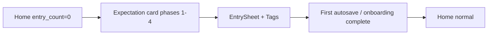
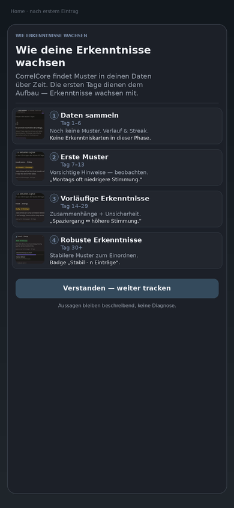
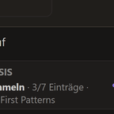
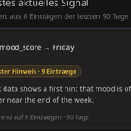
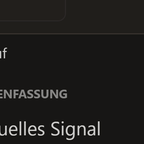
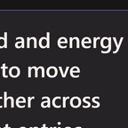

# Onboarding Maturity Expectation Card

> **Status:** Implemented · **Related:** [ADR-0021](../adr/0021-insight-maturity-phases.md), [INSIGHT_MATURITY.md](INSIGHT_MATURITY.md), [PHASE_INSIGHT_MATRIX.md](../PHASE_INSIGHT_MATRIX.md), [ADR-0030](../adr/0030-onboarding-tag-suggestions.md) · **Audience:** Product / Frontend

This document is the product concept for a **one-time onboarding expectation card** that explains CorrelCore’s four insight maturity phases **before** the user interprets an empty Insights feed as a product failure.

> **Update 2026-07-26 — placement changed.** The maturity card is now the **first
> screen of the full-screen onboarding sequence at `/onboarding`** (cold start
> redirects there), not a bottom sheet on Home. The phase content lives in the
> shared [`MaturityExpectationContent.svelte`](../../apps/web/src/lib/components/onboarding/MaturityExpectationContent.svelte),
> reused by both the wizard step and the (now Home-decoupled) `MaturityExpectationSheet`.
> The whole sequence completes **before** the first daily entry opens. Sections 3
> (“Placement”) and 8 below describe the earlier Home-sheet design and are kept
> for history.

**Implementation:** [`MaturityExpectationContent.svelte`](../../apps/web/src/lib/components/onboarding/MaturityExpectationContent.svelte) as onboarding wizard step ([`routes/onboarding/+page.svelte`](../../apps/web/src/routes/onboarding/+page.svelte)); preference `onboarding_maturity_intro_seen` (migration `029`); i18n `onboarding.maturity_intro.*`.

---

## 1. Problem

Cold start (ADR-0030) opens the first `EntrySheet` with tag suggestions. Without phase context, users may pick one-off tags and later interpret an empty Insights feed (Phase 1) as a product failure.

## 2. Goal

A single, scannable card — **„Wie deine Erkenntnisse wachsen“ / „How your insights grow“** — that:

1. Separates the four phases by entry-day ranges.
2. Shows **one concrete example insight** and **one mini visual** per phase.
3. States what is **not** available yet (especially: no correlations in phases 1–2).
4. Frames tag choice: pick tags you will **reuse often**.
5. Keeps CorrelCore tone: descriptive, non-causal, non-medical.

## 3. Placement

Show **before first-entry tag selection** (start of cold-start onboarding).



| Rule      | Detail                                                                       |
| --------- | ---------------------------------------------------------------------------- |
| Trigger   | `shouldShowOnboardingTags` is true **and** `!onboarding_maturity_intro_seen` |
| Surface   | Bottom Sheet on Home (`/`) before the first `EntrySheet` opens               |
| Ordering  | Maturity card → dismiss → EntrySheet with tag suggestions                    |
| Dismiss   | CTA / backdrop / Escape all persist `onboarding_maturity_intro_seen`         |
| Persist   | Preference `onboarding_maturity_intro_seen` (migration `029`)                |
| Deep link | `?openEntry=1` defers while the intro is pending (`GlobalEntrySheet`)        |
| Re-open   | Content remains available via `InsightJourneyExplainer` (without thumbs)     |

---

## 4. Layout (mobile-first, 390px)

One composition: title + one intro sentence + four phase rows + one CTA + one footer disclaimer.

```
┌─────────────────────────────────────────────┐
│  Wie deine Erkenntnisse wachsen             │
│  CorrelCore findet Muster in deinen Daten   │
│  über Zeit — nicht sofort alles.            │
│                                             │
│  ┌─────┐ 1  Daten sammeln · Tag 1–6         │
│  │thumb│  Noch keine Muster.                │
│  └─────┘  Bsp: Eintragsverlauf / Zähler     │
│                                             │
│  ┌─────┐ 2  Erste Muster · Tag 7–13         │
│  │thumb│  Vorsichtige Hinweise.             │
│  └─────┘  Bsp: weekday_pattern              │
│                                             │
│  ┌─────┐ 3  Vorläufig · Tag 14–29           │
│  │thumb│  Zusammenhänge + Unsicherheit.     │
│  └─────┘  Bsp: pointbiserial / spearman     │
│                                             │
│  ┌─────┐ 4  Robust · Tag 30+                │
│  │thumb│  Stabilere Muster.                 │
│  └─────┘  Bsp: Insight-Karte „Stabil“       │
│                                             │
│  [Weiter zu den Tags]                       │
│  Aussagen bleiben beschreibend, keine       │
│  Diagnose.                                  │
└─────────────────────────────────────────────┘
```

**Visual rules**

- Thumb size ≈ **72×72** (square crop), left of copy.
- No hero media overlays, no stat strips, no extra promo cards.
- Thumbs are **preview crops** of real phase UI (slightly desaturated), not live data widgets.
- Desktop (≥768px): same content in a centered modal (max-width ~420px); do not invent a second layout language.

Composite mock (placement reference):



@2x source: [`expectation_card_mock.png`](../assets/phase_matrix/screenshots/onboarding_expectation/expectation_card_mock.png).

---

## 5. Copy — German (canonical for v1)

### Shell

| Key role | DE                                                                                                                |
| -------- | ----------------------------------------------------------------------------------------------------------------- |
| Title    | Wie deine Erkenntnisse wachsen                                                                                    |
| Intro    | CorrelCore findet Muster in deinen Daten über Zeit. Die ersten Tage dienen dem Aufbau — Erkenntnisse wachsen mit. |
| Tag hint | Wähle als Nächstes Tags, die du oft wiederholst — nur so können spätere Muster entstehen.                         |
| CTA      | Weiter zu den Tags                                                                                                |
| Footer   | Aussagen bleiben beschreibend, keine Diagnose.                                                                    |

### Per phase

| Phase | Key              | Label                   | Range     | Expectation                                                | Example                                                         | Not yet                                           |
| ----- | ---------------- | ----------------------- | --------- | ---------------------------------------------------------- | --------------------------------------------------------------- | ------------------------------------------------- |
| 1     | `collecting`     | Daten sammeln           | Tag 1–6   | Wir bauen deine Datengrundlage auf. Noch keine Muster.     | Eintragsverlauf und Zähler — keine Erkenntniskarten.            | Keine Insight-Karten, keine Korrelationen         |
| 2     | `early_patterns` | Erste Muster            | Tag 7–13  | Erste Hinweise werden sichtbar. Beobachte, schließe nicht. | „Montags liegt die Stimmung oft unter deinem Durchschnitt.“     | Keine Tag↔Stimmung-Korrelationen                  |
| 3     | `provisional`    | Vorläufige Erkenntnisse | Tag 14–29 | Zusammenhänge entstehen — mit ausdrücklicher Unsicherheit. | „Tage mit Spaziergang liegen bei dir oft bei höherer Stimmung.“ | Noch nicht „bestätigt“ / „stabil“                 |
| 4     | `robust`         | Robuste Erkenntnisse    | Tag 30+   | Stabilere Muster zum Einordnen und Handeln.                | Insight-Karte mit Kennzeichnung „Stabil · n Einträge“.          | ML/Lag erst ab ~90 Tagen (nicht prominent nennen) |

**Insight families referenced:** Phase 2 → `weekday_pattern`; Phase 3 → `pointbiserial` (or `spearman`); Phase 4 → same card UI with maturity badge `robust` / „Stabil“.

---

## 6. Copy — English

### Shell

| Key role | EN                                                                                                               |
| -------- | ---------------------------------------------------------------------------------------------------------------- |
| Title    | How your insights grow                                                                                           |
| Intro    | CorrelCore finds patterns in your data over time. The first days build your foundation — insights grow with you. |
| Tag hint | Next, pick tags you will reuse often — later patterns need that repetition.                                      |
| CTA      | Continue to tags                                                                                                 |
| Footer   | Statements stay descriptive, not a diagnosis.                                                                    |

### Per phase

| Phase | Label                | Range      | Expectation                                       | Example                                                                    | Not yet                                                    |
| ----- | -------------------- | ---------- | ------------------------------------------------- | -------------------------------------------------------------------------- | ---------------------------------------------------------- |
| 1     | Collecting Data      | Days 1–6   | We are building your foundation. No patterns yet. | Entry history and counts — no insight cards.                               | No insight cards, no correlations                          |
| 2     | First Patterns       | Days 7–13  | Early hints appear. Observe; do not conclude.     | “Mondays currently line up with lower mood than your overall average.”     | No tag↔mood correlations                                   |
| 3     | Provisional Insights | Days 14–29 | Relationships emerge — with explicit uncertainty. | “Days tagged Walk currently line up with higher mood scores in your data.” | Not yet “confirmed” / “stable”                             |
| 4     | Robust Insights      | Day 30+    | More stable patterns you can act on.              | Insight card labeled “Stable · n entries”.                                 | ML/Lag only from ~90 days (do not highlight in onboarding) |

---

## 7. Mini visuals / screenshot assets

Assets live under [`../assets/phase_matrix/screenshots/onboarding_expectation/`](../assets/phase_matrix/screenshots/onboarding_expectation/).

| Phase | Thumb file                        | Crop source                                | What the thumb must show                               |
| ----- | --------------------------------- | ------------------------------------------ | ------------------------------------------------------ |
| 1     | `thumb_phase1_collecting.png`     | `mobile__InsightsPage__collecting.png`     | Empty foundation state / “noch keine Erkenntniskarten” |
| 2     | `thumb_phase2_early_patterns.png` | `mobile__InsightsPage__early_patterns.png` | Early hint card + badge „Erster Hinweis“               |
| 3     | `thumb_phase3_provisional.png`    | `mobile__InsightsPage__provisional.png`    | Provisional badge + uncertainty framing                |
| 4     | `thumb_phase4_robust.png`         | `mobile__MobileInsightLead__robust.png`    | Badge „Stabil“ + stronger quality meter                |

**Thumb processing rules**

1. Square crop of the characteristic region (empty state or insight lead / badge + one statement line).
2. Resize to 144×144 (2× for 72pt display).
3. Slight desaturation (~20%) so thumbs read as preview, not live feed.
4. Do not invent numbers outside Dev Mode fixture language.

Regen recipe (same as phase matrix screenshots): Dev Mode + `dev_force_viz` + phase presets — see [`../assets/phase_matrix/screenshots/README.md`](../assets/phase_matrix/screenshots/README.md). Then re-run the crop script documented in [`onboarding_expectation/README.md`](../assets/phase_matrix/screenshots/onboarding_expectation/README.md).

### Thumb gallery

| P1                                                                                           | P2                                                                                               | P3                                                                                            | P4                                                                                       |
| -------------------------------------------------------------------------------------------- | ------------------------------------------------------------------------------------------------ | --------------------------------------------------------------------------------------------- | ---------------------------------------------------------------------------------------- |
|  |  |  |  |

---

## 8. Relationship to existing surfaces

| Surface                                                                                                       | Role after this concept ships                                              |
| ------------------------------------------------------------------------------------------------------------- | -------------------------------------------------------------------------- |
| **This expectation card**                                                                                     | One-time expectation setting right after first entry                       |
| [`InsightJourneyExplainer.svelte`](../../apps/web/src/lib/components/insights/InsightJourneyExplainer.svelte) | Anytime reference (“?” on Insights); keep aligned copy; no thumbs required |
| Phase milestone cards                                                                                         | Celebrate **on** phase transition — do not replace this intro              |
| [`insight_previews.json`](../../apps/web/src/lib/data/insight_previews.json)                                  | Legacy topic teasers (sleep/sport) — **do not** reuse for phase education  |

Suggested future i18n namespace (implementation PR): `onboarding.maturity_intro.*` for shell + per-phase strings, reusing `maturity.{phase}.label` where identical.

---

## 9. Acceptance criteria (concept + later UI)

**Concept**

- [x] Placement is before tag selection (informs vocabulary choice).
- [x] Each phase has one mini visual + one example from a real insight family.
- [x] Copy is non-causal / non-medical and aligned with ADR-0021.
- [x] Assets and mock exist under `docs/assets/phase_matrix/screenshots/onboarding_expectation/`.

**Implementation**

- [x] Bottom sheet appears once before first-entry tags when `!onboarding_maturity_intro_seen`.
- [x] Dismiss persists preference; then EntrySheet with tags opens.
- [x] DE + EN strings registered; thumbs under `apps/web/static/onboarding/maturity/`.
- [x] Backdrop / Escape / CTA all persist dismiss (avoids reopening loop).

---

## 10. Implementation map

```
apps/web/src/lib/components/onboarding/MaturityExpectationSheet.svelte
apps/web/src/lib/utils/maturityExpectationIntro.ts
apps/web/src/lib/i18n/locales/{de,en}.json  → onboarding.maturity_intro.*
apps/web/static/onboarding/maturity/phase{1-4}_*.png
apps/web/src/routes/+page.svelte → maturity sheet → then EntrySheet with tags
apps/web/src/lib/components/entries/GlobalEntrySheet.svelte → defer ?openEntry=1 while intro pending
backend/migrations/versions/029_onboarding_maturity_intro_seen.py
```
