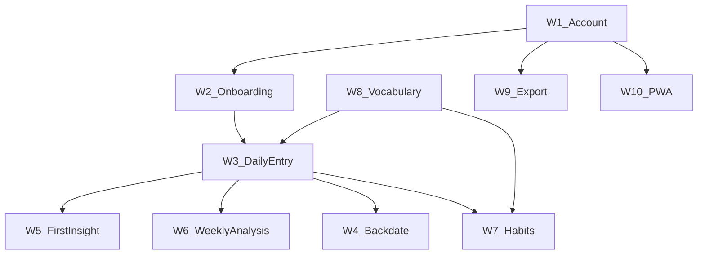

# CorrelCore — User Workflow Catalog

**Date:** 2026-06-30  
**Purpose:** Canonical map of user goals, success criteria, routes, and maturity dependencies for GUI optimization work.  
**Related:** [`FRICTION_AUDIT.md`](FRICTION_AUDIT.md), [`FRONTEND.md`](../FRONTEND.md), [`INSIGHT_MATURITY.md`](INSIGHT_MATURITY.md)

---

## Method

Goal-Directed Task Analysis (GDTA): each workflow is defined by **persona × goal × surface** (mobile ≤768px vs web ≥768px). Step-level GUI matrices live in [`FRICTION_AUDIT.md`](FRICTION_AUDIT.md).

---

## Personas

| ID  | Persona                                  | Primary goals                                        |
| --- | ---------------------------------------- | ---------------------------------------------------- |
| P1  | **Reflektive Self-Optimizer** (30–50 J.) | Daily tracking, habit correlations, weekly review    |
| P2  | **Health-Aware Recoverer**               | Symptom patterns, doctor supplement, privacy control |

Source: [`DESIGN_DOCUMENT.md`](../DESIGN_DOCUMENT.md) §1.3.

---

## Surface model

| Surface             | Role                                               | Primary workflows |
| ------------------- | -------------------------------------------------- | ----------------- |
| **Mobile** (≤768px) | Capture, check-in, lightweight review              | W1–W5, W10        |
| **Web** (≥768px)    | Analysis, comparison, management                   | W3–W9             |
| **Both**            | Shared routes; density differs at 768px breakpoint | All               |

Navigation: 4 tabs (Home, Insights, Trends, Settings). Entry is **not** a tab — opened via Home CTA (`EntrySheet`) or `/entries/new` deep links (ADR-0017).

---

## Workflow index

| ID                               | Workflow                | Frequency      | Personas | Maturity dependency             |
| -------------------------------- | ----------------------- | -------------- | -------- | ------------------------------- |
| [W1](#w1-account--vertrauen)     | Account & Vertrauen     | once           | P1, P2   | none                            |
| [W2](#w2-cold-start--onboarding) | Cold Start / Onboarding | once           | P1, P2   | none                            |
| [W3](#w3-tägliche-eingabe)       | Tägliche Eingabe        | daily          | P1, P2   | none                            |
| [W4](#w4-rückdatierte-eingabe)   | Rückdatierte Eingabe    | occasional     | P1, P2   | none                            |
| [W5](#w5-erste-erkenntnis)       | Erste Erkenntnis        | week 1–2       | P1, P2   | `collecting` → `early_patterns` |
| [W6](#w6-wöchentliche-analyse)   | Wöchentliche Analyse    | weekly         | P1, P2   | `early_patterns`+               |
| [W7](#w7-habit-review)           | Habit-Review            | weekly         | P1       | habits configured               |
| [W8](#w8-vokabular-pflegen)      | Vokabular pflegen       | rare           | P1, P2   | none                            |
| [W9](#w9-datenexport--privacy)   | Datenexport / Privacy   | rare           | P2       | none                            |
| [W10](#w10-pwa--offline)         | PWA / Offline           | once + ongoing | P1, P2   | none                            |

---

## W1: Account & Vertrauen

**Goal:** Create account, verify email, sign in securely.

**Success criteria:**

- User can register with email + password
- Email is verified before full API access
- User lands on intended post-login route (`?next=`)

**Entry routes:** `/auth/register`, `/auth/login`, `/auth/check-email`, `/auth/verify-email`, `/auth/resend-verification`

**Key files:**

- `apps/web/src/routes/auth/register/+page.svelte`
- `apps/web/src/routes/auth/login/+page.svelte`
- `apps/web/src/routes/auth/verify-email/+page.svelte`
- `apps/web/src/routes/+layout.svelte` (auth guard)

**Surface:** Both (auth layout has no AppNav; identical on mobile and web).

**Known gaps:** No password-reset flow (backend pending).

---

## W2: Cold Start / Onboarding

**Goal:** Select tracking vocabulary (tags) and reach first usable Home screen.

**Success criteria:**

- User runs the full onboarding **sequence** (all screens shown) before the first daily entry
- `onboarding_retro_completed` preference is set (via `POST /onboarding/complete`)
- User is not redirected back to onboarding on subsequent Home visits
- The first daily entry opens **only after** the sequence completes — clean, without the onboarding tag embed
- The sequence covers maturity phases, concepts, tag selection, and the cycle function — see [ONBOARDING_MATURITY_EXPECTATION_CARD.md](ONBOARDING_MATURITY_EXPECTATION_CARD.md)

**Entry routes:** `/` cold start (`entry_count === 0` AND `!onboarding_retro_completed`) **redirects to `/onboarding`**, the full-screen sequence.

**Primary flow (onboarding sequence):**

1. Cold-start Home → `goto('/onboarding')`
2. Screen 1 **Maturity** (phases 1–4) → Screen 2 **Concepts** (tag/habit/symptom/cycle) → Screen 3 **Tags** (suggestions + manual entry; optional summary for >3 tags) → Screen 4 **Cycle** (function + opt-out toggle, `cycle_tracking_enabled`)
3. Finish → `POST /onboarding/complete` + `PATCH /user/preferences` (cycle + maturity_intro_seen) → `/?openEntry=1`
4. Home opens the first **clean** `EntrySheet`

The tag-embed path inside `EntrySheet` (`OnboardingTagSuggestions`) is retained only as the **offline fallback** (deferred finalize via the suggestion stash).

**Legacy routes (still in repo; server redirects to `/onboarding`):**

- `/onboarding/retro` — 7-day mood backfill
- `/onboarding/profile` — optional profile questionnaire

**Trigger:** Home redirects to `/onboarding` when `entry_count === 0` AND `!onboarding_retro_completed` AND no deferred suggestion stash (`+page.svelte`, `shouldRedirectToOnboarding`).

**Surface:** Mobile-first.

---

## W3: Tägliche Eingabe

**Goal:** Log today's mood/energy/stress (and optional tags/symptoms) in ≤60 seconds.

**Success criteria:**

- Entry auto-saves within 800ms debounce (ADR-0013)
- User sees save status badge
- Home refreshes brief + sparkline after save
- No explicit submit button required

**Entry routes:**

- **Mobile primary:** `/` → "Log today" → `EntrySheet` (bottom sheet)
- **Alternate:** `/entries/new` (full page; used from Trends empty states, day view, deep links)

**Fields:** mood (required default 3), energy, stress, work_context (auto-default), tags, symptoms, note, cycle_day (optional, behind "More").

**Key files:**

- `apps/web/src/routes/+page.svelte`
- `apps/web/src/lib/components/entries/EntrySheet.svelte`
- `apps/web/src/lib/components/entries/EntryForm.svelte`

**Surface:** Mobile-primary for sheet; web uses same `EntryForm` in `mode="page"` (Phase 5 desktop polish open).

---

## W4: Rückdatierte Eingabe

**Goal:** Add or edit an entry for a past day (up to 7 days back).

**Success criteria:**

- User selects date within 7-day window
- Existing entry loads for edit (PATCH) or new entry created (POST)
- Day delta card shows comparison vs previous day

**Entry routes:**

- `/entries/new?date=YYYY-MM-DD`
- `/entries/day/[date]` → link to edit
- Trends/Insights heatmap drill-down → `/entries/day/[date]` or `EntryHistorySheet`

**Surface:** Both; mobile often routes via full page rather than sheet.

---

## W5: Erste Erkenntnis

**Goal:** Understand when insights appear and read first meaningful finding.

**Success criteria:**

- User saw the maturity expectation card during W2 (before tags), or can open `InsightJourneyExplainer`
- User sees maturity phase explanation on Insights / Home journey UI
- Phase-appropriate empty state or first insight card is visible
- User understands next milestone (entries until next phase)

**Entry routes:** `/` (Daily Brief), `/insights` (full feed)

**Maturity phases** ([ADR-0021](../adr/0021-insight-maturity-phases.md); onboarding card concept: [ONBOARDING_MATURITY_EXPECTATION_CARD.md](ONBOARDING_MATURITY_EXPECTATION_CARD.md)):

| Phase            | Entries | User-visible change                 |
| ---------------- | ------- | ----------------------------------- |
| `collecting`     | 1–6     | Empty states, phase copy            |
| `early_patterns` | 7–13    | First weekday pattern, weak signals |
| `provisional`    | 14–29   | Stronger correlation cards          |
| `robust`         | 30+     | Full confidence                     |

**Components:** `HomeDailyBrief`, `InsightStageHeader`, `InsightFeed`, `InsightJourneyExplainer`.

**Surface:** Mobile (brief on Home) + both (Insights tab).

---

## W6: Wöchentliche Analyse

**Goal:** Compare metrics over time, explore tag/symptom patterns, drill into specific days.

**Success criteria:**

- User can switch time range (week/month/quarter/year)
- Compare tab shows mood/energy/stress on shared axis (desktop)
- Mobile shows summary first, detail on demand
- Heatmap drill-down opens entry history

**Entry routes:** `/insights`, `/trends`

**Trends tabs:** Compare (default) | Health | Habits

**Insights views:** Findings | Matrix; category filters (All/Mood/Symptoms/Sleep)

**Surface:** Web-primary for full canvas; mobile summary + drill-down.

---

## W7: Habit-Review

**Goal:** Review adherence rate for tags marked as habits (`build`/`reduce` goals).

**Success criteria:**

- User sees habit list with adherence percentage (not streak counter)
- User can configure habits in Settings → Tags
- Empty state links to tag management when no habits exist

**Entry routes:** `/trends` (Habits tab) → `/settings/tags` (if empty)

**Prerequisite:** At least one tag with `habit_type` ≠ `none` and `target_frequency` set.

**Surface:** Both; mobile shows summary cards, desktop full `HabitsPanel`.

---

## W8: Vokabular pflegen

**Goal:** Create, edit, hide, or delete custom tags and symptoms.

**Success criteria:**

- CRUD operations persist immediately
- Habit goals configurable per tag
- Changes appear in next entry's TagPicker/SymptomChecker

**Entry routes:** `/settings` → `/settings/tags`, `/settings/symptoms`

**Surface:** Both; stacked mobile layout, dense desktop rows.

---

## W9: Datenexport / Privacy

**Goal:** Export personal data, control analytics, manage account.

**Success criteria:**

- CSV/JSON export downloads successfully
- Analytics toggle persists via preferences API
- Account deletion available (with confirmation)

**Entry routes:** `/settings`

**API:** `GET /export/csv`, `GET /export/json`, `GET /user/export` (ZIP), `PATCH /user/preferences`, `DELETE /user/me`

**Surface:** Both.

---

## W10: PWA / Offline

**Goal:** Install app to home screen; continue logging when offline.

**Success criteria:**

- Install prompt or manual instructions visible
- Offline entry queues and retries (Entry-owned retry)
- `/offline` fallback page on failed navigation

**Entry routes:** `/settings/app`, `/offline`, Home PWA banner

**Surface:** Mobile-primary; web shows connection status in Settings.

---

## Workflow dependency graph

---

## Route reference (all workflows)

| Route                                                                | Workflow(s)     | AppNav          |
| -------------------------------------------------------------------- | --------------- | --------------- |
| `/auth/*`                                                            | W1              | hidden          |
| `/onboarding`                                                        | W2              | hidden          |
| `/onboarding/retro`, `/onboarding/profile`                           | W2 (legacy)     | hidden          |
| `/`                                                                  | W2, W3, W5, W10 | yes             |
| `/entries/new`, `/entries/day/[date]`                                | W3, W4          | yes (page mode) |
| `/insights`, `/insights/disclaimer`                                  | W5, W6          | yes             |
| `/trends`                                                            | W6, W7          | yes             |
| `/settings`, `/settings/tags`, `/settings/symptoms`, `/settings/app` | W7, W8, W9, W10 | yes             |
| `/offline`                                                           | W10             | hidden          |

---

## Evidence sources

| Source                                                                               | Use                                 |
| ------------------------------------------------------------------------------------ | ----------------------------------- |
| Code routes (`apps/web/src/routes/`)                                                 | Step inventory                      |
| [`surfaceContract.ts`](../../apps/web/src/lib/ui/surfaceContract.ts)                 | Screen definitions                  |
| [`mobile-web-audit.json`](../../apps/web/figma/mobile-web-audit.json)                | Design ↔ code parity                |
| Playwright `user-journeys.spec.ts`                                                   | Automated journey regression        |
| [`FRICTION_AUDIT.md`](FRICTION_AUDIT.md)                                             | Step matrices + optimization scores |
| [`OPTIMIZATION_BACKLOG.md`](OPTIMIZATION_BACKLOG.md)                                 | GitHub issue index O-01–O-20        |
| [`GUI_OPTIMIZATION_IMPLEMENTATION_PLAN.md`](GUI_OPTIMIZATION_IMPLEMENTATION_PLAN.md) | Sprint plan and dependencies        |
