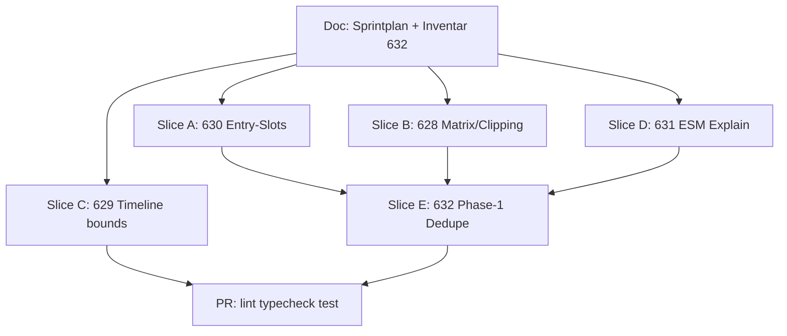

# UX-Feedback Sprint — Issues #628–#632

Last updated: 2026-08-02

Trackers:

- [#628](https://github.com/Sturmi77/correlcore/issues/628) — Korrelationsliste nicht abschneiden
- [#629](https://github.com/Sturmi77/correlcore/issues/629) — Trends-Zeitleiste Anschlag / kein Overscroll
- [#630](https://github.com/Sturmi77/correlcore/issues/630) — Entry-Tageszeiten vorerst ausblenden
- [#631](https://github.com/Sturmi77/correlcore/issues/631) — Ausgerichtete Ereignisse erklären
- [#632](https://github.com/Sturmi77/correlcore/issues/632) — Hinweistexte / Korrelations-Disclaimer entflechten

This sprint ends with **one PR**. #632 ships **Phase-1 only** (inventory +
Insights-session dedupe). Footer/Auth/Legal and first-visit banners stay on
#632 for Phase-2.

**Effort labels** mean relative engineering weight (Low / Medium / High), not
calendar duration.

---

## Goal

Ship a focused frontend UX polish PR so:

1. Correlation lists are fully reachable (no hard bottom clip).
2. Trends Compare horizontal scroll stops at the first and last data day.
3. Unused Morning/Noon/Evening entry chips are hidden until slot analytics exist.
4. Event-aligned small multiples are readable (intro, axis caption, metric,
   colour legend).
5. Insights no longer repeat the same correlation/medical disclaimer as inline
   paragraphs on every lead/card — one on-demand entry point remains.

---

## Sprint overview

| Slice | ID    | Title                            | Issues | Effort     | Status   |
| ----- | ----- | -------------------------------- | ------ | ---------- | -------- |
| 0     | UXF-0 | Sprint doc + #632 inventory      | #632   | Low        | **Done** |
| A     | UXF-A | Hide entry time slots            | #630   | Low        | **Done** |
| B     | UXF-B | Correlation list full visibility | #628   | Low–Medium | **Done** |
| C     | UXF-C | Compare timeline scroll bounds   | #629   | Medium     | **Done** |
| D     | UXF-D | ESM explainability               | #631   | Medium     | **Done** |
| E     | UXF-E | Disclaimer dedupe Phase-1        | #632   | Medium     | **Done** |

---

## Dependency graph



| Rule                        | Reason                                                                  |
| --------------------------- | ----------------------------------------------------------------------- |
| A–D independent             | Different surfaces (entry / matrix / compare / ESM)                     |
| E after B and D             | Same Insights feed/card stack; avoid fighting clip + disclaimer edits   |
| #632 Phase-2 out of this PR | First-visit banner and global copy harmonisation need product follow-up |

---

## #632 inventory — disclaimer / correlation notes

| Site                                  | Key(s)                                                    | Job                         | Class               | Phase-1 action        |
| ------------------------------------- | --------------------------------------------------------- | --------------------------- | ------------------- | --------------------- |
| `LegalFooter.svelte`                  | `disclaimer.medical`                                      | Global legal                | Legal-persistent    | Keep                  |
| `auth/+layout.svelte`                 | `disclaimer.medical`                                      | Pre-auth legal              | Legal-persistent    | Keep                  |
| `SymptomChecker.svelte`               | `disclaimer.medical`                                      | At symptom input            | Context-persistent  | Keep (Phase-2 review) |
| `MobileInsightLead.svelte`            | `insights.mobile.correlation_note` + link                 | Inline paragraph every lead | UX-repetitive       | **Remove**            |
| `InsightCard.svelte`                  | `insights.card.disclaimer_link` → `/insights/disclaimer`  | Per-card ⓘ                  | UX-repetitive       | **Remove**            |
| `InsightFeed.svelte` header button    | `insights.feed.disclaimer_aria` → `CorrelationDisclaimer` | On-demand modal             | Canonical on-demand | **Keep**              |
| `CorrelationDisclaimer.svelte` + page | `insights.disclaimer.*`                                   | Full explanation            | Canonical           | Keep                  |
| `insights/disclaimer/+page.svelte`    | same                                                      | Deep-link                   | Canonical           | Keep                  |
| `SymptomCalendarHeatmap.svelte`       | `insights.symptoms.calendar_correlation_note`             | Chart-local navigation hint | Different job       | Keep                  |
| Onboarding / cycle / maturity footers | various “descriptive, not a diagnosis”                    | One-time flows              | Keep                | Keep                  |
| Landing FAQ / about                   | medical FAQ copy                                          | Marketing                   | Out of Phase-1      | Keep                  |

### Phase-1 concept decision

- **Legal/Auth/Footer** stay persistent (different job from insight UX).
- **Insights session:** one canonical on-demand entry — Feed ⓘ →
  `CorrelationDisclaimer` (plus deep-link `/insights/disclaimer`).
- No repeated inline correlation/medical paragraphs on lead + every card.
- Safety copy remains reachable in ≤2 clicks (ISP governance).

### Phase-2 (out of this PR, stays on #632)

- Optional first-visit / “Got it” banner.
- Soften or relocate `SymptomChecker` medical line if still redundant.
- Broader copy harmonisation across onboarding/landing.

---

## Slice details

### UXF-0 — Sprint doc + inventory

This document. No product code.

### UXF-A — #630 Hide entry time slots

- `SHOW_ENTRY_TIME_SLOTS = false` in `EntryForm.svelte` with re-enable comment
  (when slot analytics ship; see ADR-0028).
- Hide chip row + hint; default `selectedSlot = 'day'`; API `slot` unchanged.
- Gate or adapt `EntryForm` slot-change UI tests.

### UXF-B — #628 Correlation list visibility

- Repro: Insights matrix with many rows on ~390px viewport.
- Fix: bottom clearance and/or `overflow-y: auto` + `max-height` on the matrix
  table so every row is reachable without hard clip under the fixed nav.
- Avoid global `--app-nav-height` changes unless measurement shows token drift.

### UXF-C — #629 Timeline scroll bounds

- `overscroll-behavior-x: contain` on `.compare__axis-scroller`.
- Reduce trailing `rightPadding` / leading empty scroll so scroll width matches
  first…last data day; keep chart ↔ heatmap alignment.
- Regression: zoom stages, strips + lines.

### UXF-D — #631 ESM explainability

- Sharpen `trends.esm.body` (DE/EN): alignment meaning + association ≠ cause.
- Axis caption, metric label from `metric` prop, 3-stop divergent colour legend.
- Keep existing lag hint; extend unit tests.

### UXF-E — #632 Phase-1 dedupe

- Remove `MobileInsightLead` correlation note paragraph.
- Remove per-card disclaimer link from `InsightCard`.
- Keep Feed disclaimer button + canonical sheet/page.

---

## Acceptance criteria (PR exit)

### #628

- [ ] All correlation matrix rows reachable (scroll or layout).
- [ ] No hard clip under bottom nav without scroll affordance.
- [ ] Light/Dark, mobile + desktop smoke.

### #629

- [ ] Horizontal scroll stops at first and last axis date.
- [ ] No empty overscroll past data; `overscroll-behavior-x: contain`.
- [ ] Strips + Lines, at least one zoom stage checked.

### #630

- [ ] Morning/Noon/Evening chips not visible.
- [ ] Save uses `day`; API/DB slots preserved.
- [ ] Re-enable flag documented in code.

### #631

- [ ] Sheet intro (DE + EN), axis caption, metric label, colour legend.
- [ ] Lag column note still present for lag insights.
- [ ] Unit tests cover new affordances.

### #632 Phase-1

- [ ] Inventory table in this doc.
- [ ] Concept decision recorded (canonical Feed ⓘ).
- [ ] Lead note + per-card disclaimer removed; Feed ⓘ kept.
- [ ] Legal/Auth/Footer untouched.

---

## Test plan

```bash
pnpm --filter @correlcore/web lint
pnpm --filter @correlcore/web typecheck
pnpm --filter @correlcore/web test
```

Manual smoke: Insights matrix + disclaimer affordance; Trends Compare scroll;
Entry form without time slots; ESM sheet copy/legend.

---

## Out of scope

- #632 Phase-2
- [#585](https://github.com/Sturmi77/correlcore/issues/585) Compare Zoom device QA
- Backend / entry-slot schema changes
- `apps/web-react`
