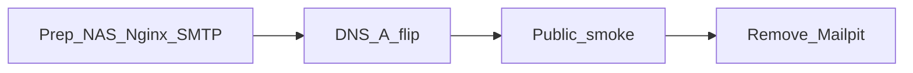

# Runbook — Combined Hosted cutover (Nginx + SMTP)

Last updated: 2026-07-19  
**Milestone:** M10.2 Sprints 1–2 live  
**Issues:** #460 (edge), #461 (SMTP)  
**Details:** [`hosted-nginx-edge.md`](hosted-nginx-edge.md) · [`hosted-smtp.md`](hosted-smtp.md)  
**Choose topology first:** [`hosted-topology-options.md`](hosted-topology-options.md)

Yes: prepare everything offline, then **flip DNS + ENV in one window**.
Do not run a half-cutover (public web without working verify mail) if you can avoid it.

> **IONOS marketing + NAS app:** If you keep the website builder on
> `correlcore.com` and run CorrelCore on `app.correlcore.com`, follow
> **Topology H** in the topology runbook — do **not** point the apex A-Record
> at the NAS. This file’s default steps assume **Topology A** (full apex on NAS).



---

## Strategy

Pick one topology before the window ([`hosted-topology-options.md`](hosted-topology-options.md)):

| Topology                  | Apex `correlcore.com`         | App login            | This runbook                   |
| ------------------------- | ----------------------------- | -------------------- | ------------------------------ |
| **A** Full NAS            | → NAS                         | apex `/auth/login`   | Steps below                    |
| **B** IONOS reverse proxy | DNS stays IONOS; proxy to NAS | apex                 | Adapt “Flip” to proxy enable   |
| **H** Hybrid ★            | stays IONOS marketing         | `app.correlcore.com` | Use topology H section instead |

### Topology A phases (default below)

| Phase     | Where                     | Public traffic             |
| --------- | ------------------------- | -------------------------- |
| **Prep**  | NAS only (Tailscale/LAN)  | Still IONOS Apache on apex |
| **Flip**  | DNS A (+ fix/remove AAAA) | Moves to NAS Nginx         |
| **Prove** | Mobile data / external    | Web + register/verify      |
| **Clean** | Hosted compose            | Mailpit gone               |

AAAA: only point at NAS if IPv6 edge is real; otherwise **remove** IONOS AAAA so clients do not stick on the old host. MX/SPF for receive stay on IONOS unless you change mail hosting.

### Topology H reminder (if chosen)

- Do **not** move apex A to the NAS.
- Add `app.correlcore.com` → NAS; ENV/`DOMAIN` = `app.correlcore.com`.
- IONOS page CTAs → `https://app.correlcore.com/auth/login` (etc.).
- SMTP still IONOS. Full steps: topology runbook § Topology H.

---

## T−1 — Prep (no DNS change yet)

Work through both detail runbooks locally until green on the NAS.

### Edge ([`hosted-nginx-edge.md`](hosted-nginx-edge.md))

- [ ] Web bound to `127.0.0.1:${WEB_HOST_PORT}`
- [ ] Traefik **not** on host 80/443
- [ ] Nginx/Synology RP → web; TLS cert ready (or will issue after A points here)
- [ ] `X-Forwarded-Proto https` set
- [ ] Local smoke: `curl http://127.0.0.1:${WEB_HOST_PORT}/api/v1/health`

### App ENV (web + mail together)

```env
APP_ENV=production
DOMAIN=correlcore.com
FRONTEND_BASE_URL=https://correlcore.com
CORS_ORIGINS=https://correlcore.com
COOKIE_SECURE=true
SMTP_HOST=smtp.ionos.de
SMTP_PORT=587
SMTP_USER=...
SMTP_PASSWORD=...
SMTP_FROM=noreply@correlcore.com
SMTP_USE_TLS=true
```

- [ ] Secrets offline-backed up (`ENCRYPTION_KEY`, `SECRET_KEY`, …)
- [ ] API/web/worker restarted with new ENV
- [ ] Optional: send a test mail while `FRONTEND_BASE_URL` already points at correlcore.com
      (links will only work after DNS flip — OK)

### Mail DNS prep ([`hosted-smtp.md`](hosted-smtp.md))

Can be done **before** web cutover (does not move apex):

- [ ] IONOS SMTP credentials ready (preferred) **or** external relay + SPF/DKIM
- [ ] DKIM published
- [ ] DMARC TXT `_dmarc.correlcore.com` with `p=none`
- [ ] MX left on IONOS (unless intentional move)

### Router

- [ ] Port-forward 80/443 → NAS **ready** (or tunnel option B)
- [ ] Know public IPv4 for the new **A** record
- [ ] CGNAT check: if no public IPv4, use tunnel/proxy — do not flip A blindly

---

## T0 — Flip window (short TTL helps)

1. Lower TTL on A/AAAA ahead of time if you can (e.g. 300s), wait for old TTL.
2. Set **A** `correlcore.com` → NAS public IPv4.
3. **AAAA:** set to NAS IPv6 **or delete** IONOS AAAA.
4. Optional: `www` → apex redirect/CNAME.
5. **Do not** change MX during this window.
6. Wait for propagation (`dig +short correlcore.com A`).

If Let's Encrypt HTTP-01 is used on the NAS, complete cert issuance immediately after A points here (ports 80/443 must reach Nginx).

---

## T+0 — Public smoke (no VPN)

```bash
curl -sfI "https://correlcore.com/" | head -20
curl -sf "https://correlcore.com/api/v1/health"
```

Browser (mobile data):

- [ ] Landing loads (CorrelCore app, not IONOS Apache placeholder)
- [ ] `/auth/register` → real inbox verify mail
- [ ] Verify link host = `https://correlcore.com`
- [ ] Login works (Secure cookies)
- [ ] Password reset once

On failure: roll back **A** (and AAAA) to previous IONOS values; fix NAS; retry.
Mail DNS (DKIM/DMARC) can stay.

---

## T+1 — Clean Hosted stack

- [ ] Remove Mailpit from Hosted compose; no `SMTP_HOST=mailpit`
- [ ] Confirm Selfhost quickstart still uses Mailpit in docs/compose defaults
- [ ] Tick backlog S1-O* + S2-O* in [`../M10_2_PUBLIC_HOSTED_LAUNCH_BACKLOG.md`](../M10_2_PUBLIC_HOSTED_LAUNCH_BACKLOG.md)

---

## Out of this cutover

| Item                                                       | When                                |
| ---------------------------------------------------------- | ----------------------------------- |
| Landing/legal content polish, `.app`→`.com` in SECURITY.md | Sprint 3 (#462)                     |
| APK CTA on landing                                         | Sprint 4 (#463 / #429)              |
| Traefik / VPS move                                         | Sprint 5 — **not** during this flip |

---

## Rollback cheat sheet

| Symptom                                | First action                                                                                                                   |
| -------------------------------------- | ------------------------------------------------------------------------------------------------------------------------------ |
| Apex still IONOS HTML                  | Dig A/AAAA; wait TTL; check CDN/proxy cache                                                                                    |
| 502/timeout after flip                 | Router forward; Nginx upstream port; web container up                                                                          |
| **502 `upstream sent too big header`** | Raise `proxy_buffer_size 32k; proxy_buffers 8 32k;` on the edge (NPM: Advanced field) — app sends large `Link` preload headers |
| Login no cookie                        | `X-Forwarded-Proto https`; `COOKIE_SECURE=true`                                                                                |
| No verify mail                         | SMTP ENV; relay auth; SPF/DKIM; API logs                                                                                       |
| Need old site back                     | Restore previous A/AAAA to IONOS                                                                                               |
