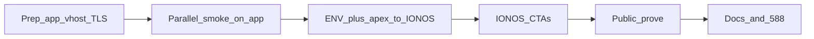

# Runbook — Topology H cutover (`app.correlcore.com`)

Last updated: 2026-08-01  
**Milestone:** M10.2  
**Related issues:** #588 (apex shows app instead of marketing), #460 (edge), #461 (SMTP)  
**Background:** [`hosted-topology-options.md`](hosted-topology-options.md) § Topology H  
**Do not use for apex-only Hosted:** [`hosted-cutover.md`](hosted-cutover.md) (Topology A)

Move CorrelCore from the apex (`https://correlcore.com`) to
`https://app.correlcore.com`, and keep **marketing** on the apex (IONOS website
builder). SMTP stays on IONOS; Postgres stays on the NAS.

This runbook assumes **Topology A is already live** (app + SMTP on
`correlcore.com`) and you are migrating to **H**. For a greenfield H launch,
skip the “apex still serves app” notes and start at Phase 1.

**Edge assumption (Hosted):** TLS and reverse proxy are **host Nginx only**
(canonical config [`infra/nginx/correlcore.com.conf`](../../infra/nginx/correlcore.com.conf),
or Synology Reverse Proxy which is Nginx under the hood). Traefik is **not**
part of this path — do not enable Compose Traefik on 80/443.



---

## End state

| Host                         | Serves                                                |
| ---------------------------- | ----------------------------------------------------- |
| `https://correlcore.com`     | IONOS marketing only (no CorrelCore cookies / `/api`) |
| `https://app.correlcore.com` | Full stack: landing, auth, app, `/api/v1/*`           |

| Concern             | Value                                     |
| ------------------- | ----------------------------------------- |
| Login               | `https://app.correlcore.com/auth/login`   |
| Verify / reset mail | Links prefix `https://app.correlcore.com` |
| SMTP FROM           | `noreply@correlcore.com` (unchanged)      |
| Cookie origin       | Host-only on `app.correlcore.com`         |

**Not supported:** Apex marketing calling NAS API with cookies from
`correlcore.com` (cross-origin). CTAs must be absolute URLs to `app.`.

---

## Master checklist (print / ticket)

Copy into the cutover ticket or keep open beside the window.

### Binding

- [ ] Topology **H** chosen and noted in
      [`../M10_2_PUBLIC_HOSTED_LAUNCH_STATUS.md`](../M10_2_PUBLIC_HOSTED_LAUNCH_STATUS.md)
- [ ] Maintainer available for DNS + Nginx (or Synology RP) + `.env` in one window
- [ ] IONOS marketing site ready (or placeholder) for apex after move
- [ ] Public IPv4 of NAS known; CGNAT check done (else tunnel/proxy for `app.`)

### Phase 1 — Prep (apex still live on NAS)

- [ ] Web still bound to `127.0.0.1:${WEB_HOST_PORT}` (default `3010`)
- [ ] Host Nginx owns 80/443 (no second edge in front)
- [ ] DNS: create `app.correlcore.com` A → NAS (AAAA only if real IPv6 edge)
- [ ] Nginx `server_name app.correlcore.com` (or Synology RP rule) → web upstream
- [ ] TLS cert for `app.` (Let's Encrypt / Synology)
- [ ] `X-Forwarded-Proto: https` set; proxy buffers ≥ 32k (ADR-0040)
- [ ] Optional: keep existing apex `server_name` until Phase 3 (both hostnames → same web)

### Phase 2 — Parallel smoke on `app.` (ENV still apex)

- [ ] `curl -sfI https://app.correlcore.com/` → 200, app HTML
- [ ] `curl -sf https://app.correlcore.com/api/v1/health` → OK
- [ ] Browser login on `app.` works (cookie for `app.` host)
- [ ] Note: verify-mail links still point at apex until Phase 3 ENV flip — OK

### Phase 3 — Flip window (short)

- [ ] Lower TTL on apex A/AAAA ahead of time if possible
- [ ] Set Hosted ENV to `app.` (see below) and restart `api` + `web` (+ worker)
- [ ] Point apex A/AAAA **back to IONOS** marketing (not NAS)
- [ ] Do **not** change MX / SPF during this window
- [ ] Wait for DNS propagation (`dig +short app.correlcore.com A`, apex → IONOS)

### Phase 4 — Marketing CTAs

- [ ] IONOS Login → `https://app.correlcore.com/auth/login`
- [ ] IONOS Register → `https://app.correlcore.com/auth/register`
- [ ] Optional “Open app” → `https://app.correlcore.com/`
- [ ] Legal footer → prefer `https://app.correlcore.com/impressum` and `/privacy`
- [ ] Optional: apex redirects `/auth/*` → `app.` for old bookmarks

### Phase 5 — Prove (no VPN / mobile data)

- [ ] Apex = marketing (not app shell)
- [ ] `app.` landing / login / register
- [ ] Register → real inbox; link host = `https://app.correlcore.com`
- [ ] `BASE_URL=https://app.correlcore.com scripts/verify-auth-cookie.sh`
- [ ] Password reset once
- [ ] Existing users know they must **re-login** (cookies do not move hosts)

### Phase 6 — Clean / close

- [ ] Confirm Hosted Mailpit already gone (or remove now)
- [ ] Hosted APK / Capacitor: `VITE_API_BASE_URL=https://app.correlcore.com/api/v1` if applicable
- [ ] Update STATUS binding: topology = **H**
- [ ] Close or comment [#588](https://github.com/Sturmi77/correlcore/issues/588) after apex no longer serves the app

---

## Phase details

### 0 — Inventory (T−1 day)

Record current production values before touching DNS:

| Item                | Current (fill in)        | Target after H                |
| ------------------- | ------------------------ | ----------------------------- |
| Apex A              | NAS / IONOS?             | **IONOS** marketing           |
| App hostname        | _(none / apex)_          | `app.correlcore.com` → NAS    |
| `FRONTEND_BASE_URL` | `https://correlcore.com` | `https://app.correlcore.com`  |
| `CORS_ORIGINS`      | apex                     | `https://app.correlcore.com`  |
| `SMTP_*`            | working                  | unchanged                     |
| Edge                | host Nginx (only)        | same Nginx, new `server_name` |
| Compose path        | Dockhand / …             | unchanged                     |

Also confirm:

```bash
# From an external network (or phone hotspot)
dig +short correlcore.com A
dig +short app.correlcore.com A   # expect empty until Phase 1
curl -sfI "https://correlcore.com/" | head -20
curl -sf "https://correlcore.com/api/v1/health"
```

---

### 1 — Nginx edge for `app.correlcore.com`

Hosted uses **Nginx only** for TLS + reverse proxy ([ADR-0040](../adr/0040-selfhost-auth-edge-passthrough.md)).

Copy
[`infra/nginx/correlcore.com.conf`](../../infra/nginx/correlcore.com.conf)
and adjust:

- `server_name app.correlcore.com;` (HTTP→HTTPS redirect block too)
- TLS cert paths for `app.correlcore.com`
- Upstream stays `127.0.0.1:${WEB_HOST_PORT}` (Dockhand default `3010`)

Keep the ADR-0040 contract: one-rule passthrough of **all** paths to web,
`X-Forwarded-Proto: https`, proxy buffers ≥ 32k, no per-path `/api` location
with its own `proxy_set_header`.

After edit: `nginx -t` && reload.

**If the edge is Synology Application Portal (Nginx under the hood)**

| Field           | Value                                             |
| --------------- | ------------------------------------------------- |
| Source hostname | `app.correlcore.com`                              |
| Source port     | `443`                                             |
| Destination     | `http://127.0.0.1:3010` (or your `WEB_HOST_PORT`) |
| Custom header   | `X-Forwarded-Proto: https`                        |
| Advanced        | `proxy_buffer_size 32k;` (+ buffers 8 32k)        |

Same rule: proxy **all** paths (no separate `/api` destination).

**DNS**

| Name                 | Type | Value                                    |
| -------------------- | ---- | ---------------------------------------- |
| `app.correlcore.com` | A    | NAS public IPv4                          |
| `app.correlcore.com` | AAAA | only if NAS IPv6 edge is real; else omit |

Leave apex on NAS until Phase 3 so production stays up during prep.

Local smoke on the NAS (before public DNS propagates):

```bash
curl -sf -H "Host: app.correlcore.com" "http://127.0.0.1:${WEB_HOST_PORT}/api/v1/health"
```

---

### 2 — Parallel smoke (ENV still apex)

After `app.` DNS + TLS are live, smoke the new host **without** changing ENV yet:

```bash
curl -sfI "https://app.correlcore.com/" | head -20
curl -sf "https://app.correlcore.com/api/v1/health"
BASE_URL=https://app.correlcore.com scripts/verify-auth-cookie.sh
```

Browser (incognito): open `https://app.correlcore.com/auth/login`, sign in.

| Expected                                  | Not expected yet                                      |
| ----------------------------------------- | ----------------------------------------------------- |
| App HTML / API / session cookie on `app.` | Verify-email link host = `app.` (still apex until §3) |
| Apex `correlcore.com` still full app      | Apex already marketing                                |

If cookie verify fails on `app.`, fix the edge **before** the ENV/apex flip
(usual causes: missing `X-Forwarded-Proto`, stripped `Set-Cookie`, tiny proxy
buffers → 502).

---

### 3 — Flip window (ENV + apex DNS)

Do these close together so verify links and public hosts stay consistent.

#### 3a — Hosted ENV

In the Hosted `.env` (Dockhand / compose):

```env
APP_ENV=production
DOMAIN=app.correlcore.com
FRONTEND_BASE_URL=https://app.correlcore.com
CORS_ORIGINS=https://app.correlcore.com
COOKIE_SECURE=true
# SMTP_* unchanged — example:
# SMTP_HOST=smtp.ionos.de
# SMTP_PORT=587
# SMTP_FROM=noreply@correlcore.com
# SMTP_USE_TLS=true
```

Restart at least `api` and `web` (and digest/analytics workers if separate).

Confirm inside the API container (or via a fresh register mail after 3b):

- `FRONTEND_BASE_URL` ends with `https://app.correlcore.com`
- No leftover `https://correlcore.com` in mail templates / health debug if exposed

#### 3b — Apex DNS back to IONOS

1. Set **A** `correlcore.com` → IONOS marketing IP (previous website builder).
2. **AAAA:** IONOS marketing IPv6 **or** delete NAS AAAA so clients do not stick on the old edge.
3. Optional `www` → apex redirect on IONOS.
4. **Do not** change MX.

```bash
dig +short correlcore.com A          # expect IONOS
dig +short app.correlcore.com A      # expect NAS
```

#### 3c — Sessions

Cookies were host-only on `correlcore.com`. After the flip, users must log in
again on `app.correlcore.com`. No cookie `Domain=.correlcore.com` shared across
apex and app (by design for H).

---

### 4 — IONOS marketing CTAs

On the apex site builder, use **absolute** URLs:

| CTA          | URL                                                |
| ------------ | -------------------------------------------------- |
| Anmelden     | `https://app.correlcore.com/auth/login`            |
| Registrieren | `https://app.correlcore.com/auth/register`         |
| App öffnen   | `https://app.correlcore.com/`                      |
| Impressum    | `https://app.correlcore.com/impressum` (preferred) |
| Datenschutz  | `https://app.correlcore.com/privacy`               |

Relative `/auth/login` on the marketing host is wrong — it stays on IONOS and
never hits the app.

Optional bookmark safety on IONOS (if the builder supports redirects):

- `https://correlcore.com/auth/*` → `https://app.correlcore.com/auth/*`

---

### 5 — Public prove

From mobile data / non-VPN:

```bash
curl -sfI "https://correlcore.com/" | head -20
# Expect: IONOS marketing HTML — not CorrelCore app shell

curl -sfI "https://app.correlcore.com/" | head -20
curl -sf "https://app.correlcore.com/api/v1/health"
./scripts/verify-deploy-health.sh https://app.correlcore.com <known_good_git_commit>
BASE_URL=https://app.correlcore.com scripts/verify-auth-cookie.sh
```

Browser checklist:

- [ ] Apex: marketing only (anonymous and with old apex cookies cleared)
- [ ] `app./`: anonymous → product landing; authenticated → home
- [ ] Register → inbox mail within ~1 min
- [ ] Verify link host = `https://app.correlcore.com/...`
- [ ] Login + soft refresh keeps session
- [ ] Password reset once

**#588 expectation after H:** apex never shows the app shell. Whether the
in-app landing vs home on `app./` is correct is covered by product routing
(`LandingPage` for anonymous, home when authenticated, `?landing=1` preview).

---

### 6 — Clean / docs

- [ ] Hosted Mailpit absent (`SMTP_HOST` ≠ `mailpit`)
- [ ] If you ship a Hosted APK: rebuild with
      `VITE_API_BASE_URL=https://app.correlcore.com/api/v1`
- [ ] STATUS: set Hosted topology binding to **H**
- [ ] Issue #588: comment with cutover evidence; close when apex is marketing-only
- [ ] Optional: retire apex `server_name` / Nginx vhost on the NAS (only `app.` remains)

---

## Rollback

| Symptom                       | First action                                                                       |
| ----------------------------- | ---------------------------------------------------------------------------------- |
| `app.` 502 / timeout          | NAS upstream port; TLS; proxy buffers; do not touch apex yet if still on NAS       |
| Cookie login fails on `app.`  | `X-Forwarded-Proto`; ADR-0040; `verify-auth-cookie.sh`                             |
| Verify links still apex       | `FRONTEND_BASE_URL` not applied / API not restarted                                |
| Apex blank / wrong after flip | Restore apex A/AAAA to previous values (NAS or IONOS)                              |
| Need full undo of H           | 1) ENV back to `https://correlcore.com` 2) apex A → NAS 3) keep or drop `app.` DNS |

Rollback of **only** `app.` DNS leaves apex marketing untouched once Phase 3b is
done. Prefer fixing `app.` edge over flipping apex back to the NAS unless the
ENV still points at apex.

---

## Code / product notes

| Area                              | Action for H                                                      |
| --------------------------------- | ----------------------------------------------------------------- |
| SvelteKit / FastAPI               | **No code change** — origins are ENV-driven                       |
| Relative `/auth/*` in app         | Correct on `app.` origin                                          |
| Apex marketing                    | Absolute CTAs only                                                |
| `infra/nginx/correlcore.com.conf` | Template for Hosted Nginx; set `server_name app.correlcore.com`   |
| Traefik                           | Not used on Hosted — ignore Compose Traefik docs for this cutover |
| In-app landing (#588 / #593)      | Still valid on `app./` for anonymous visitors                     |

---

## Quick command card

```bash
# DNS
dig +short correlcore.com A
dig +short app.correlcore.com A

# App origin
curl -sfI "https://app.correlcore.com/" | head -20
curl -sf "https://app.correlcore.com/api/v1/health"
BASE_URL=https://app.correlcore.com scripts/verify-auth-cookie.sh

# Apex should NOT be the API after flip
curl -sf "https://correlcore.com/api/v1/health" || echo "expected fail/non-app on marketing apex"
```
