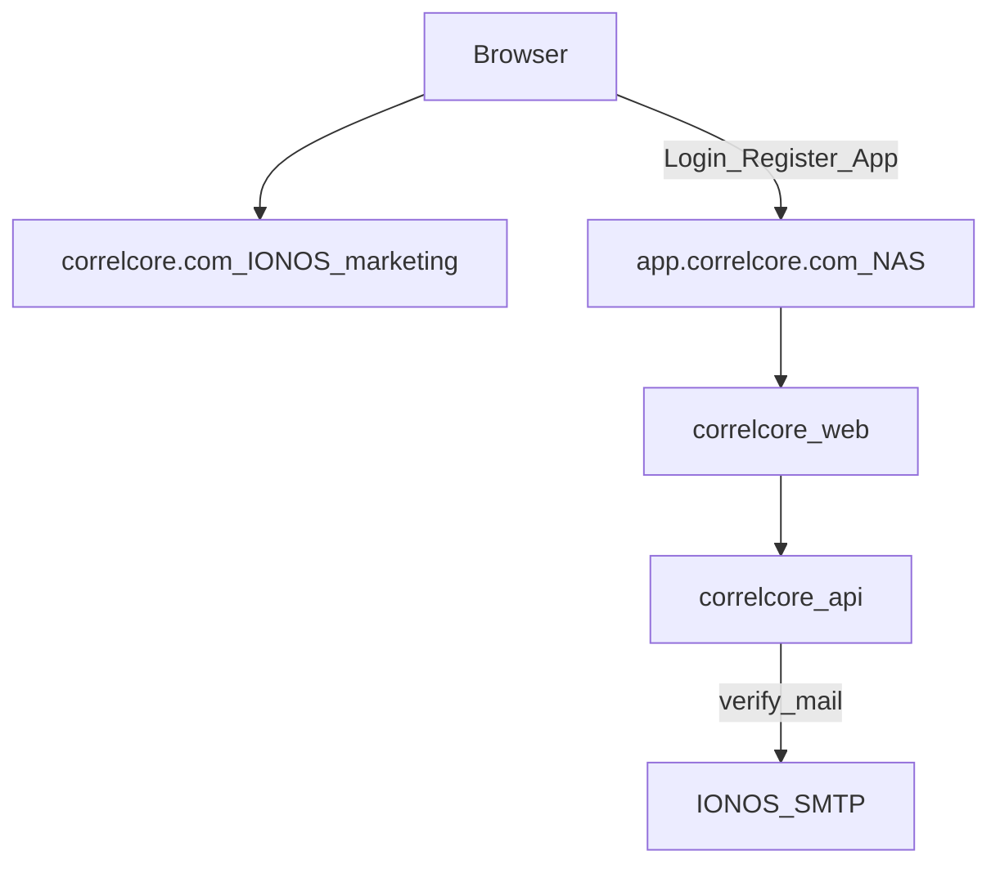

# Runbook — Hosted topology options (`correlcore.com`)

Last updated: 2026-07-19  
**Milestone:** M10.2  
**Related:** [`hosted-cutover.md`](hosted-cutover.md) · [`hosted-nginx-edge.md`](hosted-nginx-edge.md) · [`hosted-smtp.md`](hosted-smtp.md)  
**Auth constraint:** [ADR-0011](../adr/0011-web-internal-reverse-proxy.md) — browser talks **same-origin** `/api/v1`; web container proxies to API.

## Short answers

| Question                                                                              | Answer                                                                                                                                                                                               |
| ------------------------------------------------------------------------------------- | ---------------------------------------------------------------------------------------------------------------------------------------------------------------------------------------------------- |
| Wenn ich den Apex (A-Record) auf die NAS zeige, muss der Website-Content dort laufen? | **Ja.** Der Browser holt HTML/JS von dem Host, auf den DNS zeigt. Bei Apex→NAS liefert die NAS die CorrelCore-Web-App.                                                                               |
| Kann ich „nur die Website“ auf IONOS lassen und „nur das Backend“ auf der NAS?        | **Nicht so**, wie CorrelCore gebaut ist. Landing, Login und App-UI **sind** der `correlcore-web`-Container — nicht eine separate IONOS-Website. Cookie-Login braucht **dieselbe Origin** wie `/api`. |
| Was ist die einfachste Variante nah an „Website+SMTP bei IONOS, App-Daten auf NAS“?   | **Hybrid (empfohlen unten):** Marketing optional auf IONOS Apex; **volle App** (Web+API) unter `app.correlcore.com` auf der NAS; **SMTP bei IONOS**.                                                 |

---

## What “the website” is in CorrelCore

```text
Browser
  → https://<origin>/              LandingPage.svelte (SvelteKit web)
  → https://<origin>/auth/login    same web app
  → https://<origin>/api/v1/...    proxied by web → api (ADR-0011)
```

There is **no** supported product mode where IONOS serves the Svelte UI and the NAS
exposes only `correlcore-api` for cookie login. That would be cross-origin cookies
(`SameSite` / CORS) and is out of M10.2 scope.

SMTP is independent: sending mail via IONOS SMTP does **not** require hosting the
web UI on IONOS.

---

## Topology A — Full stack on NAS (classic)

```text
DNS:  correlcore.com A/AAAA → NAS public IP
Edge: Nginx/Synology on NAS → correlcore-web → correlcore-api
Mail: IONOS SMTP (MX stays IONOS)
```

| Pros                                            | Cons                                       |
| ----------------------------------------------- | ------------------------------------------ |
| One origin; matches current product             | Home IP / port-forward / CGNAT             |
| Login URL = `https://correlcore.com/auth/login` | IONOS website builder on apex must go away |

**Cutover:** [`hosted-cutover.md`](hosted-cutover.md) (A-Record flip).

---

## Topology B — IONOS as reverse-proxy edge only

```text
DNS:  correlcore.com stays on IONOS
IONOS: Reverse Proxy / “proxy” → http(s)://<NAS-reachable-host>:PORT
NAS:   correlcore-web → api  (content still generated on NAS)
Mail:  IONOS SMTP
```

| Pros                                                           | Cons                                                                    |
| -------------------------------------------------------------- | ----------------------------------------------------------------------- |
| Apex DNS can stay at IONOS                                     | IONOS must support reverse proxy to your NAS (public IP or tunnel)      |
| Same-origin preserved if proxy forwards **all** `/` and `/api` | Misconfigured headers break cookies (`X-Forwarded-Proto`)               |
| SMTP stays IONOS                                               | You are **not** hosting CorrelCore HTML on IONOS Apache — only proxying |

**Detail:**

1. NAS: stack as in [`hosted-nginx-edge.md`](hosted-nginx-edge.md) (web on localhost or LAN IP reachable from tunnel).
2. Expose NAS to IONOS via public IP + firewall allowlist **or** VPN/tunnel (Tailscale funnel / Cloudflare Tunnel / wireguard) — pick one.
3. IONOS reverse proxy:
   - Source: `https://correlcore.com`
   - Destination: NAS web upstream
   - Forward `Host`, `X-Forwarded-For`, **`X-Forwarded-Proto: https`**
   - Proxy **entire** site including `/api/*` (do not terminate API on a second host).
4. ENV:

   ```env
   FRONTEND_BASE_URL=https://correlcore.com
   CORS_ORIGINS=https://correlcore.com
   COOKIE_SECURE=true
   SMTP_HOST=smtp.ionos.de
   # ...
   ```

5. Smoke: same as combined cutover, but DNS A may still show IONOS.

---

## Topology H — Hybrid (IONOS marketing + NAS app) ★ matches “website @ IONOS”

Use this when you want to keep an IONOS-built marketing page on the apex and run
CorrelCore on the NAS without fighting cookie/same-origin rules.

```text
DNS:
  correlcore.com     → IONOS  (static / website builder / marketing)
  app.correlcore.com → NAS    (A/AAAA to NAS, or IONOS proxy to NAS)

NAS:
  full stack web+api behind Nginx for Host app.correlcore.com

Mail:
  IONOS SMTP + existing MX/SPF
```



### Why this works

- Marketing HTML can live on IONOS (whatever builder you use).
- Login/session stay **same-origin** on `https://app.correlcore.com`.
- Health data / Postgres stay on the NAS.
- SMTP stays on IONOS (Sprint 2 runbook unchanged).

### What does **not** work

- Apex IONOS page calling `https://<nas-ip>:8000/api` with cookies from `correlcore.com`.
- Serving only API on NAS and expecting the IONOS site to be the CorrelCore SPA.

### DNS

| Name                 | Type                      | Value                                   |
| -------------------- | ------------------------- | --------------------------------------- |
| `correlcore.com`     | A/AAAA                    | keep IONOS (marketing)                  |
| `app.correlcore.com` | A (and AAAA only if real) | NAS public IP **or** IONOS proxy target |
| MX / SPF             | —                         | keep IONOS; add DKIM/DMARC for sending  |

### NAS / Nginx

Server name **`app.correlcore.com`** (not apex), proxy all paths to web localhost —
same snippet as [`hosted-nginx-edge.md`](hosted-nginx-edge.md) with `server_name` changed.

### Hosted ENV

```env
APP_ENV=production
DOMAIN=app.correlcore.com
FRONTEND_BASE_URL=https://app.correlcore.com
CORS_ORIGINS=https://app.correlcore.com
COOKIE_SECURE=true
SMTP_HOST=smtp.ionos.de
SMTP_PORT=587
SMTP_USER=...
SMTP_PASSWORD=...
SMTP_FROM=noreply@correlcore.com
SMTP_USE_TLS=true
```

Verify links in mail will be `https://app.correlcore.com/auth/verify-email?...`.

### IONOS marketing page CTAs

Link buttons to the app origin (not relative `/auth/login` on the marketing host):

- Register: `https://app.correlcore.com/auth/register`
- Login: `https://app.correlcore.com/auth/login`
- Optional: “Open app” → `https://app.correlcore.com/`

Legal: either host `/impressum` & `/privacy` on the **app** origin (already in product)
and link from the marketing footer, or duplicate static legal pages on IONOS — if you
duplicate, keep them in sync (prefer linking to app routes to avoid drift).

### Capacitor / APK later

Hosted Android build should use:

```env
VITE_API_BASE_URL=https://app.correlcore.com/api/v1
```

### Combined cutover for Topology H

1. **Prep NAS** for `app.correlcore.com` (Nginx + ENV + SMTP) — no apex change.
2. **Create DNS** `app` → NAS (or proxy); get TLS on `app`.
3. **Smoke** `https://app.correlcore.com/` + register/verify (IONOS SMTP).
4. **Remove Hosted Mailpit**.
5. **Point IONOS marketing CTAs** at `app.correlcore.com`.
6. Apex `correlcore.com` can stay on IONOS indefinitely for marketing.

Rollback: delete/change only `app` DNS; apex marketing untouched.

---

## Topology comparison

|                                              | A Full NAS                  | B IONOS proxy       | H Hybrid ★                      |
| -------------------------------------------- | --------------------------- | ------------------- | ------------------------------- |
| Marketing on IONOS builder                   | No (replaced)               | No (proxied app)    | **Yes**                         |
| Login URL                                    | `correlcore.com/auth/login` | same                | `app.correlcore.com/auth/login` |
| Cookie same-origin                           | Yes                         | Yes (if full proxy) | Yes on `app`                    |
| SMTP on IONOS                                | Yes                         | Yes                 | Yes                             |
| Postgres on NAS                              | Yes                         | Yes                 | Yes                             |
| DNS flip risk                                | Apex cutover                | Proxy config        | Only `app` record               |
| Fits “website @ IONOS, backend @ NAS” intent | Partial                     | Partial             | **Best fit**                    |

---

## Decision for correlcore.com

If the parallel IONOS landing should remain the public marketing face: choose **Topology H**.  
If you want a single brand URL with login on the apex: choose **A** or **B** and retire the IONOS builder for `/`.

Document the choice in [`../M10_2_PUBLIC_HOSTED_LAUNCH_STATUS.md`](../M10_2_PUBLIC_HOSTED_LAUNCH_STATUS.md) binding decisions before the live window.
