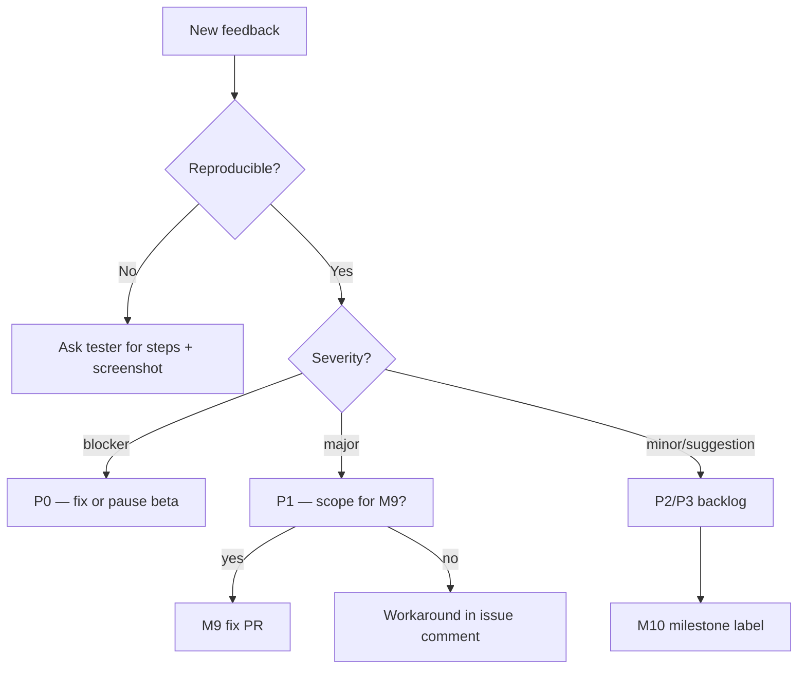

# CorrelCore — Beta Feedback Triage

Last updated: 2026-07-11 (M9 Sprint 5)

Operator runbook for processing beta tester feedback. No third-party tools — GitHub issues and
email only.

**Related:** [`BETA_ONBOARDING.md`](BETA_ONBOARDING.md) · [`BETA_CHECKLIST.md`](BETA_CHECKLIST.md)

---

## Intake

| Source | Action |
| ------ | ------ |
| GitHub issue (label `beta`) | Primary queue |
| Email | Convert to GitHub issue within 24h (redact PII from public title) |
| Direct message | Same as email |

Use template: [`.github/ISSUE_TEMPLATE/beta_feedback.md`](../../.github/ISSUE_TEMPLATE/beta_feedback.md)

---

## Severity → priority mapping

| Tester severity | Operator priority | SLA | Action |
| --------------- | ----------------- | --- | ------ |
| **blocker** | **P0** | 48h | Fix in M9 or pause onboarding |
| **major** | **P1** | 1 week | Fix in M9 if scoped; else workaround doc |
| **minor** | **P2** | Backlog | M10 / M9+ unless trivial fix |
| **suggestion** | **P3** | Backlog | M10+; note in round summary |

### P0 examples

- Cannot register or verify email
- Data loss after sync or delete
- Export ZIP fails
- Login/session broken on supported browser
- Encrypted notes unreadable after normal use

### P1 examples

- Misleading insight copy (symptom/tag correlation)
- Core workflow broken on mobile width
- Privacy control missing or non-functional
- Analytics opt-out not respected

### P2 / P3 examples

- Copy typo, spacing, colour contrast edge case
- Feature request (intensity sliders, password reset)
- Performance on old hardware (unless unusable)

---

## Triage workflow



### Per-issue labels (suggested)

| Label | Meaning |
| ----- | ------- |
| `beta` | From beta program |
| `p0` / `p1` / `p2` | Priority |
| `workflow:W3` etc. | Maps to [`USER_WORKFLOWS.md`](../frontend/USER_WORKFLOWS.md) |
| `m9-fix` | Scheduled for current milestone |
| `m10` | Deferred |

---

## Round summary template

After each feedback round (typically end of week 2), publish a **internal** summary (not in repo
if it contains tester quotes with PII):

```markdown
## Beta round <N> — <date>

**Active testers:** <count>
**Issues filed:** <count> (P0: _, P1: _, P2+: _)

### Fixed in M9
- #<issue> — <one line>

### Workarounds documented
- #<issue> — <workaround>

### Deferred to M10 / M9+
- #<issue> — <reason>

### Symptom analytics notes
- <usability themes from M9_SYMPTOM_ANALYTICS_BETA_REVIEW.md>

### Threshold / config decisions
- <link M9_ANALYTICS_THRESHOLDS_REVIEW.md if changed>
```

---

## Reporter template (copy for email)

```markdown
**Instance URL:** https://…
**Device / browser:** e.g. Android 14 / Chrome 124
**Workflow:** W3 daily entry | W5 first insight | W9 export
**Steps:**
1. …
2. …
**Expected:** …
**Actual:** …
**Severity:** blocker | major | minor | suggestion
**Screenshot:** (attach if possible)
```

---

## API-minimization rule

Do **not** add feedback widgets, NPS SDKs, or external survey tools for M9. Structured GitHub
issues provide sufficient signal for 5–10 testers.

---

## Escalation

| Condition | Escalation |
| --------- | ---------- |
| ≥2 P0 in same week | Pause new invites; stabilize instance |
| Privacy/export/delete P0 | Treat as incident — [`incident-response.md`](../runbooks/incident-response.md) |
| Symptom insight misleading (P1) | Tag `symptom-analytics`; link review doc |

---

## Sprint 5 completion criteria

- [ ] Triage runbook published (this document)
- [ ] Feedback issue template live
- [ ] Operator can classify P0–P3 without ambiguity
- [ ] ≥1 feedback round completed **or** program ready with invites sent (document in operator roster)
